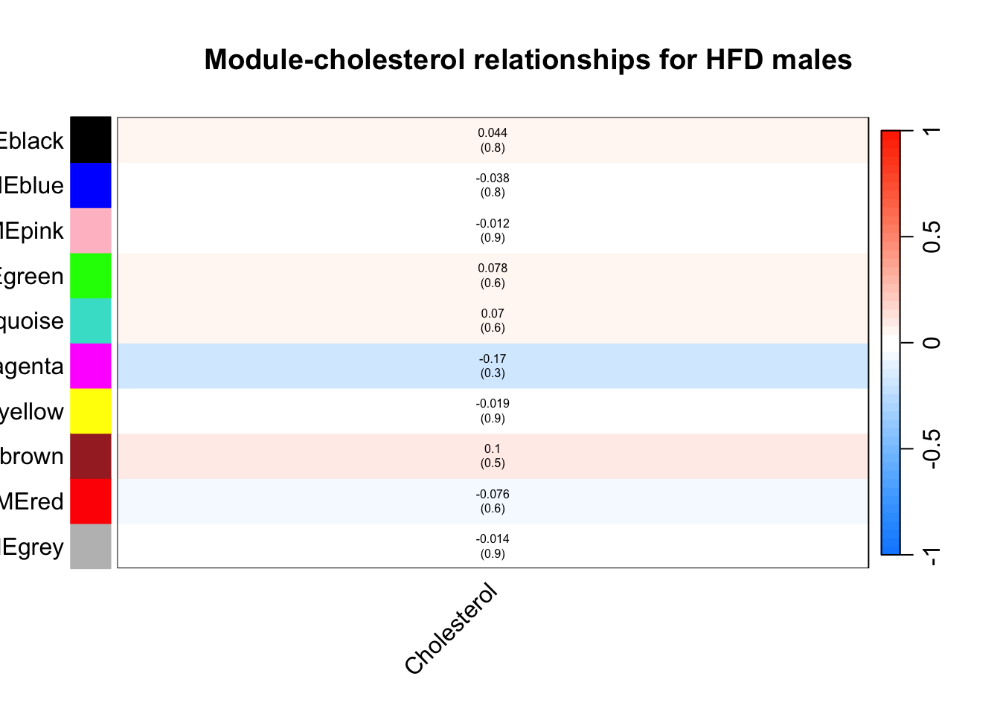
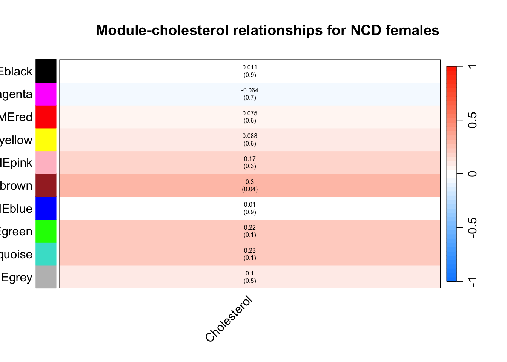

Followed instructions on https://horvath.genetics.ucla.edu/html/CoexpressionNetwork/Rpackages/WGCNA/Tutorials/, which was based on the method used in https://doi.org/10.1371/journal.pgen.0020130

# Input

Wrote this out to read in in the script Liver-WGCNA-Construction.Qmd


::: {.cell}

```{.r .cell-code}
load("ncd_hf_wcgna_networks.RData")
library(WGCNA)
```
:::


# Analysis of Constructed Network


::: {.cell}

```{.r .cell-code}
table(net$colors) %>%
  kable(caption="Genes per module (0 indicates unassigned")
```

::: {.cell-output-display}
Table: Genes per module (0 indicates unassigned

|Var1 |  Freq|
|:----|-----:|
|0    | 19779|
|1    |   517|
|2    |   372|
|3    |   171|
|4    |   163|
|5    |   151|
|6    |    83|
|7    |    58|
|8    |    47|
|9    |    35|
:::
:::


# Integation with Cholesterol Data


::: {.cell}

```{.r .cell-code}
MEs0.ncd.m <- moduleEigengenes(expr=multiExpr[[1]]$data,
                         colors=moduleColors)$eigengenes
MEs0.hf.m <- moduleEigengenes(expr=multiExpr[[2]]$data,
                         colors=moduleColors)$eigengenes
MEs0.ncd.f <- moduleEigengenes(expr=multiExpr[[3]]$data,
                         colors=moduleColors)$eigengenes
MEs0.hf.f <- moduleEigengenes(expr=multiExpr[[4]]$data,
                         colors=moduleColors)$eigengenes

MEs.ncd.m=orderMEs(MEs0.ncd.m)
MEs.hf.m=orderMEs(MEs0.hf.m)
MEs.ncd.f=orderMEs(MEs0.ncd.f)
MEs.hf.f=orderMEs(MEs0.hf.f)

#correlate eigengenes with cholesterol levels for ncd males
moduleTraitCor.ncd.m <-cor(MEs.ncd.m,
                     phenotype.data[rownames(MEs.ncd.m),'chol2'],
                     use="p",
                     method="spearman")
moduleTraitPvalue.ncd.m <- corPvalueStudent(moduleTraitCor.ncd.m,nSamples)

#correlate eigengenes with cholesterol levels for ncd females
moduleTraitCor.ncd.f <-cor(MEs.ncd.f,
                     phenotype.data[rownames(MEs.ncd.f),'chol2'],
                     use="p",
                     method="spearman")
moduleTraitPvalue.ncd.f <- corPvalueStudent(moduleTraitCor.ncd.f,nSamples)

#correlate eigengenes with cholesterol levels for hfd males
moduleTraitCor.hf.m <-cor(MEs.hf.m,
                     phenotype.data[rownames(MEs.hf.m),'chol2'],
                     use="p",
                     method="spearman")
moduleTraitPvalue.hf.m=corPvalueStudent(moduleTraitCor.hf.m,nSamples)

#correlate eigengenes with cholesterol levels for hfd females
moduleTraitCor.hf.f <-cor(MEs.hf.f,
                     phenotype.data[rownames(MEs.hf.f),'chol2'],
                     use="p",
                     method="spearman")
moduleTraitPvalue.hf.f=corPvalueStudent(moduleTraitCor.hf.f,nSamples)

#Will display correlations and their p-values
textMatrix.ncd.m <- paste(signif(moduleTraitCor.ncd.m,2),
                    "\n(",signif(moduleTraitPvalue.ncd.m,1),")",
                    sep="")

textMatrix.hf.m <- paste(signif(moduleTraitCor.hf.m,2),
                    "\n(",signif(moduleTraitPvalue.hf.m,1),")",
                    sep="")

textMatrix.ncd.f <- paste(signif(moduleTraitCor.ncd.f,2),
                    "\n(",signif(moduleTraitPvalue.ncd.f,1),")",
                    sep="")

textMatrix.hf.f <- paste(signif(moduleTraitCor.hf.f,2),
                    "\n(",signif(moduleTraitPvalue.hf.f,1),")",
                    sep="")

dim(textMatrix.ncd.m) <- dim(moduleTraitCor.ncd.m)
dim(textMatrix.hf.m) <- dim(moduleTraitCor.hf.m)
dim(textMatrix.ncd.f) <- dim(moduleTraitCor.ncd.f)
dim(textMatrix.hf.f) <- dim(moduleTraitCor.hf.f)
#Display the correlation values within a heatmap plot

labeledHeatmap(Matrix=moduleTraitCor.hf.m, 
                xLabels='Cholesterol',
                yLabels=names(MEs.hf.m),
                ySymbols=names(MEs.hf.m), 
                colorLabels=FALSE, 
                colors=blueWhiteRed(50), 
                textMatrix=textMatrix.hf.m, 
                setStdMargins=FALSE, 
                cex.text=0.5, 
                zlim=c(-1,1), 
                main=paste("Module-cholesterol relationships for HFD males"))
```

::: {.cell-output-display}
{width=672}
:::

```{.r .cell-code}
labeledHeatmap(Matrix=moduleTraitCor.ncd.m, 
                xLabels='Cholesterol',
                yLabels=names(MEs.ncd.m),
                ySymbols=names(MEs.ncd.m), 
                colorLabels=FALSE, 
                colors=blueWhiteRed(50), 
                textMatrix=textMatrix.ncd.m, 
                setStdMargins=FALSE, 
                cex.text=0.5, 
                zlim=c(-1,1), 
                main=paste("Module-cholesterol relationships for NCD males"))
```

::: {.cell-output-display}
{width=672}
:::

```{.r .cell-code}
labeledHeatmap(Matrix=moduleTraitCor.hf.f, 
                xLabels='Cholesterol',
                yLabels=names(MEs.hf.f),
                ySymbols=names(MEs.hf.f), 
                colorLabels=FALSE, 
                colors=blueWhiteRed(50), 
                textMatrix=textMatrix.hf.f, 
                setStdMargins=FALSE, 
                cex.text=0.5, 
                zlim=c(-1,1), 
                main=paste("Module-cholesterol relationships for HFD females"))
```

::: {.cell-output-display}
{width=672}
:::

```{.r .cell-code}
labeledHeatmap(Matrix=moduleTraitCor.ncd.f, 
                xLabels='Cholesterol',
                yLabels=names(MEs.ncd.f),
                ySymbols=names(MEs.ncd.f), 
                colorLabels=FALSE, 
                colors=blueWhiteRed(50), 
                textMatrix=textMatrix.ncd.f, 
                setStdMargins=FALSE, 
                cex.text=0.5, 
                zlim=c(-1,1), 
                main=paste("Module-cholesterol relationships for NCD females"))
```

::: {.cell-output-display}
{width=672}
:::

```{.r .cell-code}
labeledHeatmap(Matrix=cbind(moduleTraitCor.ncd.m,
                            moduleTraitCor.ncd.f,
                            moduleTraitCor.hf.m,
                            moduleTraitCor.hf.f), 
               xLabels=c("NCD-M","NCD-F","HFHS-M","HFHS-F"), 
               yLabels=names(MEs.ncd.m), 
               ySymbols=names(MEs.ncd.m), 
               colorLabels=FALSE, 
               colors=blueWhiteRed(50), 
               textMatrix=cbind(textMatrix.ncd.m,textMatrix.ncd.f,
                                textMatrix.hf.m,textMatrix.hf.f), 
               setStdMargins=FALSE, 
               cex.text=0.6, 
               cex.lab.y=0.4,
               zlim=c(-1,1), 
               main=paste("Module-cholesterol relationships"))
```

::: {.cell-output-display}
{width=672}
:::
:::

::: {.cell}

```{.r .cell-code}
geneModuleMembership.ncd.m <- as.data.frame(
  cor(
    phenotype.data[rownames(MEs.ncd.m),'chol2'],
    MEs.ncd.m,
    use="p",
    method="spearman"))

MMPvalue <- as.data.frame(
  corPvalueStudent(
    as.matrix(
      geneModuleMembership.ncd.m),
    nSamples[1]))

modNames=substring(names(MEs.ncd.m),3)
names(geneModuleMembership.ncd.m) <- paste("MM",modNames,sep="")
names(MMPvalue)=paste("p.MM",modNames,sep="")

geneTraitSignificance <- as.data.frame(
  cor(multiExpr[[1]]$data,
      phenotype.data[multiExpr[[1]]$data %>% rownames,'chol2'],
      use="p",
      method="spearman"))

GSPvalue <- as.data.frame(
  corPvalueStudent(
    as.matrix(geneTraitSignificance),nSamples[1]))

module <- "blue"
column <- match(module,modNames)
moduleGenes <- moduleColors==module
#stuck on verbose scatter plot
```
:::


# Top Genes in Each Module


::: {.cell}

```{.r .cell-code}
chooseTopHubInEachModule(expression.data,colorh="magenta",
                         type="unsigned")
```

::: {.cell-output .cell-output-stdout}
```
             magenta 
"ENSMUSG00000059263" 
```
:::

```{.r .cell-code}
names(expression.data)[moduleColors=="magenta"]
```

::: {.cell-output .cell-output-stdout}
```
 [1] "ENSMUSG00000090994" "ENSMUSG00000026938" "ENSMUSG00000045392"
 [4] "ENSMUSG00000027799" "ENSMUSG00000027823" "ENSMUSG00000015714"
 [7] "ENSMUSG00000027902" "ENSMUSG00000086765" "ENSMUSG00000064655"
[10] "ENSMUSG00000006445" "ENSMUSG00000029029" "ENSMUSG00000058905"
[13] "ENSMUSG00000029551" "ENSMUSG00000030400" "ENSMUSG00000030595"
[16] "ENSMUSG00000030844" "ENSMUSG00000025473" "ENSMUSG00000032475"
[19] "ENSMUSG00000019943" "ENSMUSG00000087060" "ENSMUSG00000020921"
[22] "ENSMUSG00000039703" "ENSMUSG00000021010" "ENSMUSG00000021375"
[25] "ENSMUSG00000079489" "ENSMUSG00000033644" "ENSMUSG00000016942"
[28] "ENSMUSG00000068085" "ENSMUSG00000022617" "ENSMUSG00000000530"
[31] "ENSMUSG00000075265" "ENSMUSG00000036292" "ENSMUSG00000084866"
[34] "ENSMUSG00000038954" "ENSMUSG00000024248"
```
:::

```{.r .cell-code}
#write(names(expression.data)[moduleColors=="magenta"],"Magenta_Genes.txt")
```
:::


# Session Information


::: {.cell}

```{.r .cell-code}
sessionInfo()
```

::: {.cell-output .cell-output-stdout}
```
R version 4.2.2 (2022-10-31)
Platform: x86_64-apple-darwin17.0 (64-bit)
Running under: macOS Big Sur ... 10.16

Matrix products: default
BLAS:   /Library/Frameworks/R.framework/Versions/4.2/Resources/lib/libRblas.0.dylib
LAPACK: /Library/Frameworks/R.framework/Versions/4.2/Resources/lib/libRlapack.dylib

locale:
[1] en_US.UTF-8/en_US.UTF-8/en_US.UTF-8/C/en_US.UTF-8/en_US.UTF-8

attached base packages:
[1] stats     graphics  grDevices utils     datasets  methods   base     

other attached packages:
[1] WGCNA_1.72-1          fastcluster_1.2.3     dynamicTreeCut_1.63-1
[4] ggplot2_3.4.2         readr_2.1.4           dplyr_1.1.2          
[7] tidyr_1.3.0           knitr_1.43           

loaded via a namespace (and not attached):
 [1] Biobase_2.58.0         httr_1.4.6             bit64_4.0.5           
 [4] jsonlite_1.8.5         splines_4.2.2          foreach_1.5.2         
 [7] Formula_1.2-5          stats4_4.2.2           blob_1.2.4            
[10] GenomeInfoDbData_1.2.9 impute_1.70.0          yaml_2.3.7            
[13] backports_1.4.1        pillar_1.9.0           RSQLite_2.3.1         
[16] lattice_0.21-8         glue_1.6.2             digest_0.6.31         
[19] checkmate_2.2.0        XVector_0.38.0         colorspace_2.1-0      
[22] preprocessCore_1.58.0  htmltools_0.5.5        Matrix_1.5-4.1        
[25] pkgconfig_2.0.3        zlibbioc_1.44.0        purrr_1.0.1           
[28] GO.db_3.16.0           scales_1.2.1           tzdb_0.4.0            
[31] htmlTable_2.4.1        tibble_3.2.1           KEGGREST_1.38.0       
[34] generics_0.1.3         IRanges_2.32.0         cachem_1.0.8          
[37] withr_2.5.0            nnet_7.3-19            BiocGenerics_0.44.0   
[40] cli_3.6.1              survival_3.5-5         magrittr_2.0.3        
[43] crayon_1.5.2           memoise_2.0.1          evaluate_0.21         
[46] fansi_1.0.4            doParallel_1.0.17      foreign_0.8-84        
[49] data.table_1.14.8      tools_4.2.2            hms_1.1.3             
[52] lifecycle_1.0.3        matrixStats_1.0.0      stringr_1.5.0         
[55] S4Vectors_0.36.2       munsell_0.5.0          cluster_2.1.4         
[58] AnnotationDbi_1.60.2   Biostrings_2.66.0      compiler_4.2.2        
[61] GenomeInfoDb_1.34.9    rlang_1.1.1            grid_4.2.2            
[64] RCurl_1.98-1.12        iterators_1.0.14       rstudioapi_0.14       
[67] htmlwidgets_1.6.2      bitops_1.0-7           base64enc_0.1-3       
[70] rmarkdown_2.22         gtable_0.3.3           codetools_0.2-19      
[73] DBI_1.1.3              R6_2.5.1               gridExtra_2.3         
[76] fastmap_1.1.1          bit_4.0.5              utf8_1.2.3            
[79] Hmisc_5.1-0            stringi_1.7.12         parallel_4.2.2        
[82] Rcpp_1.0.10            vctrs_0.6.2            rpart_4.1.19          
[85] png_0.1-8              tidyselect_1.2.0       xfun_0.39             
```
:::
:::
