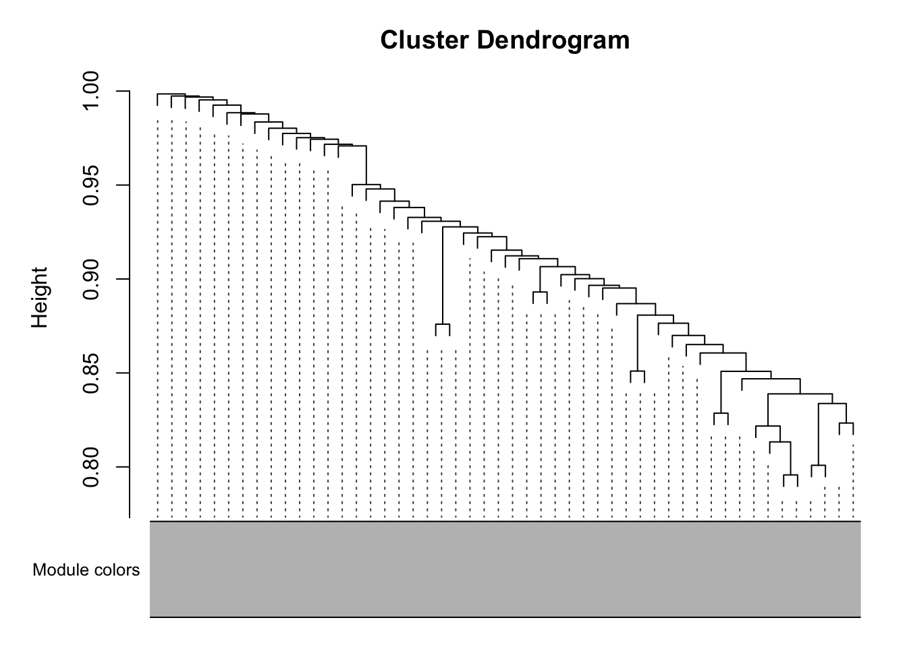

Followed instructions on https://horvath.genetics.ucla.edu/html/CoexpressionNetwork/Rpackages/WGCNA/Tutorials/, which was based on the method used in https://doi.org/10.1371/journal.pgen.0020130

# Data Preparation


::: {.cell}

```{.r .cell-code}
library(WGCNA)
options(stringsAsFactors = F)
expression.filename <- "GSE72759_DO192_RNAseq_UpperQuartileNormalized_n21454genes_forGEOSubmission.txt"

library(tibble)
expression.data <- read_tsv(expression.filename) %>%
  rename(gene_id=1) %>%
  column_to_rownames('gene_id') %>%
  t %>% as.data.frame #rotate with samples on the left and genes on the columns

phenotype.filename <- 'Svenson_HFD_DO_phenotype_V12.csv'
phenotype.data <- read_csv(phenotype.filename) %>% 
  select(mouse.id,chol2,sex,diet) %>%
  column_to_rownames('mouse.id')
  
phenotype.data[phenotype.data=='-999999'] <- NA

good.genes <- goodSamplesGenes(expression.data)
```

::: {.cell-output .cell-output-stdout}
```
 Flagging genes and samples with too many missing values...
  ..step 1
```
:::

```{.r .cell-code}
#check if all genes are ok, not too many missing values for genes or samples
good.genes$allOK
```

::: {.cell-output .cell-output-stdout}
```
[1] TRUE
```
:::
:::


# Network Construction


::: {.cell}

```{.r .cell-code}
nSets <- 4 #four datasets, NCD and HFD, male and female
setLabels <- c("NCD-M","HFHS-M","NCD-F","HFHS-F")
multiExpr=vector(mode="list",length=nSets) #create vector with two datasets

#filter for only exprerssion data where we have appropriatet phenotype data
chow.mice.m <- phenotype.data %>% filter(diet=="chow"&sex=="M") %>% rownames
hf.mice.m <- phenotype.data %>% filter(diet=="hf"&sex=="M") %>% rownames
chow.mice.f <- phenotype.data %>% filter(diet=="chow"&sex=="F") %>% rownames
hf.mice.f <- phenotype.data %>% filter(diet=="hf"&sex=="F") %>% rownames

chow.expression.m <- expression.data[chow.mice.m,] %>% na.omit
hf.expression.m <- expression.data[hf.mice.m,] %>% na.omit
chow.expression.f <- expression.data[chow.mice.f,] %>% na.omit
hf.expression.f <- expression.data[hf.mice.f,] %>% na.omit

# enter data on expression in to multiExpr object
multiExpr[[1]]=list(data=chow.expression.m)
multiExpr[[2]]=list(data=hf.expression.m) 
multiExpr[[3]]=list(data=chow.expression.f)
multiExpr[[4]]=list(data=hf.expression.f) 

exprSize <- checkSets(multiExpr)
gsg <- goodSamplesGenesMS(multiExpr)
```

::: {.cell-output .cell-output-stdout}
```
 Flagging genes and samples with too many missing values...
  ..step 1
  ..Excluding 78 genes from the calculation due to too many missing samples or zero variance.
  ..step 2
```
:::

```{.r .cell-code}
# remove genes with too many missing values or no variance
if (!gsg$allOK)
{
  # Print information about the removed genes:
  if (sum(!gsg$goodGenes) > 0)
    printFlush(paste("Removing genes:", paste(names(multiExpr[[1]]$data)[!gsg$goodGenes], 
                                              collapse = ", ")))
  for (set in 1:exprSize$nSets)
  {
    if (sum(!gsg$goodSamples[[set]]))
      printFlush(paste("In set", setLabels[set], "removing samples",
                       paste(rownames(multiExpr[[set]]$data)[!gsg$goodSamples[[set]]], collapse = ", ")))
    # Remove the offending genes and samples
    multiExpr[[set]]$data = multiExpr[[set]]$data[gsg$goodSamples[[set]], gsg$goodGenes];
  }
  # Update exprSize
  exprSize = checkSets(multiExpr)
}
```

::: {.cell-output .cell-output-stdout}
```
Removing genes: ENSMUSG00000041872, ENSMUSG00000092563, ENSMUSG00000071890, ENSMUSG00000049598, ENSMUSG00000026645, ENSMUSG00000085942, ENSMUSG00000083503, ENSMUSG00000082190, ENSMUSG00000083424, ENSMUSG00000027225, ENSMUSG00000027273, ENSMUSG00000083341, ENSMUSG00000091572, ENSMUSG00000093671, ENSMUSG00000004885, ENSMUSG00000027966, ENSMUSG00000028236, ENSMUSG00000082151, ENSMUSG00000081997, ENSMUSG00000084828, ENSMUSG00000081504, ENSMUSG00000085654, ENSMUSG00000038598, ENSMUSG00000094222, ENSMUSG00000084342, ENSMUSG00000085714, ENSMUSG00000081792, ENSMUSG00000070686, ENSMUSG00000096742, ENSMUSG00000058736, ENSMUSG00000085345, ENSMUSG00000043036, ENSMUSG00000094664, ENSMUSG00000083728, ENSMUSG00000056203, ENSMUSG00000033726, ENSMUSG00000099281, ENSMUSG00000098382, ENSMUSG00000011350, ENSMUSG00000046130, ENSMUSG00000096714, ENSMUSG00000030781, ENSMUSG00000034467, ENSMUSG00000074139, ENSMUSG00000050473, ENSMUSG00000096573, ENSMUSG00000010803, ENSMUSG00000085888, ENSMUSG00000020890, ENSMUSG00000082550, ENSMUSG00000081141, ENSMUSG00000084890, ENSMUSG00000086298, ENSMUSG00000044067, ENSMUSG00000092006, ENSMUSG00000006179, ENSMUSG00000093587, ENSMUSG00000097582, ENSMUSG00000079360, ENSMUSG00000082662, ENSMUSG00000021953, ENSMUSG00000098002, ENSMUSG00000072419, ENSMUSG00000085783, ENSMUSG00000089941, ENSMUSG00000067575, ENSMUSG00000092395, ENSMUSG00000092223, ENSMUSG00000096140, ENSMUSG00000041565, ENSMUSG00000055471, ENSMUSG00000078528, ENSMUSG00000081461, ENSMUSG00000031376, ENSMUSG00000083283, ENSMUSG00000083711, ENSMUSG00000082382, ENSMUSG00000025658
```
:::
:::


## Clustering Expression Datasets


::: {.cell}

```{.r .cell-code}
#crerate two sample trees
sampleTrees = list()
for (set in 1:nSets)
{
  sampleTrees[[set]] = hclust(dist(multiExpr[[set]]$data), method = "average")
}
#cluster genes in each set, make a hclust tree using "average" method
for (set in 1:nSets)
  plot(sampleTrees[[set]], 
       main = paste("Sample clustering on all genes in",
                    setLabels[set]),
       xlab="", 
       sub="", 
       cex = 0.7);
```

::: {.cell-output-display}
{width=672}
:::

::: {.cell-output-display}
{width=672}
:::

::: {.cell-output-display}
{width=672}
:::

::: {.cell-output-display}
{width=672}
:::

```{.r .cell-code}
# Form a multi-set structure called Traits that will hold the clinical traits.
Traits = vector(mode="list", length = nSets);
for (set in 1:nSets)
{
  setSamples = rownames(multiExpr[[set]]$data);
  traitRows = match(setSamples, rownames(phenotype.data));
  Traits[[set]] = list(data = phenotype.data[traitRows,]);
  rownames(Traits[[set]]$data) = rownames(phenotype.data[traitRows,]);
}
collectGarbage();
# Define data set dimensions
nGenes = exprSize$nGenes;
nSamples = exprSize$nSamples;
```
:::


The combined dataset includes 21376 genes and 48465048 samples separated into `nSets` datasets (`r`paste(setLabels, collapse=",")\`).


::: {.cell}

```{.r .cell-code}
# Choose a set of soft-thresholding powers
powers = seq(4,20,by=1)
# Initialize a list to hold the results of scale-free analysis
powerTables = vector(mode = "list", length = nSets);
# Call the network topology analysis function for each set in turn
for (set in 1:nSets)
  powerTables[[set]] = list(data = pickSoftThreshold(multiExpr[[set]]$data,
                                                     powerVector=powers,
                                                     verbose = 2)[[2]]);
```

::: {.cell-output .cell-output-stdout}
```
pickSoftThreshold: will use block size 2092.
 pickSoftThreshold: calculating connectivity for given powers...
   ..working on genes 1 through 2092 of 21376
   ..working on genes 2093 through 4184 of 21376
   ..working on genes 4185 through 6276 of 21376
   ..working on genes 6277 through 8368 of 21376
   ..working on genes 8369 through 10460 of 21376
   ..working on genes 10461 through 12552 of 21376
   ..working on genes 12553 through 14644 of 21376
   ..working on genes 14645 through 16736 of 21376
   ..working on genes 16737 through 18828 of 21376
   ..working on genes 18829 through 20920 of 21376
   ..working on genes 20921 through 21376 of 21376
   Power SFT.R.sq slope truncated.R.sq mean.k. median.k. max.k.
1      4    0.892 -2.87          0.991  65.100  45.60000  401.0
2      5    0.913 -2.59          0.998  26.700  16.00000  238.0
3      6    0.922 -2.42          0.999  12.400   6.22000  154.0
4      7    0.925 -2.28          0.997   6.420   2.62000  106.0
5      8    0.928 -2.12          0.993   3.630   1.20000   76.1
6      9    0.910 -2.01          0.963   2.210   0.58400   57.2
7     10    0.944 -1.77          0.960   1.450   0.29500   44.2
8     11    0.971 -1.59          0.962   1.010   0.15500   35.3
9     12    0.974 -1.54          0.967   0.742   0.08460   34.2
10    13    0.967 -1.48          0.960   0.572   0.04720   33.5
11    14    0.967 -1.44          0.961   0.459   0.02690   32.9
12    15    0.947 -1.40          0.936   0.382   0.01560   32.5
13    16    0.926 -1.38          0.910   0.327   0.00919   32.2
14    17    0.893 -1.36          0.865   0.287   0.00547   31.9
15    18    0.362 -1.79          0.241   0.257   0.00332   31.7
16    19    0.362 -1.74          0.240   0.233   0.00204   31.6
17    20    0.363 -1.70          0.241   0.215   0.00126   31.5
pickSoftThreshold: will use block size 2092.
 pickSoftThreshold: calculating connectivity for given powers...
   ..working on genes 1 through 2092 of 21376
   ..working on genes 2093 through 4184 of 21376
   ..working on genes 4185 through 6276 of 21376
   ..working on genes 6277 through 8368 of 21376
   ..working on genes 8369 through 10460 of 21376
   ..working on genes 10461 through 12552 of 21376
   ..working on genes 12553 through 14644 of 21376
   ..working on genes 14645 through 16736 of 21376
   ..working on genes 16737 through 18828 of 21376
   ..working on genes 18829 through 20920 of 21376
   ..working on genes 20921 through 21376 of 21376
   Power SFT.R.sq slope truncated.R.sq mean.k. median.k. max.k.
1      4    0.836 -2.34          0.970  98.800  60.50000  593.0
2      5    0.845 -2.21          0.979  44.000  22.70000  345.0
3      6    0.849 -2.12          0.983  21.700   9.45000  212.0
4      7    0.854 -2.04          0.986  11.600   4.23000  135.0
5      8    0.865 -1.95          0.993   6.690   2.03000   88.8
6      9    0.869 -1.88          0.989   4.080   1.03000   60.8
7     10    0.911 -1.70          0.989   2.620   0.54500   42.6
8     11    0.925 -1.64          0.950   1.760   0.29800   33.7
9     12    0.886 -1.76          0.880   1.240   0.16800   33.1
10    13    0.349 -2.44          0.191   0.908   0.09830   32.6
11    14    0.321 -2.88          0.143   0.690   0.05830   32.3
12    15    0.332 -2.78          0.153   0.544   0.03490   32.1
13    16    0.333 -2.66          0.153   0.442   0.02150   31.9
14    17    0.336 -2.56          0.155   0.370   0.01340   31.7
15    18    0.336 -2.46          0.154   0.317   0.00837   31.6
16    19    0.319 -2.64          0.125   0.278   0.00531   31.5
17    20    0.319 -2.56          0.126   0.249   0.00341   31.4
pickSoftThreshold: will use block size 2092.
 pickSoftThreshold: calculating connectivity for given powers...
   ..working on genes 1 through 2092 of 21376
   ..working on genes 2093 through 4184 of 21376
   ..working on genes 4185 through 6276 of 21376
   ..working on genes 6277 through 8368 of 21376
   ..working on genes 8369 through 10460 of 21376
   ..working on genes 10461 through 12552 of 21376
   ..working on genes 12553 through 14644 of 21376
   ..working on genes 14645 through 16736 of 21376
   ..working on genes 16737 through 18828 of 21376
   ..working on genes 18829 through 20920 of 21376
   ..working on genes 20921 through 21376 of 21376
   Power SFT.R.sq slope truncated.R.sq mean.k. median.k. max.k.
1      4    0.945 -2.85          0.994  55.200 39.300000  342.0
2      5    0.956 -2.60          0.994  21.500 13.300000  202.0
3      6    0.956 -2.43          0.986   9.530  4.990000  134.0
4      7    0.962 -2.27          0.989   4.720  2.050000   95.3
5      8    0.963 -2.09          0.985   2.590  0.900000   71.6
6      9    0.945 -1.93          0.959   1.550  0.421000   55.9
7     10    0.915 -1.76          0.908   1.010  0.207000   44.9
8     11    0.964 -1.52          0.962   0.714  0.105000   36.9
9     12    0.940 -1.44          0.936   0.536  0.055300   33.7
10    13    0.955 -1.36          0.960   0.425  0.029800   32.1
11    14    0.940 -1.32          0.940   0.353  0.016500   31.0
12    15    0.935 -1.27          0.935   0.303  0.009300   31.0
13    16    0.897 -1.25          0.884   0.267  0.005370   31.0
14    17    0.897 -1.24          0.881   0.241  0.003110   31.0
15    18    0.910 -1.21          0.898   0.221  0.001840   31.0
16    19    0.900 -1.20          0.885   0.205  0.001100   31.0
17    20    0.838 -1.23          0.795   0.193  0.000663   31.0
pickSoftThreshold: will use block size 2092.
 pickSoftThreshold: calculating connectivity for given powers...
   ..working on genes 1 through 2092 of 21376
   ..working on genes 2093 through 4184 of 21376
   ..working on genes 4185 through 6276 of 21376
   ..working on genes 6277 through 8368 of 21376
   ..working on genes 8369 through 10460 of 21376
   ..working on genes 10461 through 12552 of 21376
   ..working on genes 12553 through 14644 of 21376
   ..working on genes 14645 through 16736 of 21376
   ..working on genes 16737 through 18828 of 21376
   ..working on genes 18829 through 20920 of 21376
   ..working on genes 20921 through 21376 of 21376
   Power SFT.R.sq slope truncated.R.sq mean.k. median.k. max.k.
1      4    0.821 -2.31          0.950  86.800  54.20000  486.0
2      5    0.842 -2.19          0.971  38.500  19.50000  302.0
3      6    0.854 -2.09          0.982  19.200   7.80000  202.0
4      7    0.855 -1.99          0.973  10.500   3.38000  142.0
5      8    0.946 -1.72          0.981   6.270   1.57000  103.0
6      9    0.918 -1.76          0.923   4.000   0.77500   91.8
7     10    0.891 -1.78          0.871   2.700   0.39600   87.2
8     11    0.876 -1.74          0.841   1.930   0.21200   83.4
9     12    0.873 -1.68          0.837   1.440   0.11600   80.2
10    13    0.910 -1.57          0.886   1.130   0.06610   77.4
11    14    0.911 -1.50          0.896   0.912   0.03800   75.0
12    15    0.899 -1.43          0.888   0.763   0.02240   72.9
13    16    0.887 -1.38          0.880   0.656   0.01350   71.1
14    17    0.889 -1.34          0.883   0.577   0.00824   69.4
15    18    0.903 -1.29          0.899   0.518   0.00505   67.9
16    19    0.911 -1.25          0.911   0.472   0.00311   66.5
17    20    0.912 -1.22          0.915   0.436   0.00193   65.3
```
:::

```{.r .cell-code}
collectGarbage();
# Plot the results:
colors = color.scheme

# Will plot these columns of the returned scale free analysis tables
plotCols = c(2,5,6,7)
colNames = c("Scale Free Topology Model Fit", "Mean connectivity", "Median connectivity",
"Max connectivity");
# Get the minima and maxima of the plotted points
ylim = matrix(NA, nrow = 2, ncol = 4);
for (set in 1:nSets)
{
  for (col in 1:length(plotCols))
  {
    ylim[1, col] = min(ylim[1, col], powerTables[[set]]$data[, plotCols[col]], na.rm = TRUE);
    ylim[2, col] = max(ylim[2, col], powerTables[[set]]$data[, plotCols[col]], na.rm = TRUE);
  }
}
# Plot the quantities in the chosen columns vs. the soft thresholding power
sizeGrWindow(8, 6)
#pdf(file = "Plots/scaleFreeAnalysis.pdf", wi = 8, he = 6)
par(mfcol = c(2,2));
par(mar = c(4.2, 4.2 , 2.2, 0.5))
cex1 = 0.7;
for (col in 1:length(plotCols)) for (set in 1:nSets)
{
  if (set==1)
  {
    plot(powerTables[[set]]$data[,1], -sign(powerTables[[set]]$data[,3])*powerTables[[set]]$data[,2],
         xlab="Soft Threshold (power)",ylab=colNames[col],type="n", ylim = ylim[, col],
         main = colNames[col]);
    addGrid();
  }
  if (col==1)
  {
    text(powerTables[[set]]$data[,1], -sign(powerTables[[set]]$data[,3])*powerTables[[set]]$data[,2],
         labels=powers,cex=cex1,col=colors[set]);
  } else
    text(powerTables[[set]]$data[,1], powerTables[[set]]$data[,plotCols[col]],
         labels=powers,cex=cex1,col=colors[set]);
  if (col==1)
  {
    legend("bottomright", legend = setLabels, col = colors, pch = 20) ;
  } else
    legend("topright", legend = setLabels, col = colors, pch = 20) ;
}
#dev.off();
```
:::

::: {.cell}

```{.r .cell-code}
network.power <-6
net = blockwiseConsensusModules(
        multiExpr, 
        power = network.power, 
        minModuleSize = 20, #default is 20, tutorial said 30
        deepSplit = 2, #default
        maxBlockSize = nrow(chow.expression.f),
        pamRespectsDendro = FALSE, 
        mergeCutHeight = 0.25,
        numericLabels = TRUE,
        minKMEtoStay = 0.1, #default is 0.2, tutorial said 0.1
        saveTOMs = TRUE, 
        verbose = 1)
```

::: {.cell-output .cell-output-stdout}
```
 Calculating consensus modules and module eigengenes block-wise from all genes
 Calculating topological overlaps block-wise from all genes
```
:::
:::


Constructed modules with 6 soft-thresholding power, based on the visualization of the .

## Plotting Samples Clustered by Consensus Modules


::: {.cell}

```{.r .cell-code}
consMEs = net$multiMEs
moduleLabels = net$colors
# Convert the numeric labels to color labels
moduleColors = labels2colors(moduleLabels)
consTree = net$dendrograms[[1]]

# Convert labels to colors for plotting
mergedColors = labels2colors(net$colors)
# Plot the dendrogram and the module colors underneath
plotDendroAndColors(net$dendrograms[[1]], mergedColors[net$blockGenes[[1]]],
                    "Module colors",
                    dendroLabels = FALSE, hang = 0.03,
                    addGuide = TRUE, guideHang = 0.05)
```

::: {.cell-output-display}
{width=672}
:::

```{.r .cell-code}
# Convert labels to colors for plotting
mergedColors = labels2colors(net$colors)
# Plot the dendrogram and the module colors underneath
plotDendroAndColors(net$dendrograms[[2]], mergedColors[net$blockGenes[[1]]],
                    "Module colors",
                    dendroLabels = FALSE, hang = 0.03,
                    addGuide = TRUE, guideHang = 0.05)
```

::: {.cell-output-display}
{width=672}
:::

```{.r .cell-code}
# plotDendroAndColors(consTree, moduleColors,
#                     "Module colors",
#                     dendroLabels = FALSE, hang = 0.03,
#                     addGuide = TRUE, guideHang = 0.05,
#                     main = "Consensus gene dendrogram and module colors")

moduleLabels = net$colors
moduleColors = labels2colors(net$colors)
MEs = net$MEs;
geneTree = net$dendrograms[[1]];
```
:::


# Output

Wrote this out to read in in the script Liver-WGCNA-Cholesterol.Qmd


::: {.cell}

```{.r .cell-code}
save.image(file = "ncd_hf_wcgna_networks.RData")
```
:::


# Session Information


::: {.cell}

```{.r .cell-code}
sessionInfo()
```

::: {.cell-output .cell-output-stdout}
```
R version 4.2.2 (2022-10-31)
Platform: x86_64-apple-darwin17.0 (64-bit)
Running under: macOS Big Sur ... 10.16

Matrix products: default
BLAS:   /Library/Frameworks/R.framework/Versions/4.2/Resources/lib/libRblas.0.dylib
LAPACK: /Library/Frameworks/R.framework/Versions/4.2/Resources/lib/libRlapack.dylib

locale:
[1] en_US.UTF-8/en_US.UTF-8/en_US.UTF-8/C/en_US.UTF-8/en_US.UTF-8

attached base packages:
[1] stats     graphics  grDevices utils     datasets  methods   base     

other attached packages:
[1] tibble_3.2.1          WGCNA_1.72-1          fastcluster_1.2.3    
[4] dynamicTreeCut_1.63-1 ggplot2_3.4.2         readr_2.1.4          
[7] dplyr_1.1.2           tidyr_1.3.0           knitr_1.43           

loaded via a namespace (and not attached):
 [1] Biobase_2.58.0         httr_1.4.6             vroom_1.6.3           
 [4] bit64_4.0.5            jsonlite_1.8.5         splines_4.2.2         
 [7] foreach_1.5.2          Formula_1.2-5          stats4_4.2.2          
[10] blob_1.2.4             GenomeInfoDbData_1.2.9 impute_1.70.0         
[13] yaml_2.3.7             backports_1.4.1        pillar_1.9.0          
[16] RSQLite_2.3.1          lattice_0.21-8         glue_1.6.2            
[19] digest_0.6.31          checkmate_2.2.0        XVector_0.38.0        
[22] colorspace_2.1-0       preprocessCore_1.58.0  htmltools_0.5.5       
[25] Matrix_1.5-4.1         pkgconfig_2.0.3        zlibbioc_1.44.0       
[28] purrr_1.0.1            GO.db_3.16.0           scales_1.2.1          
[31] tzdb_0.4.0             htmlTable_2.4.1        KEGGREST_1.38.0       
[34] generics_0.1.3         IRanges_2.32.0         cachem_1.0.8          
[37] withr_2.5.0            nnet_7.3-19            BiocGenerics_0.44.0   
[40] cli_3.6.1              survival_3.5-5         magrittr_2.0.3        
[43] crayon_1.5.2           memoise_2.0.1          evaluate_0.21         
[46] fansi_1.0.4            doParallel_1.0.17      foreign_0.8-84        
[49] data.table_1.14.8      tools_4.2.2            hms_1.1.3             
[52] lifecycle_1.0.3        matrixStats_1.0.0      stringr_1.5.0         
[55] S4Vectors_0.36.2       munsell_0.5.0          cluster_2.1.4         
[58] AnnotationDbi_1.60.2   Biostrings_2.66.0      compiler_4.2.2        
[61] GenomeInfoDb_1.34.9    rlang_1.1.1            grid_4.2.2            
[64] RCurl_1.98-1.12        iterators_1.0.14       rstudioapi_0.14       
[67] htmlwidgets_1.6.2      bitops_1.0-7           base64enc_0.1-3       
[70] rmarkdown_2.22         gtable_0.3.3           codetools_0.2-19      
[73] DBI_1.1.3              R6_2.5.1               gridExtra_2.3         
[76] fastmap_1.1.1          bit_4.0.5              utf8_1.2.3            
[79] Hmisc_5.1-0            stringi_1.7.12         parallel_4.2.2        
[82] Rcpp_1.0.10            vctrs_0.6.2            rpart_4.1.19          
[85] png_0.1-8              tidyselect_1.2.0       xfun_0.39             
```
:::
:::