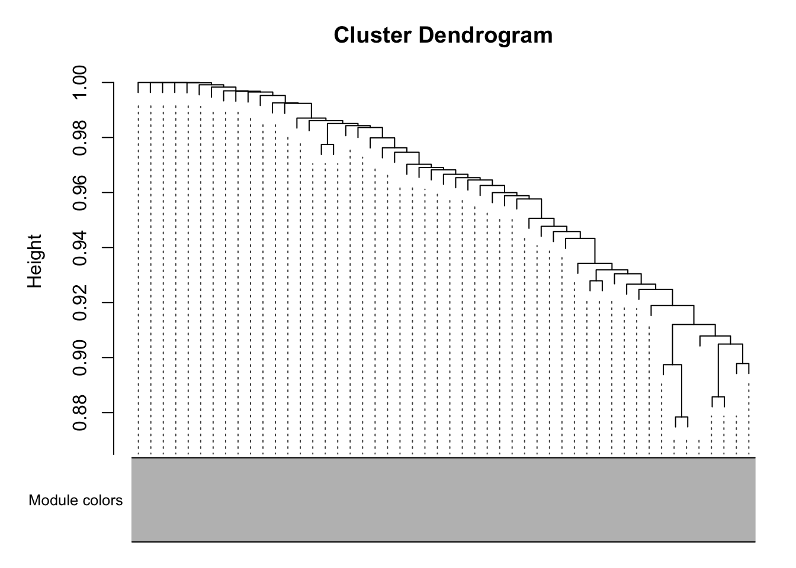

Followed instructions on https://horvath.genetics.ucla.edu/html/CoexpressionNetwork/Rpackages/WGCNA/Tutorials/, which was based on the method used in https://doi.org/10.1371/journal.pgen.0020130

# Data Preparation


::: {.cell}

```{.r .cell-code}
library(WGCNA)
options(stringsAsFactors = F)
expression.filename <- "GSE72759_DO192_RNAseq_UpperQuartileNormalized_n21454genes_forGEOSubmission.txt"

library(tibble)
expression.data <- read_tsv(expression.filename) %>%
  rename(gene_id=1) %>%
  column_to_rownames('gene_id') %>%
  t %>% as.data.frame #rotate with samples on the left and genes on the columns

phenotype.filename <- 'Svenson_HFD_DO_phenotype_V12.csv'
phenotype.data <- read_csv(phenotype.filename) %>% 
  select(mouse.id,chol2,sex,diet) %>%
  column_to_rownames('mouse.id')
  
phenotype.data[phenotype.data=='-999999'] <- NA

good.genes <- goodSamplesGenes(expression.data)
```

::: {.cell-output .cell-output-stdout}
```
 Flagging genes and samples with too many missing values...
  ..step 1
```
:::

```{.r .cell-code}
#check if all genes are ok, not too many missing values for genes or samples
good.genes$allOK
```

::: {.cell-output .cell-output-stdout}
```
[1] TRUE
```
:::
:::


# Network Construction


::: {.cell}

```{.r .cell-code}
nSets <- 2 #tw datasets
setLabels <- c("NCD","HFHS")
multiExpr=vector(mode="list",length=nSets) #create vector with two datasets

chow.mice <- phenotype.data %>% filter(diet=="chow") %>% rownames
hf.mice <- phenotype.data %>% filter(diet=="hf") %>% rownames

chow.expression <- expression.data[chow.mice,] %>% na.omit
hf.expression <- expression.data[hf.mice,] %>% na.omit

#for NCD data, this is not separating males from females
multiExpr[[1]]=list(data=chow.expression)
multiExpr[[2]]=list(data=hf.expression) 

exprSize <- checkSets(multiExpr)
gsg <- goodSamplesGenesMS(multiExpr)
```

::: {.cell-output .cell-output-stdout}
```
 Flagging genes and samples with too many missing values...
  ..step 1
  ..Excluding 2 genes from the calculation due to too many missing samples or zero variance.
  ..step 2
```
:::

```{.r .cell-code}
#names(multiExpr[[2]]$data)=maleData$substanceBXH; 
#rownames(multiExpr[[2]]$data)=names(maleData)[-c(1:8)];

if (!gsg$allOK)
{
  # Print information about the removed genes:
  if (sum(!gsg$goodGenes) > 0)
    printFlush(paste("Removing genes:", paste(names(multiExpr[[1]]$data)[!gsg$goodGenes], 
                                              collapse = ", ")))
  for (set in 1:exprSize$nSets)
  {
    if (sum(!gsg$goodSamples[[set]]))
      printFlush(paste("In set", setLabels[set], "removing samples",
                       paste(rownames(multiExpr[[set]]$data)[!gsg$goodSamples[[set]]], collapse = ", ")))
    # Remove the offending genes and samples
    multiExpr[[set]]$data = multiExpr[[set]]$data[gsg$goodSamples[[set]], gsg$goodGenes];
  }
  # Update exprSize
  exprSize = checkSets(multiExpr)
}
```

::: {.cell-output .cell-output-stdout}
```
Removing genes: ENSMUSG00000092006, ENSMUSG00000025658
```
:::

```{.r .cell-code}
sampleTrees = list()
for (set in 1:nSets)
{
  sampleTrees[[set]] = hclust(dist(multiExpr[[set]]$data), method = "average")
}

for (set in 1:nSets)
  plot(sampleTrees[[set]], 
       main = paste("Sample clustering on all genes in",
                    setLabels[set]),
       xlab="", 
       sub="", 
       cex = 0.7);
```

::: {.cell-output-display}
{width=672}
:::

::: {.cell-output-display}
{width=672}
:::

```{.r .cell-code}
# Form a multi-set structure that will hold the clinical traits.
Traits = vector(mode="list", length = nSets);
for (set in 1:nSets)
{
  setSamples = rownames(multiExpr[[set]]$data);
  traitRows = match(setSamples, rownames(phenotype.data));
  Traits[[set]] = list(data = phenotype.data[traitRows,]);
  rownames(Traits[[set]]$data) = rownames(phenotype.data[traitRows,]);
}
collectGarbage();
# Define data set dimensions
nGenes = exprSize$nGenes;
nSamples = exprSize$nSamples;
```
:::


The combined dataset includes 21452 genes and 9894 samples separated into `nSets` datasets (`r`paste(setLabels, collapse=",")\`).


::: {.cell}

```{.r .cell-code}
# Choose a set of soft-thresholding powers
powers = c(seq(4,10,by=1), seq(12,20, by=2));
# Initialize a list to hold the results of scale-free analysis
powerTables = vector(mode = "list", length = nSets);
# Call the network topology analysis function for each set in turn
for (set in 1:nSets)
  powerTables[[set]] = list(data = pickSoftThreshold(multiExpr[[set]]$data,
                                                     powerVector=powers,
                                                     verbose = 2)[[2]]);
```

::: {.cell-output .cell-output-stdout}
```
pickSoftThreshold: will use block size 2085.
 pickSoftThreshold: calculating connectivity for given powers...
   ..working on genes 1 through 2085 of 21452
   ..working on genes 2086 through 4170 of 21452
   ..working on genes 4171 through 6255 of 21452
   ..working on genes 6256 through 8340 of 21452
   ..working on genes 8341 through 10425 of 21452
   ..working on genes 10426 through 12510 of 21452
   ..working on genes 12511 through 14595 of 21452
   ..working on genes 14596 through 16680 of 21452
   ..working on genes 16681 through 18765 of 21452
   ..working on genes 18766 through 20850 of 21452
   ..working on genes 20851 through 21452 of 21452
   Power SFT.R.sq slope truncated.R.sq mean.k. median.k. max.k.
1      4    0.834 -1.72          0.954  85.200 27.700000  808.0
2      5    0.844 -1.68          0.969  40.300  8.710000  514.0
3      6    0.857 -1.67          0.977  21.100  3.040000  343.0
4      7    0.877 -1.64          0.988  11.900  1.170000  236.0
5      8    0.892 -1.62          0.994   7.110  0.490000  167.0
6      9    0.897 -1.61          0.992   4.460  0.213000  120.0
7     10    0.901 -1.59          0.993   2.920  0.098000   88.5
8     12    0.897 -1.54          0.983   1.400  0.022800   50.0
9     14    0.938 -1.40          0.946   0.758  0.005940   31.8
10    16    0.367 -2.07          0.298   0.461  0.001680   31.5
11    18    0.361 -2.47          0.291   0.312  0.000487   31.3
12    20    0.363 -2.32          0.275   0.231  0.000151   31.2
pickSoftThreshold: will use block size 2085.
 pickSoftThreshold: calculating connectivity for given powers...
   ..working on genes 1 through 2085 of 21452
   ..working on genes 2086 through 4170 of 21452
   ..working on genes 4171 through 6255 of 21452
   ..working on genes 6256 through 8340 of 21452
   ..working on genes 8341 through 10425 of 21452
   ..working on genes 10426 through 12510 of 21452
   ..working on genes 12511 through 14595 of 21452
   ..working on genes 14596 through 16680 of 21452
   ..working on genes 16681 through 18765 of 21452
   ..working on genes 18766 through 20850 of 21452
   ..working on genes 20851 through 21452 of 21452
   Power SFT.R.sq slope truncated.R.sq mean.k. median.k. max.k.
1      4    0.831 -1.83          0.979  73.100 33.600000  568.0
2      5    0.843 -1.83          0.988  32.900 11.100000  345.0
3      6    0.856 -1.84          0.995  16.500  4.090000  225.0
4      7    0.856 -1.87          0.995   9.020  1.640000  153.0
5      8    0.855 -1.88          0.994   5.280  0.712000  107.0
6      9    0.849 -1.84          0.976   3.270  0.324000   77.6
7     10    0.944 -1.63          0.983   2.140  0.155000   57.4
8     12    0.943 -1.65          0.934   1.050  0.038800   51.5
9     14    0.922 -1.55          0.905   0.613  0.010600   48.2
10    16    0.920 -1.41          0.920   0.411  0.003150   45.5
11    18    0.912 -1.31          0.928   0.309  0.000975   43.2
12    20    0.901 -1.24          0.914   0.252  0.000314   41.3
```
:::

```{.r .cell-code}
collectGarbage();
# Plot the results:
colors = c("black", "red")
# Will plot these columns of the returned scale free analysis tables
plotCols = c(2,5,6,7)
colNames = c("Scale Free Topology Model Fit", "Mean connectivity", "Median connectivity",
"Max connectivity");
# Get the minima and maxima of the plotted points
ylim = matrix(NA, nrow = 2, ncol = 4);
for (set in 1:nSets)
{
  for (col in 1:length(plotCols))
  {
    ylim[1, col] = min(ylim[1, col], powerTables[[set]]$data[, plotCols[col]], na.rm = TRUE);
    ylim[2, col] = max(ylim[2, col], powerTables[[set]]$data[, plotCols[col]], na.rm = TRUE);
  }
}
# Plot the quantities in the chosen columns vs. the soft thresholding power
sizeGrWindow(8, 6)
#pdf(file = "Plots/scaleFreeAnalysis.pdf", wi = 8, he = 6)
par(mfcol = c(2,2));
par(mar = c(4.2, 4.2 , 2.2, 0.5))
cex1 = 0.7;
for (col in 1:length(plotCols)) for (set in 1:nSets)
{
  if (set==1)
  {
    plot(powerTables[[set]]$data[,1], -sign(powerTables[[set]]$data[,3])*powerTables[[set]]$data[,2],
         xlab="Soft Threshold (power)",ylab=colNames[col],type="n", ylim = ylim[, col],
         main = colNames[col]);
    addGrid();
  }
  if (col==1)
  {
    text(powerTables[[set]]$data[,1], -sign(powerTables[[set]]$data[,3])*powerTables[[set]]$data[,2],
         labels=powers,cex=cex1,col=colors[set]);
  } else
    text(powerTables[[set]]$data[,1], powerTables[[set]]$data[,plotCols[col]],
         labels=powers,cex=cex1,col=colors[set]);
  if (col==1)
  {
    legend("bottomright", legend = setLabels, col = colors, pch = 20) ;
  } else
    legend("topright", legend = setLabels, col = colors, pch = 20) ;
}
#dev.off();

network.power <-10
net = blockwiseConsensusModules(
        multiExpr, 
        power = network.power, 
        minModuleSize = 10, #default is 20, tutorial said 30
        deepSplit = 2, #default
        maxBlockSize = nrow(chow.expression),
        pamRespectsDendro = FALSE, 
        mergeCutHeight = 0.25,
        numericLabels = TRUE,
        minKMEtoStay = 0.2, #default is 0.2, tutorial said 0.1
        saveTOMs = TRUE, 
        verbose = 3)
```

::: {.cell-output .cell-output-stdout}
```
 Calculating consensus modules and module eigengenes block-wise from all genes
 Calculating topological overlaps block-wise from all genes
   Flagging genes and samples with too many missing values...
    ..step 1
 ....pre-clustering genes to determine blocks..
   Consensus projective K-means:
   ..consensus k-means clustering..
   ..merging smaller clusters...
 ..Working on block 1 .
 ....Working on set 1
    TOM calculation: adjacency..
    ..will not use multithreading.
     Fraction of slow calculations: 0.000000
    ..connectivity..
    ..matrix multiplication (system BLAS)..
    ..normalization..
    ..done.
 ....Working on set 2
    TOM calculation: adjacency..
    ..will not use multithreading.
     Fraction of slow calculations: 0.000000
    ..connectivity..
    ..matrix multiplication (system BLAS)..
    ..normalization..
    ..done.
 ..Working on block 2 .
 ....Working on set 1
    TOM calculation: adjacency..
    ..will not use multithreading.
     Fraction of slow calculations: 0.000000
    ..connectivity..
    ..matrix multiplication (system BLAS)..
    ..normalization..
    ..done.
 ....Working on set 2
    TOM calculation: adjacency..
    ..will not use multithreading.
     Fraction of slow calculations: 0.000000
    ..connectivity..
    ..matrix multiplication (system BLAS)..
    ..normalization..
    ..done.
 ..Working on block 3 .
 ....Working on set 1
    TOM calculation: adjacency..
    ..will not use multithreading.
     Fraction of slow calculations: 0.000000
    ..connectivity..
    ..matrix multiplication (system BLAS)..
    ..normalization..
    ..done.
 ....Working on set 2
    TOM calculation: adjacency..
    ..will not use multithreading.
     Fraction of slow calculations: 0.000000
    ..connectivity..
    ..matrix multiplication (system BLAS)..
    ..normalization..
    ..done.
 ..Working on block 4 .
 ....Working on set 1
    TOM calculation: adjacency..
    ..will not use multithreading.
     Fraction of slow calculations: 0.000000
    ..connectivity..
    ..matrix multiplication (system BLAS)..
    ..normalization..
    ..done.
 ....Working on set 2
    TOM calculation: adjacency..
    ..will not use multithreading.
     Fraction of slow calculations: 0.000000
    ..connectivity..
    ..matrix multiplication (system BLAS)..
    ..normalization..
    ..done.
 ..Working on block 5 .
 ....Working on set 1
    TOM calculation: adjacency..
    ..will not use multithreading.
     Fraction of slow calculations: 0.000000
    ..connectivity..
    ..matrix multiplication (system BLAS)..
    ..normalization..
    ..done.
 ....Working on set 2
    TOM calculation: adjacency..
    ..will not use multithreading.
     Fraction of slow calculations: 0.000000
    ..connectivity..
    ..matrix multiplication (system BLAS)..
    ..normalization..
    ..done.
 ..Working on block 6 .
 ....Working on set 1
    TOM calculation: adjacency..
    ..will not use multithreading.
     Fraction of slow calculations: 0.000000
    ..connectivity..
    ..matrix multiplication (system BLAS)..
    ..normalization..
    ..done.
 ....Working on set 2
    TOM calculation: adjacency..
    ..will not use multithreading.
     Fraction of slow calculations: 0.000000
    ..connectivity..
    ..matrix multiplication (system BLAS)..
    ..normalization..
    ..done.
 ..Working on block 7 .
 ....Working on set 1
    TOM calculation: adjacency..
    ..will not use multithreading.
     Fraction of slow calculations: 0.000000
    ..connectivity..
    ..matrix multiplication (system BLAS)..
    ..normalization..
    ..done.
 ....Working on set 2
    TOM calculation: adjacency..
    ..will not use multithreading.
     Fraction of slow calculations: 0.000000
    ..connectivity..
    ..matrix multiplication (system BLAS)..
    ..normalization..
    ..done.
 ..Working on block 8 .
 ....Working on set 1
    TOM calculation: adjacency..
    ..will not use multithreading.
     Fraction of slow calculations: 0.000000
    ..connectivity..
    ..matrix multiplication (system BLAS)..
    ..normalization..
    ..done.
 ....Working on set 2
    TOM calculation: adjacency..
    ..will not use multithreading.
     Fraction of slow calculations: 0.000000
    ..connectivity..
    ..matrix multiplication (system BLAS)..
    ..normalization..
    ..done.
 ..Working on block 9 .
 ....Working on set 1
    TOM calculation: adjacency..
    ..will not use multithreading.
     Fraction of slow calculations: 0.000000
    ..connectivity..
    ..matrix multiplication (system BLAS)..
    ..normalization..
    ..done.
 ....Working on set 2
    TOM calculation: adjacency..
    ..will not use multithreading.
     Fraction of slow calculations: 0.000000
    ..connectivity..
    ..matrix multiplication (system BLAS)..
    ..normalization..
    ..done.
 ..Working on block 10 .
 ....Working on set 1
    TOM calculation: adjacency..
    ..will not use multithreading.
     Fraction of slow calculations: 0.000000
    ..connectivity..
    ..matrix multiplication (system BLAS)..
    ..normalization..
    ..done.
 ....Working on set 2
    TOM calculation: adjacency..
    ..will not use multithreading.
     Fraction of slow calculations: 0.000000
    ..connectivity..
    ..matrix multiplication (system BLAS)..
    ..normalization..
    ..done.
 ..Working on block 11 .
 ....Working on set 1
    TOM calculation: adjacency..
    ..will not use multithreading.
     Fraction of slow calculations: 0.000000
    ..connectivity..
    ..matrix multiplication (system BLAS)..
    ..normalization..
    ..done.
 ....Working on set 2
    TOM calculation: adjacency..
    ..will not use multithreading.
     Fraction of slow calculations: 0.000000
    ..connectivity..
    ..matrix multiplication (system BLAS)..
    ..normalization..
    ..done.
 ..Working on block 12 .
 ....Working on set 1
    TOM calculation: adjacency..
    ..will not use multithreading.
     Fraction of slow calculations: 0.000000
    ..connectivity..
    ..matrix multiplication (system BLAS)..
    ..normalization..
    ..done.
 ....Working on set 2
    TOM calculation: adjacency..
    ..will not use multithreading.
     Fraction of slow calculations: 0.000000
    ..connectivity..
    ..matrix multiplication (system BLAS)..
    ..normalization..
    ..done.
 ..Working on block 13 .
 ....Working on set 1
    TOM calculation: adjacency..
    ..will not use multithreading.
     Fraction of slow calculations: 0.000000
    ..connectivity..
    ..matrix multiplication (system BLAS)..
    ..normalization..
    ..done.
 ....Working on set 2
    TOM calculation: adjacency..
    ..will not use multithreading.
     Fraction of slow calculations: 0.000000
    ..connectivity..
    ..matrix multiplication (system BLAS)..
    ..normalization..
    ..done.
 ..Working on block 14 .
 ....Working on set 1
    TOM calculation: adjacency..
    ..will not use multithreading.
     Fraction of slow calculations: 0.000000
    ..connectivity..
    ..matrix multiplication (system BLAS)..
    ..normalization..
    ..done.
 ....Working on set 2
    TOM calculation: adjacency..
    ..will not use multithreading.
     Fraction of slow calculations: 0.000000
    ..connectivity..
    ..matrix multiplication (system BLAS)..
    ..normalization..
    ..done.
 ..Working on block 15 .
 ....Working on set 1
    TOM calculation: adjacency..
    ..will not use multithreading.
     Fraction of slow calculations: 0.000000
    ..connectivity..
    ..matrix multiplication (system BLAS)..
    ..normalization..
    ..done.
 ....Working on set 2
    TOM calculation: adjacency..
    ..will not use multithreading.
     Fraction of slow calculations: 0.000000
    ..connectivity..
    ..matrix multiplication (system BLAS)..
    ..normalization..
    ..done.
 ..Working on block 16 .
 ....Working on set 1
    TOM calculation: adjacency..
    ..will not use multithreading.
     Fraction of slow calculations: 0.000000
    ..connectivity..
    ..matrix multiplication (system BLAS)..
    ..normalization..
    ..done.
 ....Working on set 2
    TOM calculation: adjacency..
    ..will not use multithreading.
     Fraction of slow calculations: 0.000000
    ..connectivity..
    ..matrix multiplication (system BLAS)..
    ..normalization..
    ..done.
 ..Working on block 17 .
 ....Working on set 1
    TOM calculation: adjacency..
    ..will not use multithreading.
     Fraction of slow calculations: 0.000000
    ..connectivity..
    ..matrix multiplication (system BLAS)..
    ..normalization..
    ..done.
 ....Working on set 2
    TOM calculation: adjacency..
    ..will not use multithreading.
     Fraction of slow calculations: 0.000000
    ..connectivity..
    ..matrix multiplication (system BLAS)..
    ..normalization..
    ..done.
 ..Working on block 18 .
 ....Working on set 1
    TOM calculation: adjacency..
    ..will not use multithreading.
     Fraction of slow calculations: 0.000000
    ..connectivity..
    ..matrix multiplication (system BLAS)..
    ..normalization..
    ..done.
 ....Working on set 2
    TOM calculation: adjacency..
    ..will not use multithreading.
     Fraction of slow calculations: 0.000000
    ..connectivity..
    ..matrix multiplication (system BLAS)..
    ..normalization..
    ..done.
 ..Working on block 19 .
 ....Working on set 1
    TOM calculation: adjacency..
    ..will not use multithreading.
     Fraction of slow calculations: 0.000000
    ..connectivity..
    ..matrix multiplication (system BLAS)..
    ..normalization..
    ..done.
 ....Working on set 2
    TOM calculation: adjacency..
    ..will not use multithreading.
     Fraction of slow calculations: 0.000000
    ..connectivity..
    ..matrix multiplication (system BLAS)..
    ..normalization..
    ..done.
 ..Working on block 20 .
 ....Working on set 1
    TOM calculation: adjacency..
    ..will not use multithreading.
     Fraction of slow calculations: 0.000000
    ..connectivity..
    ..matrix multiplication (system BLAS)..
    ..normalization..
    ..done.
 ....Working on set 2
    TOM calculation: adjacency..
    ..will not use multithreading.
     Fraction of slow calculations: 0.000000
    ..connectivity..
    ..matrix multiplication (system BLAS)..
    ..normalization..
    ..done.
 ..Working on block 21 .
 ....Working on set 1
    TOM calculation: adjacency..
    ..will not use multithreading.
     Fraction of slow calculations: 0.000000
    ..connectivity..
    ..matrix multiplication (system BLAS)..
    ..normalization..
    ..done.
 ....Working on set 2
    TOM calculation: adjacency..
    ..will not use multithreading.
     Fraction of slow calculations: 0.000000
    ..connectivity..
    ..matrix multiplication (system BLAS)..
    ..normalization..
    ..done.
 ..Working on block 22 .
 ....Working on set 1
    TOM calculation: adjacency..
    ..will not use multithreading.
     Fraction of slow calculations: 0.000000
    ..connectivity..
    ..matrix multiplication (system BLAS)..
    ..normalization..
    ..done.
 ....Working on set 2
    TOM calculation: adjacency..
    ..will not use multithreading.
     Fraction of slow calculations: 0.000000
    ..connectivity..
    ..matrix multiplication (system BLAS)..
    ..normalization..
    ..done.
 ..Working on block 23 .
 ....Working on set 1
    TOM calculation: adjacency..
    ..will not use multithreading.
     Fraction of slow calculations: 0.000000
    ..connectivity..
    ..matrix multiplication (system BLAS)..
    ..normalization..
    ..done.
 ....Working on set 2
    TOM calculation: adjacency..
    ..will not use multithreading.
     Fraction of slow calculations: 0.000000
    ..connectivity..
    ..matrix multiplication (system BLAS)..
    ..normalization..
    ..done.
 ..Working on block 24 .
 ....Working on set 1
    TOM calculation: adjacency..
    ..will not use multithreading.
     Fraction of slow calculations: 0.000000
    ..connectivity..
    ..matrix multiplication (system BLAS)..
    ..normalization..
    ..done.
 ....Working on set 2
    TOM calculation: adjacency..
    ..will not use multithreading.
     Fraction of slow calculations: 0.000000
    ..connectivity..
    ..matrix multiplication (system BLAS)..
    ..normalization..
    ..done.
 ..Working on block 25 .
 ....Working on set 1
    TOM calculation: adjacency..
    ..will not use multithreading.
     Fraction of slow calculations: 0.000000
    ..connectivity..
    ..matrix multiplication (system BLAS)..
    ..normalization..
    ..done.
 ....Working on set 2
    TOM calculation: adjacency..
    ..will not use multithreading.
     Fraction of slow calculations: 0.000000
    ..connectivity..
    ..matrix multiplication (system BLAS)..
    ..normalization..
    ..done.
 ..Working on block 26 .
 ....Working on set 1
    TOM calculation: adjacency..
    ..will not use multithreading.
     Fraction of slow calculations: 0.000000
    ..connectivity..
    ..matrix multiplication (system BLAS)..
    ..normalization..
    ..done.
 ....Working on set 2
    TOM calculation: adjacency..
    ..will not use multithreading.
     Fraction of slow calculations: 0.000000
    ..connectivity..
    ..matrix multiplication (system BLAS)..
    ..normalization..
    ..done.
 ..Working on block 27 .
 ....Working on set 1
    TOM calculation: adjacency..
    ..will not use multithreading.
     Fraction of slow calculations: 0.000000
    ..connectivity..
    ..matrix multiplication (system BLAS)..
    ..normalization..
    ..done.
 ....Working on set 2
    TOM calculation: adjacency..
    ..will not use multithreading.
     Fraction of slow calculations: 0.000000
    ..connectivity..
    ..matrix multiplication (system BLAS)..
    ..normalization..
    ..done.
 ..Working on block 28 .
 ....Working on set 1
    TOM calculation: adjacency..
    ..will not use multithreading.
     Fraction of slow calculations: 0.000000
    ..connectivity..
    ..matrix multiplication (system BLAS)..
    ..normalization..
    ..done.
 ....Working on set 2
    TOM calculation: adjacency..
    ..will not use multithreading.
     Fraction of slow calculations: 0.000000
    ..connectivity..
    ..matrix multiplication (system BLAS)..
    ..normalization..
    ..done.
 ..Working on block 29 .
 ....Working on set 1
    TOM calculation: adjacency..
    ..will not use multithreading.
     Fraction of slow calculations: 0.000000
    ..connectivity..
    ..matrix multiplication (system BLAS)..
    ..normalization..
    ..done.
 ....Working on set 2
    TOM calculation: adjacency..
    ..will not use multithreading.
     Fraction of slow calculations: 0.000000
    ..connectivity..
    ..matrix multiplication (system BLAS)..
    ..normalization..
    ..done.
 ..Working on block 30 .
 ....Working on set 1
    TOM calculation: adjacency..
    ..will not use multithreading.
     Fraction of slow calculations: 0.000000
    ..connectivity..
    ..matrix multiplication (system BLAS)..
    ..normalization..
    ..done.
 ....Working on set 2
    TOM calculation: adjacency..
    ..will not use multithreading.
     Fraction of slow calculations: 0.000000
    ..connectivity..
    ..matrix multiplication (system BLAS)..
    ..normalization..
    ..done.
 ..Working on block 31 .
 ....Working on set 1
    TOM calculation: adjacency..
    ..will not use multithreading.
     Fraction of slow calculations: 0.000000
    ..connectivity..
    ..matrix multiplication (system BLAS)..
    ..normalization..
    ..done.
 ....Working on set 2
    TOM calculation: adjacency..
    ..will not use multithreading.
     Fraction of slow calculations: 0.000000
    ..connectivity..
    ..matrix multiplication (system BLAS)..
    ..normalization..
    ..done.
 ..Working on block 32 .
 ....Working on set 1
    TOM calculation: adjacency..
    ..will not use multithreading.
     Fraction of slow calculations: 0.000000
    ..connectivity..
    ..matrix multiplication (system BLAS)..
    ..normalization..
    ..done.
 ....Working on set 2
    TOM calculation: adjacency..
    ..will not use multithreading.
     Fraction of slow calculations: 0.000000
    ..connectivity..
    ..matrix multiplication (system BLAS)..
    ..normalization..
    ..done.
 ..Working on block 33 .
 ....Working on set 1
    TOM calculation: adjacency..
    ..will not use multithreading.
     Fraction of slow calculations: 0.000000
    ..connectivity..
    ..matrix multiplication (system BLAS)..
    ..normalization..
    ..done.
 ....Working on set 2
    TOM calculation: adjacency..
    ..will not use multithreading.
     Fraction of slow calculations: 0.000000
    ..connectivity..
    ..matrix multiplication (system BLAS)..
    ..normalization..
    ..done.
 ..Working on block 34 .
 ....Working on set 1
    TOM calculation: adjacency..
    ..will not use multithreading.
     Fraction of slow calculations: 0.000000
    ..connectivity..
    ..matrix multiplication (system BLAS)..
    ..normalization..
    ..done.
 ....Working on set 2
    TOM calculation: adjacency..
    ..will not use multithreading.
     Fraction of slow calculations: 0.000000
    ..connectivity..
    ..matrix multiplication (system BLAS)..
    ..normalization..
    ..done.
 ..Working on block 35 .
 ....Working on set 1
    TOM calculation: adjacency..
    ..will not use multithreading.
     Fraction of slow calculations: 0.000000
    ..connectivity..
    ..matrix multiplication (system BLAS)..
    ..normalization..
    ..done.
 ....Working on set 2
    TOM calculation: adjacency..
    ..will not use multithreading.
     Fraction of slow calculations: 0.000000
    ..connectivity..
    ..matrix multiplication (system BLAS)..
    ..normalization..
    ..done.
 ..Working on block 36 .
 ....Working on set 1
    TOM calculation: adjacency..
    ..will not use multithreading.
     Fraction of slow calculations: 0.000000
    ..connectivity..
    ..matrix multiplication (system BLAS)..
    ..normalization..
    ..done.
 ....Working on set 2
    TOM calculation: adjacency..
    ..will not use multithreading.
     Fraction of slow calculations: 0.000000
    ..connectivity..
    ..matrix multiplication (system BLAS)..
    ..normalization..
    ..done.
 ..Working on block 37 .
 ....Working on set 1
    TOM calculation: adjacency..
    ..will not use multithreading.
     Fraction of slow calculations: 0.000000
    ..connectivity..
    ..matrix multiplication (system BLAS)..
    ..normalization..
    ..done.
 ....Working on set 2
    TOM calculation: adjacency..
    ..will not use multithreading.
     Fraction of slow calculations: 0.000000
    ..connectivity..
    ..matrix multiplication (system BLAS)..
    ..normalization..
    ..done.
 ..Working on block 38 .
 ....Working on set 1
    TOM calculation: adjacency..
    ..will not use multithreading.
     Fraction of slow calculations: 0.000000
    ..connectivity..
    ..matrix multiplication (system BLAS)..
    ..normalization..
    ..done.
 ....Working on set 2
    TOM calculation: adjacency..
    ..will not use multithreading.
     Fraction of slow calculations: 0.000000
    ..connectivity..
    ..matrix multiplication (system BLAS)..
    ..normalization..
    ..done.
 ..Working on block 39 .
 ....Working on set 1
    TOM calculation: adjacency..
    ..will not use multithreading.
     Fraction of slow calculations: 0.000000
    ..connectivity..
    ..matrix multiplication (system BLAS)..
    ..normalization..
    ..done.
 ....Working on set 2
    TOM calculation: adjacency..
    ..will not use multithreading.
     Fraction of slow calculations: 0.000000
    ..connectivity..
    ..matrix multiplication (system BLAS)..
    ..normalization..
    ..done.
 ..Working on block 40 .
 ....Working on set 1
    TOM calculation: adjacency..
    ..will not use multithreading.
     Fraction of slow calculations: 0.000000
    ..connectivity..
    ..matrix multiplication (system BLAS)..
    ..normalization..
    ..done.
 ....Working on set 2
    TOM calculation: adjacency..
    ..will not use multithreading.
     Fraction of slow calculations: 0.000000
    ..connectivity..
    ..matrix multiplication (system BLAS)..
    ..normalization..
    ..done.
 ..Working on block 41 .
 ....Working on set 1
    TOM calculation: adjacency..
    ..will not use multithreading.
     Fraction of slow calculations: 0.000000
    ..connectivity..
    ..matrix multiplication (system BLAS)..
    ..normalization..
    ..done.
 ....Working on set 2
    TOM calculation: adjacency..
    ..will not use multithreading.
     Fraction of slow calculations: 0.000000
    ..connectivity..
    ..matrix multiplication (system BLAS)..
    ..normalization..
    ..done.
 ..Working on block 42 .
 ....Working on set 1
    TOM calculation: adjacency..
    ..will not use multithreading.
     Fraction of slow calculations: 0.000000
    ..connectivity..
    ..matrix multiplication (system BLAS)..
    ..normalization..
    ..done.
 ....Working on set 2
    TOM calculation: adjacency..
    ..will not use multithreading.
     Fraction of slow calculations: 0.000000
    ..connectivity..
    ..matrix multiplication (system BLAS)..
    ..normalization..
    ..done.
 ..Working on block 43 .
 ....Working on set 1
    TOM calculation: adjacency..
    ..will not use multithreading.
     Fraction of slow calculations: 0.000000
    ..connectivity..
    ..matrix multiplication (system BLAS)..
    ..normalization..
    ..done.
 ....Working on set 2
    TOM calculation: adjacency..
    ..will not use multithreading.
     Fraction of slow calculations: 0.000000
    ..connectivity..
    ..matrix multiplication (system BLAS)..
    ..normalization..
    ..done.
 ..Working on block 44 .
 ....Working on set 1
    TOM calculation: adjacency..
    ..will not use multithreading.
     Fraction of slow calculations: 0.000000
    ..connectivity..
    ..matrix multiplication (system BLAS)..
    ..normalization..
    ..done.
 ....Working on set 2
    TOM calculation: adjacency..
    ..will not use multithreading.
     Fraction of slow calculations: 0.000000
    ..connectivity..
    ..matrix multiplication (system BLAS)..
    ..normalization..
    ..done.
 ..Working on block 45 .
 ....Working on set 1
    TOM calculation: adjacency..
    ..will not use multithreading.
     Fraction of slow calculations: 0.000000
    ..connectivity..
    ..matrix multiplication (system BLAS)..
    ..normalization..
    ..done.
 ....Working on set 2
    TOM calculation: adjacency..
    ..will not use multithreading.
     Fraction of slow calculations: 0.000000
    ..connectivity..
    ..matrix multiplication (system BLAS)..
    ..normalization..
    ..done.
 ..Working on block 46 .
 ....Working on set 1
    TOM calculation: adjacency..
    ..will not use multithreading.
     Fraction of slow calculations: 0.000000
    ..connectivity..
    ..matrix multiplication (system BLAS)..
    ..normalization..
    ..done.
 ....Working on set 2
    TOM calculation: adjacency..
    ..will not use multithreading.
     Fraction of slow calculations: 0.000000
    ..connectivity..
    ..matrix multiplication (system BLAS)..
    ..normalization..
    ..done.
 ..Working on block 47 .
 ....Working on set 1
    TOM calculation: adjacency..
    ..will not use multithreading.
     Fraction of slow calculations: 0.000000
    ..connectivity..
    ..matrix multiplication (system BLAS)..
    ..normalization..
    ..done.
 ....Working on set 2
    TOM calculation: adjacency..
    ..will not use multithreading.
     Fraction of slow calculations: 0.000000
    ..connectivity..
    ..matrix multiplication (system BLAS)..
    ..normalization..
    ..done.
 ..Working on block 48 .
 ....Working on set 1
    TOM calculation: adjacency..
    ..will not use multithreading.
     Fraction of slow calculations: 0.000000
    ..connectivity..
    ..matrix multiplication (system BLAS)..
    ..normalization..
    ..done.
 ....Working on set 2
    TOM calculation: adjacency..
    ..will not use multithreading.
     Fraction of slow calculations: 0.000000
    ..connectivity..
    ..matrix multiplication (system BLAS)..
    ..normalization..
    ..done.
 ..Working on block 49 .
 ....Working on set 1
    TOM calculation: adjacency..
    ..will not use multithreading.
     Fraction of slow calculations: 0.000000
    ..connectivity..
    ..matrix multiplication (system BLAS)..
    ..normalization..
    ..done.
 ....Working on set 2
    TOM calculation: adjacency..
    ..will not use multithreading.
     Fraction of slow calculations: 0.000000
    ..connectivity..
    ..matrix multiplication (system BLAS)..
    ..normalization..
    ..done.
 ..Working on block 50 .
 ....Working on set 1
    TOM calculation: adjacency..
    ..will not use multithreading.
     Fraction of slow calculations: 0.000000
    ..connectivity..
    ..matrix multiplication (system BLAS)..
    ..normalization..
    ..done.
 ....Working on set 2
    TOM calculation: adjacency..
    ..will not use multithreading.
     Fraction of slow calculations: 0.000000
    ..connectivity..
    ..matrix multiplication (system BLAS)..
    ..normalization..
    ..done.
 ..Working on block 51 .
 ....Working on set 1
    TOM calculation: adjacency..
    ..will not use multithreading.
     Fraction of slow calculations: 0.000000
    ..connectivity..
    ..matrix multiplication (system BLAS)..
    ..normalization..
    ..done.
 ....Working on set 2
    TOM calculation: adjacency..
    ..will not use multithreading.
     Fraction of slow calculations: 0.000000
    ..connectivity..
    ..matrix multiplication (system BLAS)..
    ..normalization..
    ..done.
 ..Working on block 52 .
 ....Working on set 1
    TOM calculation: adjacency..
    ..will not use multithreading.
     Fraction of slow calculations: 0.000000
    ..connectivity..
    ..matrix multiplication (system BLAS)..
    ..normalization..
    ..done.
 ....Working on set 2
    TOM calculation: adjacency..
    ..will not use multithreading.
     Fraction of slow calculations: 0.000000
    ..connectivity..
    ..matrix multiplication (system BLAS)..
    ..normalization..
    ..done.
 ..Working on block 53 .
 ....Working on set 1
    TOM calculation: adjacency..
    ..will not use multithreading.
     Fraction of slow calculations: 0.000000
    ..connectivity..
    ..matrix multiplication (system BLAS)..
    ..normalization..
    ..done.
 ....Working on set 2
    TOM calculation: adjacency..
    ..will not use multithreading.
     Fraction of slow calculations: 0.000000
    ..connectivity..
    ..matrix multiplication (system BLAS)..
    ..normalization..
    ..done.
 ..Working on block 54 .
 ....Working on set 1
    TOM calculation: adjacency..
    ..will not use multithreading.
     Fraction of slow calculations: 0.000000
    ..connectivity..
    ..matrix multiplication (system BLAS)..
    ..normalization..
    ..done.
 ....Working on set 2
    TOM calculation: adjacency..
    ..will not use multithreading.
     Fraction of slow calculations: 0.000000
    ..connectivity..
    ..matrix multiplication (system BLAS)..
    ..normalization..
    ..done.
 ..Working on block 55 .
 ....Working on set 1
    TOM calculation: adjacency..
    ..will not use multithreading.
     Fraction of slow calculations: 0.000000
    ..connectivity..
    ..matrix multiplication (system BLAS)..
    ..normalization..
    ..done.
 ....Working on set 2
    TOM calculation: adjacency..
    ..will not use multithreading.
     Fraction of slow calculations: 0.000000
    ..connectivity..
    ..matrix multiplication (system BLAS)..
    ..normalization..
    ..done.
 ..Working on block 56 .
 ....Working on set 1
    TOM calculation: adjacency..
    ..will not use multithreading.
     Fraction of slow calculations: 0.000000
    ..connectivity..
    ..matrix multiplication (system BLAS)..
    ..normalization..
    ..done.
 ....Working on set 2
    TOM calculation: adjacency..
    ..will not use multithreading.
     Fraction of slow calculations: 0.000000
    ..connectivity..
    ..matrix multiplication (system BLAS)..
    ..normalization..
    ..done.
 ..Working on block 57 .
 ....Working on set 1
    TOM calculation: adjacency..
    ..will not use multithreading.
     Fraction of slow calculations: 0.000000
    ..connectivity..
    ..matrix multiplication (system BLAS)..
    ..normalization..
    ..done.
 ....Working on set 2
    TOM calculation: adjacency..
    ..will not use multithreading.
     Fraction of slow calculations: 0.000000
    ..connectivity..
    ..matrix multiplication (system BLAS)..
    ..normalization..
    ..done.
 ..Working on block 58 .
 ....Working on set 1
    TOM calculation: adjacency..
    ..will not use multithreading.
     Fraction of slow calculations: 0.000000
    ..connectivity..
    ..matrix multiplication (system BLAS)..
    ..normalization..
    ..done.
 ....Working on set 2
    TOM calculation: adjacency..
    ..will not use multithreading.
     Fraction of slow calculations: 0.000000
    ..connectivity..
    ..matrix multiplication (system BLAS)..
    ..normalization..
    ..done.
 ..Working on block 59 .
 ....Working on set 1
    TOM calculation: adjacency..
    ..will not use multithreading.
     Fraction of slow calculations: 0.000000
    ..connectivity..
    ..matrix multiplication (system BLAS)..
    ..normalization..
    ..done.
 ....Working on set 2
    TOM calculation: adjacency..
    ..will not use multithreading.
     Fraction of slow calculations: 0.000000
    ..connectivity..
    ..matrix multiplication (system BLAS)..
    ..normalization..
    ..done.
 ..Working on block 60 .
 ....Working on set 1
    TOM calculation: adjacency..
    ..will not use multithreading.
     Fraction of slow calculations: 0.000000
    ..connectivity..
    ..matrix multiplication (system BLAS)..
    ..normalization..
    ..done.
 ....Working on set 2
    TOM calculation: adjacency..
    ..will not use multithreading.
     Fraction of slow calculations: 0.000000
    ..connectivity..
    ..matrix multiplication (system BLAS)..
    ..normalization..
    ..done.
 ..Working on block 61 .
 ....Working on set 1
    TOM calculation: adjacency..
    ..will not use multithreading.
     Fraction of slow calculations: 0.000000
    ..connectivity..
    ..matrix multiplication (system BLAS)..
    ..normalization..
    ..done.
 ....Working on set 2
    TOM calculation: adjacency..
    ..will not use multithreading.
     Fraction of slow calculations: 0.000000
    ..connectivity..
    ..matrix multiplication (system BLAS)..
    ..normalization..
    ..done.
 ..Working on block 62 .
 ....Working on set 1
    TOM calculation: adjacency..
    ..will not use multithreading.
     Fraction of slow calculations: 0.000000
    ..connectivity..
    ..matrix multiplication (system BLAS)..
    ..normalization..
    ..done.
 ....Working on set 2
    TOM calculation: adjacency..
    ..will not use multithreading.
     Fraction of slow calculations: 0.000000
    ..connectivity..
    ..matrix multiplication (system BLAS)..
    ..normalization..
    ..done.
 ..Working on block 63 .
 ....Working on set 1
    TOM calculation: adjacency..
    ..will not use multithreading.
     Fraction of slow calculations: 0.000000
    ..connectivity..
    ..matrix multiplication (system BLAS)..
    ..normalization..
    ..done.
 ....Working on set 2
    TOM calculation: adjacency..
    ..will not use multithreading.
     Fraction of slow calculations: 0.000000
    ..connectivity..
    ..matrix multiplication (system BLAS)..
    ..normalization..
    ..done.
 ..Working on block 64 .
 ....Working on set 1
    TOM calculation: adjacency..
    ..will not use multithreading.
     Fraction of slow calculations: 0.000000
    ..connectivity..
    ..matrix multiplication (system BLAS)..
    ..normalization..
    ..done.
 ....Working on set 2
    TOM calculation: adjacency..
    ..will not use multithreading.
     Fraction of slow calculations: 0.000000
    ..connectivity..
    ..matrix multiplication (system BLAS)..
    ..normalization..
    ..done.
 ..Working on block 65 .
 ....Working on set 1
    TOM calculation: adjacency..
    ..will not use multithreading.
     Fraction of slow calculations: 0.000000
    ..connectivity..
    ..matrix multiplication (system BLAS)..
    ..normalization..
    ..done.
 ....Working on set 2
    TOM calculation: adjacency..
    ..will not use multithreading.
     Fraction of slow calculations: 0.000000
    ..connectivity..
    ..matrix multiplication (system BLAS)..
    ..normalization..
    ..done.
 ..Working on block 66 .
 ....Working on set 1
    TOM calculation: adjacency..
    ..will not use multithreading.
     Fraction of slow calculations: 0.000000
    ..connectivity..
    ..matrix multiplication (system BLAS)..
    ..normalization..
    ..done.
 ....Working on set 2
    TOM calculation: adjacency..
    ..will not use multithreading.
     Fraction of slow calculations: 0.000000
    ..connectivity..
    ..matrix multiplication (system BLAS)..
    ..normalization..
    ..done.
 ..Working on block 67 .
 ....Working on set 1
    TOM calculation: adjacency..
    ..will not use multithreading.
     Fraction of slow calculations: 0.000000
    ..connectivity..
    ..matrix multiplication (system BLAS)..
    ..normalization..
    ..done.
 ....Working on set 2
    TOM calculation: adjacency..
    ..will not use multithreading.
     Fraction of slow calculations: 0.000000
    ..connectivity..
    ..matrix multiplication (system BLAS)..
    ..normalization..
    ..done.
 ..Working on block 68 .
 ....Working on set 1
    TOM calculation: adjacency..
    ..will not use multithreading.
     Fraction of slow calculations: 0.000000
    ..connectivity..
    ..matrix multiplication (system BLAS)..
    ..normalization..
    ..done.
 ....Working on set 2
    TOM calculation: adjacency..
    ..will not use multithreading.
     Fraction of slow calculations: 0.000000
    ..connectivity..
    ..matrix multiplication (system BLAS)..
    ..normalization..
    ..done.
 ..Working on block 69 .
 ....Working on set 1
    TOM calculation: adjacency..
    ..will not use multithreading.
     Fraction of slow calculations: 0.000000
    ..connectivity..
    ..matrix multiplication (system BLAS)..
    ..normalization..
    ..done.
 ....Working on set 2
    TOM calculation: adjacency..
    ..will not use multithreading.
     Fraction of slow calculations: 0.000000
    ..connectivity..
    ..matrix multiplication (system BLAS)..
    ..normalization..
    ..done.
 ..Working on block 70 .
 ....Working on set 1
    TOM calculation: adjacency..
    ..will not use multithreading.
     Fraction of slow calculations: 0.000000
    ..connectivity..
    ..matrix multiplication (system BLAS)..
    ..normalization..
    ..done.
 ....Working on set 2
    TOM calculation: adjacency..
    ..will not use multithreading.
     Fraction of slow calculations: 0.000000
    ..connectivity..
    ..matrix multiplication (system BLAS)..
    ..normalization..
    ..done.
 ..Working on block 71 .
 ....Working on set 1
    TOM calculation: adjacency..
    ..will not use multithreading.
     Fraction of slow calculations: 0.000000
    ..connectivity..
    ..matrix multiplication (system BLAS)..
    ..normalization..
    ..done.
 ....Working on set 2
    TOM calculation: adjacency..
    ..will not use multithreading.
     Fraction of slow calculations: 0.000000
    ..connectivity..
    ..matrix multiplication (system BLAS)..
    ..normalization..
    ..done.
 ..Working on block 72 .
 ....Working on set 1
    TOM calculation: adjacency..
    ..will not use multithreading.
     Fraction of slow calculations: 0.000000
    ..connectivity..
    ..matrix multiplication (system BLAS)..
    ..normalization..
    ..done.
 ....Working on set 2
    TOM calculation: adjacency..
    ..will not use multithreading.
     Fraction of slow calculations: 0.000000
    ..connectivity..
    ..matrix multiplication (system BLAS)..
    ..normalization..
    ..done.
 ..Working on block 73 .
 ....Working on set 1
    TOM calculation: adjacency..
    ..will not use multithreading.
     Fraction of slow calculations: 0.000000
    ..connectivity..
    ..matrix multiplication (system BLAS)..
    ..normalization..
    ..done.
 ....Working on set 2
    TOM calculation: adjacency..
    ..will not use multithreading.
     Fraction of slow calculations: 0.000000
    ..connectivity..
    ..matrix multiplication (system BLAS)..
    ..normalization..
    ..done.
 ..Working on block 74 .
 ....Working on set 1
    TOM calculation: adjacency..
    ..will not use multithreading.
     Fraction of slow calculations: 0.000000
    ..connectivity..
    ..matrix multiplication (system BLAS)..
    ..normalization..
    ..done.
 ....Working on set 2
    TOM calculation: adjacency..
    ..will not use multithreading.
     Fraction of slow calculations: 0.000000
    ..connectivity..
    ..matrix multiplication (system BLAS)..
    ..normalization..
    ..done.
 ..Working on block 75 .
 ....Working on set 1
    TOM calculation: adjacency..
    ..will not use multithreading.
     Fraction of slow calculations: 0.000000
    ..connectivity..
    ..matrix multiplication (system BLAS)..
    ..normalization..
    ..done.
 ....Working on set 2
    TOM calculation: adjacency..
    ..will not use multithreading.
     Fraction of slow calculations: 0.000000
    ..connectivity..
    ..matrix multiplication (system BLAS)..
    ..normalization..
    ..done.
 ..Working on block 76 .
 ....Working on set 1
    TOM calculation: adjacency..
    ..will not use multithreading.
     Fraction of slow calculations: 0.000000
    ..connectivity..
    ..matrix multiplication (system BLAS)..
    ..normalization..
    ..done.
 ....Working on set 2
    TOM calculation: adjacency..
    ..will not use multithreading.
     Fraction of slow calculations: 0.000000
    ..connectivity..
    ..matrix multiplication (system BLAS)..
    ..normalization..
    ..done.
 ..Working on block 77 .
 ....Working on set 1
    TOM calculation: adjacency..
    ..will not use multithreading.
     Fraction of slow calculations: 0.000000
    ..connectivity..
    ..matrix multiplication (system BLAS)..
    ..normalization..
    ..done.
 ....Working on set 2
    TOM calculation: adjacency..
    ..will not use multithreading.
     Fraction of slow calculations: 0.000000
    ..connectivity..
    ..matrix multiplication (system BLAS)..
    ..normalization..
    ..done.
 ..Working on block 78 .
 ....Working on set 1
    TOM calculation: adjacency..
    ..will not use multithreading.
     Fraction of slow calculations: 0.000000
    ..connectivity..
    ..matrix multiplication (system BLAS)..
    ..normalization..
    ..done.
 ....Working on set 2
    TOM calculation: adjacency..
    ..will not use multithreading.
     Fraction of slow calculations: 0.000000
    ..connectivity..
    ..matrix multiplication (system BLAS)..
    ..normalization..
    ..done.
 ..Working on block 79 .
 ....Working on set 1
    TOM calculation: adjacency..
    ..will not use multithreading.
     Fraction of slow calculations: 0.000000
    ..connectivity..
    ..matrix multiplication (system BLAS)..
    ..normalization..
    ..done.
 ....Working on set 2
    TOM calculation: adjacency..
    ..will not use multithreading.
     Fraction of slow calculations: 0.000000
    ..connectivity..
    ..matrix multiplication (system BLAS)..
    ..normalization..
    ..done.
 ..Working on block 80 .
 ....Working on set 1
    TOM calculation: adjacency..
    ..will not use multithreading.
     Fraction of slow calculations: 0.000000
    ..connectivity..
    ..matrix multiplication (system BLAS)..
    ..normalization..
    ..done.
 ....Working on set 2
    TOM calculation: adjacency..
    ..will not use multithreading.
     Fraction of slow calculations: 0.000000
    ..connectivity..
    ..matrix multiplication (system BLAS)..
    ..normalization..
    ..done.
 ..Working on block 81 .
 ....Working on set 1
    TOM calculation: adjacency..
    ..will not use multithreading.
     Fraction of slow calculations: 0.000000
    ..connectivity..
    ..matrix multiplication (system BLAS)..
    ..normalization..
    ..done.
 ....Working on set 2
    TOM calculation: adjacency..
    ..will not use multithreading.
     Fraction of slow calculations: 0.000000
    ..connectivity..
    ..matrix multiplication (system BLAS)..
    ..normalization..
    ..done.
 ..Working on block 82 .
 ....Working on set 1
    TOM calculation: adjacency..
    ..will not use multithreading.
     Fraction of slow calculations: 0.000000
    ..connectivity..
    ..matrix multiplication (system BLAS)..
    ..normalization..
    ..done.
 ....Working on set 2
    TOM calculation: adjacency..
    ..will not use multithreading.
     Fraction of slow calculations: 0.000000
    ..connectivity..
    ..matrix multiplication (system BLAS)..
    ..normalization..
    ..done.
 ..Working on block 83 .
 ....Working on set 1
    TOM calculation: adjacency..
    ..will not use multithreading.
     Fraction of slow calculations: 0.000000
    ..connectivity..
    ..matrix multiplication (system BLAS)..
    ..normalization..
    ..done.
 ....Working on set 2
    TOM calculation: adjacency..
    ..will not use multithreading.
     Fraction of slow calculations: 0.000000
    ..connectivity..
    ..matrix multiplication (system BLAS)..
    ..normalization..
    ..done.
 ..Working on block 84 .
 ....Working on set 1
    TOM calculation: adjacency..
    ..will not use multithreading.
     Fraction of slow calculations: 0.000000
    ..connectivity..
    ..matrix multiplication (system BLAS)..
    ..normalization..
    ..done.
 ....Working on set 2
    TOM calculation: adjacency..
    ..will not use multithreading.
     Fraction of slow calculations: 0.000000
    ..connectivity..
    ..matrix multiplication (system BLAS)..
    ..normalization..
    ..done.
 ..Working on block 85 .
 ....Working on set 1
    TOM calculation: adjacency..
    ..will not use multithreading.
     Fraction of slow calculations: 0.000000
    ..connectivity..
    ..matrix multiplication (system BLAS)..
    ..normalization..
    ..done.
 ....Working on set 2
    TOM calculation: adjacency..
    ..will not use multithreading.
     Fraction of slow calculations: 0.000000
    ..connectivity..
    ..matrix multiplication (system BLAS)..
    ..normalization..
    ..done.
 ..Working on block 86 .
 ....Working on set 1
    TOM calculation: adjacency..
    ..will not use multithreading.
     Fraction of slow calculations: 0.000000
    ..connectivity..
    ..matrix multiplication (system BLAS)..
    ..normalization..
    ..done.
 ....Working on set 2
    TOM calculation: adjacency..
    ..will not use multithreading.
     Fraction of slow calculations: 0.000000
    ..connectivity..
    ..matrix multiplication (system BLAS)..
    ..normalization..
    ..done.
 ..Working on block 87 .
 ....Working on set 1
    TOM calculation: adjacency..
    ..will not use multithreading.
     Fraction of slow calculations: 0.000000
    ..connectivity..
    ..matrix multiplication (system BLAS)..
    ..normalization..
    ..done.
 ....Working on set 2
    TOM calculation: adjacency..
    ..will not use multithreading.
     Fraction of slow calculations: 0.000000
    ..connectivity..
    ..matrix multiplication (system BLAS)..
    ..normalization..
    ..done.
 ..Working on block 88 .
 ....Working on set 1
    TOM calculation: adjacency..
    ..will not use multithreading.
     Fraction of slow calculations: 0.000000
    ..connectivity..
    ..matrix multiplication (system BLAS)..
    ..normalization..
    ..done.
 ....Working on set 2
    TOM calculation: adjacency..
    ..will not use multithreading.
     Fraction of slow calculations: 0.000000
    ..connectivity..
    ..matrix multiplication (system BLAS)..
    ..normalization..
    ..done.
 ..Working on block 89 .
 ....Working on set 1
    TOM calculation: adjacency..
    ..will not use multithreading.
     Fraction of slow calculations: 0.000000
    ..connectivity..
    ..matrix multiplication (system BLAS)..
    ..normalization..
    ..done.
 ....Working on set 2
    TOM calculation: adjacency..
    ..will not use multithreading.
     Fraction of slow calculations: 0.000000
    ..connectivity..
    ..matrix multiplication (system BLAS)..
    ..normalization..
    ..done.
 ..Working on block 90 .
 ....Working on set 1
    TOM calculation: adjacency..
    ..will not use multithreading.
     Fraction of slow calculations: 0.000000
    ..connectivity..
    ..matrix multiplication (system BLAS)..
    ..normalization..
    ..done.
 ....Working on set 2
    TOM calculation: adjacency..
    ..will not use multithreading.
     Fraction of slow calculations: 0.000000
    ..connectivity..
    ..matrix multiplication (system BLAS)..
    ..normalization..
    ..done.
 ..Working on block 91 .
 ....Working on set 1
    TOM calculation: adjacency..
    ..will not use multithreading.
     Fraction of slow calculations: 0.000000
    ..connectivity..
    ..matrix multiplication (system BLAS)..
    ..normalization..
    ..done.
 ....Working on set 2
    TOM calculation: adjacency..
    ..will not use multithreading.
     Fraction of slow calculations: 0.000000
    ..connectivity..
    ..matrix multiplication (system BLAS)..
    ..normalization..
    ..done.
 ..Working on block 92 .
 ....Working on set 1
    TOM calculation: adjacency..
    ..will not use multithreading.
     Fraction of slow calculations: 0.000000
    ..connectivity..
    ..matrix multiplication (system BLAS)..
    ..normalization..
    ..done.
 ....Working on set 2
    TOM calculation: adjacency..
    ..will not use multithreading.
     Fraction of slow calculations: 0.000000
    ..connectivity..
    ..matrix multiplication (system BLAS)..
    ..normalization..
    ..done.
 ..Working on block 93 .
 ....Working on set 1
    TOM calculation: adjacency..
    ..will not use multithreading.
     Fraction of slow calculations: 0.000000
    ..connectivity..
    ..matrix multiplication (system BLAS)..
    ..normalization..
    ..done.
 ....Working on set 2
    TOM calculation: adjacency..
    ..will not use multithreading.
     Fraction of slow calculations: 0.000000
    ..connectivity..
    ..matrix multiplication (system BLAS)..
    ..normalization..
    ..done.
 ..Working on block 94 .
 ....Working on set 1
    TOM calculation: adjacency..
    ..will not use multithreading.
     Fraction of slow calculations: 0.000000
    ..connectivity..
    ..matrix multiplication (system BLAS)..
    ..normalization..
    ..done.
 ....Working on set 2
    TOM calculation: adjacency..
    ..will not use multithreading.
     Fraction of slow calculations: 0.000000
    ..connectivity..
    ..matrix multiplication (system BLAS)..
    ..normalization..
    ..done.
 ..Working on block 95 .
 ....Working on set 1
    TOM calculation: adjacency..
    ..will not use multithreading.
     Fraction of slow calculations: 0.000000
    ..connectivity..
    ..matrix multiplication (system BLAS)..
    ..normalization..
    ..done.
 ....Working on set 2
    TOM calculation: adjacency..
    ..will not use multithreading.
     Fraction of slow calculations: 0.000000
    ..connectivity..
    ..matrix multiplication (system BLAS)..
    ..normalization..
    ..done.
 ..Working on block 96 .
 ....Working on set 1
    TOM calculation: adjacency..
    ..will not use multithreading.
     Fraction of slow calculations: 0.000000
    ..connectivity..
    ..matrix multiplication (system BLAS)..
    ..normalization..
    ..done.
 ....Working on set 2
    TOM calculation: adjacency..
    ..will not use multithreading.
     Fraction of slow calculations: 0.000000
    ..connectivity..
    ..matrix multiplication (system BLAS)..
    ..normalization..
    ..done.
 ..Working on block 97 .
 ....Working on set 1
    TOM calculation: adjacency..
    ..will not use multithreading.
     Fraction of slow calculations: 0.000000
    ..connectivity..
    ..matrix multiplication (system BLAS)..
    ..normalization..
    ..done.
 ....Working on set 2
    TOM calculation: adjacency..
    ..will not use multithreading.
     Fraction of slow calculations: 0.000000
    ..connectivity..
    ..matrix multiplication (system BLAS)..
    ..normalization..
    ..done.
 ..Working on block 98 .
 ....Working on set 1
    TOM calculation: adjacency..
    ..will not use multithreading.
     Fraction of slow calculations: 0.000000
    ..connectivity..
    ..matrix multiplication (system BLAS)..
    ..normalization..
    ..done.
 ....Working on set 2
    TOM calculation: adjacency..
    ..will not use multithreading.
     Fraction of slow calculations: 0.000000
    ..connectivity..
    ..matrix multiplication (system BLAS)..
    ..normalization..
    ..done.
 ..Working on block 99 .
 ....Working on set 1
    TOM calculation: adjacency..
    ..will not use multithreading.
     Fraction of slow calculations: 0.000000
    ..connectivity..
    ..matrix multiplication (system BLAS)..
    ..normalization..
    ..done.
 ....Working on set 2
    TOM calculation: adjacency..
    ..will not use multithreading.
     Fraction of slow calculations: 0.000000
    ..connectivity..
    ..matrix multiplication (system BLAS)..
    ..normalization..
    ..done.
 ..Working on block 100 .
 ....Working on set 1
    TOM calculation: adjacency..
    ..will not use multithreading.
     Fraction of slow calculations: 0.000000
    ..connectivity..
    ..matrix multiplication (system BLAS)..
    ..normalization..
    ..done.
 ....Working on set 2
    TOM calculation: adjacency..
    ..will not use multithreading.
     Fraction of slow calculations: 0.000000
    ..connectivity..
    ..matrix multiplication (system BLAS)..
    ..normalization..
    ..done.
 ..Working on block 101 .
 ....Working on set 1
    TOM calculation: adjacency..
    ..will not use multithreading.
     Fraction of slow calculations: 0.000000
    ..connectivity..
    ..matrix multiplication (system BLAS)..
    ..normalization..
    ..done.
 ....Working on set 2
    TOM calculation: adjacency..
    ..will not use multithreading.
     Fraction of slow calculations: 0.000000
    ..connectivity..
    ..matrix multiplication (system BLAS)..
    ..normalization..
    ..done.
 ..Working on block 102 .
 ....Working on set 1
    TOM calculation: adjacency..
    ..will not use multithreading.
     Fraction of slow calculations: 0.000000
    ..connectivity..
    ..matrix multiplication (system BLAS)..
    ..normalization..
    ..done.
 ....Working on set 2
    TOM calculation: adjacency..
    ..will not use multithreading.
     Fraction of slow calculations: 0.000000
    ..connectivity..
    ..matrix multiplication (system BLAS)..
    ..normalization..
    ..done.
 ..Working on block 103 .
 ....Working on set 1
    TOM calculation: adjacency..
    ..will not use multithreading.
     Fraction of slow calculations: 0.000000
    ..connectivity..
    ..matrix multiplication (system BLAS)..
    ..normalization..
    ..done.
 ....Working on set 2
    TOM calculation: adjacency..
    ..will not use multithreading.
     Fraction of slow calculations: 0.000000
    ..connectivity..
    ..matrix multiplication (system BLAS)..
    ..normalization..
    ..done.
 ..Working on block 104 .
 ....Working on set 1
    TOM calculation: adjacency..
    ..will not use multithreading.
     Fraction of slow calculations: 0.000000
    ..connectivity..
    ..matrix multiplication (system BLAS)..
    ..normalization..
    ..done.
 ....Working on set 2
    TOM calculation: adjacency..
    ..will not use multithreading.
     Fraction of slow calculations: 0.000000
    ..connectivity..
    ..matrix multiplication (system BLAS)..
    ..normalization..
    ..done.
 ..Working on block 105 .
 ....Working on set 1
    TOM calculation: adjacency..
    ..will not use multithreading.
     Fraction of slow calculations: 0.000000
    ..connectivity..
    ..matrix multiplication (system BLAS)..
    ..normalization..
    ..done.
 ....Working on set 2
    TOM calculation: adjacency..
    ..will not use multithreading.
     Fraction of slow calculations: 0.000000
    ..connectivity..
    ..matrix multiplication (system BLAS)..
    ..normalization..
    ..done.
 ..Working on block 106 .
 ....Working on set 1
    TOM calculation: adjacency..
    ..will not use multithreading.
     Fraction of slow calculations: 0.000000
    ..connectivity..
    ..matrix multiplication (system BLAS)..
    ..normalization..
    ..done.
 ....Working on set 2
    TOM calculation: adjacency..
    ..will not use multithreading.
     Fraction of slow calculations: 0.000000
    ..connectivity..
    ..matrix multiplication (system BLAS)..
    ..normalization..
    ..done.
 ..Working on block 107 .
 ....Working on set 1
    TOM calculation: adjacency..
    ..will not use multithreading.
     Fraction of slow calculations: 0.000000
    ..connectivity..
    ..matrix multiplication (system BLAS)..
    ..normalization..
    ..done.
 ....Working on set 2
    TOM calculation: adjacency..
    ..will not use multithreading.
     Fraction of slow calculations: 0.000000
    ..connectivity..
    ..matrix multiplication (system BLAS)..
    ..normalization..
    ..done.
 ..Working on block 108 .
 ....Working on set 1
    TOM calculation: adjacency..
    ..will not use multithreading.
     Fraction of slow calculations: 0.000000
    ..connectivity..
    ..matrix multiplication (system BLAS)..
    ..normalization..
    ..done.
 ....Working on set 2
    TOM calculation: adjacency..
    ..will not use multithreading.
     Fraction of slow calculations: 0.000000
    ..connectivity..
    ..matrix multiplication (system BLAS)..
    ..normalization..
    ..done.
 ..Working on block 109 .
 ....Working on set 1
    TOM calculation: adjacency..
    ..will not use multithreading.
     Fraction of slow calculations: 0.000000
    ..connectivity..
    ..matrix multiplication (system BLAS)..
    ..normalization..
    ..done.
 ....Working on set 2
    TOM calculation: adjacency..
    ..will not use multithreading.
     Fraction of slow calculations: 0.000000
    ..connectivity..
    ..matrix multiplication (system BLAS)..
    ..normalization..
    ..done.
 ..Working on block 110 .
 ....Working on set 1
    TOM calculation: adjacency..
    ..will not use multithreading.
     Fraction of slow calculations: 0.000000
    ..connectivity..
    ..matrix multiplication (system BLAS)..
    ..normalization..
    ..done.
 ....Working on set 2
    TOM calculation: adjacency..
    ..will not use multithreading.
     Fraction of slow calculations: 0.000000
    ..connectivity..
    ..matrix multiplication (system BLAS)..
    ..normalization..
    ..done.
 ..Working on block 111 .
 ....Working on set 1
    TOM calculation: adjacency..
    ..will not use multithreading.
     Fraction of slow calculations: 0.000000
    ..connectivity..
    ..matrix multiplication (system BLAS)..
    ..normalization..
    ..done.
 ....Working on set 2
    TOM calculation: adjacency..
    ..will not use multithreading.
     Fraction of slow calculations: 0.000000
    ..connectivity..
    ..matrix multiplication (system BLAS)..
    ..normalization..
    ..done.
 ..Working on block 112 .
 ....Working on set 1
    TOM calculation: adjacency..
    ..will not use multithreading.
     Fraction of slow calculations: 0.000000
    ..connectivity..
    ..matrix multiplication (system BLAS)..
    ..normalization..
    ..done.
 ....Working on set 2
    TOM calculation: adjacency..
    ..will not use multithreading.
     Fraction of slow calculations: 0.000000
    ..connectivity..
    ..matrix multiplication (system BLAS)..
    ..normalization..
    ..done.
 ..Working on block 113 .
 ....Working on set 1
    TOM calculation: adjacency..
    ..will not use multithreading.
     Fraction of slow calculations: 0.000000
    ..connectivity..
    ..matrix multiplication (system BLAS)..
    ..normalization..
    ..done.
 ....Working on set 2
    TOM calculation: adjacency..
    ..will not use multithreading.
     Fraction of slow calculations: 0.000000
    ..connectivity..
    ..matrix multiplication (system BLAS)..
    ..normalization..
    ..done.
 ..Working on block 114 .
 ....Working on set 1
    TOM calculation: adjacency..
    ..will not use multithreading.
     Fraction of slow calculations: 0.000000
    ..connectivity..
    ..matrix multiplication (system BLAS)..
    ..normalization..
    ..done.
 ....Working on set 2
    TOM calculation: adjacency..
    ..will not use multithreading.
     Fraction of slow calculations: 0.000000
    ..connectivity..
    ..matrix multiplication (system BLAS)..
    ..normalization..
    ..done.
 ..Working on block 115 .
 ....Working on set 1
    TOM calculation: adjacency..
    ..will not use multithreading.
     Fraction of slow calculations: 0.000000
    ..connectivity..
    ..matrix multiplication (system BLAS)..
    ..normalization..
    ..done.
 ....Working on set 2
    TOM calculation: adjacency..
    ..will not use multithreading.
     Fraction of slow calculations: 0.000000
    ..connectivity..
    ..matrix multiplication (system BLAS)..
    ..normalization..
    ..done.
 ..Working on block 116 .
 ....Working on set 1
    TOM calculation: adjacency..
    ..will not use multithreading.
     Fraction of slow calculations: 0.000000
    ..connectivity..
    ..matrix multiplication (system BLAS)..
    ..normalization..
    ..done.
 ....Working on set 2
    TOM calculation: adjacency..
    ..will not use multithreading.
     Fraction of slow calculations: 0.000000
    ..connectivity..
    ..matrix multiplication (system BLAS)..
    ..normalization..
    ..done.
 ..Working on block 117 .
 ....Working on set 1
    TOM calculation: adjacency..
    ..will not use multithreading.
     Fraction of slow calculations: 0.000000
    ..connectivity..
    ..matrix multiplication (system BLAS)..
    ..normalization..
    ..done.
 ....Working on set 2
    TOM calculation: adjacency..
    ..will not use multithreading.
     Fraction of slow calculations: 0.000000
    ..connectivity..
    ..matrix multiplication (system BLAS)..
    ..normalization..
    ..done.
 ..Working on block 118 .
 ....Working on set 1
    TOM calculation: adjacency..
    ..will not use multithreading.
     Fraction of slow calculations: 0.000000
    ..connectivity..
    ..matrix multiplication (system BLAS)..
    ..normalization..
    ..done.
 ....Working on set 2
    TOM calculation: adjacency..
    ..will not use multithreading.
     Fraction of slow calculations: 0.000000
    ..connectivity..
    ..matrix multiplication (system BLAS)..
    ..normalization..
    ..done.
 ..Working on block 119 .
 ....Working on set 1
    TOM calculation: adjacency..
    ..will not use multithreading.
     Fraction of slow calculations: 0.000000
    ..connectivity..
    ..matrix multiplication (system BLAS)..
    ..normalization..
    ..done.
 ....Working on set 2
    TOM calculation: adjacency..
    ..will not use multithreading.
     Fraction of slow calculations: 0.000000
    ..connectivity..
    ..matrix multiplication (system BLAS)..
    ..normalization..
    ..done.
 ..Working on block 120 .
 ....Working on set 1
    TOM calculation: adjacency..
    ..will not use multithreading.
     Fraction of slow calculations: 0.000000
    ..connectivity..
    ..matrix multiplication (system BLAS)..
    ..normalization..
    ..done.
 ....Working on set 2
    TOM calculation: adjacency..
    ..will not use multithreading.
     Fraction of slow calculations: 0.000000
    ..connectivity..
    ..matrix multiplication (system BLAS)..
    ..normalization..
    ..done.
 ..Working on block 121 .
 ....Working on set 1
    TOM calculation: adjacency..
    ..will not use multithreading.
     Fraction of slow calculations: 0.000000
    ..connectivity..
    ..matrix multiplication (system BLAS)..
    ..normalization..
    ..done.
 ....Working on set 2
    TOM calculation: adjacency..
    ..will not use multithreading.
     Fraction of slow calculations: 0.000000
    ..connectivity..
    ..matrix multiplication (system BLAS)..
    ..normalization..
    ..done.
 ..Working on block 122 .
 ....Working on set 1
    TOM calculation: adjacency..
    ..will not use multithreading.
     Fraction of slow calculations: 0.000000
    ..connectivity..
    ..matrix multiplication (system BLAS)..
    ..normalization..
    ..done.
 ....Working on set 2
    TOM calculation: adjacency..
    ..will not use multithreading.
     Fraction of slow calculations: 0.000000
    ..connectivity..
    ..matrix multiplication (system BLAS)..
    ..normalization..
    ..done.
 ..Working on block 123 .
 ....Working on set 1
    TOM calculation: adjacency..
    ..will not use multithreading.
     Fraction of slow calculations: 0.000000
    ..connectivity..
    ..matrix multiplication (system BLAS)..
    ..normalization..
    ..done.
 ....Working on set 2
    TOM calculation: adjacency..
    ..will not use multithreading.
     Fraction of slow calculations: 0.000000
    ..connectivity..
    ..matrix multiplication (system BLAS)..
    ..normalization..
    ..done.
 ..Working on block 124 .
 ....Working on set 1
    TOM calculation: adjacency..
    ..will not use multithreading.
     Fraction of slow calculations: 0.000000
    ..connectivity..
    ..matrix multiplication (system BLAS)..
    ..normalization..
    ..done.
 ....Working on set 2
    TOM calculation: adjacency..
    ..will not use multithreading.
     Fraction of slow calculations: 0.000000
    ..connectivity..
    ..matrix multiplication (system BLAS)..
    ..normalization..
    ..done.
 ..Working on block 125 .
 ....Working on set 1
    TOM calculation: adjacency..
    ..will not use multithreading.
     Fraction of slow calculations: 0.000000
    ..connectivity..
    ..matrix multiplication (system BLAS)..
    ..normalization..
    ..done.
 ....Working on set 2
    TOM calculation: adjacency..
    ..will not use multithreading.
     Fraction of slow calculations: 0.000000
    ..connectivity..
    ..matrix multiplication (system BLAS)..
    ..normalization..
    ..done.
 ..Working on block 126 .
 ....Working on set 1
    TOM calculation: adjacency..
    ..will not use multithreading.
     Fraction of slow calculations: 0.000000
    ..connectivity..
    ..matrix multiplication (system BLAS)..
    ..normalization..
    ..done.
 ....Working on set 2
    TOM calculation: adjacency..
    ..will not use multithreading.
     Fraction of slow calculations: 0.000000
    ..connectivity..
    ..matrix multiplication (system BLAS)..
    ..normalization..
    ..done.
 ..Working on block 127 .
 ....Working on set 1
    TOM calculation: adjacency..
    ..will not use multithreading.
     Fraction of slow calculations: 0.000000
    ..connectivity..
    ..matrix multiplication (system BLAS)..
    ..normalization..
    ..done.
 ....Working on set 2
    TOM calculation: adjacency..
    ..will not use multithreading.
     Fraction of slow calculations: 0.000000
    ..connectivity..
    ..matrix multiplication (system BLAS)..
    ..normalization..
    ..done.
 ..Working on block 128 .
 ....Working on set 1
    TOM calculation: adjacency..
    ..will not use multithreading.
     Fraction of slow calculations: 0.000000
    ..connectivity..
    ..matrix multiplication (system BLAS)..
    ..normalization..
    ..done.
 ....Working on set 2
    TOM calculation: adjacency..
    ..will not use multithreading.
     Fraction of slow calculations: 0.000000
    ..connectivity..
    ..matrix multiplication (system BLAS)..
    ..normalization..
    ..done.
 ..Working on block 129 .
 ....Working on set 1
    TOM calculation: adjacency..
    ..will not use multithreading.
     Fraction of slow calculations: 0.000000
    ..connectivity..
    ..matrix multiplication (system BLAS)..
    ..normalization..
    ..done.
 ....Working on set 2
    TOM calculation: adjacency..
    ..will not use multithreading.
     Fraction of slow calculations: 0.000000
    ..connectivity..
    ..matrix multiplication (system BLAS)..
    ..normalization..
    ..done.
 ..Working on block 130 .
 ....Working on set 1
    TOM calculation: adjacency..
    ..will not use multithreading.
     Fraction of slow calculations: 0.000000
    ..connectivity..
    ..matrix multiplication (system BLAS)..
    ..normalization..
    ..done.
 ....Working on set 2
    TOM calculation: adjacency..
    ..will not use multithreading.
     Fraction of slow calculations: 0.000000
    ..connectivity..
    ..matrix multiplication (system BLAS)..
    ..normalization..
    ..done.
 ..Working on block 131 .
 ....Working on set 1
    TOM calculation: adjacency..
    ..will not use multithreading.
     Fraction of slow calculations: 0.000000
    ..connectivity..
    ..matrix multiplication (system BLAS)..
    ..normalization..
    ..done.
 ....Working on set 2
    TOM calculation: adjacency..
    ..will not use multithreading.
     Fraction of slow calculations: 0.000000
    ..connectivity..
    ..matrix multiplication (system BLAS)..
    ..normalization..
    ..done.
 ..Working on block 132 .
 ....Working on set 1
    TOM calculation: adjacency..
    ..will not use multithreading.
     Fraction of slow calculations: 0.000000
    ..connectivity..
    ..matrix multiplication (system BLAS)..
    ..normalization..
    ..done.
 ....Working on set 2
    TOM calculation: adjacency..
    ..will not use multithreading.
     Fraction of slow calculations: 0.000000
    ..connectivity..
    ..matrix multiplication (system BLAS)..
    ..normalization..
    ..done.
 ..Working on block 133 .
 ....Working on set 1
    TOM calculation: adjacency..
    ..will not use multithreading.
     Fraction of slow calculations: 0.000000
    ..connectivity..
    ..matrix multiplication (system BLAS)..
    ..normalization..
    ..done.
 ....Working on set 2
    TOM calculation: adjacency..
    ..will not use multithreading.
     Fraction of slow calculations: 0.000000
    ..connectivity..
    ..matrix multiplication (system BLAS)..
    ..normalization..
    ..done.
 ..Working on block 134 .
 ....Working on set 1
    TOM calculation: adjacency..
    ..will not use multithreading.
     Fraction of slow calculations: 0.000000
    ..connectivity..
    ..matrix multiplication (system BLAS)..
    ..normalization..
    ..done.
 ....Working on set 2
    TOM calculation: adjacency..
    ..will not use multithreading.
     Fraction of slow calculations: 0.000000
    ..connectivity..
    ..matrix multiplication (system BLAS)..
    ..normalization..
    ..done.
 ..Working on block 135 .
 ....Working on set 1
    TOM calculation: adjacency..
    ..will not use multithreading.
     Fraction of slow calculations: 0.000000
    ..connectivity..
    ..matrix multiplication (system BLAS)..
    ..normalization..
    ..done.
 ....Working on set 2
    TOM calculation: adjacency..
    ..will not use multithreading.
     Fraction of slow calculations: 0.000000
    ..connectivity..
    ..matrix multiplication (system BLAS)..
    ..normalization..
    ..done.
 ..Working on block 136 .
 ....Working on set 1
    TOM calculation: adjacency..
    ..will not use multithreading.
     Fraction of slow calculations: 0.000000
    ..connectivity..
    ..matrix multiplication (system BLAS)..
    ..normalization..
    ..done.
 ....Working on set 2
    TOM calculation: adjacency..
    ..will not use multithreading.
     Fraction of slow calculations: 0.000000
    ..connectivity..
    ..matrix multiplication (system BLAS)..
    ..normalization..
    ..done.
 ..Working on block 137 .
 ....Working on set 1
    TOM calculation: adjacency..
    ..will not use multithreading.
     Fraction of slow calculations: 0.000000
    ..connectivity..
    ..matrix multiplication (system BLAS)..
    ..normalization..
    ..done.
 ....Working on set 2
    TOM calculation: adjacency..
    ..will not use multithreading.
     Fraction of slow calculations: 0.000000
    ..connectivity..
    ..matrix multiplication (system BLAS)..
    ..normalization..
    ..done.
 ..Working on block 138 .
 ....Working on set 1
    TOM calculation: adjacency..
    ..will not use multithreading.
     Fraction of slow calculations: 0.000000
    ..connectivity..
    ..matrix multiplication (system BLAS)..
    ..normalization..
    ..done.
 ....Working on set 2
    TOM calculation: adjacency..
    ..will not use multithreading.
     Fraction of slow calculations: 0.000000
    ..connectivity..
    ..matrix multiplication (system BLAS)..
    ..normalization..
    ..done.
 ..Working on block 139 .
 ....Working on set 1
    TOM calculation: adjacency..
    ..will not use multithreading.
     Fraction of slow calculations: 0.000000
    ..connectivity..
    ..matrix multiplication (system BLAS)..
    ..normalization..
    ..done.
 ....Working on set 2
    TOM calculation: adjacency..
    ..will not use multithreading.
     Fraction of slow calculations: 0.000000
    ..connectivity..
    ..matrix multiplication (system BLAS)..
    ..normalization..
    ..done.
 ..Working on block 140 .
 ....Working on set 1
    TOM calculation: adjacency..
    ..will not use multithreading.
     Fraction of slow calculations: 0.000000
    ..connectivity..
    ..matrix multiplication (system BLAS)..
    ..normalization..
    ..done.
 ....Working on set 2
    TOM calculation: adjacency..
    ..will not use multithreading.
     Fraction of slow calculations: 0.000000
    ..connectivity..
    ..matrix multiplication (system BLAS)..
    ..normalization..
    ..done.
 ..Working on block 141 .
 ....Working on set 1
    TOM calculation: adjacency..
    ..will not use multithreading.
     Fraction of slow calculations: 0.000000
    ..connectivity..
    ..matrix multiplication (system BLAS)..
    ..normalization..
    ..done.
 ....Working on set 2
    TOM calculation: adjacency..
    ..will not use multithreading.
     Fraction of slow calculations: 0.000000
    ..connectivity..
    ..matrix multiplication (system BLAS)..
    ..normalization..
    ..done.
 ..Working on block 142 .
 ....Working on set 1
    TOM calculation: adjacency..
    ..will not use multithreading.
     Fraction of slow calculations: 0.000000
    ..connectivity..
    ..matrix multiplication (system BLAS)..
    ..normalization..
    ..done.
 ....Working on set 2
    TOM calculation: adjacency..
    ..will not use multithreading.
     Fraction of slow calculations: 0.000000
    ..connectivity..
    ..matrix multiplication (system BLAS)..
    ..normalization..
    ..done.
 ..Working on block 143 .
 ....Working on set 1
    TOM calculation: adjacency..
    ..will not use multithreading.
     Fraction of slow calculations: 0.000000
    ..connectivity..
    ..matrix multiplication (system BLAS)..
    ..normalization..
    ..done.
 ....Working on set 2
    TOM calculation: adjacency..
    ..will not use multithreading.
     Fraction of slow calculations: 0.000000
    ..connectivity..
    ..matrix multiplication (system BLAS)..
    ..normalization..
    ..done.
 ..Working on block 144 .
 ....Working on set 1
    TOM calculation: adjacency..
    ..will not use multithreading.
     Fraction of slow calculations: 0.000000
    ..connectivity..
    ..matrix multiplication (system BLAS)..
    ..normalization..
    ..done.
 ....Working on set 2
    TOM calculation: adjacency..
    ..will not use multithreading.
     Fraction of slow calculations: 0.000000
    ..connectivity..
    ..matrix multiplication (system BLAS)..
    ..normalization..
    ..done.
 ..Working on block 145 .
 ....Working on set 1
    TOM calculation: adjacency..
    ..will not use multithreading.
     Fraction of slow calculations: 0.000000
    ..connectivity..
    ..matrix multiplication (system BLAS)..
    ..normalization..
    ..done.
 ....Working on set 2
    TOM calculation: adjacency..
    ..will not use multithreading.
     Fraction of slow calculations: 0.000000
    ..connectivity..
    ..matrix multiplication (system BLAS)..
    ..normalization..
    ..done.
 ..Working on block 146 .
 ....Working on set 1
    TOM calculation: adjacency..
    ..will not use multithreading.
     Fraction of slow calculations: 0.000000
    ..connectivity..
    ..matrix multiplication (system BLAS)..
    ..normalization..
    ..done.
 ....Working on set 2
    TOM calculation: adjacency..
    ..will not use multithreading.
     Fraction of slow calculations: 0.000000
    ..connectivity..
    ..matrix multiplication (system BLAS)..
    ..normalization..
    ..done.
 ..Working on block 147 .
 ....Working on set 1
    TOM calculation: adjacency..
    ..will not use multithreading.
     Fraction of slow calculations: 0.000000
    ..connectivity..
    ..matrix multiplication (system BLAS)..
    ..normalization..
    ..done.
 ....Working on set 2
    TOM calculation: adjacency..
    ..will not use multithreading.
     Fraction of slow calculations: 0.000000
    ..connectivity..
    ..matrix multiplication (system BLAS)..
    ..normalization..
    ..done.
 ..Working on block 148 .
 ....Working on set 1
    TOM calculation: adjacency..
    ..will not use multithreading.
     Fraction of slow calculations: 0.000000
    ..connectivity..
    ..matrix multiplication (system BLAS)..
    ..normalization..
    ..done.
 ....Working on set 2
    TOM calculation: adjacency..
    ..will not use multithreading.
     Fraction of slow calculations: 0.000000
    ..connectivity..
    ..matrix multiplication (system BLAS)..
    ..normalization..
    ..done.
 ..Working on block 149 .
 ....Working on set 1
    TOM calculation: adjacency..
    ..will not use multithreading.
     Fraction of slow calculations: 0.000000
    ..connectivity..
    ..matrix multiplication (system BLAS)..
    ..normalization..
    ..done.
 ....Working on set 2
    TOM calculation: adjacency..
    ..will not use multithreading.
     Fraction of slow calculations: 0.000000
    ..connectivity..
    ..matrix multiplication (system BLAS)..
    ..normalization..
    ..done.
 ..Working on block 150 .
 ....Working on set 1
    TOM calculation: adjacency..
    ..will not use multithreading.
     Fraction of slow calculations: 0.000000
    ..connectivity..
    ..matrix multiplication (system BLAS)..
    ..normalization..
    ..done.
 ....Working on set 2
    TOM calculation: adjacency..
    ..will not use multithreading.
     Fraction of slow calculations: 0.000000
    ..connectivity..
    ..matrix multiplication (system BLAS)..
    ..normalization..
    ..done.
 ..Working on block 151 .
 ....Working on set 1
    TOM calculation: adjacency..
    ..will not use multithreading.
     Fraction of slow calculations: 0.000000
    ..connectivity..
    ..matrix multiplication (system BLAS)..
    ..normalization..
    ..done.
 ....Working on set 2
    TOM calculation: adjacency..
    ..will not use multithreading.
     Fraction of slow calculations: 0.000000
    ..connectivity..
    ..matrix multiplication (system BLAS)..
    ..normalization..
    ..done.
 ..Working on block 152 .
 ....Working on set 1
    TOM calculation: adjacency..
    ..will not use multithreading.
     Fraction of slow calculations: 0.000000
    ..connectivity..
    ..matrix multiplication (system BLAS)..
    ..normalization..
    ..done.
 ....Working on set 2
    TOM calculation: adjacency..
    ..will not use multithreading.
     Fraction of slow calculations: 0.000000
    ..connectivity..
    ..matrix multiplication (system BLAS)..
    ..normalization..
    ..done.
 ..Working on block 153 .
 ....Working on set 1
    TOM calculation: adjacency..
    ..will not use multithreading.
     Fraction of slow calculations: 0.000000
    ..connectivity..
    ..matrix multiplication (system BLAS)..
    ..normalization..
    ..done.
 ....Working on set 2
    TOM calculation: adjacency..
    ..will not use multithreading.
     Fraction of slow calculations: 0.000000
    ..connectivity..
    ..matrix multiplication (system BLAS)..
    ..normalization..
    ..done.
 ..Working on block 154 .
 ....Working on set 1
    TOM calculation: adjacency..
    ..will not use multithreading.
     Fraction of slow calculations: 0.000000
    ..connectivity..
    ..matrix multiplication (system BLAS)..
    ..normalization..
    ..done.
 ....Working on set 2
    TOM calculation: adjacency..
    ..will not use multithreading.
     Fraction of slow calculations: 0.000000
    ..connectivity..
    ..matrix multiplication (system BLAS)..
    ..normalization..
    ..done.
 ..Working on block 155 .
 ....Working on set 1
    TOM calculation: adjacency..
    ..will not use multithreading.
     Fraction of slow calculations: 0.000000
    ..connectivity..
    ..matrix multiplication (system BLAS)..
    ..normalization..
    ..done.
 ....Working on set 2
    TOM calculation: adjacency..
    ..will not use multithreading.
     Fraction of slow calculations: 0.000000
    ..connectivity..
    ..matrix multiplication (system BLAS)..
    ..normalization..
    ..done.
 ..Working on block 156 .
 ....Working on set 1
    TOM calculation: adjacency..
    ..will not use multithreading.
     Fraction of slow calculations: 0.000000
    ..connectivity..
    ..matrix multiplication (system BLAS)..
    ..normalization..
    ..done.
 ....Working on set 2
    TOM calculation: adjacency..
    ..will not use multithreading.
     Fraction of slow calculations: 0.000000
    ..connectivity..
    ..matrix multiplication (system BLAS)..
    ..normalization..
    ..done.
 ..Working on block 157 .
 ....Working on set 1
    TOM calculation: adjacency..
    ..will not use multithreading.
     Fraction of slow calculations: 0.000000
    ..connectivity..
    ..matrix multiplication (system BLAS)..
    ..normalization..
    ..done.
 ....Working on set 2
    TOM calculation: adjacency..
    ..will not use multithreading.
     Fraction of slow calculations: 0.000000
    ..connectivity..
    ..matrix multiplication (system BLAS)..
    ..normalization..
    ..done.
 ..Working on block 158 .
 ....Working on set 1
    TOM calculation: adjacency..
    ..will not use multithreading.
     Fraction of slow calculations: 0.000000
    ..connectivity..
    ..matrix multiplication (system BLAS)..
    ..normalization..
    ..done.
 ....Working on set 2
    TOM calculation: adjacency..
    ..will not use multithreading.
     Fraction of slow calculations: 0.000000
    ..connectivity..
    ..matrix multiplication (system BLAS)..
    ..normalization..
    ..done.
 ..Working on block 159 .
 ....Working on set 1
    TOM calculation: adjacency..
    ..will not use multithreading.
     Fraction of slow calculations: 0.000000
    ..connectivity..
    ..matrix multiplication (system BLAS)..
    ..normalization..
    ..done.
 ....Working on set 2
    TOM calculation: adjacency..
    ..will not use multithreading.
     Fraction of slow calculations: 0.000000
    ..connectivity..
    ..matrix multiplication (system BLAS)..
    ..normalization..
    ..done.
 ..Working on block 160 .
 ....Working on set 1
    TOM calculation: adjacency..
    ..will not use multithreading.
     Fraction of slow calculations: 0.000000
    ..connectivity..
    ..matrix multiplication (system BLAS)..
    ..normalization..
    ..done.
 ....Working on set 2
    TOM calculation: adjacency..
    ..will not use multithreading.
     Fraction of slow calculations: 0.000000
    ..connectivity..
    ..matrix multiplication (system BLAS)..
    ..normalization..
    ..done.
 ..Working on block 161 .
 ....Working on set 1
    TOM calculation: adjacency..
    ..will not use multithreading.
     Fraction of slow calculations: 0.000000
    ..connectivity..
    ..matrix multiplication (system BLAS)..
    ..normalization..
    ..done.
 ....Working on set 2
    TOM calculation: adjacency..
    ..will not use multithreading.
     Fraction of slow calculations: 0.000000
    ..connectivity..
    ..matrix multiplication (system BLAS)..
    ..normalization..
    ..done.
 ..Working on block 162 .
 ....Working on set 1
    TOM calculation: adjacency..
    ..will not use multithreading.
     Fraction of slow calculations: 0.000000
    ..connectivity..
    ..matrix multiplication (system BLAS)..
    ..normalization..
    ..done.
 ....Working on set 2
    TOM calculation: adjacency..
    ..will not use multithreading.
     Fraction of slow calculations: 0.000000
    ..connectivity..
    ..matrix multiplication (system BLAS)..
    ..normalization..
    ..done.
 ..Working on block 163 .
 ....Working on set 1
    TOM calculation: adjacency..
    ..will not use multithreading.
     Fraction of slow calculations: 0.000000
    ..connectivity..
    ..matrix multiplication (system BLAS)..
    ..normalization..
    ..done.
 ....Working on set 2
    TOM calculation: adjacency..
    ..will not use multithreading.
     Fraction of slow calculations: 0.000000
    ..connectivity..
    ..matrix multiplication (system BLAS)..
    ..normalization..
    ..done.
 ..Working on block 164 .
 ....Working on set 1
    TOM calculation: adjacency..
    ..will not use multithreading.
     Fraction of slow calculations: 0.000000
    ..connectivity..
    ..matrix multiplication (system BLAS)..
    ..normalization..
    ..done.
 ....Working on set 2
    TOM calculation: adjacency..
    ..will not use multithreading.
     Fraction of slow calculations: 0.000000
    ..connectivity..
    ..matrix multiplication (system BLAS)..
    ..normalization..
    ..done.
 ..Working on block 165 .
 ....Working on set 1
    TOM calculation: adjacency..
    ..will not use multithreading.
     Fraction of slow calculations: 0.000000
    ..connectivity..
    ..matrix multiplication (system BLAS)..
    ..normalization..
    ..done.
 ....Working on set 2
    TOM calculation: adjacency..
    ..will not use multithreading.
     Fraction of slow calculations: 0.000000
    ..connectivity..
    ..matrix multiplication (system BLAS)..
    ..normalization..
    ..done.
 ..Working on block 166 .
 ....Working on set 1
    TOM calculation: adjacency..
    ..will not use multithreading.
     Fraction of slow calculations: 0.000000
    ..connectivity..
    ..matrix multiplication (system BLAS)..
    ..normalization..
    ..done.
 ....Working on set 2
    TOM calculation: adjacency..
    ..will not use multithreading.
     Fraction of slow calculations: 0.000000
    ..connectivity..
    ..matrix multiplication (system BLAS)..
    ..normalization..
    ..done.
 ..Working on block 167 .
 ....Working on set 1
    TOM calculation: adjacency..
    ..will not use multithreading.
     Fraction of slow calculations: 0.000000
    ..connectivity..
    ..matrix multiplication (system BLAS)..
    ..normalization..
    ..done.
 ....Working on set 2
    TOM calculation: adjacency..
    ..will not use multithreading.
     Fraction of slow calculations: 0.000000
    ..connectivity..
    ..matrix multiplication (system BLAS)..
    ..normalization..
    ..done.
 ..Working on block 168 .
 ....Working on set 1
    TOM calculation: adjacency..
    ..will not use multithreading.
     Fraction of slow calculations: 0.000000
    ..connectivity..
    ..matrix multiplication (system BLAS)..
    ..normalization..
    ..done.
 ....Working on set 2
    TOM calculation: adjacency..
    ..will not use multithreading.
     Fraction of slow calculations: 0.000000
    ..connectivity..
    ..matrix multiplication (system BLAS)..
    ..normalization..
    ..done.
 ..Working on block 169 .
 ....Working on set 1
    TOM calculation: adjacency..
    ..will not use multithreading.
     Fraction of slow calculations: 0.000000
    ..connectivity..
    ..matrix multiplication (system BLAS)..
    ..normalization..
    ..done.
 ....Working on set 2
    TOM calculation: adjacency..
    ..will not use multithreading.
     Fraction of slow calculations: 0.000000
    ..connectivity..
    ..matrix multiplication (system BLAS)..
    ..normalization..
    ..done.
 ..Working on block 170 .
 ....Working on set 1
    TOM calculation: adjacency..
    ..will not use multithreading.
     Fraction of slow calculations: 0.000000
    ..connectivity..
    ..matrix multiplication (system BLAS)..
    ..normalization..
    ..done.
 ....Working on set 2
    TOM calculation: adjacency..
    ..will not use multithreading.
     Fraction of slow calculations: 0.000000
    ..connectivity..
    ..matrix multiplication (system BLAS)..
    ..normalization..
    ..done.
 ..Working on block 171 .
 ....Working on set 1
    TOM calculation: adjacency..
    ..will not use multithreading.
     Fraction of slow calculations: 0.000000
    ..connectivity..
    ..matrix multiplication (system BLAS)..
    ..normalization..
    ..done.
 ....Working on set 2
    TOM calculation: adjacency..
    ..will not use multithreading.
     Fraction of slow calculations: 0.000000
    ..connectivity..
    ..matrix multiplication (system BLAS)..
    ..normalization..
    ..done.
 ..Working on block 172 .
 ....Working on set 1
    TOM calculation: adjacency..
    ..will not use multithreading.
     Fraction of slow calculations: 0.000000
    ..connectivity..
    ..matrix multiplication (system BLAS)..
    ..normalization..
    ..done.
 ....Working on set 2
    TOM calculation: adjacency..
    ..will not use multithreading.
     Fraction of slow calculations: 0.000000
    ..connectivity..
    ..matrix multiplication (system BLAS)..
    ..normalization..
    ..done.
 ..Working on block 173 .
 ....Working on set 1
    TOM calculation: adjacency..
    ..will not use multithreading.
     Fraction of slow calculations: 0.000000
    ..connectivity..
    ..matrix multiplication (system BLAS)..
    ..normalization..
    ..done.
 ....Working on set 2
    TOM calculation: adjacency..
    ..will not use multithreading.
     Fraction of slow calculations: 0.000000
    ..connectivity..
    ..matrix multiplication (system BLAS)..
    ..normalization..
    ..done.
 ..Working on block 174 .
 ....Working on set 1
    TOM calculation: adjacency..
    ..will not use multithreading.
     Fraction of slow calculations: 0.000000
    ..connectivity..
    ..matrix multiplication (system BLAS)..
    ..normalization..
    ..done.
 ....Working on set 2
    TOM calculation: adjacency..
    ..will not use multithreading.
     Fraction of slow calculations: 0.000000
    ..connectivity..
    ..matrix multiplication (system BLAS)..
    ..normalization..
    ..done.
 ..Working on block 175 .
 ....Working on set 1
    TOM calculation: adjacency..
    ..will not use multithreading.
     Fraction of slow calculations: 0.000000
    ..connectivity..
    ..matrix multiplication (system BLAS)..
    ..normalization..
    ..done.
 ....Working on set 2
    TOM calculation: adjacency..
    ..will not use multithreading.
     Fraction of slow calculations: 0.000000
    ..connectivity..
    ..matrix multiplication (system BLAS)..
    ..normalization..
    ..done.
 ..Working on block 176 .
 ....Working on set 1
    TOM calculation: adjacency..
    ..will not use multithreading.
     Fraction of slow calculations: 0.000000
    ..connectivity..
    ..matrix multiplication (system BLAS)..
    ..normalization..
    ..done.
 ....Working on set 2
    TOM calculation: adjacency..
    ..will not use multithreading.
     Fraction of slow calculations: 0.000000
    ..connectivity..
    ..matrix multiplication (system BLAS)..
    ..normalization..
    ..done.
 ..Working on block 177 .
 ....Working on set 1
    TOM calculation: adjacency..
    ..will not use multithreading.
     Fraction of slow calculations: 0.000000
    ..connectivity..
    ..matrix multiplication (system BLAS)..
    ..normalization..
    ..done.
 ....Working on set 2
    TOM calculation: adjacency..
    ..will not use multithreading.
     Fraction of slow calculations: 0.000000
    ..connectivity..
    ..matrix multiplication (system BLAS)..
    ..normalization..
    ..done.
 ..Working on block 178 .
 ....Working on set 1
    TOM calculation: adjacency..
    ..will not use multithreading.
     Fraction of slow calculations: 0.000000
    ..connectivity..
    ..matrix multiplication (system BLAS)..
    ..normalization..
    ..done.
 ....Working on set 2
    TOM calculation: adjacency..
    ..will not use multithreading.
     Fraction of slow calculations: 0.000000
    ..connectivity..
    ..matrix multiplication (system BLAS)..
    ..normalization..
    ..done.
 ..Working on block 179 .
 ....Working on set 1
    TOM calculation: adjacency..
    ..will not use multithreading.
     Fraction of slow calculations: 0.000000
    ..connectivity..
    ..matrix multiplication (system BLAS)..
    ..normalization..
    ..done.
 ....Working on set 2
    TOM calculation: adjacency..
    ..will not use multithreading.
     Fraction of slow calculations: 0.000000
    ..connectivity..
    ..matrix multiplication (system BLAS)..
    ..normalization..
    ..done.
 ..Working on block 180 .
 ....Working on set 1
    TOM calculation: adjacency..
    ..will not use multithreading.
     Fraction of slow calculations: 0.000000
    ..connectivity..
    ..matrix multiplication (system BLAS)..
    ..normalization..
    ..done.
 ....Working on set 2
    TOM calculation: adjacency..
    ..will not use multithreading.
     Fraction of slow calculations: 0.000000
    ..connectivity..
    ..matrix multiplication (system BLAS)..
    ..normalization..
    ..done.
 ..Working on block 181 .
 ....Working on set 1
    TOM calculation: adjacency..
    ..will not use multithreading.
     Fraction of slow calculations: 0.000000
    ..connectivity..
    ..matrix multiplication (system BLAS)..
    ..normalization..
    ..done.
 ....Working on set 2
    TOM calculation: adjacency..
    ..will not use multithreading.
     Fraction of slow calculations: 0.000000
    ..connectivity..
    ..matrix multiplication (system BLAS)..
    ..normalization..
    ..done.
 ..Working on block 182 .
 ....Working on set 1
    TOM calculation: adjacency..
    ..will not use multithreading.
     Fraction of slow calculations: 0.000000
    ..connectivity..
    ..matrix multiplication (system BLAS)..
    ..normalization..
    ..done.
 ....Working on set 2
    TOM calculation: adjacency..
    ..will not use multithreading.
     Fraction of slow calculations: 0.000000
    ..connectivity..
    ..matrix multiplication (system BLAS)..
    ..normalization..
    ..done.
 ..Working on block 183 .
 ....Working on set 1
    TOM calculation: adjacency..
    ..will not use multithreading.
     Fraction of slow calculations: 0.000000
    ..connectivity..
    ..matrix multiplication (system BLAS)..
    ..normalization..
    ..done.
 ....Working on set 2
    TOM calculation: adjacency..
    ..will not use multithreading.
     Fraction of slow calculations: 0.000000
    ..connectivity..
    ..matrix multiplication (system BLAS)..
    ..normalization..
    ..done.
 ..Working on block 184 .
 ....Working on set 1
    TOM calculation: adjacency..
    ..will not use multithreading.
     Fraction of slow calculations: 0.000000
    ..connectivity..
    ..matrix multiplication (system BLAS)..
    ..normalization..
    ..done.
 ....Working on set 2
    TOM calculation: adjacency..
    ..will not use multithreading.
     Fraction of slow calculations: 0.000000
    ..connectivity..
    ..matrix multiplication (system BLAS)..
    ..normalization..
    ..done.
 ..Working on block 185 .
 ....Working on set 1
    TOM calculation: adjacency..
    ..will not use multithreading.
     Fraction of slow calculations: 0.000000
    ..connectivity..
    ..matrix multiplication (system BLAS)..
    ..normalization..
    ..done.
 ....Working on set 2
    TOM calculation: adjacency..
    ..will not use multithreading.
     Fraction of slow calculations: 0.000000
    ..connectivity..
    ..matrix multiplication (system BLAS)..
    ..normalization..
    ..done.
 ..Working on block 186 .
 ....Working on set 1
    TOM calculation: adjacency..
    ..will not use multithreading.
     Fraction of slow calculations: 0.000000
    ..connectivity..
    ..matrix multiplication (system BLAS)..
    ..normalization..
    ..done.
 ....Working on set 2
    TOM calculation: adjacency..
    ..will not use multithreading.
     Fraction of slow calculations: 0.000000
    ..connectivity..
    ..matrix multiplication (system BLAS)..
    ..normalization..
    ..done.
 ..Working on block 187 .
 ....Working on set 1
    TOM calculation: adjacency..
    ..will not use multithreading.
     Fraction of slow calculations: 0.000000
    ..connectivity..
    ..matrix multiplication (system BLAS)..
    ..normalization..
    ..done.
 ....Working on set 2
    TOM calculation: adjacency..
    ..will not use multithreading.
     Fraction of slow calculations: 0.000000
    ..connectivity..
    ..matrix multiplication (system BLAS)..
    ..normalization..
    ..done.
 ..Working on block 188 .
 ....Working on set 1
    TOM calculation: adjacency..
    ..will not use multithreading.
     Fraction of slow calculations: 0.000000
    ..connectivity..
    ..matrix multiplication (system BLAS)..
    ..normalization..
    ..done.
 ....Working on set 2
    TOM calculation: adjacency..
    ..will not use multithreading.
     Fraction of slow calculations: 0.000000
    ..connectivity..
    ..matrix multiplication (system BLAS)..
    ..normalization..
    ..done.
 ..Working on block 189 .
 ....Working on set 1
    TOM calculation: adjacency..
    ..will not use multithreading.
     Fraction of slow calculations: 0.000000
    ..connectivity..
    ..matrix multiplication (system BLAS)..
    ..normalization..
    ..done.
 ....Working on set 2
    TOM calculation: adjacency..
    ..will not use multithreading.
     Fraction of slow calculations: 0.000000
    ..connectivity..
    ..matrix multiplication (system BLAS)..
    ..normalization..
    ..done.
 ..Working on block 190 .
 ....Working on set 1
    TOM calculation: adjacency..
    ..will not use multithreading.
     Fraction of slow calculations: 0.000000
    ..connectivity..
    ..matrix multiplication (system BLAS)..
    ..normalization..
    ..done.
 ....Working on set 2
    TOM calculation: adjacency..
    ..will not use multithreading.
     Fraction of slow calculations: 0.000000
    ..connectivity..
    ..matrix multiplication (system BLAS)..
    ..normalization..
    ..done.
 ..Working on block 191 .
 ....Working on set 1
    TOM calculation: adjacency..
    ..will not use multithreading.
     Fraction of slow calculations: 0.000000
    ..connectivity..
    ..matrix multiplication (system BLAS)..
    ..normalization..
    ..done.
 ....Working on set 2
    TOM calculation: adjacency..
    ..will not use multithreading.
     Fraction of slow calculations: 0.000000
    ..connectivity..
    ..matrix multiplication (system BLAS)..
    ..normalization..
    ..done.
 ..Working on block 192 .
 ....Working on set 1
    TOM calculation: adjacency..
    ..will not use multithreading.
     Fraction of slow calculations: 0.000000
    ..connectivity..
    ..matrix multiplication (system BLAS)..
    ..normalization..
    ..done.
 ....Working on set 2
    TOM calculation: adjacency..
    ..will not use multithreading.
     Fraction of slow calculations: 0.000000
    ..connectivity..
    ..matrix multiplication (system BLAS)..
    ..normalization..
    ..done.
 ..Working on block 193 .
 ....Working on set 1
    TOM calculation: adjacency..
    ..will not use multithreading.
     Fraction of slow calculations: 0.000000
    ..connectivity..
    ..matrix multiplication (system BLAS)..
    ..normalization..
    ..done.
 ....Working on set 2
    TOM calculation: adjacency..
    ..will not use multithreading.
     Fraction of slow calculations: 0.000000
    ..connectivity..
    ..matrix multiplication (system BLAS)..
    ..normalization..
    ..done.
 ..Working on block 194 .
 ....Working on set 1
    TOM calculation: adjacency..
    ..will not use multithreading.
     Fraction of slow calculations: 0.000000
    ..connectivity..
    ..matrix multiplication (system BLAS)..
    ..normalization..
    ..done.
 ....Working on set 2
    TOM calculation: adjacency..
    ..will not use multithreading.
     Fraction of slow calculations: 0.000000
    ..connectivity..
    ..matrix multiplication (system BLAS)..
    ..normalization..
    ..done.
 ..Working on block 195 .
 ....Working on set 1
    TOM calculation: adjacency..
    ..will not use multithreading.
     Fraction of slow calculations: 0.000000
    ..connectivity..
    ..matrix multiplication (system BLAS)..
    ..normalization..
    ..done.
 ....Working on set 2
    TOM calculation: adjacency..
    ..will not use multithreading.
     Fraction of slow calculations: 0.000000
    ..connectivity..
    ..matrix multiplication (system BLAS)..
    ..normalization..
    ..done.
 ..Working on block 196 .
 ....Working on set 1
    TOM calculation: adjacency..
    ..will not use multithreading.
     Fraction of slow calculations: 0.000000
    ..connectivity..
    ..matrix multiplication (system BLAS)..
    ..normalization..
    ..done.
 ....Working on set 2
    TOM calculation: adjacency..
    ..will not use multithreading.
     Fraction of slow calculations: 0.000000
    ..connectivity..
    ..matrix multiplication (system BLAS)..
    ..normalization..
    ..done.
 ..Working on block 197 .
 ....Working on set 1
    TOM calculation: adjacency..
    ..will not use multithreading.
     Fraction of slow calculations: 0.000000
    ..connectivity..
    ..matrix multiplication (system BLAS)..
    ..normalization..
    ..done.
 ....Working on set 2
    TOM calculation: adjacency..
    ..will not use multithreading.
     Fraction of slow calculations: 0.000000
    ..connectivity..
    ..matrix multiplication (system BLAS)..
    ..normalization..
    ..done.
 ..Working on block 198 .
 ....Working on set 1
    TOM calculation: adjacency..
    ..will not use multithreading.
     Fraction of slow calculations: 0.000000
    ..connectivity..
    ..matrix multiplication (system BLAS)..
    ..normalization..
    ..done.
 ....Working on set 2
    TOM calculation: adjacency..
    ..will not use multithreading.
     Fraction of slow calculations: 0.000000
    ..connectivity..
    ..matrix multiplication (system BLAS)..
    ..normalization..
    ..done.
 ..Working on block 199 .
 ....Working on set 1
    TOM calculation: adjacency..
    ..will not use multithreading.
     Fraction of slow calculations: 0.000000
    ..connectivity..
    ..matrix multiplication (system BLAS)..
    ..normalization..
    ..done.
 ....Working on set 2
    TOM calculation: adjacency..
    ..will not use multithreading.
     Fraction of slow calculations: 0.000000
    ..connectivity..
    ..matrix multiplication (system BLAS)..
    ..normalization..
    ..done.
 ..Working on block 200 .
 ....Working on set 1
    TOM calculation: adjacency..
    ..will not use multithreading.
     Fraction of slow calculations: 0.000000
    ..connectivity..
    ..matrix multiplication (system BLAS)..
    ..normalization..
    ..done.
 ....Working on set 2
    TOM calculation: adjacency..
    ..will not use multithreading.
     Fraction of slow calculations: 0.000000
    ..connectivity..
    ..matrix multiplication (system BLAS)..
    ..normalization..
    ..done.
 ..Working on block 201 .
 ....Working on set 1
    TOM calculation: adjacency..
    ..will not use multithreading.
     Fraction of slow calculations: 0.000000
    ..connectivity..
    ..matrix multiplication (system BLAS)..
    ..normalization..
    ..done.
 ....Working on set 2
    TOM calculation: adjacency..
    ..will not use multithreading.
     Fraction of slow calculations: 0.000000
    ..connectivity..
    ..matrix multiplication (system BLAS)..
    ..normalization..
    ..done.
 ..Working on block 202 .
 ....Working on set 1
    TOM calculation: adjacency..
    ..will not use multithreading.
     Fraction of slow calculations: 0.000000
    ..connectivity..
    ..matrix multiplication (system BLAS)..
    ..normalization..
    ..done.
 ....Working on set 2
    TOM calculation: adjacency..
    ..will not use multithreading.
     Fraction of slow calculations: 0.000000
    ..connectivity..
    ..matrix multiplication (system BLAS)..
    ..normalization..
    ..done.
 ..Working on block 203 .
 ....Working on set 1
    TOM calculation: adjacency..
    ..will not use multithreading.
     Fraction of slow calculations: 0.000000
    ..connectivity..
    ..matrix multiplication (system BLAS)..
    ..normalization..
    ..done.
 ....Working on set 2
    TOM calculation: adjacency..
    ..will not use multithreading.
     Fraction of slow calculations: 0.000000
    ..connectivity..
    ..matrix multiplication (system BLAS)..
    ..normalization..
    ..done.
 ..Working on block 204 .
 ....Working on set 1
    TOM calculation: adjacency..
    ..will not use multithreading.
     Fraction of slow calculations: 0.000000
    ..connectivity..
    ..matrix multiplication (system BLAS)..
    ..normalization..
    ..done.
 ....Working on set 2
    TOM calculation: adjacency..
    ..will not use multithreading.
     Fraction of slow calculations: 0.000000
    ..connectivity..
    ..matrix multiplication (system BLAS)..
    ..normalization..
    ..done.
 ..Working on block 205 .
 ....Working on set 1
    TOM calculation: adjacency..
    ..will not use multithreading.
     Fraction of slow calculations: 0.000000
    ..connectivity..
    ..matrix multiplication (system BLAS)..
    ..normalization..
    ..done.
 ....Working on set 2
    TOM calculation: adjacency..
    ..will not use multithreading.
     Fraction of slow calculations: 0.000000
    ..connectivity..
    ..matrix multiplication (system BLAS)..
    ..normalization..
    ..done.
 ..Working on block 206 .
 ....Working on set 1
    TOM calculation: adjacency..
    ..will not use multithreading.
     Fraction of slow calculations: 0.000000
    ..connectivity..
    ..matrix multiplication (system BLAS)..
    ..normalization..
    ..done.
 ....Working on set 2
    TOM calculation: adjacency..
    ..will not use multithreading.
     Fraction of slow calculations: 0.000000
    ..connectivity..
    ..matrix multiplication (system BLAS)..
    ..normalization..
    ..done.
 ..Working on block 207 .
 ....Working on set 1
    TOM calculation: adjacency..
    ..will not use multithreading.
     Fraction of slow calculations: 0.000000
    ..connectivity..
    ..matrix multiplication (system BLAS)..
    ..normalization..
    ..done.
 ....Working on set 2
    TOM calculation: adjacency..
    ..will not use multithreading.
     Fraction of slow calculations: 0.000000
    ..connectivity..
    ..matrix multiplication (system BLAS)..
    ..normalization..
    ..done.
 ..Working on block 208 .
 ....Working on set 1
    TOM calculation: adjacency..
    ..will not use multithreading.
     Fraction of slow calculations: 0.000000
    ..connectivity..
    ..matrix multiplication (system BLAS)..
    ..normalization..
    ..done.
 ....Working on set 2
    TOM calculation: adjacency..
    ..will not use multithreading.
     Fraction of slow calculations: 0.000000
    ..connectivity..
    ..matrix multiplication (system BLAS)..
    ..normalization..
    ..done.
 ..Working on block 209 .
 ....Working on set 1
    TOM calculation: adjacency..
    ..will not use multithreading.
     Fraction of slow calculations: 0.000000
    ..connectivity..
    ..matrix multiplication (system BLAS)..
    ..normalization..
    ..done.
 ....Working on set 2
    TOM calculation: adjacency..
    ..will not use multithreading.
     Fraction of slow calculations: 0.000000
    ..connectivity..
    ..matrix multiplication (system BLAS)..
    ..normalization..
    ..done.
 ..Working on block 210 .
 ....Working on set 1
    TOM calculation: adjacency..
    ..will not use multithreading.
     Fraction of slow calculations: 0.000000
    ..connectivity..
    ..matrix multiplication (system BLAS)..
    ..normalization..
    ..done.
 ....Working on set 2
    TOM calculation: adjacency..
    ..will not use multithreading.
     Fraction of slow calculations: 0.000000
    ..connectivity..
    ..matrix multiplication (system BLAS)..
    ..normalization..
    ..done.
 ..Working on block 211 .
 ....Working on set 1
    TOM calculation: adjacency..
    ..will not use multithreading.
     Fraction of slow calculations: 0.000000
    ..connectivity..
    ..matrix multiplication (system BLAS)..
    ..normalization..
    ..done.
 ....Working on set 2
    TOM calculation: adjacency..
    ..will not use multithreading.
     Fraction of slow calculations: 0.000000
    ..connectivity..
    ..matrix multiplication (system BLAS)..
    ..normalization..
    ..done.
 ..Working on block 212 .
 ....Working on set 1
    TOM calculation: adjacency..
    ..will not use multithreading.
     Fraction of slow calculations: 0.000000
    ..connectivity..
    ..matrix multiplication (system BLAS)..
    ..normalization..
    ..done.
 ....Working on set 2
    TOM calculation: adjacency..
    ..will not use multithreading.
     Fraction of slow calculations: 0.000000
    ..connectivity..
    ..matrix multiplication (system BLAS)..
    ..normalization..
    ..done.
 ..Working on block 213 .
 ....Working on set 1
    TOM calculation: adjacency..
    ..will not use multithreading.
     Fraction of slow calculations: 0.000000
    ..connectivity..
    ..matrix multiplication (system BLAS)..
    ..normalization..
    ..done.
 ....Working on set 2
    TOM calculation: adjacency..
    ..will not use multithreading.
     Fraction of slow calculations: 0.000000
    ..connectivity..
    ..matrix multiplication (system BLAS)..
    ..normalization..
    ..done.
 ..Working on block 214 .
 ....Working on set 1
    TOM calculation: adjacency..
    ..will not use multithreading.
     Fraction of slow calculations: 0.000000
    ..connectivity..
    ..matrix multiplication (system BLAS)..
    ..normalization..
    ..done.
 ....Working on set 2
    TOM calculation: adjacency..
    ..will not use multithreading.
     Fraction of slow calculations: 0.000000
    ..connectivity..
    ..matrix multiplication (system BLAS)..
    ..normalization..
    ..done.
 ..Working on block 215 .
 ....Working on set 1
    TOM calculation: adjacency..
    ..will not use multithreading.
     Fraction of slow calculations: 0.000000
    ..connectivity..
    ..matrix multiplication (system BLAS)..
    ..normalization..
    ..done.
 ....Working on set 2
    TOM calculation: adjacency..
    ..will not use multithreading.
     Fraction of slow calculations: 0.000000
    ..connectivity..
    ..matrix multiplication (system BLAS)..
    ..normalization..
    ..done.
 ..Working on block 216 .
 ....Working on set 1
    TOM calculation: adjacency..
    ..will not use multithreading.
     Fraction of slow calculations: 0.000000
    ..connectivity..
    ..matrix multiplication (system BLAS)..
    ..normalization..
    ..done.
 ....Working on set 2
    TOM calculation: adjacency..
    ..will not use multithreading.
     Fraction of slow calculations: 0.000000
    ..connectivity..
    ..matrix multiplication (system BLAS)..
    ..normalization..
    ..done.
 ..Working on block 217 .
 ....Working on set 1
    TOM calculation: adjacency..
    ..will not use multithreading.
     Fraction of slow calculations: 0.000000
    ..connectivity..
    ..matrix multiplication (system BLAS)..
    ..normalization..
    ..done.
 ....Working on set 2
    TOM calculation: adjacency..
    ..will not use multithreading.
     Fraction of slow calculations: 0.000000
    ..connectivity..
    ..matrix multiplication (system BLAS)..
    ..normalization..
    ..done.
 ..Working on block 218 .
 ....Working on set 1
    TOM calculation: adjacency..
    ..will not use multithreading.
     Fraction of slow calculations: 0.000000
    ..connectivity..
    ..matrix multiplication (system BLAS)..
    ..normalization..
    ..done.
 ....Working on set 2
    TOM calculation: adjacency..
    ..will not use multithreading.
     Fraction of slow calculations: 0.000000
    ..connectivity..
    ..matrix multiplication (system BLAS)..
    ..normalization..
    ..done.
 ..Working on block 219 .
 ....Working on set 1
    TOM calculation: adjacency..
    ..will not use multithreading.
     Fraction of slow calculations: 0.000000
    ..connectivity..
    ..matrix multiplication (system BLAS)..
    ..normalization..
    ..done.
 ....Working on set 2
    TOM calculation: adjacency..
    ..will not use multithreading.
     Fraction of slow calculations: 0.000000
    ..connectivity..
    ..matrix multiplication (system BLAS)..
    ..normalization..
    ..done.
 ..Working on block 220 .
 ....Working on set 1
    TOM calculation: adjacency..
    ..will not use multithreading.
     Fraction of slow calculations: 0.000000
    ..connectivity..
    ..matrix multiplication (system BLAS)..
    ..normalization..
    ..done.
 ....Working on set 2
    TOM calculation: adjacency..
    ..will not use multithreading.
     Fraction of slow calculations: 0.000000
    ..connectivity..
    ..matrix multiplication (system BLAS)..
    ..normalization..
    ..done.
 ..Working on block 221 .
 ....Working on set 1
    TOM calculation: adjacency..
    ..will not use multithreading.
     Fraction of slow calculations: 0.000000
    ..connectivity..
    ..matrix multiplication (system BLAS)..
    ..normalization..
    ..done.
 ....Working on set 2
    TOM calculation: adjacency..
    ..will not use multithreading.
     Fraction of slow calculations: 0.000000
    ..connectivity..
    ..matrix multiplication (system BLAS)..
    ..normalization..
    ..done.
 ..Working on block 222 .
 ....Working on set 1
    TOM calculation: adjacency..
    ..will not use multithreading.
     Fraction of slow calculations: 0.000000
    ..connectivity..
    ..matrix multiplication (system BLAS)..
    ..normalization..
    ..done.
 ....Working on set 2
    TOM calculation: adjacency..
    ..will not use multithreading.
     Fraction of slow calculations: 0.000000
    ..connectivity..
    ..matrix multiplication (system BLAS)..
    ..normalization..
    ..done.
 ..Working on block 223 .
 ....Working on set 1
    TOM calculation: adjacency..
    ..will not use multithreading.
     Fraction of slow calculations: 0.000000
    ..connectivity..
    ..matrix multiplication (system BLAS)..
    ..normalization..
    ..done.
 ....Working on set 2
    TOM calculation: adjacency..
    ..will not use multithreading.
     Fraction of slow calculations: 0.000000
    ..connectivity..
    ..matrix multiplication (system BLAS)..
    ..normalization..
    ..done.
 ..Working on block 224 .
 ....Working on set 1
    TOM calculation: adjacency..
    ..will not use multithreading.
     Fraction of slow calculations: 0.000000
    ..connectivity..
    ..matrix multiplication (system BLAS)..
    ..normalization..
    ..done.
 ....Working on set 2
    TOM calculation: adjacency..
    ..will not use multithreading.
     Fraction of slow calculations: 0.000000
    ..connectivity..
    ..matrix multiplication (system BLAS)..
    ..normalization..
    ..done.
 ..Working on block 225 .
 ....Working on set 1
    TOM calculation: adjacency..
    ..will not use multithreading.
     Fraction of slow calculations: 0.000000
    ..connectivity..
    ..matrix multiplication (system BLAS)..
    ..normalization..
    ..done.
 ....Working on set 2
    TOM calculation: adjacency..
    ..will not use multithreading.
     Fraction of slow calculations: 0.000000
    ..connectivity..
    ..matrix multiplication (system BLAS)..
    ..normalization..
    ..done.
 ..Working on block 226 .
 ....Working on set 1
    TOM calculation: adjacency..
    ..will not use multithreading.
     Fraction of slow calculations: 0.000000
    ..connectivity..
    ..matrix multiplication (system BLAS)..
    ..normalization..
    ..done.
 ....Working on set 2
    TOM calculation: adjacency..
    ..will not use multithreading.
     Fraction of slow calculations: 0.000000
    ..connectivity..
    ..matrix multiplication (system BLAS)..
    ..normalization..
    ..done.
 ..Working on block 227 .
 ....Working on set 1
    TOM calculation: adjacency..
    ..will not use multithreading.
     Fraction of slow calculations: 0.000000
    ..connectivity..
    ..matrix multiplication (system BLAS)..
    ..normalization..
    ..done.
 ....Working on set 2
    TOM calculation: adjacency..
    ..will not use multithreading.
     Fraction of slow calculations: 0.000000
    ..connectivity..
    ..matrix multiplication (system BLAS)..
    ..normalization..
    ..done.
 ..Working on block 228 .
 ....Working on set 1
    TOM calculation: adjacency..
    ..will not use multithreading.
     Fraction of slow calculations: 0.000000
    ..connectivity..
    ..matrix multiplication (system BLAS)..
    ..normalization..
    ..done.
 ....Working on set 2
    TOM calculation: adjacency..
    ..will not use multithreading.
     Fraction of slow calculations: 0.000000
    ..connectivity..
    ..matrix multiplication (system BLAS)..
    ..normalization..
    ..done.
 ..Working on block 229 .
 ....Working on set 1
    TOM calculation: adjacency..
    ..will not use multithreading.
     Fraction of slow calculations: 0.000000
    ..connectivity..
    ..matrix multiplication (system BLAS)..
    ..normalization..
    ..done.
 ....Working on set 2
    TOM calculation: adjacency..
    ..will not use multithreading.
     Fraction of slow calculations: 0.000000
    ..connectivity..
    ..matrix multiplication (system BLAS)..
    ..normalization..
    ..done.
 ..Working on block 230 .
 ....Working on set 1
    TOM calculation: adjacency..
    ..will not use multithreading.
     Fraction of slow calculations: 0.000000
    ..connectivity..
    ..matrix multiplication (system BLAS)..
    ..normalization..
    ..done.
 ....Working on set 2
    TOM calculation: adjacency..
    ..will not use multithreading.
     Fraction of slow calculations: 0.000000
    ..connectivity..
    ..matrix multiplication (system BLAS)..
    ..normalization..
    ..done.
 ..Working on block 231 .
 ....Working on set 1
    TOM calculation: adjacency..
    ..will not use multithreading.
     Fraction of slow calculations: 0.000000
    ..connectivity..
    ..matrix multiplication (system BLAS)..
    ..normalization..
    ..done.
 ....Working on set 2
    TOM calculation: adjacency..
    ..will not use multithreading.
     Fraction of slow calculations: 0.000000
    ..connectivity..
    ..matrix multiplication (system BLAS)..
    ..normalization..
    ..done.
 ..Working on block 232 .
 ....Working on set 1
    TOM calculation: adjacency..
    ..will not use multithreading.
     Fraction of slow calculations: 0.000000
    ..connectivity..
    ..matrix multiplication (system BLAS)..
    ..normalization..
    ..done.
 ....Working on set 2
    TOM calculation: adjacency..
    ..will not use multithreading.
     Fraction of slow calculations: 0.000000
    ..connectivity..
    ..matrix multiplication (system BLAS)..
    ..normalization..
    ..done.
 ..Working on block 233 .
 ....Working on set 1
    TOM calculation: adjacency..
    ..will not use multithreading.
     Fraction of slow calculations: 0.000000
    ..connectivity..
    ..matrix multiplication (system BLAS)..
    ..normalization..
    ..done.
 ....Working on set 2
    TOM calculation: adjacency..
    ..will not use multithreading.
     Fraction of slow calculations: 0.000000
    ..connectivity..
    ..matrix multiplication (system BLAS)..
    ..normalization..
    ..done.
 ..Working on block 1 .
 ....clustering and detecting modules..
 ....calculating eigengenes..
 ....checking consensus modules for statistical meaningfulness..
 ..Working on block 2 .
 ....clustering and detecting modules..
 No modules detected in block 2 --> continuing with next block.
 ..Working on block 3 .
 ....clustering and detecting modules..
 ....calculating eigengenes..
 ....checking consensus modules for statistical meaningfulness..
 ..Working on block 4 .
 ....clustering and detecting modules..
 ....calculating eigengenes..
 ....checking consensus modules for statistical meaningfulness..
 ..Working on block 5 .
 ....clustering and detecting modules..
 ....calculating eigengenes..
 ....checking consensus modules for statistical meaningfulness..
 ..Working on block 6 .
 ....clustering and detecting modules..
 No modules detected in block 6 --> continuing with next block.
 ..Working on block 7 .
 ....clustering and detecting modules..
 ....calculating eigengenes..
 ....checking consensus modules for statistical meaningfulness..
 ..Working on block 8 .
 ....clustering and detecting modules..
 ....calculating eigengenes..
 ....checking consensus modules for statistical meaningfulness..
 ..Working on block 9 .
 ....clustering and detecting modules..
 ....calculating eigengenes..
 ....checking consensus modules for statistical meaningfulness..
 ..Working on block 10 .
 ....clustering and detecting modules..
 ....calculating eigengenes..
 ....checking consensus modules for statistical meaningfulness..
 ..Working on block 11 .
 ....clustering and detecting modules..
 No modules detected in block 11 --> continuing with next block.
 ..Working on block 12 .
 ....clustering and detecting modules..
 No modules detected in block 12 --> continuing with next block.
 ..Working on block 13 .
 ....clustering and detecting modules..
 ....calculating eigengenes..
 ....checking consensus modules for statistical meaningfulness..
 ..Working on block 14 .
 ....clustering and detecting modules..
 No modules detected in block 14 --> continuing with next block.
 ..Working on block 15 .
 ....clustering and detecting modules..
 ....calculating eigengenes..
 ....checking consensus modules for statistical meaningfulness..
 ..Working on block 16 .
 ....clustering and detecting modules..
 ....calculating eigengenes..
 ....checking consensus modules for statistical meaningfulness..
 ..Working on block 17 .
 ....clustering and detecting modules..
 No modules detected in block 17 --> continuing with next block.
 ..Working on block 18 .
 ....clustering and detecting modules..
 No modules detected in block 18 --> continuing with next block.
 ..Working on block 19 .
 ....clustering and detecting modules..
 No modules detected in block 19 --> continuing with next block.
 ..Working on block 20 .
 ....clustering and detecting modules..
 No modules detected in block 20 --> continuing with next block.
 ..Working on block 21 .
 ....clustering and detecting modules..
 No modules detected in block 21 --> continuing with next block.
 ..Working on block 22 .
 ....clustering and detecting modules..
 No modules detected in block 22 --> continuing with next block.
 ..Working on block 23 .
 ....clustering and detecting modules..
 ....calculating eigengenes..
 ....checking consensus modules for statistical meaningfulness..
 ..Working on block 24 .
 ....clustering and detecting modules..
 ....calculating eigengenes..
 ....checking consensus modules for statistical meaningfulness..
 ..Working on block 25 .
 ....clustering and detecting modules..
 ....calculating eigengenes..
 ....checking consensus modules for statistical meaningfulness..
 ..Working on block 26 .
 ....clustering and detecting modules..
 ....calculating eigengenes..
 ....checking consensus modules for statistical meaningfulness..
 ..Working on block 27 .
 ....clustering and detecting modules..
 ....calculating eigengenes..
 ....checking consensus modules for statistical meaningfulness..
 ..Working on block 28 .
 ....clustering and detecting modules..
 No modules detected in block 28 --> continuing with next block.
 ..Working on block 29 .
 ....clustering and detecting modules..
 ....calculating eigengenes..
 ....checking consensus modules for statistical meaningfulness..
 ..Working on block 30 .
 ....clustering and detecting modules..
 No modules detected in block 30 --> continuing with next block.
 ..Working on block 31 .
 ....clustering and detecting modules..
 ....calculating eigengenes..
 ....checking consensus modules for statistical meaningfulness..
 ..Working on block 32 .
 ....clustering and detecting modules..
 No modules detected in block 32 --> continuing with next block.
 ..Working on block 33 .
 ....clustering and detecting modules..
 ....calculating eigengenes..
 ....checking consensus modules for statistical meaningfulness..
 ..Working on block 34 .
 ....clustering and detecting modules..
 ....calculating eigengenes..
 ....checking consensus modules for statistical meaningfulness..
 ..Working on block 35 .
 ....clustering and detecting modules..
 No modules detected in block 35 --> continuing with next block.
 ..Working on block 36 .
 ....clustering and detecting modules..
 ....calculating eigengenes..
 ....checking consensus modules for statistical meaningfulness..
 ..Working on block 37 .
 ....clustering and detecting modules..
 No modules detected in block 37 --> continuing with next block.
 ..Working on block 38 .
 ....clustering and detecting modules..
 No modules detected in block 38 --> continuing with next block.
 ..Working on block 39 .
 ....clustering and detecting modules..
 ....calculating eigengenes..
 ....checking consensus modules for statistical meaningfulness..
 ..Working on block 40 .
 ....clustering and detecting modules..
 No modules detected in block 40 --> continuing with next block.
 ..Working on block 41 .
 ....clustering and detecting modules..
 ....calculating eigengenes..
 ....checking consensus modules for statistical meaningfulness..
 ..Working on block 42 .
 ....clustering and detecting modules..
 ....calculating eigengenes..
 ....checking consensus modules for statistical meaningfulness..
 ..Working on block 43 .
 ....clustering and detecting modules..
 No modules detected in block 43 --> continuing with next block.
 ..Working on block 44 .
 ....clustering and detecting modules..
 ....calculating eigengenes..
 ....checking consensus modules for statistical meaningfulness..
 ..Working on block 45 .
 ....clustering and detecting modules..
 ....calculating eigengenes..
 ....checking consensus modules for statistical meaningfulness..
 ..Working on block 46 .
 ....clustering and detecting modules..
 No modules detected in block 46 --> continuing with next block.
 ..Working on block 47 .
 ....clustering and detecting modules..
 ....calculating eigengenes..
 ....checking consensus modules for statistical meaningfulness..
 ..Working on block 48 .
 ....clustering and detecting modules..
 No modules detected in block 48 --> continuing with next block.
 ..Working on block 49 .
 ....clustering and detecting modules..
 No modules detected in block 49 --> continuing with next block.
 ..Working on block 50 .
 ....clustering and detecting modules..
 No modules detected in block 50 --> continuing with next block.
 ..Working on block 51 .
 ....clustering and detecting modules..
 ....calculating eigengenes..
 ....checking consensus modules for statistical meaningfulness..
 ..Working on block 52 .
 ....clustering and detecting modules..
 ....calculating eigengenes..
 ....checking consensus modules for statistical meaningfulness..
 ..Working on block 53 .
 ....clustering and detecting modules..
 ....calculating eigengenes..
 ....checking consensus modules for statistical meaningfulness..
 ..Working on block 54 .
 ....clustering and detecting modules..
 No modules detected in block 54 --> continuing with next block.
 ..Working on block 55 .
 ....clustering and detecting modules..
 No modules detected in block 55 --> continuing with next block.
 ..Working on block 56 .
 ....clustering and detecting modules..
 No modules detected in block 56 --> continuing with next block.
 ..Working on block 57 .
 ....clustering and detecting modules..
 No modules detected in block 57 --> continuing with next block.
 ..Working on block 58 .
 ....clustering and detecting modules..
 No modules detected in block 58 --> continuing with next block.
 ..Working on block 59 .
 ....clustering and detecting modules..
 No modules detected in block 59 --> continuing with next block.
 ..Working on block 60 .
 ....clustering and detecting modules..
 No modules detected in block 60 --> continuing with next block.
 ..Working on block 61 .
 ....clustering and detecting modules..
 ....calculating eigengenes..
 ....checking consensus modules for statistical meaningfulness..
 ..Working on block 62 .
 ....clustering and detecting modules..
 No modules detected in block 62 --> continuing with next block.
 ..Working on block 63 .
 ....clustering and detecting modules..
 No modules detected in block 63 --> continuing with next block.
 ..Working on block 64 .
 ....clustering and detecting modules..
 ....calculating eigengenes..
 ....checking consensus modules for statistical meaningfulness..
 ..Working on block 65 .
 ....clustering and detecting modules..
 No modules detected in block 65 --> continuing with next block.
 ..Working on block 66 .
 ....clustering and detecting modules..
 ....calculating eigengenes..
 ....checking consensus modules for statistical meaningfulness..
 ..Working on block 67 .
 ....clustering and detecting modules..
 ....calculating eigengenes..
 ....checking consensus modules for statistical meaningfulness..
 ..Working on block 68 .
 ....clustering and detecting modules..
 ....calculating eigengenes..
 ....checking consensus modules for statistical meaningfulness..
 ..Working on block 69 .
 ....clustering and detecting modules..
 No modules detected in block 69 --> continuing with next block.
 ..Working on block 70 .
 ....clustering and detecting modules..
 No modules detected in block 70 --> continuing with next block.
 ..Working on block 71 .
 ....clustering and detecting modules..
 ....calculating eigengenes..
 ....checking consensus modules for statistical meaningfulness..
 ..Working on block 72 .
 ....clustering and detecting modules..
 ....calculating eigengenes..
 ....checking consensus modules for statistical meaningfulness..
 ..Working on block 73 .
 ....clustering and detecting modules..
 No modules detected in block 73 --> continuing with next block.
 ..Working on block 74 .
 ....clustering and detecting modules..
 No modules detected in block 74 --> continuing with next block.
 ..Working on block 75 .
 ....clustering and detecting modules..
 No modules detected in block 75 --> continuing with next block.
 ..Working on block 76 .
 ....clustering and detecting modules..
 No modules detected in block 76 --> continuing with next block.
 ..Working on block 77 .
 ....clustering and detecting modules..
 ....calculating eigengenes..
 ....checking consensus modules for statistical meaningfulness..
 ..Working on block 78 .
 ....clustering and detecting modules..
 No modules detected in block 78 --> continuing with next block.
 ..Working on block 79 .
 ....clustering and detecting modules..
 No modules detected in block 79 --> continuing with next block.
 ..Working on block 80 .
 ....clustering and detecting modules..
 No modules detected in block 80 --> continuing with next block.
 ..Working on block 81 .
 ....clustering and detecting modules..
 ....calculating eigengenes..
 ....checking consensus modules for statistical meaningfulness..
 ..Working on block 82 .
 ....clustering and detecting modules..
 ....calculating eigengenes..
 ....checking consensus modules for statistical meaningfulness..
 ..Working on block 83 .
 ....clustering and detecting modules..
 ....calculating eigengenes..
 ....checking consensus modules for statistical meaningfulness..
 ..Working on block 84 .
 ....clustering and detecting modules..
 No modules detected in block 84 --> continuing with next block.
 ..Working on block 85 .
 ....clustering and detecting modules..
 ....calculating eigengenes..
 ....checking consensus modules for statistical meaningfulness..
 ..Working on block 86 .
 ....clustering and detecting modules..
 ....calculating eigengenes..
 ....checking consensus modules for statistical meaningfulness..
 ..Working on block 87 .
 ....clustering and detecting modules..
 ....calculating eigengenes..
 ....checking consensus modules for statistical meaningfulness..
 ..Working on block 88 .
 ....clustering and detecting modules..
 No modules detected in block 88 --> continuing with next block.
 ..Working on block 89 .
 ....clustering and detecting modules..
 No modules detected in block 89 --> continuing with next block.
 ..Working on block 90 .
 ....clustering and detecting modules..
 ....calculating eigengenes..
 ....checking consensus modules for statistical meaningfulness..
 ..Working on block 91 .
 ....clustering and detecting modules..
 No modules detected in block 91 --> continuing with next block.
 ..Working on block 92 .
 ....clustering and detecting modules..
 No modules detected in block 92 --> continuing with next block.
 ..Working on block 93 .
 ....clustering and detecting modules..
 No modules detected in block 93 --> continuing with next block.
 ..Working on block 94 .
 ....clustering and detecting modules..
 ....calculating eigengenes..
 ....checking consensus modules for statistical meaningfulness..
 ..Working on block 95 .
 ....clustering and detecting modules..
 No modules detected in block 95 --> continuing with next block.
 ..Working on block 96 .
 ....clustering and detecting modules..
 ....calculating eigengenes..
 ....checking consensus modules for statistical meaningfulness..
 ..Working on block 97 .
 ....clustering and detecting modules..
 No modules detected in block 97 --> continuing with next block.
 ..Working on block 98 .
 ....clustering and detecting modules..
 ....calculating eigengenes..
 ....checking consensus modules for statistical meaningfulness..
 ..Working on block 99 .
 ....clustering and detecting modules..
 No modules detected in block 99 --> continuing with next block.
 ..Working on block 100 .
 ....clustering and detecting modules..
 ....calculating eigengenes..
 ....checking consensus modules for statistical meaningfulness..
 ..Working on block 101 .
 ....clustering and detecting modules..
 ....calculating eigengenes..
 ....checking consensus modules for statistical meaningfulness..
 ..Working on block 102 .
 ....clustering and detecting modules..
 ....calculating eigengenes..
 ....checking consensus modules for statistical meaningfulness..
 ..Working on block 103 .
 ....clustering and detecting modules..
 ....calculating eigengenes..
 ....checking consensus modules for statistical meaningfulness..
 ..Working on block 104 .
 ....clustering and detecting modules..
 ....calculating eigengenes..
 ....checking consensus modules for statistical meaningfulness..
 ..Working on block 105 .
 ....clustering and detecting modules..
 ....calculating eigengenes..
 ....checking consensus modules for statistical meaningfulness..
 ..Working on block 106 .
 ....clustering and detecting modules..
 ....calculating eigengenes..
 ....checking consensus modules for statistical meaningfulness..
 ..Working on block 107 .
 ....clustering and detecting modules..
 ....calculating eigengenes..
 ....checking consensus modules for statistical meaningfulness..
 ..Working on block 108 .
 ....clustering and detecting modules..
 No modules detected in block 108 --> continuing with next block.
 ..Working on block 109 .
 ....clustering and detecting modules..
 No modules detected in block 109 --> continuing with next block.
 ..Working on block 110 .
 ....clustering and detecting modules..
 ....calculating eigengenes..
 ....checking consensus modules for statistical meaningfulness..
 ..Working on block 111 .
 ....clustering and detecting modules..
 ....calculating eigengenes..
 ....checking consensus modules for statistical meaningfulness..
 ..Working on block 112 .
 ....clustering and detecting modules..
 ....calculating eigengenes..
 ....checking consensus modules for statistical meaningfulness..
 ..Working on block 113 .
 ....clustering and detecting modules..
 ....calculating eigengenes..
 ....checking consensus modules for statistical meaningfulness..
 ..Working on block 114 .
 ....clustering and detecting modules..
 ....calculating eigengenes..
 ....checking consensus modules for statistical meaningfulness..
 ..Working on block 115 .
 ....clustering and detecting modules..
 No modules detected in block 115 --> continuing with next block.
 ..Working on block 116 .
 ....clustering and detecting modules..
 No modules detected in block 116 --> continuing with next block.
 ..Working on block 117 .
 ....clustering and detecting modules..
 ....calculating eigengenes..
 ....checking consensus modules for statistical meaningfulness..
 ..Working on block 118 .
 ....clustering and detecting modules..
 No modules detected in block 118 --> continuing with next block.
 ..Working on block 119 .
 ....clustering and detecting modules..
 ....calculating eigengenes..
 ....checking consensus modules for statistical meaningfulness..
 ..Working on block 120 .
 ....clustering and detecting modules..
 ....calculating eigengenes..
 ....checking consensus modules for statistical meaningfulness..
 ..Working on block 121 .
 ....clustering and detecting modules..
 ....calculating eigengenes..
 ....checking consensus modules for statistical meaningfulness..
 ..Working on block 122 .
 ....clustering and detecting modules..
 ....calculating eigengenes..
 ....checking consensus modules for statistical meaningfulness..
 ..Working on block 123 .
 ....clustering and detecting modules..
 No modules detected in block 123 --> continuing with next block.
 ..Working on block 124 .
 ....clustering and detecting modules..
 ....calculating eigengenes..
 ....checking consensus modules for statistical meaningfulness..
 ..Working on block 125 .
 ....clustering and detecting modules..
 No modules detected in block 125 --> continuing with next block.
 ..Working on block 126 .
 ....clustering and detecting modules..
 ....calculating eigengenes..
 ....checking consensus modules for statistical meaningfulness..
 ..Working on block 127 .
 ....clustering and detecting modules..
 No modules detected in block 127 --> continuing with next block.
 ..Working on block 128 .
 ....clustering and detecting modules..
 ....calculating eigengenes..
 ....checking consensus modules for statistical meaningfulness..
 ..Working on block 129 .
 ....clustering and detecting modules..
 ....calculating eigengenes..
 ....checking consensus modules for statistical meaningfulness..
 ..Working on block 130 .
 ....clustering and detecting modules..
 ....calculating eigengenes..
 ....checking consensus modules for statistical meaningfulness..
 ..Working on block 131 .
 ....clustering and detecting modules..
 No modules detected in block 131 --> continuing with next block.
 ..Working on block 132 .
 ....clustering and detecting modules..
 ....calculating eigengenes..
 ....checking consensus modules for statistical meaningfulness..
 ..Working on block 133 .
 ....clustering and detecting modules..
 ....calculating eigengenes..
 ....checking consensus modules for statistical meaningfulness..
 ..Working on block 134 .
 ....clustering and detecting modules..
 No modules detected in block 134 --> continuing with next block.
 ..Working on block 135 .
 ....clustering and detecting modules..
 No modules detected in block 135 --> continuing with next block.
 ..Working on block 136 .
 ....clustering and detecting modules..
 ....calculating eigengenes..
 ....checking consensus modules for statistical meaningfulness..
 ..Working on block 137 .
 ....clustering and detecting modules..
 No modules detected in block 137 --> continuing with next block.
 ..Working on block 138 .
 ....clustering and detecting modules..
 ....calculating eigengenes..
 ....checking consensus modules for statistical meaningfulness..
 ..Working on block 139 .
 ....clustering and detecting modules..
 No modules detected in block 139 --> continuing with next block.
 ..Working on block 140 .
 ....clustering and detecting modules..
 ....calculating eigengenes..
 ....checking consensus modules for statistical meaningfulness..
 ..Working on block 141 .
 ....clustering and detecting modules..
 No modules detected in block 141 --> continuing with next block.
 ..Working on block 142 .
 ....clustering and detecting modules..
 No modules detected in block 142 --> continuing with next block.
 ..Working on block 143 .
 ....clustering and detecting modules..
 No modules detected in block 143 --> continuing with next block.
 ..Working on block 144 .
 ....clustering and detecting modules..
 No modules detected in block 144 --> continuing with next block.
 ..Working on block 145 .
 ....clustering and detecting modules..
 No modules detected in block 145 --> continuing with next block.
 ..Working on block 146 .
 ....clustering and detecting modules..
 No modules detected in block 146 --> continuing with next block.
 ..Working on block 147 .
 ....clustering and detecting modules..
 No modules detected in block 147 --> continuing with next block.
 ..Working on block 148 .
 ....clustering and detecting modules..
 No modules detected in block 148 --> continuing with next block.
 ..Working on block 149 .
 ....clustering and detecting modules..
 No modules detected in block 149 --> continuing with next block.
 ..Working on block 150 .
 ....clustering and detecting modules..
 ....calculating eigengenes..
 ....checking consensus modules for statistical meaningfulness..
 ..Working on block 151 .
 ....clustering and detecting modules..
 No modules detected in block 151 --> continuing with next block.
 ..Working on block 152 .
 ....clustering and detecting modules..
 No modules detected in block 152 --> continuing with next block.
 ..Working on block 153 .
 ....clustering and detecting modules..
 ....calculating eigengenes..
 ....checking consensus modules for statistical meaningfulness..
 ..Working on block 154 .
 ....clustering and detecting modules..
 No modules detected in block 154 --> continuing with next block.
 ..Working on block 155 .
 ....clustering and detecting modules..
 No modules detected in block 155 --> continuing with next block.
 ..Working on block 156 .
 ....clustering and detecting modules..
 No modules detected in block 156 --> continuing with next block.
 ..Working on block 157 .
 ....clustering and detecting modules..
 No modules detected in block 157 --> continuing with next block.
 ..Working on block 158 .
 ....clustering and detecting modules..
 ....calculating eigengenes..
 ....checking consensus modules for statistical meaningfulness..
 ..Working on block 159 .
 ....clustering and detecting modules..
 ....calculating eigengenes..
 ....checking consensus modules for statistical meaningfulness..
 ..Working on block 160 .
 ....clustering and detecting modules..
 ....calculating eigengenes..
 ....checking consensus modules for statistical meaningfulness..
 ..Working on block 161 .
 ....clustering and detecting modules..
 No modules detected in block 161 --> continuing with next block.
 ..Working on block 162 .
 ....clustering and detecting modules..
 No modules detected in block 162 --> continuing with next block.
 ..Working on block 163 .
 ....clustering and detecting modules..
 No modules detected in block 163 --> continuing with next block.
 ..Working on block 164 .
 ....clustering and detecting modules..
 No modules detected in block 164 --> continuing with next block.
 ..Working on block 165 .
 ....clustering and detecting modules..
 No modules detected in block 165 --> continuing with next block.
 ..Working on block 166 .
 ....clustering and detecting modules..
 No modules detected in block 166 --> continuing with next block.
 ..Working on block 167 .
 ....clustering and detecting modules..
 No modules detected in block 167 --> continuing with next block.
 ..Working on block 168 .
 ....clustering and detecting modules..
 ....calculating eigengenes..
 ....checking consensus modules for statistical meaningfulness..
 ..Working on block 169 .
 ....clustering and detecting modules..
 No modules detected in block 169 --> continuing with next block.
 ..Working on block 170 .
 ....clustering and detecting modules..
 ....calculating eigengenes..
 ....checking consensus modules for statistical meaningfulness..
 ..Working on block 171 .
 ....clustering and detecting modules..
 No modules detected in block 171 --> continuing with next block.
 ..Working on block 172 .
 ....clustering and detecting modules..
 ....calculating eigengenes..
 ....checking consensus modules for statistical meaningfulness..
 ..Working on block 173 .
 ....clustering and detecting modules..
 No modules detected in block 173 --> continuing with next block.
 ..Working on block 174 .
 ....clustering and detecting modules..
 No modules detected in block 174 --> continuing with next block.
 ..Working on block 175 .
 ....clustering and detecting modules..
 ....calculating eigengenes..
 ....checking consensus modules for statistical meaningfulness..
 ..Working on block 176 .
 ....clustering and detecting modules..
 No modules detected in block 176 --> continuing with next block.
 ..Working on block 177 .
 ....clustering and detecting modules..
 No modules detected in block 177 --> continuing with next block.
 ..Working on block 178 .
 ....clustering and detecting modules..
 ....calculating eigengenes..
 ....checking consensus modules for statistical meaningfulness..
 ..Working on block 179 .
 ....clustering and detecting modules..
 No modules detected in block 179 --> continuing with next block.
 ..Working on block 180 .
 ....clustering and detecting modules..
 ....calculating eigengenes..
 ....checking consensus modules for statistical meaningfulness..
 ..Working on block 181 .
 ....clustering and detecting modules..
 ....calculating eigengenes..
 ....checking consensus modules for statistical meaningfulness..
 ..Working on block 182 .
 ....clustering and detecting modules..
 No modules detected in block 182 --> continuing with next block.
 ..Working on block 183 .
 ....clustering and detecting modules..
 No modules detected in block 183 --> continuing with next block.
 ..Working on block 184 .
 ....clustering and detecting modules..
 No modules detected in block 184 --> continuing with next block.
 ..Working on block 185 .
 ....clustering and detecting modules..
 ....calculating eigengenes..
 ....checking consensus modules for statistical meaningfulness..
 ..Working on block 186 .
 ....clustering and detecting modules..
 No modules detected in block 186 --> continuing with next block.
 ..Working on block 187 .
 ....clustering and detecting modules..
 No modules detected in block 187 --> continuing with next block.
 ..Working on block 188 .
 ....clustering and detecting modules..
 ....calculating eigengenes..
 ....checking consensus modules for statistical meaningfulness..
 ..Working on block 189 .
 ....clustering and detecting modules..
 No modules detected in block 189 --> continuing with next block.
 ..Working on block 190 .
 ....clustering and detecting modules..
 No modules detected in block 190 --> continuing with next block.
 ..Working on block 191 .
 ....clustering and detecting modules..
 No modules detected in block 191 --> continuing with next block.
 ..Working on block 192 .
 ....clustering and detecting modules..
 No modules detected in block 192 --> continuing with next block.
 ..Working on block 193 .
 ....clustering and detecting modules..
 No modules detected in block 193 --> continuing with next block.
 ..Working on block 194 .
 ....clustering and detecting modules..
 No modules detected in block 194 --> continuing with next block.
 ..Working on block 195 .
 ....clustering and detecting modules..
 No modules detected in block 195 --> continuing with next block.
 ..Working on block 196 .
 ....clustering and detecting modules..
 ....calculating eigengenes..
 ....checking consensus modules for statistical meaningfulness..
 ..Working on block 197 .
 ....clustering and detecting modules..
 ....calculating eigengenes..
 ....checking consensus modules for statistical meaningfulness..
 ..Working on block 198 .
 ....clustering and detecting modules..
 No modules detected in block 198 --> continuing with next block.
 ..Working on block 199 .
 ....clustering and detecting modules..
 No modules detected in block 199 --> continuing with next block.
 ..Working on block 200 .
 ....clustering and detecting modules..
 No modules detected in block 200 --> continuing with next block.
 ..Working on block 201 .
 ....clustering and detecting modules..
 No modules detected in block 201 --> continuing with next block.
 ..Working on block 202 .
 ....clustering and detecting modules..
 No modules detected in block 202 --> continuing with next block.
 ..Working on block 203 .
 ....clustering and detecting modules..
 No modules detected in block 203 --> continuing with next block.
 ..Working on block 204 .
 ....clustering and detecting modules..
 ....calculating eigengenes..
 ....checking consensus modules for statistical meaningfulness..
 ..Working on block 205 .
 ....clustering and detecting modules..
 No modules detected in block 205 --> continuing with next block.
 ..Working on block 206 .
 ....clustering and detecting modules..
 ....calculating eigengenes..
 ....checking consensus modules for statistical meaningfulness..
 ..Working on block 207 .
 ....clustering and detecting modules..
 No modules detected in block 207 --> continuing with next block.
 ..Working on block 208 .
 ....clustering and detecting modules..
 No modules detected in block 208 --> continuing with next block.
 ..Working on block 209 .
 ....clustering and detecting modules..
 ....calculating eigengenes..
 ....checking consensus modules for statistical meaningfulness..
 ..Working on block 210 .
 ....clustering and detecting modules..
 ....calculating eigengenes..
 ....checking consensus modules for statistical meaningfulness..
 ..Working on block 211 .
 ....clustering and detecting modules..
 No modules detected in block 211 --> continuing with next block.
 ..Working on block 212 .
 ....clustering and detecting modules..
 No modules detected in block 212 --> continuing with next block.
 ..Working on block 213 .
 ....clustering and detecting modules..
 No modules detected in block 213 --> continuing with next block.
 ..Working on block 214 .
 ....clustering and detecting modules..
 No modules detected in block 214 --> continuing with next block.
 ..Working on block 215 .
 ....clustering and detecting modules..
 No modules detected in block 215 --> continuing with next block.
 ..Working on block 216 .
 ....clustering and detecting modules..
 ....calculating eigengenes..
 ....checking consensus modules for statistical meaningfulness..
 ..Working on block 217 .
 ....clustering and detecting modules..
 No modules detected in block 217 --> continuing with next block.
 ..Working on block 218 .
 ....clustering and detecting modules..
 No modules detected in block 218 --> continuing with next block.
 ..Working on block 219 .
 ....clustering and detecting modules..
 ....calculating eigengenes..
 ....checking consensus modules for statistical meaningfulness..
 ..Working on block 220 .
 ....clustering and detecting modules..
 No modules detected in block 220 --> continuing with next block.
 ..Working on block 221 .
 ....clustering and detecting modules..
 No modules detected in block 221 --> continuing with next block.
 ..Working on block 222 .
 ....clustering and detecting modules..
 No modules detected in block 222 --> continuing with next block.
 ..Working on block 223 .
 ....clustering and detecting modules..
 No modules detected in block 223 --> continuing with next block.
 ..Working on block 224 .
 ....clustering and detecting modules..
 ....calculating eigengenes..
 ....checking consensus modules for statistical meaningfulness..
 ..Working on block 225 .
 ....clustering and detecting modules..
 No modules detected in block 225 --> continuing with next block.
 ..Working on block 226 .
 ....clustering and detecting modules..
 No modules detected in block 226 --> continuing with next block.
 ..Working on block 227 .
 ....clustering and detecting modules..
 No modules detected in block 227 --> continuing with next block.
 ..Working on block 228 .
 ....clustering and detecting modules..
 No modules detected in block 228 --> continuing with next block.
 ..Working on block 229 .
 ....clustering and detecting modules..
 No modules detected in block 229 --> continuing with next block.
 ..Working on block 230 .
 ....clustering and detecting modules..
 No modules detected in block 230 --> continuing with next block.
 ..Working on block 231 .
 ....clustering and detecting modules..
 No modules detected in block 231 --> continuing with next block.
 ..Working on block 232 .
 ....clustering and detecting modules..
 No modules detected in block 232 --> continuing with next block.
 ..Working on block 233 .
 ....clustering and detecting modules..
 No modules detected in block 233 --> continuing with next block.
 ....checking for genes that should be reassigned..
 ..merging consensus modules that are too close..
     mergeCloseModules: Merging modules whose distance is less than 0.25
       Calculating new MEs...
```
:::
:::


Constructed modules with 10 soft-thresholding power.

## Plotting Samples Clustered by Consensus Modules


::: {.cell}

```{.r .cell-code}
consMEs = net$multiMEs
moduleLabels = net$colors
# Convert the numeric labels to color labels
moduleColors = labels2colors(moduleLabels)
consTree = net$dendrograms[[1]]

# Convert labels to colors for plotting
mergedColors = labels2colors(net$colors)
# Plot the dendrogram and the module colors underneath
plotDendroAndColors(net$dendrograms[[1]], mergedColors[net$blockGenes[[1]]],
                    "Module colors",
                    dendroLabels = FALSE, hang = 0.03,
                    addGuide = TRUE, guideHang = 0.05)
```

::: {.cell-output-display}
{width=672}
:::

```{.r .cell-code}
# Convert labels to colors for plotting
mergedColors = labels2colors(net$colors)
# Plot the dendrogram and the module colors underneath
plotDendroAndColors(net$dendrograms[[2]], mergedColors[net$blockGenes[[1]]],
                    "Module colors",
                    dendroLabels = FALSE, hang = 0.03,
                    addGuide = TRUE, guideHang = 0.05)
```

::: {.cell-output-display}
{width=672}
:::

```{.r .cell-code}
# plotDendroAndColors(consTree, moduleColors,
#                     "Module colors",
#                     dendroLabels = FALSE, hang = 0.03,
#                     addGuide = TRUE, guideHang = 0.05,
#                     main = "Consensus gene dendrogram and module colors")

moduleLabels = net$colors
moduleColors = labels2colors(net$colors)
MEs = net$MEs;
geneTree = net$dendrograms[[1]];
```
:::


# Output

Wrote this out to read in in the script Liver-WGCNA-Cholesterol.Qmd


::: {.cell}

```{.r .cell-code}
save.image(file = "ncd_hf_wcgna_networks.RData")
```
:::


# Session Information


::: {.cell}

```{.r .cell-code}
sessionInfo()
```

::: {.cell-output .cell-output-stdout}
```
R version 4.2.2 (2022-10-31)
Platform: x86_64-apple-darwin17.0 (64-bit)
Running under: macOS Big Sur ... 10.16

Matrix products: default
BLAS:   /Library/Frameworks/R.framework/Versions/4.2/Resources/lib/libRblas.0.dylib
LAPACK: /Library/Frameworks/R.framework/Versions/4.2/Resources/lib/libRlapack.dylib

locale:
[1] en_US.UTF-8/en_US.UTF-8/en_US.UTF-8/C/en_US.UTF-8/en_US.UTF-8

attached base packages:
[1] stats     graphics  grDevices utils     datasets  methods   base     

other attached packages:
[1] tibble_3.2.1          WGCNA_1.72-1          fastcluster_1.2.3    
[4] dynamicTreeCut_1.63-1 ggplot2_3.4.2         readr_2.1.4          
[7] dplyr_1.1.2           tidyr_1.3.0           knitr_1.43           

loaded via a namespace (and not attached):
 [1] Biobase_2.58.0         httr_1.4.6             vroom_1.6.3           
 [4] bit64_4.0.5            jsonlite_1.8.5         splines_4.2.2         
 [7] foreach_1.5.2          Formula_1.2-5          stats4_4.2.2          
[10] blob_1.2.4             GenomeInfoDbData_1.2.9 impute_1.70.0         
[13] yaml_2.3.7             backports_1.4.1        pillar_1.9.0          
[16] RSQLite_2.3.1          lattice_0.21-8         glue_1.6.2            
[19] digest_0.6.31          checkmate_2.2.0        XVector_0.38.0        
[22] colorspace_2.1-0       preprocessCore_1.58.0  htmltools_0.5.5       
[25] Matrix_1.5-4.1         pkgconfig_2.0.3        zlibbioc_1.44.0       
[28] purrr_1.0.1            GO.db_3.16.0           scales_1.2.1          
[31] tzdb_0.4.0             htmlTable_2.4.1        KEGGREST_1.38.0       
[34] generics_0.1.3         IRanges_2.32.0         cachem_1.0.8          
[37] withr_2.5.0            nnet_7.3-19            BiocGenerics_0.44.0   
[40] cli_3.6.1              survival_3.5-5         magrittr_2.0.3        
[43] crayon_1.5.2           memoise_2.0.1          evaluate_0.21         
[46] fansi_1.0.4            doParallel_1.0.17      foreign_0.8-84        
[49] data.table_1.14.8      tools_4.2.2            hms_1.1.3             
[52] lifecycle_1.0.3        matrixStats_1.0.0      stringr_1.5.0         
[55] S4Vectors_0.36.2       munsell_0.5.0          cluster_2.1.4         
[58] AnnotationDbi_1.60.2   Biostrings_2.66.0      compiler_4.2.2        
[61] GenomeInfoDb_1.34.9    rlang_1.1.1            grid_4.2.2            
[64] RCurl_1.98-1.12        iterators_1.0.14       rstudioapi_0.14       
[67] htmlwidgets_1.6.2      bitops_1.0-7           base64enc_0.1-3       
[70] rmarkdown_2.22         gtable_0.3.3           codetools_0.2-19      
[73] DBI_1.1.3              R6_2.5.1               gridExtra_2.3         
[76] fastmap_1.1.1          bit_4.0.5              utf8_1.2.3            
[79] Hmisc_5.1-0            stringi_1.7.12         parallel_4.2.2        
[82] Rcpp_1.0.10            vctrs_0.6.2            rpart_4.1.19          
[85] png_0.1-8              tidyselect_1.2.0       xfun_0.39             
```
:::
:::