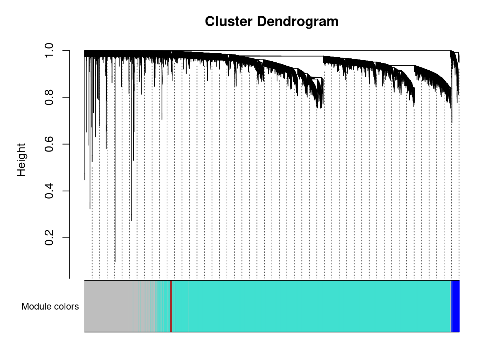

Followed instructions on https://horvath.genetics.ucla.edu/html/CoexpressionNetwork/Rpackages/WGCNA/Tutorials/, which was based on the method used in https://doi.org/10.1371/journal.pgen.0020130

# Data Preparation


::: {.cell}

```{.r .cell-code}
library(WGCNA)
options(stringsAsFactors = F)

phenotype.datatfile <- '../dataset.phenotype.Svenson_DO_HFD.v12.Rds'
all.phenotype.data <- readRDS(phenotype.datatfile)
annotation <- all.phenotype.data$annot.samples[c('mouse.id','sex','diet')]

phenotype.data <- 
  all.phenotype.data$data$raw %>% 
  as.data.frame 

phenotype.data$mouse.id <- rownames(phenotype.data)

phenotype.data <-
  phenotype.data %>%
  left_join(annotation,by='mouse.id')
  
expression.datatfile <- '../dataset.mrna.Svenson_DO_HFD.v12.Rds'
expression.data <- readRDS(expression.datatfile)
mrna.data <-
  expression.data$data$raw %>% as.data.frame

good.genes <- goodSamplesGenes(mrna.data)
```

::: {.cell-output .cell-output-stdout}
```
 Flagging genes and samples with too many missing values...
  ..step 1
```
:::

```{.r .cell-code}
#check if all genes are ok, not too many missing values for genes or samples
good.genes$allOK
```

::: {.cell-output .cell-output-stdout}
```
[1] TRUE
```
:::
:::


# Network Construction


::: {.cell}

```{.r .cell-code}
nSets <- 4 #four datasets, NCD and HFD, male and female
setLabels <- c("NCD-M","HFHS-M","NCD-F","HFHS-F")
multiExpr=vector(mode="list",length=nSets) #create vector with two datasets

#filter for only exprerssion data where we have appropriatet phenotype data
chow.mice.m <- phenotype.data %>% filter(diet=="chow"&sex=="M") %>% pull(mouse.id)
hf.mice.m <- phenotype.data %>% filter(diet=="hf"&sex=="M") %>% pull(mouse.id)
chow.mice.f <- phenotype.data %>% filter(diet=="chow"&sex=="F") %>% pull(mouse.id)
hf.mice.f <- phenotype.data %>% filter(diet=="hf"&sex=="F") %>% pull(mouse.id)

chow.expression.m <- mrna.data[chow.mice.m,] %>% na.omit
hf.expression.m <- mrna.data[hf.mice.m,] %>% na.omit
chow.expression.f <- mrna.data[chow.mice.f,] %>% na.omit
hf.expression.f <- mrna.data[hf.mice.f,] %>% na.omit

# enter data on expression in to multiExpr object
multiExpr[[1]]=list(data=chow.expression.m)
multiExpr[[2]]=list(data=hf.expression.m) 
multiExpr[[3]]=list(data=chow.expression.f)
multiExpr[[4]]=list(data=hf.expression.f) 

exprSize <- checkSets(multiExpr)
gsg <- goodSamplesGenesMS(multiExpr)
```

::: {.cell-output .cell-output-stdout}
```
 Flagging genes and samples with too many missing values...
  ..step 1
```
:::

```{.r .cell-code}
# remove genes with too many missing values or no variance
if (!gsg$allOK)
{
  # Print information about the removed genes:
  if (sum(!gsg$goodGenes) > 0)
    printFlush(paste("Removing genes:", paste(names(multiExpr[[1]]$data)[!gsg$goodGenes], 
                                              collapse = ", ")))
  for (set in 1:exprSize$nSets)
  {
    if (sum(!gsg$goodSamples[[set]]))
      printFlush(paste("In set", setLabels[set], "removing samples",
                       paste(rownames(multiExpr[[set]]$data)[!gsg$goodSamples[[set]]], collapse = ", ")))
    # Remove the offending genes and samples
    multiExpr[[set]]$data = multiExpr[[set]]$data[gsg$goodSamples[[set]], gsg$goodGenes];
  }
  # Update exprSize
  exprSize = checkSets(multiExpr)
}
```
:::


## Clustering Expression Datasets


::: {.cell}

```{.r .cell-code}
#crerate two sample trees
sampleTrees = list()
for (set in 1:nSets)
{
  sampleTrees[[set]] = hclust(dist(multiExpr[[set]]$data), method = "average")
}
#cluster genes in each set, make a hclust tree using "average" method
for (set in 1:nSets)
  plot(sampleTrees[[set]], 
       main = paste("Sample clustering on all genes in",
                    setLabels[set]),
       xlab="", 
       sub="", 
       cex = 0.7);
```

::: {.cell-output-display}
{width=672}
:::

::: {.cell-output-display}
{width=672}
:::

::: {.cell-output-display}
{width=672}
:::

::: {.cell-output-display}
{width=672}
:::

```{.r .cell-code}
# Form a multi-set structure called Traits that will hold the clinical traits.
Traits = vector(mode="list", length = nSets);
for (set in 1:nSets)
{
  setSamples = rownames(multiExpr[[set]]$data);
  traitRows = match(setSamples, rownames(phenotype.data));
  Traits[[set]] = list(data = phenotype.data[traitRows,]);
  rownames(Traits[[set]]$data) = rownames(phenotype.data[traitRows,]);
}
collectGarbage();
# Define data set dimensions
nGenes = exprSize$nGenes;
nSamples = exprSize$nSamples;
```
:::


The combined dataset includes 11770 genes and 120112123120 samples separated into `nSets` datasets (NCD-M,HFHS-M,NCD-F,HFHS-F).


::: {.cell}

```{.r .cell-code}
# Choose a set of soft-thresholding powers
powers = seq(4,20,by=1)
# Initialize a list to hold the results of scale-free analysis
powerTables = vector(mode = "list", length = nSets);
# Call the network topology analysis function for each set in turn
for (set in 1:nSets)
  powerTables[[set]] = list(data = pickSoftThreshold(multiExpr[[set]]$data,
                                                     powerVector=powers,
                                                     verbose = 2)[[2]]);
```

::: {.cell-output .cell-output-stdout}
```
pickSoftThreshold: will use block size 3801.
 pickSoftThreshold: calculating connectivity for given powers...
   ..working on genes 1 through 3801 of 11770
```
:::

::: {.cell-output .cell-output-stdout}
```
   ..working on genes 3802 through 7602 of 11770
   ..working on genes 7603 through 11403 of 11770
   ..working on genes 11404 through 11770 of 11770
   Power SFT.R.sq  slope truncated.R.sq mean.k. median.k. max.k.
1      4    0.316 -0.365          0.223  1640.0    1670.0   3930
2      5    0.462 -0.532          0.467  1180.0    1120.0   3250
3      6    0.538 -0.674          0.607   879.0     771.0   2720
4      7    0.578 -0.788          0.689   667.0     534.0   2310
5      8    0.607 -0.890          0.746   515.0     375.0   1980
6      9    0.636 -0.971          0.796   403.0     265.0   1710
7     10    0.647 -1.040          0.829   320.0     190.0   1480
8     11    0.668 -1.110          0.854   256.0     137.0   1290
9     12    0.677 -1.180          0.872   207.0      99.2   1140
10    13    0.690 -1.230          0.891   169.0      72.2   1000
11    14    0.696 -1.270          0.904   139.0      53.0    886
12    15    0.711 -1.310          0.916   115.0      39.2    786
13    16    0.718 -1.340          0.926    95.4      29.2    700
14    17    0.735 -1.380          0.941    79.8      21.8    626
15    18    0.746 -1.400          0.951    67.1      16.4    561
16    19    0.738 -1.450          0.948    56.7      12.3    503
17    20    0.742 -1.490          0.950    48.1       9.3    453
pickSoftThreshold: will use block size 3801.
 pickSoftThreshold: calculating connectivity for given powers...
   ..working on genes 1 through 3801 of 11770
   ..working on genes 3802 through 7602 of 11770
   ..working on genes 7603 through 11403 of 11770
   ..working on genes 11404 through 11770 of 11770
   Power SFT.R.sq  slope truncated.R.sq mean.k. median.k. max.k.
1      4    0.328 -0.701          0.519  1090.0   1080.00   2940
2      5    0.425 -0.882          0.642   743.0    694.00   2300
3      6    0.482 -1.030          0.721   523.0    453.00   1830
4      7    0.520 -1.160          0.767   379.0    302.00   1480
5      8    0.561 -1.230          0.808   281.0    205.00   1220
6      9    0.579 -1.300          0.835   213.0    141.00   1010
7     10    0.601 -1.350          0.859   164.0     98.80    840
8     11    0.626 -1.380          0.880   128.0     69.70    707
9     12    0.647 -1.410          0.896   101.0     49.80    599
10    13    0.657 -1.440          0.906    80.3     35.80    511
11    14    0.667 -1.470          0.914    64.6     25.90    439
12    15    0.664 -1.520          0.913    52.5     19.00    379
13    16    0.665 -1.560          0.917    42.9     14.00    329
14    17    0.678 -1.570          0.925    35.4     10.40    287
15    18    0.688 -1.580          0.932    29.3      7.71    251
16    19    0.682 -1.620          0.931    24.5      5.82    221
17    20    0.693 -1.640          0.939    20.5      4.43    195
pickSoftThreshold: will use block size 3801.
 pickSoftThreshold: calculating connectivity for given powers...
   ..working on genes 1 through 3801 of 11770
   ..working on genes 3802 through 7602 of 11770
   ..working on genes 7603 through 11403 of 11770
   ..working on genes 11404 through 11770 of 11770
   Power SFT.R.sq  slope truncated.R.sq mean.k. median.k. max.k.
1      4    0.344 -0.349          0.227  1660.0    1690.0   3960
2      5    0.484 -0.517          0.456  1210.0    1150.0   3280
3      6    0.559 -0.645          0.582   901.0     789.0   2750
4      7    0.614 -0.740          0.683   687.0     549.0   2340
5      8    0.653 -0.819          0.744   534.0     387.0   2000
6      9    0.697 -0.876          0.804   421.0     276.0   1730
7     10    0.724 -0.932          0.844   336.0     198.0   1500
8     11    0.747 -0.972          0.872   271.0     143.0   1310
9     12    0.759 -1.020          0.887   220.0     105.0   1150
10    13    0.771 -1.070          0.903   181.0      76.5   1010
11    14    0.776 -1.110          0.915   150.0      56.4    900
12    15    0.774 -1.160          0.916   125.0      41.7    803
13    16    0.772 -1.200          0.918   104.0      31.1    720
14    17    0.773 -1.240          0.924    88.0      23.2    647
15    18    0.779 -1.270          0.931    74.5      17.5    583
16    19    0.781 -1.300          0.934    63.4      13.2    527
17    20    0.766 -1.340          0.924    54.2      10.1    478
pickSoftThreshold: will use block size 3801.
 pickSoftThreshold: calculating connectivity for given powers...
   ..working on genes 1 through 3801 of 11770
   ..working on genes 3802 through 7602 of 11770
   ..working on genes 7603 through 11403 of 11770
   ..working on genes 11404 through 11770 of 11770
   Power SFT.R.sq  slope truncated.R.sq mean.k. median.k. max.k.
1      4    0.243 -0.452          0.306  1560.0    1600.0   3760
2      5    0.360 -0.677          0.490  1110.0    1080.0   3080
3      6    0.424 -0.843          0.597   816.0     750.0   2550
4      7    0.468 -0.977          0.666   614.0     525.0   2140
5      8    0.513 -1.070          0.726   472.0     373.0   1820
6      9    0.538 -1.160          0.764   368.0     269.0   1550
7     10    0.568 -1.230          0.804   291.0     195.0   1340
8     11    0.590 -1.270          0.831   233.0     143.0   1160
9     12    0.604 -1.330          0.847   188.0     106.0   1010
10    13    0.618 -1.370          0.864   154.0      78.2    882
11    14    0.638 -1.400          0.882   126.0      58.8    774
12    15    0.647 -1.440          0.892   105.0      44.4    683
13    16    0.663 -1.460          0.905    87.5      33.6    604
14    17    0.675 -1.470          0.915    73.4      25.5    536
15    18    0.688 -1.490          0.924    62.0      19.5    477
16    19    0.691 -1.510          0.927    52.6      15.1    426
17    20    0.702 -1.520          0.935    44.9      11.7    381
```
:::

```{.r .cell-code}
collectGarbage();
# Plot the results:
colors = color.scheme

# Will plot these columns of the returned scale free analysis tables
plotCols = c(2,5,6,7)
colNames = c("Scale Free Topology Model Fit", "Mean connectivity", "Median connectivity",
"Max connectivity");
# Get the minima and maxima of the plotted points
ylim = matrix(NA, nrow = 2, ncol = 4);
for (set in 1:nSets)
{
  for (col in 1:length(plotCols))
  {
    ylim[1, col] = min(ylim[1, col], powerTables[[set]]$data[, plotCols[col]], na.rm = TRUE);
    ylim[2, col] = max(ylim[2, col], powerTables[[set]]$data[, plotCols[col]], na.rm = TRUE);
  }
}
# Plot the quantities in the chosen columns vs. the soft thresholding power
sizeGrWindow(8, 6)
pdf(file = "scaleFreeAnalysis.pdf", wi = 8, he = 6)
par(mfcol = c(2,2));
par(mar = c(4.2, 4.2 , 2.2, 0.5))
cex1 = 0.7;
for (col in 1:length(plotCols)) for (set in 1:nSets)
{
  if (set==1)
  {
    plot(powerTables[[set]]$data[,1], -sign(powerTables[[set]]$data[,3])*powerTables[[set]]$data[,2],
         xlab="Soft Threshold (power)",ylab=colNames[col],type="n", ylim = ylim[, col],
         main = colNames[col]);
    addGrid();
  }
  if (col==1)
  {
    text(powerTables[[set]]$data[,1], -sign(powerTables[[set]]$data[,3])*powerTables[[set]]$data[,2],
         labels=powers,cex=cex1,col=colors[set]);
  } else
    text(powerTables[[set]]$data[,1], powerTables[[set]]$data[,plotCols[col]],
         labels=powers,cex=cex1,col=colors[set]);
  if (col==1)
  {
    legend("bottomright", legend = setLabels, col = colors, pch = 20) ;
  } else
    legend("topright", legend = setLabels, col = colors, pch = 20) ;
}
dev.off();
```

::: {.cell-output .cell-output-stdout}
```
pdf 
  2 
```
:::
:::

::: {.cell}

```{.r .cell-code}
network.power <- 15 #based on the max SFT R2 maximum
net <- blockwiseConsensusModules(
        multiExpr, 
        power = network.power, 
        minModuleSize = 30, #default is 20, tutorial said 30
        deepSplit = 2, #default
        maxBlockSize = ncol(mrna.data), #total number of genes
        pamRespectsDendro = FALSE, 
        mergeCutHeight = 0.25,
        numericLabels = TRUE,
        minKMEtoStay = 0.1, #default is 0.2, tutorial said 0.1
        saveTOMs = TRUE, 
        verbose = 1)
```

::: {.cell-output .cell-output-stdout}
```
 Calculating consensus modules and module eigengenes block-wise from all genes
 Calculating topological overlaps block-wise from all genes
```
:::
:::


Constructed modules with 15 soft-thresholding power, based on the visualization of the soft-thresholding power $R^2$.

## Plotting Samples Clustered by Consensus Modules


::: {.cell}

```{.r .cell-code}
consMEs = net$multiMEs
moduleLabels = net$colors
# Convert the numeric labels to color labels
moduleColors = labels2colors(moduleLabels)
consTree = net$dendrograms[[1]]

# Convert labels to colors for plotting
mergedColors = labels2colors(net$colors)
# Plot the dendrogram and the module colors underneath
plotDendroAndColors(net$dendrograms[[1]], mergedColors[net$blockGenes[[1]]],
                    "Module colors",
                    dendroLabels = FALSE, hang = 0.03,
                    addGuide = TRUE, guideHang = 0.05)
```

::: {.cell-output-display}
{width=672}
:::

```{.r .cell-code}
# Convert labels to colors for plotting
mergedColors = labels2colors(net$colors)

MEs = net$MEs;
geneTree = net$dendrograms[[1]];
```
:::


# Output

Wrote this out to read in in the script Liver-WGCNA-Cholesterol.Qmd


::: {.cell}

```{.r .cell-code}
save.image(file = "ncd_hf_wcgna_networks.RData")
```
:::


# Session Information


::: {.cell}

```{.r .cell-code}
sessionInfo()
```

::: {.cell-output .cell-output-stdout}
```
R version 4.4.0 (2024-04-24)
Platform: x86_64-pc-linux-gnu
Running under: Red Hat Enterprise Linux 8.8 (Ootpa)

Matrix products: default
BLAS:   /sw/pkgs/arc/stacks/gcc/13.2.0/R/4.4.0/lib64/R/lib/libRblas.so 
LAPACK: /sw/pkgs/arc/stacks/gcc/13.2.0/R/4.4.0/lib64/R/lib/libRlapack.so;  LAPACK version 3.12.0

locale:
 [1] LC_CTYPE=en_US.UTF-8       LC_NUMERIC=C              
 [3] LC_TIME=en_US.UTF-8        LC_COLLATE=en_US.UTF-8    
 [5] LC_MONETARY=en_US.UTF-8    LC_MESSAGES=en_US.UTF-8   
 [7] LC_PAPER=en_US.UTF-8       LC_NAME=C                 
 [9] LC_ADDRESS=C               LC_TELEPHONE=C            
[11] LC_MEASUREMENT=en_US.UTF-8 LC_IDENTIFICATION=C       

time zone: America/Detroit
tzcode source: system (glibc)

attached base packages:
[1] stats     graphics  grDevices utils     datasets  methods   base     

other attached packages:
[1] WGCNA_1.73            fastcluster_1.2.6     dynamicTreeCut_1.63-1
[4] ggplot2_3.5.1         readr_2.1.5           dplyr_1.1.4          
[7] tidyr_1.3.1           knitr_1.49           

loaded via a namespace (and not attached):
 [1] tidyselect_1.2.1        blob_1.2.4              Biostrings_2.72.1      
 [4] fastmap_1.2.0           digest_0.6.37           rpart_4.1.23           
 [7] lifecycle_1.0.4         cluster_2.1.6           survival_3.5-8         
[10] KEGGREST_1.44.1         RSQLite_2.3.9           magrittr_2.0.3         
[13] compiler_4.4.0          rlang_1.1.4             Hmisc_5.2-2            
[16] tools_4.4.0             yaml_2.3.9              data.table_1.16.4      
[19] htmlwidgets_1.6.4       bit_4.5.0.1             withr_3.0.2            
[22] foreign_0.8-86          purrr_1.0.2             BiocGenerics_0.50.0    
[25] nnet_7.3-19             grid_4.4.0              stats4_4.4.0           
[28] preprocessCore_1.66.0   colorspace_2.1-1        GO.db_3.19.1           
[31] scales_1.3.0            iterators_1.0.14        cli_3.6.3              
[34] rmarkdown_2.29          crayon_1.5.3            generics_0.1.3         
[37] rstudioapi_0.17.1       httr_1.4.7              tzdb_0.4.0             
[40] DBI_1.2.3               cachem_1.1.0            stringr_1.5.1          
[43] zlibbioc_1.50.0         splines_4.4.0           parallel_4.4.0         
[46] impute_1.78.0           AnnotationDbi_1.66.0    XVector_0.44.0         
[49] matrixStats_1.5.0       base64enc_0.1-3         vctrs_0.6.5            
[52] Matrix_1.7-0            jsonlite_1.8.9          IRanges_2.38.1         
[55] hms_1.1.3               S4Vectors_0.42.1        bit64_4.5.2            
[58] Formula_1.2-5           htmlTable_2.4.3         foreach_1.5.2          
[61] glue_1.8.0              codetools_0.2-20        stringi_1.8.4          
[64] gtable_0.3.6            GenomeInfoDb_1.40.1     UCSC.utils_1.0.0       
[67] munsell_0.5.1           tibble_3.2.1            pillar_1.10.1          
[70] htmltools_0.5.8.1       GenomeInfoDbData_1.2.12 R6_2.5.1               
[73] doParallel_1.0.17       evaluate_1.0.1          Biobase_2.64.0         
[76] lattice_0.22-6          png_0.1-8               backports_1.5.0        
[79] memoise_2.0.1           Rcpp_1.0.13-1           gridExtra_2.3          
[82] checkmate_2.3.2         xfun_0.50               pkgconfig_2.0.3        
```
:::
:::