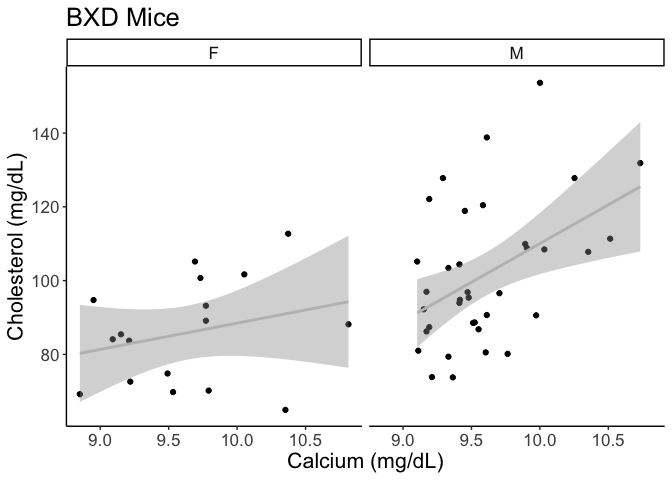
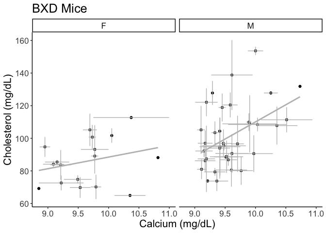

# Purpose

To analyze cholesterol levels from diversity outbred mice, identifying predictors of elevated choelsterol.

# Experimental Details

This analysis uses data from the Andreux et al dataset

# Raw Data


```r
ca.female.filename <- 'BXD_12844.csv'	
ca.male.filename <- 'BXD_12914.csv' 
chol.male.filename <- 'BXD_12951.csv'	
chol.female.filename <- 'BXD_12881.csv'
```


```r
library(readr) #loads the readr package


ca.f.data <- read_csv(ca.female.filename, skip=10) %>% mutate(Sex="F",Measure="Ca")
ca.m.data <- read_csv(ca.male.filename, skip=10) %>% mutate(Sex="M",Measure="Ca")
chol.f.data <- read_csv(chol.female.filename, skip=10) %>% mutate(Sex="F",Measure="Chol")
chol.m.data <- read_csv(chol.male.filename, skip=10) %>% mutate(Sex="M",Measure="Chol")

combined.data <-
  left_join(bind_rows(ca.f.data,ca.m.data),
            bind_rows(chol.f.data,chol.m.data),
            by=c("Name","Sex"),
            suffix=c("_ca","_chol")) %>%
  mutate(Chol=Value_chol*38.665,
         Chol.se = SE_chol*38.665) %>% #convert to mg/dL
  mutate(Ca = Value_ca*4.005,
         Ca.se = SE_ca*4.005) %>% #convert to mg/dL 
  mutate(Ca.sd = Ca.se*sqrt(N_ca),
         Chol.sd = Chol.se*sqrt(N_chol))
```

# Sample Sizes


```r
combined.data %>%
  mutate(Ca.Data = !(is.na(Ca)),
         Chol.Data = !(is.na(Chol))) %>%
  group_by(Sex,Ca.Data,Chol.Data) %>%
  count %>%
  kable(caption="Number of strains for BXD Ca/Chol associations")
```


Table: Number of strains for BXD Ca/Chol associations

|Sex |Ca.Data |Chol.Data |  n|
|:---|:-------|:---------|--:|
|F   |TRUE    |TRUE      | 17|
|M   |TRUE    |TRUE      | 36|

```r
combined.data %>%
  mutate(Total.Mice = N_ca + N_chol) %>%
  group_by(Sex) %>%
  summarize(All.Mice = sum(Total.Mice)) %>%
  kable(caption="Number of strains for BXD Ca/Chol associations")
```


Table: Number of strains for BXD Ca/Chol associations

|Sex | All.Mice|
|:---|--------:|
|F   |       72|
|M   |      254|

# Analysis of BXD 


```r
library(ggplot2)
library(ggrepel)
combined.data %>%
  ggplot(aes(y=Chol,x=Ca)) +
  geom_point() +
  geom_smooth(method="lm",color="grey") +
  labs(y="Cholesterol (mg/dL)",
       x="Calcium (mg/dL)",
       title="BXD Strains") +
  #geom_label_repel(aes(label=Name)) +
  facet_grid(.~Sex) +
  theme_classic() +
  theme(text=element_text(size=16))
```

<!-- -->

```r
combined.data %>%
  ggplot(aes(y=Chol,x=Ca)) +
  geom_point() +
  geom_errorbar(aes(ymin=Chol-Chol.sd,
                    ymax=Chol+Chol.sd),
                col="grey") +
  geom_errorbarh(aes(xmin=Ca-Ca.sd,
                    xmax=Ca+Ca.sd),
                 col="grey") +
  geom_smooth(method="lm",color="grey") +
  labs(y="Cholesterol (mg/dL)",
       x="Calcium (mg/dL)",
       title="BXD Strains") +
  #geom_label_repel(aes(label=Name)) +
  facet_grid(.~Sex) +
  theme_classic() +
  theme(text=element_text(size=16))
```

<!-- -->

```r
library(broom)
with(combined.data, cor.test(Ca,Chol, method="spearman"))  %>%
  tidy %>%
  kable(caption="Overall association between calcium and cholesterol in BXD mice")
```


Table: Overall association between calcium and cholesterol in BXD mice

| estimate| statistic| p.value|method                          |alternative |
|--------:|---------:|-------:|:-------------------------------|:-----------|
|    0.334|     16529|   0.015|Spearman's rank correlation rho |two.sided   |

```r
with(combined.data %>% filter(Sex=="M"), cor.test(Ca,Chol, method="spearman"))  %>%
  tidy %>%
  kable(caption="Association between calcium and cholesterol in BXD male mice")
```


Table: Association between calcium and cholesterol in BXD male mice

| estimate| statistic| p.value|method                          |alternative |
|--------:|---------:|-------:|:-------------------------------|:-----------|
|    0.393|      4717|   0.018|Spearman's rank correlation rho |two.sided   |

```r
with(combined.data %>% filter(Sex=="F"), cor.test(Ca,Chol, method="spearman"))  %>%
  tidy %>%
  kable(caption="Association between calcium and cholesterol in BXD female mice")
```


Table: Association between calcium and cholesterol in BXD female mice

| estimate| statistic| p.value|method                          |alternative |
|--------:|---------:|-------:|:-------------------------------|:-----------|
|    0.269|       597|   0.297|Spearman's rank correlation rho |two.sided   |

```r
lm(Chol ~ Sex + Ca, data=combined.data) %>% tidy %>%
  kable(caption="Multivariate regression of Calcium and Cholesterol Associations")
```


Table: Multivariate regression of Calcium and Cholesterol Associations

|term        | estimate| std.error| statistic| p.value|
|:-----------|--------:|---------:|---------:|-------:|
|(Intercept) |    -56.8|     49.21|     -1.16|   0.254|
|SexM        |     16.3|      4.86|      3.35|   0.002|
|Ca          |     14.8|      5.09|      2.91|   0.005|

```r
lm(Chol ~ Sex + Ca, data=combined.data) %>% glance %>%
  kable(caption="Multivariate regression of Calcium and Cholesterol Associations")
```


Table: Multivariate regression of Calcium and Cholesterol Associations

| r.squared| adj.r.squared| sigma| statistic| p.value| df| logLik| AIC| BIC| deviance| df.residual| nobs|
|---------:|-------------:|-----:|---------:|-------:|--:|------:|---:|---:|--------:|-----------:|----:|
|     0.274|         0.244|  16.5|      9.41|       0|  2|   -222| 452| 460|    13611|          50|   53|

```r
lm(Chol ~ Sex + Ca + Sex:Ca, data=combined.data) %>% tidy %>%
  kable(caption="Multivariate regression of Calcium and Cholesterol Associations, testing for modification by sex")
```


Table: Multivariate regression of Calcium and Cholesterol Associations, testing for modification by sex

|term        | estimate| std.error| statistic| p.value|
|:-----------|--------:|---------:|---------:|-------:|
|(Intercept) |    17.20|     72.89|     0.236|   0.814|
|SexM        |  -117.15|     97.73|    -1.199|   0.236|
|Ca          |     7.13|      7.55|     0.944|   0.350|
|SexM:Ca     |    13.87|     10.15|     1.367|   0.178|

# Session Information


```r
sessionInfo()
```

```
## R version 4.2.2 (2022-10-31)
## Platform: x86_64-apple-darwin17.0 (64-bit)
## Running under: macOS Big Sur ... 10.16
## 
## Matrix products: default
## BLAS:   /Library/Frameworks/R.framework/Versions/4.2/Resources/lib/libRblas.0.dylib
## LAPACK: /Library/Frameworks/R.framework/Versions/4.2/Resources/lib/libRlapack.dylib
## 
## locale:
## [1] en_US.UTF-8/en_US.UTF-8/en_US.UTF-8/C/en_US.UTF-8/en_US.UTF-8
## 
## attached base packages:
## [1] stats     graphics  grDevices utils     datasets  methods   base     
## 
## other attached packages:
## [1] broom_1.0.2   ggrepel_0.9.2 ggplot2_3.4.0 readr_2.1.3   dplyr_1.0.10 
## [6] tidyr_1.3.0   knitr_1.41   
## 
## loaded via a namespace (and not attached):
##  [1] tidyselect_1.2.0 xfun_0.36        bslib_0.4.2      purrr_1.0.1     
##  [5] splines_4.2.2    lattice_0.20-45  colorspace_2.0-3 vctrs_0.5.2     
##  [9] generics_0.1.3   htmltools_0.5.4  yaml_2.3.6       mgcv_1.8-41     
## [13] utf8_1.2.2       rlang_1.0.6      jquerylib_0.1.4  pillar_1.8.1    
## [17] glue_1.6.2       withr_2.5.0      DBI_1.1.3        bit64_4.0.5     
## [21] lifecycle_1.0.3  stringr_1.5.0    munsell_0.5.0    gtable_0.3.1    
## [25] evaluate_0.19    labeling_0.4.2   tzdb_0.3.0       fastmap_1.1.0   
## [29] parallel_4.2.2   fansi_1.0.3      highr_0.10       Rcpp_1.0.9      
## [33] backports_1.4.1  scales_1.2.1     cachem_1.0.6     vroom_1.6.0     
## [37] jsonlite_1.8.4   farver_2.1.1     bit_4.0.5        hms_1.1.2       
## [41] digest_0.6.31    stringi_1.7.12   grid_4.2.2       cli_3.6.0       
## [45] tools_4.2.2      magrittr_2.0.3   sass_0.4.4       tibble_3.1.8    
## [49] crayon_1.5.2     pkgconfig_2.0.3  Matrix_1.5-3     ellipsis_0.3.2  
## [53] assertthat_0.2.1 rmarkdown_2.19   rstudioapi_0.14  R6_2.5.1        
## [57] nlme_3.1-161     compiler_4.2.2
```

