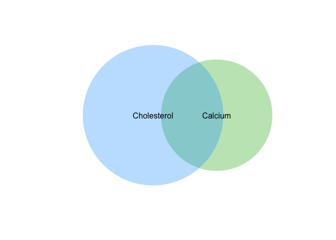
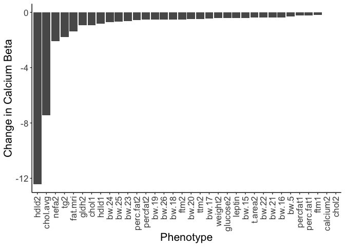

# Purpose

To analyze associations between other phenotypes and cholesterol and calcium to identify potential measured confounders.

# Experimental Details

This analysis uses the complete dataset (F01-F425 and M01-M425). 

# Raw Data


```r
phenotype.filename <- 'Svenson-183_Svenson_DO-phenotypes.csv'
```


```r
library(readr) #loads the readr package


phenotype.data <- read_csv(phenotype.filename)
#set phenotypes of zero or  to na
phenotype.data[phenotype.data < 0] <- NA

library(forcats)
cholesterol.data <-
  phenotype.data %>%
  mutate(Diet = fct_recode(as.factor(diet),
                           "NCD"="chow",
                           "HFHS"="hf")) %>%
  select(-diet) %>%
  mutate(chol.avg = rowMeans(select(., starts_with("chol")), 
                             na.rm = TRUE))
```

# Correlation Matrix


```r
library("psych")    
correlation.matrix <- cholesterol.data %>%
  select(-coat_color,-gen,-sex,-Diet,-sample) %>%
  corr.test(method="spearman", use="pairwise",adjust="BH")

correlation.matrix$p %>%
  as.data.frame() %>%
  select(calcium2) %>%
  filter(calcium2<0.05/162) -> calcium.correlates

correlation.matrix$p %>%
  as.data.frame() %>%
  select(chol.avg) %>%
  filter(chol.avg<0.05/162) -> cholesterol.correlates

overlapping.correlates <- intersect(rownames(calcium.correlates),
                                    rownames(cholesterol.correlates))
```


```r
library(venneuler)

venneuler(c("Calcium"=dim(calcium.correlates)[1]+1,
            "Cholesterol"=dim(cholesterol.correlates)[1]+1,
            "Calcium&Cholesterol"=length(overlapping.correlates)+1)) %>%
  plot
```

<!-- -->

# Testing Moderation by Correlates


```r
base.model <- lm(chol2 ~ Diet + sex + calcium2, data=cholesterol.data)

confounders.data <-
  data.frame("Measure"=overlapping.correlates) %>%
  mutate(Calcium.mod = NA)

for (measure in overlapping.correlates) {
  formula <- as.formula(paste("chol2 ~ ", measure, " + Diet + sex + calcium2"))
  test.model = lm(formula,data=cholesterol.data)
  confounders.data <- 
    confounders.data %>%
    add_row(Measure=measure,
            Calcium.mod=coefficients(test.model)['calcium2'])
}

confounders.data <-
  confounders.data %>% 
  mutate(Calcium.base = coefficients(base.model)['calcium2']) %>%
  filter(!is.na(Calcium.mod)) 

library(ggplot2)
confounders.data %>%
  mutate(Estimate.change = Calcium.mod-Calcium.base) %>%
  ggplot(aes(y=Estimate.change,x=reorder(Measure,Calcium.mod))) +
  geom_bar(stat="identity") +
  labs(y="Change in Calcium Beta",
       x="Phenotype") +
  theme_classic() +
  theme(text=element_text(size=16),
        axis.text.x = element_text(angle = 90, vjust = 0.5, hjust=1))
```

<!-- -->

```r
confounders.data %>%
  arrange(Calcium.mod) %>%
  mutate(Estimate.change = Calcium.mod-Calcium.base) %>%
  kable(caption="Base and Moderated Model Estimates")
```


Table: Base and Moderated Model Estimates

|Measure     | Calcium.mod| Calcium.base| Estimate.change|
|:-----------|-----------:|------------:|---------------:|
|hdld2       |       0.424|         12.7|         -12.236|
|chol.avg    |       5.276|         12.7|          -7.383|
|nefa2       |      10.411|         12.7|          -2.249|
|tg2         |      10.801|         12.7|          -1.858|
|fat_mri     |      11.205|         12.7|          -1.454|
|gldh2       |      11.713|         12.7|          -0.947|
|chol1       |      11.840|         12.7|          -0.819|
|bw_24       |      11.911|         12.7|          -0.749|
|hdld1       |      11.921|         12.7|          -0.738|
|bw_25       |      11.927|         12.7|          -0.733|
|bw_23       |      11.952|         12.7|          -0.708|
|bw_26       |      12.082|         12.7|          -0.578|
|bw_19       |      12.158|         12.7|          -0.502|
|bw_18       |      12.166|         12.7|          -0.494|
|perc_fat2   |      12.178|         12.7|          -0.482|
|bw_20       |      12.185|         12.7|          -0.475|
|ftm2        |      12.211|         12.7|          -0.448|
|bw_22       |      12.221|         12.7|          -0.439|
|bw_17       |      12.227|         12.7|          -0.432|
|glucose2    |      12.232|         12.7|          -0.427|
|leptin      |      12.262|         12.7|          -0.398|
|ttm2        |      12.264|         12.7|          -0.396|
|bw_15       |      12.291|         12.7|          -0.368|
|weight2     |      12.306|         12.7|          -0.354|
|bw_21       |      12.339|         12.7|          -0.321|
|t_area2     |      12.341|         12.7|          -0.319|
|bw_5        |      12.350|         12.7|          -0.310|
|perc_fat1   |      12.451|         12.7|          -0.209|
|ftm1        |      12.498|         12.7|          -0.162|
|chol2       |      12.660|         12.7|           0.000|
|calcium2    |      12.660|         12.7|           0.000|
|phosphorus2 |      13.705|         12.7|           1.045|


# Session Information


```r
sessionInfo()
```

```
## R version 4.2.0 (2022-04-22)
## Platform: x86_64-apple-darwin17.0 (64-bit)
## Running under: macOS Big Sur/Monterey 10.16
## 
## Matrix products: default
## BLAS:   /Library/Frameworks/R.framework/Versions/4.2/Resources/lib/libRblas.0.dylib
## LAPACK: /Library/Frameworks/R.framework/Versions/4.2/Resources/lib/libRlapack.dylib
## 
## locale:
## [1] en_US.UTF-8/en_US.UTF-8/en_US.UTF-8/C/en_US.UTF-8/en_US.UTF-8
## 
## attached base packages:
## [1] stats     graphics  grDevices utils     datasets  methods   base     
## 
## other attached packages:
## [1] ggplot2_3.4.0   venneuler_1.1-3 rJava_1.0-6     psych_2.2.9    
## [5] forcats_0.5.2   readr_2.1.3     dplyr_1.0.10    tidyr_1.2.1    
## [9] knitr_1.41     
## 
## loaded via a namespace (and not attached):
##  [1] tidyselect_1.2.0 xfun_0.35        bslib_0.4.1      purrr_0.3.5     
##  [5] lattice_0.20-45  colorspace_2.0-3 vctrs_0.5.1      generics_0.1.3  
##  [9] htmltools_0.5.3  yaml_2.3.6       utf8_1.2.2       rlang_1.0.6     
## [13] jquerylib_0.1.4  pillar_1.8.1     glue_1.6.2       withr_2.5.0     
## [17] DBI_1.1.3        bit64_4.0.5      lifecycle_1.0.3  stringr_1.4.1   
## [21] munsell_0.5.0    gtable_0.3.1     evaluate_0.18    labeling_0.4.2  
## [25] tzdb_0.3.0       fastmap_1.1.0    parallel_4.2.0   fansi_1.0.3     
## [29] highr_0.9        scales_1.2.1     cachem_1.0.6     vroom_1.6.0     
## [33] jsonlite_1.8.3   farver_2.1.1     bit_4.0.5        mnormt_2.1.1    
## [37] hms_1.1.2        digest_0.6.30    stringi_1.7.8    grid_4.2.0      
## [41] cli_3.4.1        tools_4.2.0      magrittr_2.0.3   sass_0.4.3      
## [45] tibble_3.1.8     crayon_1.5.2     pkgconfig_2.0.3  ellipsis_0.3.2  
## [49] assertthat_0.2.1 rmarkdown_2.18   rstudioapi_0.14  R6_2.5.1        
## [53] nlme_3.1-160     compiler_4.2.0
```

