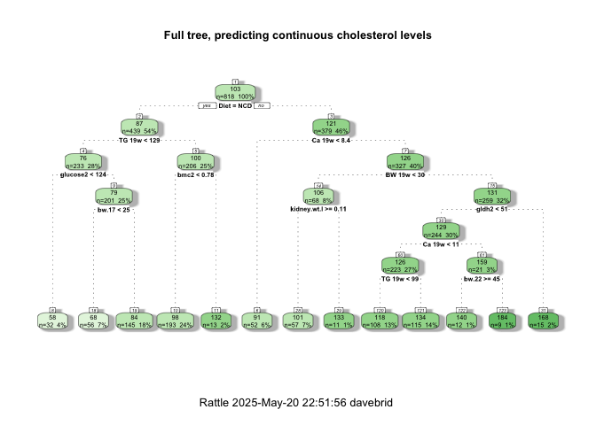
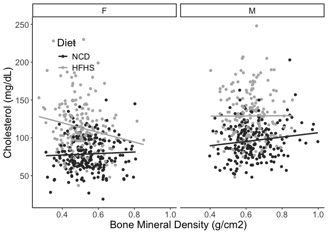
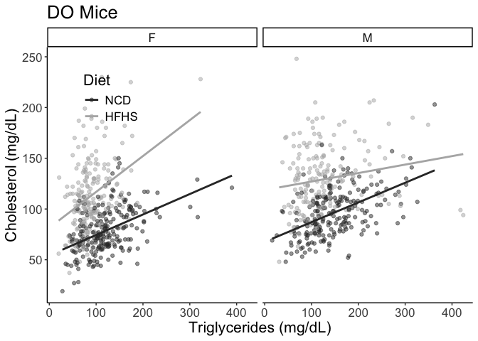

# Purpose

To analyze cholesterol levels from diversity outbred mice, identifying predictors of elevated choelsterol.

# Experimental Details

This analysis uses the complete dataset (F01-F425 and M01-M425). 

# Raw Data


```r
phenotype.filename <- 'Svenson_HFD_DO_phenotype_V12.csv'
```


```r
library(readr) #loads the readr package


phenotype.data <- read_csv(phenotype.filename)
#set phenotypes of zero or  to na
phenotype.data[phenotype.data < 0] <- NA

library(forcats)
cholesterol.data <-
  phenotype.data %>%
  mutate(Diet = fct_recode(as.factor(diet),
                           "NCD"="chow",
                           "HFHS"="hf")) %>%
  mutate(chol.avg = rowMeans(select(., starts_with("chol")), 
                             na.rm = TRUE))
```

# Analysis

The total number of mice with cholesterol levels in this dataset is 840
 mice, broken down as follows:
 

```r
cholesterol.data %>%
  group_by(Diet,sex) %>%
  count() %>%
  kable(caption="Number of mice in each group")
```


Table: Number of mice in each group

|Diet |sex |   n|
|:----|:---|---:|
|NCD  |F   | 225|
|NCD  |M   | 224|
|HFHS |F   | 198|
|HFHS |M   | 193|
 
## Cholesterol Levels for NCD Annimals


```r
cholesterol.data %>%
  group_by(sex,diet) %>%
  summarize_at(.vars=vars(chol1,chol2,chol.avg), .funs=list(~shapiro.test(.)$p.value)) %>%
  kable(caption="Groupwise Shapiro-Wilk normality tests for cholesterol levels", digits=c(0,0,5,5,5))
```


Table: Groupwise Shapiro-Wilk normality tests for cholesterol levels

|sex |diet |   chol1|   chol2| chol.avg|
|:---|:----|-------:|-------:|--------:|
|F   |chow | 0.21667| 0.01587|  0.21915|
|F   |hf   | 0.00767| 0.00006|  0.00271|
|M   |chow | 0.00000| 0.00071|  0.00002|
|M   |hf   | 0.04293| 0.01883|  0.09956|

```r
library(ggplot2)
cholesterol.data %>%
  select(sex,Diet,starts_with('chol')) %>%
  group_by(sex,Diet) %>%
  pivot_longer(cols=starts_with('chol'),
               names_to = "Measure",
               values_to = "Cholesterol") %>%
  ggplot(aes(x=Cholesterol,fill=Measure)) +
  geom_density(alpha=0.5) +
  facet_grid(Diet~sex)
```

<!-- -->

### Similarity at Both Time Points


```r
summary.data.complete <-
  cholesterol.data %>%
  group_by(sex,Diet) %>%
  summarize_at(.vars=vars(chol1,chol2,chol.avg), .funs=list(mean=~mean(., na.rm=T),
                                                            se=se,
                                                            sd=~sd(., na.rm=T)))

kable(summary.data.complete, caption="Cholesterol levels at 11 and 18 weeks")
```


Table: Cholesterol levels at 11 and 18 weeks

|sex |Diet | chol1_mean| chol2_mean| chol.avg_mean| chol1_se| chol2_se| chol.avg_se| chol1_sd| chol2_sd| chol.avg_sd|
|:---|:----|----------:|----------:|-------------:|--------:|--------:|-----------:|--------:|--------:|-----------:|
|F   |NCD  |       80.0|       78.7|            79|     1.16|     1.48|        1.23|     17.4|     22.2|        18.4|
|F   |HFHS |      108.5|      113.3|           111|     1.78|     2.40|        1.87|     25.0|     33.7|        26.3|
|M   |NCD  |       96.4|       96.5|            97|     1.47|     1.57|        1.37|     22.0|     23.5|        20.6|
|M   |HFHS |      128.2|      129.3|           128|     2.09|     2.33|        1.92|     29.1|     32.3|        26.7|

```r
library(broom)
wilcox.test(cholesterol.data$chol2,
       cholesterol.data$chol1, 
       paired=TRUE) %>% tidy %>%
  kable(caption="Pairwise t-test ofcholesterol levels week 11 and week 18")
```


Table: Pairwise t-test ofcholesterol levels week 11 and week 18

| statistic| p.value|method                                               |alternative |
|---------:|-------:|:----------------------------------------------------|:-----------|
|    147377|   0.474|Wilcoxon signed rank test with continuity correction |two.sided   |

```r
summary.data.complete %>%
  pivot_longer(cols=starts_with('chol'),
               names_sep="_",
               names_to = c("Measure","Measurement"),
               values_to = "Cholesterol") %>%
  pivot_wider(values_from="Cholesterol",names_from = "Measurement") %>%
  mutate(Value=fct_recode(as.factor(Measure),
                          "Average"="chol.avg",
                          `8 Weeks`="chol1",
                          `19 Weeks`="chol2")) %>%
  ggplot(aes(y=mean,ymin=mean-sd,ymax=mean+sd,x=Value)) +
  geom_bar(stat='identity') +
  geom_errorbar(width=0.5) +
  facet_grid(Diet~sex) +
    labs(y="Cholesterol (mg/dL)",
       x="") +
  scale_fill_grey() +
  scale_color_grey() +
  theme_classic() +
  theme(text=element_text(size=16),
        axis.text.x = element_text(angle = 90, vjust = 0.5, hjust=1))
```

<!-- -->


```r
summary.data <-
  cholesterol.data %>%
  group_by(sex,diet) %>%
  summarize_at(.vars=vars(chol2), .funs=list(mean=~mean(., na.rm=T),
                                             se=se,
                                             sd=~sd(., na.rm=T)))

library(broom)
lm(chol2~sex*diet, data=cholesterol.data) %>%
  tidy %>%
  kable(caption="Global interactions between sex and diet")
```


Table: Global interactions between sex and diet

|term        | estimate| std.error| statistic| p.value|
|:-----------|--------:|---------:|---------:|-------:|
|(Intercept) |    78.67|      1.88|    41.887|   0.000|
|sexM        |    17.80|      2.68|     6.648|   0.000|
|diethf      |    34.64|      2.75|    12.615|   0.000|
|sexM:diethf |    -1.86|      3.94|    -0.474|   0.636|

```r
lm(chol2~sex+diet, data=cholesterol.data) %>%
  tidy %>%
  kable(caption="Global effects of sex and diet, no interaction",
        digits=c(0,2,2,2,99))
```


Table: Global effects of sex and diet, no interaction

|term        | estimate| std.error| statistic|  p.value|
|:-----------|--------:|---------:|---------:|--------:|
|(Intercept) |     79.1|      1.65|     47.95| 0.00e+00|
|sexM        |     16.9|      1.96|      8.64| 3.03e-17|
|diethf      |     33.7|      1.97|     17.16| 1.37e-56|

```r
cholesterol.data %>%
  group_by(sex,diet) %>%
  filter(!is.na(chol2)) %>%
  count %>%
  kable(caption="Total cholesterol values at 19 weeks for the complete DO dataset")
```


Table: Total cholesterol values at 19 weeks for the complete DO dataset

|sex |diet |   n|
|:---|:----|---:|
|F   |chow | 223|
|F   |hf   | 196|
|M   |chow | 216|
|M   |hf   | 183|

```r
library(ggplot2)
cholesterol.data %>%
  ggplot(aes(y=chol2,x=sex,
             fill=Diet)) +
  geom_violin() +
  geom_jitter(alpha=0.2,
              position = position_jitterdodge(dodge.width = 0.9,
                                              jitter.width = 0.5,
                                              jitter.height = 0)) +
  labs(y="Cholesterol (mg/dL)",
       x="Sex") +
  scale_fill_grey() +
  scale_color_grey() +
  theme_classic() +
  theme(text=element_text(size=16),
        legend.position = c(0.15,0.8))
```

<!-- -->

There is no evidence of an interaction between sex and diet, though both covariates were significant individually.  

# Cholesterol Classification

Classified elevated cholesterol as being greater than the mean for the averaged cholesterol data for all mice


```r
cholesterol.data <-
  cholesterol.data %>%
  mutate(High.Chol = chol2 > mean(chol2,na.rm=T)) %>%
  mutate(sex = as.factor(sex),
         diet = as.factor(diet))
```

# Classification Tree

First used only sex and diet to predict using classification trees


```r
library(tree)

# load libraries
library(rpart)
library(rattle)

tree.sex.diet <- rpart(High.Chol~sex+Diet, data=cholesterol.data)
fancyRpartPlot(tree.sex.diet)
```

<!-- -->

Next included fat mass as a predictor


```r
tree.fat <- rpart(High.Chol~sex+diet+percfat2, data=cholesterol.data)
log.fat <- glm(High.Chol~sex+diet+percfat2, data=cholesterol.data, family='binomial')
log.fat %>% tidy %>% kable(caption="Logistic regression for sex and diet as predictors of above average cholesterol levels")
```


Table: Logistic regression for sex and diet as predictors of above average cholesterol levels

|term        | estimate| std.error| statistic| p.value|
|:-----------|--------:|---------:|---------:|-------:|
|(Intercept) |    -2.72|     0.298|     -9.11|       0|
|sexM        |     1.29|     0.173|      7.49|       0|
|diethf      |     1.47|     0.187|      7.88|       0|
|percfat2    |     4.59|     1.035|      4.44|       0|

```r
fancyRpartPlot(tree.sex.diet)
```

<!-- -->


```r
#function to figure out if all columns are na, pass to select  
not_all_na <- function(x) any(!is.na(x))  

cholesterol.data %>%
  dplyr::select(where(not_all_na)) %>% #remove columns with all nA
  dplyr::select(-mouse.id,-chol.avg,-chol1, -hdld1,-hdld2,-diet) -> #remove cholesterol and hdl columns
  chol.pred.data.high #testing higher than average cholesterol

cholesterol.data %>%
  select(where(not_all_na)) %>% #remove columns with all nA
  select(-mouse.id,-chol1,-chol.avg,-High.Chol, -hdld1,-hdld2,-diet) -> #remove cholesterol and hdl columns
  chol.pred.data.cont #testing continuous cholesterol levels

 
chol.pred.data.cont %>% 
  rename(`TG 19w`="tg2",
         `Ca 19w`="calcium2",
         `BW 19w`="bw.19") %>%
  rpart(chol2~., data=., method="anova") -> tree.all.cont
chol.pred.data.high %>% rpart(High.Chol~., data=., method="class") -> tree.all.high

fancyRpartPlot(tree.all.cont, main="Full tree, predicting continuous cholesterol levels")
```

<!-- -->

```r
fancyRpartPlot(tree.all.high, main="Full tree, predicting above average cholesterol levels")
```

<!-- -->

```r
#pruning of the continuous model, first showed the complexity parameter table
tree.all.cont$cptable %>% kable(caption="Complexity parameter table, used to idenfiy minumum crossvalidated error rate (xerror)")
```


Table: Complexity parameter table, used to idenfiy minumum crossvalidated error rate (xerror)

|    CP| nsplit| rel error| xerror|  xstd|
|-----:|------:|---------:|------:|-----:|
| 0.247|      0|     1.000|  1.001| 0.059|
| 0.064|      1|     0.753|  0.756| 0.045|
| 0.060|      2|     0.689|  0.729| 0.044|
| 0.036|      3|     0.629|  0.634| 0.040|
| 0.023|      4|     0.593|  0.636| 0.042|
| 0.022|      5|     0.569|  0.628| 0.043|
| 0.015|      6|     0.547|  0.609| 0.044|
| 0.015|      7|     0.532|  0.636| 0.046|
| 0.014|      8|     0.516|  0.637| 0.046|
| 0.011|      9|     0.502|  0.655| 0.046|
| 0.011|     10|     0.491|  0.650| 0.046|
| 0.010|     11|     0.481|  0.651| 0.046|
| 0.010|     12|     0.470|  0.649| 0.046|

```r
prune(tree.all.cont, cp=0.0365) -> tree.all.cont.pruned

fancyRpartPlot(tree.all.cont.pruned, uniform=TRUE, main="Pruned tree predicting continuous cholesterol levels")
```

<!-- -->

```r
rpart.plot::prp(tree.all.cont.pruned, extra=1, 
                main="",
                cex=1.2) 
```

<!-- -->

```r
tree.all.cont.pruned
```

```
## n=818 (22 observations deleted due to missingness)
## 
## node), split, n, deviance, yval
##       * denotes terminal node
## 
## 1) root 818 928000 103.0  
##   2) Diet=NCD 439 263000  87.4  
##     4) TG 19w< 128 233  92600  76.5 *
##     5) TG 19w>=128 206 111000  99.8 *
##   3) Diet=HFHS 379 436000 121.0  
##     6) Ca 19w< 8.35 52  26700  90.6 *
##     7) Ca 19w>=8.35 327 353000 126.0 *
```


```r
log.calcium <- glm(High.Chol~sex+diet+tg2+calcium2, data=cholesterol.data, family='binomial')
summary(log.calcium)
```

```
## 
## Call:
## glm(formula = High.Chol ~ sex + diet + tg2 + calcium2, family = "binomial", 
##     data = cholesterol.data)
## 
## Deviance Residuals: 
##    Min      1Q  Median      3Q     Max  
## -2.811  -0.788  -0.265   0.818   2.557  
## 
## Coefficients:
##              Estimate Std. Error z value Pr(>|z|)    
## (Intercept) -10.63079    1.09542   -9.70  < 2e-16 ***
## sexM          1.10576    0.18978    5.83  5.7e-09 ***
## diethf        2.22720    0.20620   10.80  < 2e-16 ***
## tg2           0.00883    0.00189    4.68  2.9e-06 ***
## calcium2      0.84725    0.11357    7.46  8.6e-14 ***
## ---
## Signif. codes:  0 '***' 0.001 '**' 0.01 '*' 0.05 '.' 0.1 ' ' 1
## 
## (Dispersion parameter for binomial family taken to be 1)
## 
##     Null deviance: 1058.9  on 765  degrees of freedom
## Residual deviance:  766.9  on 761  degrees of freedom
##   (74 observations deleted due to missingness)
## AIC: 776.9
## 
## Number of Fisher Scoring iterations: 5
```

```r
library(ggplot2)

ggplot(data=cholesterol.data,
       aes(y=chol2,
           x=calcium2,
           col=Diet)) +
  geom_point() +
  facet_grid(.~sex) +
  geom_smooth(method=lm, se=F) +
  labs(y="Cholesterol (mg/dL)",
       x="Calcium (mg/dL)",
       title="DO Strains") +
  scale_fill_grey() +
  scale_color_grey() +
  theme_classic() +
    guides(color=guide_legend(override.aes=list(fill=NA))) +
  theme(text=element_text(size=16),
        legend.position = c(0.15,0.80),
        legend.key=element_blank(),
        legend.background=element_blank())
```

<!-- -->

```r
 lm(chol2~Diet+sex+calcium2, data=cholesterol.data) %>% 
   tidy %>% 
   kable(caption="Diet adjusted association of cholesterol with calcium",
         digits=c(3,3,3,2,99))
```


Table: Diet adjusted association of cholesterol with calcium

|term        | estimate| std.error| statistic|  p.value|
|:-----------|--------:|---------:|---------:|--------:|
|(Intercept) |    -34.2|     7.979|     -4.29| 2.04e-05|
|DietHFHS    |     28.4|     1.801|     15.80| 7.63e-49|
|sexM        |     17.7|     1.779|      9.98| 4.04e-22|
|calcium2    |     12.6|     0.866|     14.52| 2.31e-42|

```r
  lm(chol2~Diet+sex+calcium2, data=cholesterol.data) %>% 
   glance %>% 
   kable(caption="Diet adjusted association of cholesterol with triglycerides",
         digits=c(3,3,3,2,99))
```


Table: Diet adjusted association of cholesterol with triglycerides

| r.squared| adj.r.squared| sigma| statistic| p.value| df| logLik|  AIC|  BIC| deviance| df.residual| nobs|
|---------:|-------------:|-----:|---------:|-------:|--:|------:|----:|----:|--------:|-----------:|----:|
|     0.452|          0.45|  24.6|       210|   4e-99|  3|  -3538| 7086| 7109|   460649|         762|  766|

```r
cholesterol.data %>%
  group_by(Diet,sex) %>%
  summarize(Estimate = cor.test(chol2,calcium2, method="spearman")$estimate,
            P.value = cor.test(chol2,calcium2, method="spearman")$p.value) %>%
  kable(caption="Spearman's rho estimates for cholesterol and calcium for each subgroup of diet and sex",
        digits=c(0,0,3,99))
```


Table: Spearman's rho estimates for cholesterol and calcium for each subgroup of diet and sex

|Diet |sex | Estimate|  P.value|
|:----|:---|--------:|--------:|
|NCD  |F   |    0.415| 1.50e-09|
|NCD  |M   |    0.427| 5.66e-11|
|HFHS |F   |    0.384| 2.24e-07|
|HFHS |M   |    0.470| 1.88e-11|

```r
lm.calcium.1 <- lm(chol2~calcium2, data=cholesterol.data)
lm.calcium.2 <- lm(chol2~calcium2+sex, data=cholesterol.data)
lm.calcium.3 <- lm(chol2~calcium2+sex+diet, data=cholesterol.data)
lm.calcium.4 <- lm(chol2~calcium2+sex+tg2, data=cholesterol.data)
lm.calcium.5 <- lm(chol2~calcium2+sex+bw.19, data=cholesterol.data)
lm.calcium.6 <- lm(chol2~sex+diet+calcium2, data=cholesterol.data)
lm.calcium.7 <- lm(chol2~sex+diet+calcium2+tg2, data=cholesterol.data)
lm.calcium.8 <- lm(chol2~sex+diet+calcium2+tg2+bw.19, data=cholesterol.data)
anova(lm.calcium.3,lm.calcium.4)
```

```
## Analysis of Variance Table
## 
## Model 1: chol2 ~ calcium2 + sex + diet
## Model 2: chol2 ~ calcium2 + sex + tg2
##   Res.Df    RSS Df Sum of Sq F Pr(>F)
## 1    762 460649                      
## 2    762 608722  0   -148072
```

```r
lm.calcium.9 <- lm(chol2~sex+diet*calcium2, data=cholesterol.data)
aov.calcium <- aov(chol2~sex+diet+calcium2, data=cholesterol.data)
summary(lm.calcium.1) %>% tidy %>% kable(caption="Effects of calcium on cholesterol at 18w", digits=50)
```


Table: Effects of calcium on cholesterol at 18w

|term        | estimate| std.error| statistic|  p.value|
|:-----------|--------:|---------:|---------:|--------:|
|(Intercept) |    -28.2|      9.52|     -2.96| 3.12e-03|
|calcium2    |     14.4|      1.03|     13.91| 2.17e-39|

```r
summary(lm.calcium.2) %>% tidy %>% kable(caption="Sex adjusted effects of calcium on cholesterol at 18w", digits=50)
```


Table: Sex adjusted effects of calcium on cholesterol at 18w

|term        | estimate| std.error| statistic|  p.value|
|:-----------|--------:|---------:|---------:|--------:|
|(Intercept) |    -39.1|     9.180|     -4.26| 2.34e-05|
|calcium2    |     14.6|     0.987|     14.75| 1.75e-43|
|sexM        |     17.6|     2.048|      8.61| 4.24e-17|

```r
summary(lm.calcium.3) %>% tidy %>% kable(caption="Sex and diet adjusted effects of calcium on cholesterol at 18w", digits=50)
```


Table: Sex and diet adjusted effects of calcium on cholesterol at 18w

|term        | estimate| std.error| statistic|  p.value|
|:-----------|--------:|---------:|---------:|--------:|
|(Intercept) |    -34.2|     7.979|     -4.29| 2.04e-05|
|calcium2    |     12.6|     0.866|     14.52| 2.31e-42|
|sexM        |     17.7|     1.779|      9.98| 4.04e-22|
|diethf      |     28.4|     1.801|     15.80| 7.60e-49|

```r
summary(lm.calcium.4) %>% tidy %>% kable(caption="Sex and diet and tg adjusted effects of calcium on cholesterol at 18w", digits=50)
```


Table: Sex and diet and tg adjusted effects of calcium on cholesterol at 18w

|term        | estimate| std.error| statistic|  p.value|
|:-----------|--------:|---------:|---------:|--------:|
|(Intercept) | -38.5294|    9.1695|     -4.20| 2.96e-05|
|calcium2    |  14.0889|    1.0160|     13.87| 3.71e-39|
|sexM        |  16.5404|    2.1255|      7.78| 2.33e-14|
|tg2         |   0.0346|    0.0185|      1.87| 6.13e-02|

```r
summary(lm.calcium.5) %>% tidy %>% kable(caption="Sex and diet and tg adjusted effects of calcium on cholesterol at 18w", digits=50)
```


Table: Sex and diet and tg adjusted effects of calcium on cholesterol at 18w

|term        | estimate| std.error| statistic|  p.value|
|:-----------|--------:|---------:|---------:|--------:|
|(Intercept) |   -60.52|     9.169|     -6.60| 7.69e-11|
|calcium2    |    12.90|     0.966|     13.35| 1.08e-36|
|sexM        |     6.59|     2.378|      2.77| 5.70e-03|
|bw.19       |     1.24|     0.150|      8.29| 5.12e-16|

```r
summary(lm.calcium.6) %>% tidy %>% kable(caption="Sex and diet and tg adjusted effects of calcium on cholesterol at 18w", digits=50)
```


Table: Sex and diet and tg adjusted effects of calcium on cholesterol at 18w

|term        | estimate| std.error| statistic|  p.value|
|:-----------|--------:|---------:|---------:|--------:|
|(Intercept) |    -34.2|     7.979|     -4.29| 2.04e-05|
|sexM        |     17.7|     1.779|      9.98| 4.04e-22|
|diethf      |     28.4|     1.801|     15.80| 7.60e-49|
|calcium2    |     12.6|     0.866|     14.52| 2.31e-42|

```r
summary(lm.calcium.7) %>% tidy %>% kable(caption="Sex and diet and tg adjusted effects of calcium on cholesterol at 18w", digits=50)
```


Table: Sex and diet and tg adjusted effects of calcium on cholesterol at 18w

|term        | estimate| std.error| statistic|  p.value|
|:-----------|--------:|---------:|---------:|--------:|
|(Intercept) |  -31.782|    7.7396|     -4.11| 4.45e-05|
|sexM        |   14.144|    1.7970|      7.87| 1.21e-14|
|diethf      |   32.080|    1.8186|     17.64| 0.00e+00|
|calcium2    |   10.783|    0.8767|     12.30| 7.72e-32|
|tg2         |    0.115|    0.0162|      7.10| 2.91e-12|

```r
summary(lm.calcium.8) %>% tidy %>% kable(caption="Sex and diet and tg adjusted effects of calcium on cholesterol at 18w", digits=50)
```


Table: Sex and diet and tg adjusted effects of calcium on cholesterol at 18w

|term        | estimate| std.error| statistic|  p.value|
|:-----------|--------:|---------:|---------:|--------:|
|(Intercept) |  -39.758|    8.1256|     -4.89| 1.21e-06|
|sexM        |   10.458|    2.1623|      4.84| 1.60e-06|
|diethf      |   29.777|    1.9547|     15.23| 6.39e-46|
|calcium2    |   10.440|    0.8798|     11.87| 6.45e-30|
|tg2         |    0.110|    0.0162|      6.75| 2.90e-11|
|bw.19       |    0.434|    0.1413|      3.07| 2.20e-03|

```r
lm.calcium.chow <- lm(chol2~sex+calcium2, filter(cholesterol.data, diet == "chow"))
summary(lm.calcium.chow) %>% glance %>% kable
```


| r.squared| adj.r.squared| sigma| statistic| p.value| df| df.residual| nobs|
|---------:|-------------:|-----:|---------:|-------:|--:|-----------:|----:|
|     0.325|         0.322|  19.9|      98.4|       0|  2|         409|  412|

```r
lm.calcium.hf <- lm(chol2~sex+calcium2, filter(cholesterol.data, diet == "hf"))
summary(lm.calcium.hf) %>% glance %>% kable
```


| r.squared| adj.r.squared| sigma| statistic| p.value| df| df.residual| nobs|
|---------:|-------------:|-----:|---------:|-------:|--:|-----------:|----:|
|     0.273|         0.269|  28.9|        66|       0|  2|         351|  354|

```r
lm.calcium <- lm(chol2~sex+diet+calcium2, cholesterol.data)
summary(lm.calcium) %>% glance %>% kable(caption="Linear model of calcium on cholesterol adjusting for sex and diet")
```


Table: Linear model of calcium on cholesterol adjusting for sex and diet

| r.squared| adj.r.squared| sigma| statistic| p.value| df| df.residual| nobs|
|---------:|-------------:|-----:|---------:|-------:|--:|-----------:|----:|
|     0.452|          0.45|  24.6|       210|       0|  3|         762|  766|

```r
library(effectsize)
eta_squared(lm.calcium, partial = TRUE) %>% kable(caption="Partial effect sizes for calcium model")
```


Table: Partial effect sizes for calcium model

|Parameter | Eta2_partial|   CI| CI_low| CI_high|
|:---------|------------:|----:|------:|-------:|
|sex       |        0.107| 0.95|  0.075|       1|
|diet      |        0.300| 0.95|  0.258|       1|
|calcium2  |        0.217| 0.95|  0.176|       1|

```r
#moderation by triglycerides
lm.calcium.tg <- lm(chol2~sex+diet+calcium2+tg2, cholesterol.data)
summary(lm.calcium.tg) %>% tidy %>% kable(caption="Linear model of calcium on cholesterol adjusting for sex, diet and triglycerides")
```


Table: Linear model of calcium on cholesterol adjusting for sex, diet and triglycerides

|term        | estimate| std.error| statistic| p.value|
|:-----------|--------:|---------:|---------:|-------:|
|(Intercept) |  -31.782|     7.740|     -4.11|       0|
|sexM        |   14.144|     1.797|      7.87|       0|
|diethf      |   32.080|     1.819|     17.64|       0|
|calcium2    |   10.783|     0.877|     12.30|       0|
|tg2         |    0.115|     0.016|      7.10|       0|

```r
anova(lm.calcium,lm.calcium.tg)%>% 
  kable(caption="Comparason of models with or without triglyceride levels",
        digits=c(0,0,0,0,0,99))
```


Table: Comparason of models with or without triglyceride levels

| Res.Df|    RSS| Df| Sum of Sq|  F|   Pr(>F)|
|------:|------:|--:|---------:|--:|--------:|
|    762| 460649| NA|        NA| NA|       NA|
|    761| 432050|  1|     28600| 50| 2.91e-12|

```r
lm.calcium.chol <- lm(chol2~calcium2, cholesterol.data)
summary(lm.calcium.chol) %>% glance %>% kable(caption="Linear model of calcium on cholesterol")
```


Table: Linear model of calcium on cholesterol

| r.squared| adj.r.squared| sigma| statistic| p.value| df| df.residual| nobs|
|---------:|-------------:|-----:|---------:|-------:|--:|-----------:|----:|
|     0.202|         0.201|  29.6|       194|       0|  1|         764|  766|

```r
lm.calcium.chol.sex <- lm(chol2~calcium2+sex, cholesterol.data)
summary(lm.calcium.chol.sex) %>% glance %>% kable(caption="Linear model of calcium on cholesterol adjusting for sex")
```


Table: Linear model of calcium on cholesterol adjusting for sex

| r.squared| adj.r.squared| sigma| statistic| p.value| df| df.residual| nobs|
|---------:|-------------:|-----:|---------:|-------:|--:|-----------:|----:|
|     0.273|         0.271|  28.3|       143|       0|  2|         763|  766|

```r
lm.calcium.chol.sex.bw <- lm(chol2~calcium2+sex+bw.19, cholesterol.data)
summary(lm.calcium.chol.sex.bw) %>% glance %>% kable(caption="Linear model of calcium on cholesterol adjusting for sex and bw")
```


Table: Linear model of calcium on cholesterol adjusting for sex and bw

| r.squared| adj.r.squared| sigma| statistic| p.value| df| df.residual| nobs|
|---------:|-------------:|-----:|---------:|-------:|--:|-----------:|----:|
|     0.334|         0.331|  27.1|       127|       0|  3|         761|  765|

```r
summary(lm.calcium.chol)
```

```
## 
## Call:
## lm(formula = chol2 ~ calcium2, data = cholesterol.data)
## 
## Residuals:
##    Min     1Q Median     3Q    Max 
## -67.61 -19.86  -3.02  15.93 123.89 
## 
## Coefficients:
##             Estimate Std. Error t value Pr(>|t|)    
## (Intercept)   -28.22       9.52   -2.96   0.0031 ** 
## calcium2       14.37       1.03   13.91   <2e-16 ***
## ---
## Signif. codes:  0 '***' 0.001 '**' 0.01 '*' 0.05 '.' 0.1 ' ' 1
## 
## Residual standard error: 29.6 on 764 degrees of freedom
##   (74 observations deleted due to missingness)
## Multiple R-squared:  0.202,	Adjusted R-squared:  0.201 
## F-statistic:  194 on 1 and 764 DF,  p-value: <2e-16
```

```r
summary(lm.calcium.chol.sex)
```

```
## 
## Call:
## lm(formula = chol2 ~ calcium2 + sex, data = cholesterol.data)
## 
## Residuals:
##    Min     1Q Median     3Q    Max 
## -61.35 -19.54  -2.63  15.95 129.36 
## 
## Coefficients:
##             Estimate Std. Error t value Pr(>|t|)    
## (Intercept)  -39.072      9.180   -4.26 0.000023 ***
## calcium2      14.553      0.987   14.75  < 2e-16 ***
## sexM          17.628      2.048    8.61  < 2e-16 ***
## ---
## Signif. codes:  0 '***' 0.001 '**' 0.01 '*' 0.05 '.' 0.1 ' ' 1
## 
## Residual standard error: 28.3 on 763 degrees of freedom
##   (74 observations deleted due to missingness)
## Multiple R-squared:  0.273,	Adjusted R-squared:  0.271 
## F-statistic:  143 on 2 and 763 DF,  p-value: <2e-16
```

```r
summary(lm.calcium.chol.sex.bw)
```

```
## 
## Call:
## lm(formula = chol2 ~ calcium2 + sex + bw.19, data = cholesterol.data)
## 
## Residuals:
##    Min     1Q Median     3Q    Max 
## -67.96 -18.41  -2.14  14.44 128.30 
## 
## Coefficients:
##             Estimate Std. Error t value Pr(>|t|)    
## (Intercept)  -60.515      9.169   -6.60  7.7e-11 ***
## calcium2      12.903      0.966   13.35  < 2e-16 ***
## sexM           6.592      2.378    2.77   0.0057 ** 
## bw.19          1.242      0.150    8.29  5.1e-16 ***
## ---
## Signif. codes:  0 '***' 0.001 '**' 0.01 '*' 0.05 '.' 0.1 ' ' 1
## 
## Residual standard error: 27.1 on 761 degrees of freedom
##   (75 observations deleted due to missingness)
## Multiple R-squared:  0.334,	Adjusted R-squared:  0.331 
## F-statistic:  127 on 3 and 761 DF,  p-value: <2e-16
```

## Effects of Diet and Sex on Calcium


```r
summary.data <-
  cholesterol.data %>%
  group_by(sex,diet) %>%
  summarize_at(.vars=vars(calcium2), .funs=list(mean=~mean(., na.rm=T),
                                                se=se,
                                                sd=~sd(., na.rm=T)))

lm(calcium2~sex*diet, data=cholesterol.data) %>%
  tidy %>%
  kable(caption="Global interactions between sex and diet on calcium levels")
```


Table: Global interactions between sex and diet on calcium levels

|term        | estimate| std.error| statistic| p.value|
|:-----------|--------:|---------:|---------:|-------:|
|(Intercept) |    9.088|     0.073|    123.99|   0.000|
|sexM        |   -0.134|     0.101|     -1.32|   0.187|
|diethf      |    0.197|     0.107|      1.84|   0.067|
|sexM:diethf |    0.202|     0.149|      1.36|   0.174|

```r
lm(calcium2~sex+diet, data=cholesterol.data) %>%
  tidy %>%
  kable(caption="Global effects of sex and diet on calcium levels, no interaction",
        digits=c(0,2,2,2,99))
```


Table: Global effects of sex and diet on calcium levels, no interaction

|term        | estimate| std.error| statistic|   p.value|
|:-----------|--------:|---------:|---------:|---------:|
|(Intercept) |     9.04|      0.06|    141.67| 0.0000000|
|sexM        |    -0.04|      0.07|     -0.54| 0.5915731|
|diethf      |     0.30|      0.07|      4.07| 0.0000511|

```r
cholesterol.data %>%
  group_by(sex,diet) %>%
  filter(!is.na(calcium2)) %>%
  count %>%
  kable(caption="Total calcium values for complete DO dataset")
```


Table: Total calcium values for complete DO dataset

|sex |diet |   n|
|:---|:----|---:|
|F   |chow | 196|
|F   |hf   | 171|
|M   |chow | 216|
|M   |hf   | 185|

```r
cholesterol.data %>%
  ggplot(aes(y=calcium2,x=sex,
             fill=Diet)) +
  geom_violin() +
  geom_jitter(alpha=0.2,
              position = position_jitterdodge(dodge.width = 0.9,
                                              jitter.width = 0.5,
                                              jitter.height = 0)) +
  labs(y="Calcium (mg/dL)",
       x="Sex") +
  scale_fill_grey() +
  scale_color_grey() +
  theme_classic() +
  theme(text=element_text(size=16),
        legend.position = c(0.85,0.15))
```

<!-- -->

# Bone Content and Density


```r
ggplot(data=cholesterol.data,
       aes(y=chol2,
           x=bmd2,
           col=Diet)) +
  geom_point() +
  facet_grid(.~sex) +
  geom_smooth(method=lm, se=F) +
  labs(y="Cholesterol (mg/dL)",
       x="Bone Mineral Density (g/cm2)") +
  scale_fill_grey() +
  scale_color_grey() +
  theme_classic() +
    guides(color=guide_legend(override.aes=list(fill=NA))) +
  theme(text=element_text(size=16),
        legend.position = c(0.15,0.80),
        legend.key=element_blank(),
        legend.background=element_blank())
```

<!-- -->

```r
 lm(chol2~Diet+sex+bmd2, data=cholesterol.data) %>% 
   tidy %>% 
   kable(caption="Diet adjusted association of cholesterol with bone mineral density",
         digits=c(0,3,3,2,99))
```


Table: Diet adjusted association of cholesterol with bone mineral density

|term        | estimate| std.error| statistic|  p.value|
|:-----------|--------:|---------:|---------:|--------:|
|(Intercept) |    79.78|      5.53|     14.44| 3.48e-42|
|DietHFHS    |    33.62|      2.00|     16.79| 1.77e-54|
|sexM        |    16.89|      2.23|      7.59| 8.98e-14|
|bmd2        |    -1.19|      9.79|     -0.12| 9.03e-01|


```r
ggplot(data=cholesterol.data,
       aes(y=chol2,
           x=bmc2,
           col=Diet)) +
  geom_point() +
  facet_grid(.~sex) +
  geom_smooth(method=lm, se=F) +
  labs(y="Cholesterol (mg/dL)",
       x="Bone Mineral Content (g)") +
  scale_fill_grey() +
  scale_color_grey() +
  theme_classic() +
    guides(color=guide_legend(override.aes=list(fill=NA))) +
  theme(text=element_text(size=16),
        legend.position = c(0.15,0.80),
        legend.key=element_blank(),
        legend.background=element_blank())
```

<!-- -->

```r
 lm(chol2~Diet+sex+bmc2, data=cholesterol.data) %>% 
   tidy %>% 
   kable(caption="Diet adjusted association of cholesterol with bone mineral content",
         digits=c(0,3,3,2,99))
```


Table: Diet adjusted association of cholesterol with bone mineral content

|term        | estimate| std.error| statistic|  p.value|
|:-----------|--------:|---------:|---------:|--------:|
|(Intercept) |    79.70|      6.32|     12.61| 2.07e-33|
|DietHFHS    |    33.63|      2.00|     16.84| 9.34e-55|
|sexM        |    16.86|      2.22|      7.60| 8.02e-14|
|bmc2        |    -1.04|     11.19|     -0.09| 9.26e-01|


```r
ggplot(data=cholesterol.data,
       aes(y=chol2,
           x=tg2,
           col=Diet)) +
  geom_point(alpha=0.5) +
  facet_grid(.~sex) +
  geom_smooth(method=lm, se=F) +
  labs(y="Cholesterol (mg/dL)",
       x="Triglycerides (mg/dL)",
       title="DO Strains") +
  scale_fill_grey() +
  scale_color_grey() +
  theme_classic() +
    guides(color=guide_legend(override.aes=list(fill=NA))) +
  theme(text=element_text(size=16),
        legend.position = c(0.15,0.80),
        legend.key=element_blank(),
        legend.background=element_blank())
```

<!-- -->

```r
 lm(chol2~Diet+sex+tg2, data=cholesterol.data) %>% 
   tidy %>% 
   kable(caption="Diet adjusted association of cholesterol with triglycerides",
         digits=c(0,3,3,2,99))
```


Table: Diet adjusted association of cholesterol with triglycerides

|term        | estimate| std.error| statistic|  p.value|
|:-----------|--------:|---------:|---------:|--------:|
|(Intercept) |   58.062|     2.537|     22.88| 7.23e-90|
|DietHFHS    |   38.474|     1.901|     20.24| 4.48e-74|
|sexM        |   11.375|     1.917|      5.93| 4.40e-09|
|tg2         |    0.177|     0.017|     10.47| 3.77e-24|

```r
  lm(chol2~Diet+sex+tg2, data=cholesterol.data) %>% 
   glance %>% 
   kable(caption="Diet adjusted association of cholesterol with triglycerides",
         digits=c(0,3,3,2,99))
```


Table: Diet adjusted association of cholesterol with triglycerides

| r.squared| adj.r.squared| sigma| statistic|  p.value| df| logLik|  AIC|  BIC| deviance| df.residual| nobs|
|---------:|-------------:|-----:|---------:|--------:|--:|------:|----:|----:|--------:|-----------:|----:|
|         0|          0.39|  26.3|       175| 1.58e-87|  3|  -3834| 7679| 7702|   564513|         814|  818|

```r
lm.tg.1 <- lm(chol2~sex+tg2, data=cholesterol.data)
lm.tg.2 <- lm(chol2~sex+diet+tg2, data=cholesterol.data)
lm.tg.3 <- lm(chol2~sex+calcium2+tg2, data=cholesterol.data)
lm.tg.4 <- lm(chol2~sex+bw.19+tg2, data=cholesterol.data)
lm.tg.5 <- lm(chol2~sex+diet+tg2+calcium2, data=cholesterol.data)
lm.tg.6 <- lm(chol2~sex+diet+tg2+calcium2+bw.19, data=cholesterol.data)
lm.tg.male <- lm(chol2~diet*tg2, dplyr::filter(cholesterol.data, sex == "M"))
lm.tg.female <- lm(chol2~diet*tg2, dplyr::filter(cholesterol.data, sex == "F"))
lm.tg.complicated <- lm(chol2~diet + sex + diet*tg2 + sex*tg2 + sex*diet + sex*diet*tg2, data=cholesterol.data)
aov.tg <- aov(chol2~sex+diet+tg2, data=cholesterol.data)

summary(lm.tg.1) %>% tidy %>% kable(caption="Sex adjusted effects of tg on cholesterol at 18w", digits=50)
```


Table: Sex adjusted effects of tg on cholesterol at 18w

|term        | estimate| std.error| statistic|  p.value|
|:-----------|--------:|---------:|---------:|--------:|
|(Intercept) |  84.7193|    2.6572|     31.88| 0.00e+00|
|sexM        |  13.6024|    2.3452|      5.80| 9.48e-09|
|tg2         |   0.0954|    0.0201|      4.75| 2.41e-06|

```r
summary(lm.tg.2) %>% tidy %>% kable(caption="Sex and diet adjusted effects of tg on cholesterol at 18w", digits=50)
```


Table: Sex and diet adjusted effects of tg on cholesterol at 18w

|term        | estimate| std.error| statistic|  p.value|
|:-----------|--------:|---------:|---------:|--------:|
|(Intercept) |   58.062|    2.5374|     22.88| 0.00e+00|
|sexM        |   11.375|    1.9172|      5.93| 4.40e-09|
|diethf      |   38.474|    1.9012|     20.24| 0.00e+00|
|tg2         |    0.177|    0.0169|     10.47| 3.77e-24|

```r
summary(lm.tg.3) %>% tidy %>% kable(caption="Sex and diet adjusted effects of tg on cholesterol at 18w", digits=50)
```


Table: Sex and diet adjusted effects of tg on cholesterol at 18w

|term        | estimate| std.error| statistic|  p.value|
|:-----------|--------:|---------:|---------:|--------:|
|(Intercept) | -38.5294|    9.1695|     -4.20| 2.96e-05|
|sexM        |  16.5404|    2.1255|      7.78| 2.33e-14|
|calcium2    |  14.0889|    1.0160|     13.87| 3.71e-39|
|tg2         |   0.0346|    0.0185|      1.87| 6.13e-02|

```r
summary(lm.tg.4) %>% tidy %>% kable(caption="Sex and diet adjusted effects of tg on cholesterol at 18w", digits=50)
```


Table: Sex and diet adjusted effects of tg on cholesterol at 18w

|term        | estimate| std.error| statistic|  p.value|
|:-----------|--------:|---------:|---------:|--------:|
|(Intercept) |  36.4401|    5.2549|     6.934| 8.32e-12|
|sexM        |  -0.4276|    2.5861|    -0.165| 8.69e-01|
|bw.19       |   1.6579|    0.1587|    10.450| 4.53e-24|
|tg2         |   0.0865|    0.0189|     4.582| 5.33e-06|

```r
summary(lm.tg.5) %>% tidy %>% kable(caption="Sex and diet adjusted effects of tg on cholesterol at 18w", digits=50)
```


Table: Sex and diet adjusted effects of tg on cholesterol at 18w

|term        | estimate| std.error| statistic|  p.value|
|:-----------|--------:|---------:|---------:|--------:|
|(Intercept) |  -31.782|    7.7396|     -4.11| 4.45e-05|
|sexM        |   14.144|    1.7970|      7.87| 1.21e-14|
|diethf      |   32.080|    1.8186|     17.64| 0.00e+00|
|tg2         |    0.115|    0.0162|      7.10| 2.91e-12|
|calcium2    |   10.783|    0.8767|     12.30| 7.72e-32|

```r
summary(lm.tg.6) %>% tidy %>% kable(caption="Sex and diet adjusted effects of tg on cholesterol at 18w", digits=50)
```


Table: Sex and diet adjusted effects of tg on cholesterol at 18w

|term        | estimate| std.error| statistic|  p.value|
|:-----------|--------:|---------:|---------:|--------:|
|(Intercept) |  -39.758|    8.1256|     -4.89| 1.21e-06|
|sexM        |   10.458|    2.1623|      4.84| 1.60e-06|
|diethf      |   29.777|    1.9547|     15.23| 6.39e-46|
|tg2         |    0.110|    0.0162|      6.75| 2.90e-11|
|calcium2    |   10.440|    0.8798|     11.87| 6.45e-30|
|bw.19       |    0.434|    0.1413|      3.07| 2.20e-03|

```r
summary(lm.tg.male) %>% tidy %>% kable(caption="Sex and diet adjusted effects of calcium on cholesterol at 18w for males", digits=50)
```


Table: Sex and diet adjusted effects of calcium on cholesterol at 18w for males

|term        | estimate| std.error| statistic|  p.value|
|:-----------|--------:|---------:|---------:|--------:|
|(Intercept) |   67.619|    4.6676|     14.49| 1.91e-38|
|diethf      |   51.106|    6.3091|      8.10| 6.90e-15|
|tg2         |    0.194|    0.0290|      6.69| 7.53e-11|
|diethf:tg2  |   -0.111|    0.0417|     -2.66| 8.20e-03|

```r
summary(lm.tg.female) %>% tidy %>% kable(caption="Sex and diet adjusted effects of calcium on cholesterol at 18w for females", digits=50)
```


Table: Sex and diet adjusted effects of calcium on cholesterol at 18w for females

|term        | estimate| std.error| statistic|  p.value|
|:-----------|--------:|---------:|---------:|--------:|
|(Intercept) |   54.282|    4.4166|     12.29| 8.01e-30|
|diethf      |   27.199|    6.6631|      4.08| 5.36e-05|
|tg2         |    0.202|    0.0336|      6.00| 4.31e-09|
|diethf:tg2  |    0.152|    0.0615|      2.47| 1.38e-02|

```r
summary(lm.tg.complicated) %>% tidy %>% kable(caption="Sex and diet adjusted effects of calcium on cholesterol at 18w", digits=50)
```


Table: Sex and diet adjusted effects of calcium on cholesterol at 18w

|term            | estimate| std.error| statistic|  p.value|
|:---------------|--------:|---------:|---------:|--------:|
|(Intercept)     |  54.2816|    4.4600|    12.171| 2.04e-31|
|diethf          |  27.1988|    6.7285|     4.042| 5.80e-05|
|sexM            |  13.3372|    6.4221|     2.077| 3.81e-02|
|tg2             |   0.2015|    0.0339|     5.941| 4.19e-09|
|diethf:tg2      |   0.1520|    0.0621|     2.449| 1.45e-02|
|sexM:tg2        |  -0.0073|    0.0445|    -0.164| 8.70e-01|
|diethf:sexM     |  23.9069|    9.1807|     2.604| 9.38e-03|
|diethf:sexM:tg2 |  -0.2628|    0.0746|    -3.525| 4.47e-04|

```r
lm.tg.chow <- lm(chol2~sex+tg2, filter(cholesterol.data, diet == "chow"))
summary(lm.tg.chow) %>% glance %>% kable
```


| r.squared| adj.r.squared| sigma| statistic| p.value| df| df.residual| nobs|
|---------:|-------------:|-----:|---------:|-------:|--:|-----------:|----:|
|      0.34|         0.337|    20|       112|       0|  2|         436|  439|

```r
lm.tg.hf <- lm(chol2~sex+tg2, filter(cholesterol.data, diet == "hf"))
summary(lm.tg.hf) %>% glance %>% kable
```


| r.squared| adj.r.squared| sigma| statistic| p.value| df| df.residual| nobs|
|---------:|-------------:|-----:|---------:|-------:|--:|-----------:|----:|
|     0.108|         0.103|  32.2|      22.7|       0|  2|         376|  379|

```r
library(effectsize)
omega_squared(aov.calcium, partial = TRUE) %>%
  kable(caption="Partial effect size estimates for predictors of continuous cholesterol levels")
```


Table: Partial effect size estimates for predictors of continuous cholesterol levels

|Parameter | Omega2_partial|   CI| CI_low| CI_high|
|:---------|--------------:|----:|------:|-------:|
|sex       |          0.105| 0.95|  0.074|       1|
|diet      |          0.299| 0.95|  0.256|       1|
|calcium2  |          0.215| 0.95|  0.174|       1|

```r
dplyr::filter(cholesterol.data, sex == "M")
```

```
## # A tibble: 417 × 173
##    mouse.id sex     gen litter diet  coat.color  acr1  acr2 adiponectin b.area1
##    <chr>    <fct> <dbl>  <dbl> <fct> <chr>      <dbl> <dbl>       <dbl>   <dbl>
##  1 F142     M         7      2 hf    agouti        NA    NA          NA    8.31
##  2 M01      M         4      2 hf    agouti        NA    NA          NA    9.97
##  3 M02      M         4      2 hf    agouti        NA    NA          NA    9.02
##  4 M03      M         4      2 hf    agouti        NA    NA          NA    9.05
##  5 M04      M         4      2 hf    black         NA    NA          NA    9.55
##  6 M05      M         4      2 hf    agouti        NA    NA          NA    8.78
##  7 M06      M         4      2 hf    agouti        NA    NA          NA   11.4 
##  8 M07      M         4      2 hf    agouti        NA    NA          NA    9.24
##  9 M08      M         4      2 hf    black         NA    NA          NA   10.7 
## 10 M09      M         4      2 hf    agouti        NA    NA          NA   NA   
## # ℹ 407 more rows
## # ℹ 163 more variables: b.area2 <dbl>, bmc1 <dbl>, bmc2 <dbl>, bmd1 <dbl>,
## #   bmd2 <dbl>, bun1 <dbl>, bun2 <dbl>, bw.10 <dbl>, bw.11 <dbl>, bw.12 <dbl>,
## #   bw.13 <dbl>, bw.14 <dbl>, bw.15 <dbl>, bw.16 <dbl>, bw.17 <dbl>,
## #   bw.18 <dbl>, bw.19 <dbl>, bw.20 <dbl>, bw.21 <dbl>, bw.22 <dbl>,
## #   bw.23 <dbl>, bw.24 <dbl>, bw.25 <dbl>, bw.26 <dbl>, bw.27 <dbl>,
## #   bw.28 <dbl>, bw.29 <dbl>, bw.3 <dbl>, bw.30 <dbl>, bw.4 <dbl>, …
```

# Mediating Effect of Body Weight


```r
ggplot(data=cholesterol.data,
       aes(y=chol2,
           x=bw.19,
           col=diet)) +
  geom_point() +
  facet_grid(.~sex) +
  geom_smooth(method=lm) +
    labs(y="Cholesterol (mg/dL)",
       x="Body Weight (g)",
       title="DO Strains") +
  scale_fill_grey() +
  scale_color_grey() +
  theme_classic() +
    guides(color=guide_legend(override.aes=list(fill=NA))) +
  theme(text=element_text(size=16),
        legend.position = c(0.15,0.80),
        legend.key=element_blank(),
        legend.background=element_blank())
```

<!-- -->

```r
lm.bw.model.1 <- lm(chol2~sex+bw.19, data=cholesterol.data)

summary(lm.bw.model.1) %>% tidy %>% kable(caption="Effects of body weight on cholesterol at 18w, ajdusting for sex", digits=50)
```


Table: Effects of body weight on cholesterol at 18w, ajdusting for sex

|term        | estimate| std.error| statistic|  p.value|
|:-----------|--------:|---------:|---------:|--------:|
|(Intercept) |    44.74|      4.99|     8.959| 2.20e-18|
|sexM        |     2.06|      2.56|     0.803| 4.22e-01|
|bw.19       |     1.69|      0.16|    10.527| 2.19e-24|

```r
lm.bw.model.2 <- lm(chol2~sex+diet+bw.19, data=cholesterol.data)

summary(lm.bw.model.2) %>% tidy %>% kable(caption="Effects of body weight on cholesterol at 18w, ajdusting for sex and diet", digits=50)
```


Table: Effects of body weight on cholesterol at 18w, ajdusting for sex and diet

|term        | estimate| std.error| statistic|  p.value|
|:-----------|--------:|---------:|---------:|--------:|
|(Intercept) |   55.859|     4.554|     12.27| 7.51e-32|
|sexM        |    9.548|     2.360|      4.05| 5.72e-05|
|diethf      |   29.317|     2.093|     14.01| 4.36e-40|
|bw.19       |    0.852|     0.156|      5.46| 6.17e-08|

```r
# mediating effect of body weight on the calcium, cholesterol relationship
lm.bw.1 <- lm(chol2~calcium2, data=cholesterol.data)
lm.bw.2 <- lm(chol2~calcium2+sex, data=cholesterol.data)
lm.bw.3 <- lm(chol2~calcium2+sex+bw.19, data=cholesterol.data)
lm.bw.4 <- lm(chol2~calcium2+sex+bw.19+diet, data=cholesterol.data)

bind_rows(tidy(lm.bw.1) %>% mutate(Model='cholesterol~calcium'),
          tidy(lm.bw.2) %>% mutate(Model='cholesterol~calcium+sex'),
          tidy(lm.bw.3) %>% mutate(Model='cholesterol~calcium+sex+body.weight'),
          tidy(lm.bw.4) %>% mutate(Model='cholesterol~calcium+sex+body.weight+diet')) %>%
  filter(term=='calcium2') %>%
  mutate(beta.calcium=paste(round(estimate,2),round(std.error,2),sep="+/-")) %>%
  select(Model,beta.calcium,p.value) %>%
  kable(caption="Summary of effects of body weight mediation",digits=c(0,0,99))
```


Table: Summary of effects of body weight mediation

|Model                                    |beta.calcium |  p.value|
|:----------------------------------------|:------------|--------:|
|cholesterol~calcium                      |14.37+/-1.03 | 2.17e-39|
|cholesterol~calcium+sex                  |14.55+/-0.99 | 1.75e-43|
|cholesterol~calcium+sex+body.weight      |12.9+/-0.97  | 1.08e-36|
|cholesterol~calcium+sex+body.weight+diet |12.05+/-0.87 | 5.59e-39|

## Mediation Analysis for Body Weight

Did a mediation analysis for the effects of body weight on the calcium-cholesterol relationship.  Based this on the instructions at https://data.library.virginia.edu/introduction-to-mediation-analysis/


```r
library(mediation)
#need a dataset that is complete with respect to calcium and cholesterol
mediation.cholesterol.data <-
  cholesterol.data %>%
  filter(!is.na(calcium2)) %>%
  filter(!is.na(chol2))
mediator.model <- lm(bw.19 ~ calcium2+sex, mediation.cholesterol.data)
model.full <- lm(chol2 ~ calcium2 + sex+bw.19, mediation.cholesterol.data)

bw.mediation.results <- mediate(mediator.model, model.full, treat='calcium2', mediator='bw.19',
                   boot=TRUE, sims=1000)
summary(bw.mediation.results) 
```

```
## 
## Causal Mediation Analysis 
## 
## Nonparametric Bootstrap Confidence Intervals with the Percentile Method
## 
##                Estimate 95% CI Lower 95% CI Upper p-value    
## ACME             1.6482       0.9711         2.38  <2e-16 ***
## ADE             12.9034      11.1844        14.72  <2e-16 ***
## Total Effect    14.5516      12.8398        16.28  <2e-16 ***
## Prop. Mediated   0.1133       0.0666         0.17  <2e-16 ***
## ---
## Signif. codes:  0 '***' 0.001 '**' 0.01 '*' 0.05 '.' 0.1 ' ' 1
## 
## Sample Size Used: 765 
## 
## 
## Simulations: 1000
```

Differences in body weight partially mediate the relationship between calcium and cholesterol.

# Mediating Effect of Percent Fat Mass


```r
ggplot(data=cholesterol.data,
       aes(y=chol2,
           x=percfat2*100,
           col=diet)) +
  geom_point() +
  facet_grid(.~sex) +
  geom_smooth(method=lm) +
    labs(y="Cholesterol (mg/dL)",
       x="Percent Fat Mass",
       title="DO Strains") +
  scale_fill_grey() +
  scale_color_grey() +
  theme_classic() +
    guides(color=guide_legend(override.aes=list(fill=NA))) +
  theme(text=element_text(size=16),
        legend.position = c(0.15,0.80),
        legend.key=element_blank(),
        legend.background=element_blank())
```

<!-- -->

```r
lm.bw.model.1 <- lm(chol2~sex+percfat2, data=cholesterol.data)

summary(lm.bw.model.1) %>% tidy %>% kable(caption="Effects of percent fat mass on cholesterol at 18w, ajdusting for sex", digits=50)
```


Table: Effects of percent fat mass on cholesterol at 18w, ajdusting for sex

|term        | estimate| std.error| statistic|  p.value|
|:-----------|--------:|---------:|---------:|--------:|
|(Intercept) |     52.4|      3.43|      15.3| 1.90e-46|
|sexM        |     21.8|      2.11|      10.3| 1.25e-23|
|percfat2    |    151.5|     11.12|      13.6| 3.11e-38|

```r
lm.bw.model.2 <- lm(chol2~sex+diet+percfat2, data=cholesterol.data)

summary(lm.bw.model.2) %>% tidy %>% kable(caption="Effects of percent fat mass on cholesterol at 18w, ajdusting for sex and diet", digits=50)
```


Table: Effects of percent fat mass on cholesterol at 18w, ajdusting for sex and diet

|term        | estimate| std.error| statistic|  p.value|
|:-----------|--------:|---------:|---------:|--------:|
|(Intercept) |     61.5|      3.30|     18.66| 0.00e+00|
|sexM        |     19.4|      1.98|      9.80| 1.75e-21|
|diethf      |     25.9|      2.31|     11.20| 3.51e-27|
|percfat2    |     75.9|     12.35|      6.14| 1.28e-09|

```r
# mediating effect of body weight on the calcium, cholesterol relationship
lm.fm.1 <- lm(chol2~calcium2, data=cholesterol.data)
lm.fm.2 <- lm(chol2~calcium2+sex, data=cholesterol.data)
lm.fm.3 <- lm(chol2~calcium2+sex+percfat2, data=cholesterol.data)
lm.fm.4 <- lm(chol2~calcium2+sex+percfat2+diet, data=cholesterol.data)

bind_rows(tidy(lm.fm.1) %>% mutate(Model='cholesterol~calcium'),
          tidy(lm.fm.2) %>% mutate(Model='cholesterol~calcium+sex'),
          tidy(lm.fm.3) %>% mutate(Model='cholesterol~calcium+sex+fat.mass'),
          tidy(lm.fm.4) %>% mutate(Model='cholesterol~calcium+sex+fat.mass+diet')) %>%
  filter(term=='calcium2') %>%
  mutate(beta.calcium=paste(round(estimate,2),round(std.error,2),sep="+/-")) %>%
  dplyr::select(Model,beta.calcium,p.value) %>%
  kable(caption="Summary of effects of percent fat mass mediation",digits=c(0,0,99))
```


Table: Summary of effects of percent fat mass mediation

|Model                                 |beta.calcium |  p.value|
|:-------------------------------------|:------------|--------:|
|cholesterol~calcium                   |14.37+/-1.03 | 2.17e-39|
|cholesterol~calcium+sex               |14.55+/-0.99 | 1.75e-43|
|cholesterol~calcium+sex+fat.mass      |12.56+/-0.93 | 1.16e-37|
|cholesterol~calcium+sex+fat.mass+diet |12.04+/-0.87 | 2.72e-39|

## Mediation Analysis for Percent Fat Mass

Did a mediation analysis for the effects of percent fat mass on the calcium-cholesterol relationship.  Based this on the instructions at https://data.library.virginia.edu/introduction-to-mediation-analysis/


```r
#need a dataset that is complete with respect to calcium and cholesterol
mediation.cholesterol.data <-
  cholesterol.data %>%
  filter(!is.na(calcium2)) %>%
  filter(!is.na(chol2))
mediator.model <- lm(percfat2 ~ calcium2+sex, mediation.cholesterol.data)
model.full <- lm(chol2 ~ calcium2 + sex+percfat2, mediation.cholesterol.data)

bw.mediation.results <- mediate(mediator.model, model.full, treat='calcium2', mediator='percfat2',
                   boot=TRUE, sims=1000)
summary(bw.mediation.results) 
```

```
## 
## Causal Mediation Analysis 
## 
## Nonparametric Bootstrap Confidence Intervals with the Percentile Method
## 
##                Estimate 95% CI Lower 95% CI Upper p-value    
## ACME             2.0783       1.2178         2.93  <2e-16 ***
## ADE             12.5614      10.8843        14.48  <2e-16 ***
## Total Effect    14.6397      13.0375        16.48  <2e-16 ***
## Prop. Mediated   0.1420       0.0818         0.20  <2e-16 ***
## ---
## Signif. codes:  0 '***' 0.001 '**' 0.01 '*' 0.05 '.' 0.1 ' ' 1
## 
## Sample Size Used: 758 
## 
## 
## Simulations: 1000
```

Differences in body weight partially mediate the relationship between calcium and cholesterol.


# Random Forests


```r
library(caret)
library(ipred)

# Specify 10-fold cross validation
ctrl <- trainControl(method = "cv",  number = 10) 

# train bagged model
bagged_cv <- bagging(
  formula = chol2~Diet+calcium2,
  data    = chol.pred.data.cont,
  coob=TRUE
  )

# assess 10-50 bagged trees
ntree <- 10:50

# create empty vector to store OOB RMSE values
rmse <- vector(mode = "numeric", length = length(ntree))

for (i in seq_along(ntree)) {
  # reproducibility
  set.seed(123)
  
  # perform bagged model
  model <- bagging(
  formula = chol2~Diet+sex+calcium2+tg2,
  data    = chol.pred.data.cont,
  coob=TRUE,
  nbagg   = ntree[i]
)
  # get OOB error
  rmse[i] <- model$err
}

plot(ntree, rmse, type = 'l', lwd = 2)
abline(v = 25, col = "red", lty = "dashed")
```

<!-- -->

```r
predict_model<-predict(bagged_cv, chol.pred.data.cont)

ggplot(chol.pred.data.cont, aes(x=predict_model,y=chol2)) +
  geom_point()
```

<!-- -->

```r
library(randomForest)
forest <- randomForest(chol2~Diet+sex+calcium2+tg2, 
             data = chol.pred.data.cont,
             na.action=na.exclude) 
varImpPlot(forest)
```

<!-- -->

```r
predict_model<-predict(forest, chol.pred.data.cont)
```

# Session Information


```r
sessionInfo()
```

```
## R version 4.2.2 (2022-10-31)
## Platform: x86_64-apple-darwin17.0 (64-bit)
## Running under: macOS Big Sur ... 10.16
## 
## Matrix products: default
## BLAS:   /Library/Frameworks/R.framework/Versions/4.2/Resources/lib/libRblas.0.dylib
## LAPACK: /Library/Frameworks/R.framework/Versions/4.2/Resources/lib/libRlapack.dylib
## 
## locale:
## [1] en_US.UTF-8/en_US.UTF-8/en_US.UTF-8/C/en_US.UTF-8/en_US.UTF-8
## 
## attached base packages:
## [1] stats     graphics  grDevices utils     datasets  methods   base     
## 
## other attached packages:
##  [1] randomForest_4.7-1.1 ipred_0.9-13         caret_6.0-93        
##  [4] lattice_0.20-45      mediation_4.5.0      sandwich_3.0-2      
##  [7] mvtnorm_1.1-3        Matrix_1.5-3         MASS_7.3-58.1       
## [10] effectsize_0.8.2     rattle_5.5.1         bitops_1.0-7        
## [13] tibble_3.2.1         rpart_4.1.19         tree_1.0-42         
## [16] broom_1.0.2          ggplot2_3.4.2        forcats_0.5.2       
## [19] readr_2.1.3          dplyr_1.1.2          tidyr_1.3.0         
## [22] knitr_1.41          
## 
## loaded via a namespace (and not attached):
##   [1] TH.data_1.1-1        minqa_1.2.5          colorspace_2.1-0    
##   [4] deldir_1.0-6         class_7.3-20         ellipsis_0.3.2      
##   [7] estimability_1.4.1   htmlTable_2.4.1      parameters_0.20.1   
##  [10] base64enc_0.1-3      rstudioapi_0.14      listenv_0.9.0       
##  [13] farver_2.1.1         bit64_4.0.5          lubridate_1.9.0     
##  [16] prodlim_2019.11.13   fansi_1.0.4          codetools_0.2-18    
##  [19] splines_4.2.2        cachem_1.0.8         Formula_1.2-4       
##  [22] jsonlite_1.8.4       nloptr_2.0.3         pROC_1.18.0         
##  [25] cluster_2.1.4        png_0.1-8            compiler_4.2.2      
##  [28] emmeans_1.8.3        backports_1.4.1      fastmap_1.1.1       
##  [31] cli_3.6.1            htmltools_0.5.4      tools_4.2.2         
##  [34] coda_0.19-4          gtable_0.3.3         glue_1.6.2          
##  [37] reshape2_1.4.4       Rcpp_1.0.10          jquerylib_0.1.4     
##  [40] vctrs_0.6.2          nlme_3.1-161         iterators_1.0.14    
##  [43] insight_0.18.8       timeDate_4022.108    gower_1.0.1         
##  [46] xfun_0.36            stringr_1.5.0        globals_0.16.2      
##  [49] lme4_1.1-31          timechange_0.1.1     lpSolve_5.6.17      
##  [52] lifecycle_1.0.3      future_1.30.0        zoo_1.8-11          
##  [55] scales_1.2.1         vroom_1.6.0          hms_1.1.2           
##  [58] parallel_4.2.2       RColorBrewer_1.1-3   rpart.plot_3.1.1    
##  [61] yaml_2.3.6           gridExtra_2.3        sass_0.4.4          
##  [64] latticeExtra_0.6-30  stringi_1.7.12       highr_0.10          
##  [67] bayestestR_0.13.0    foreach_1.5.2        checkmate_2.1.0     
##  [70] hardhat_1.2.0        boot_1.3-28.1        lava_1.7.1          
##  [73] rlang_1.1.1          pkgconfig_2.0.3      evaluate_0.19       
##  [76] purrr_1.0.1          recipes_1.0.4        htmlwidgets_1.6.1   
##  [79] labeling_0.4.2       bit_4.0.5            tidyselect_1.2.0    
##  [82] parallelly_1.33.0    plyr_1.8.8           magrittr_2.0.3      
##  [85] R6_2.5.1             generics_0.1.3       Hmisc_4.7-2         
##  [88] multcomp_1.4-20      pillar_1.9.0         foreign_0.8-84      
##  [91] withr_2.5.0          mgcv_1.8-41          survival_3.5-0      
##  [94] datawizard_0.6.5     nnet_7.3-18          future.apply_1.10.0 
##  [97] crayon_1.5.2         interp_1.1-3         utf8_1.2.3          
## [100] tzdb_0.3.0           rmarkdown_2.19       jpeg_0.1-10         
## [103] grid_4.2.2           data.table_1.14.8    ModelMetrics_1.2.2.2
## [106] digest_0.6.31        xtable_1.8-4         stats4_4.2.2        
## [109] munsell_0.5.0        bslib_0.4.2
```

