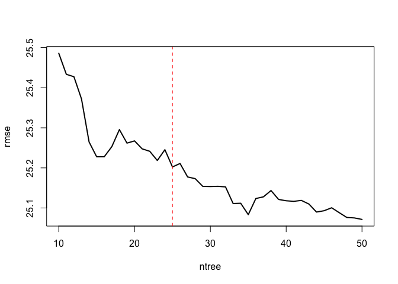

# Purpose

To analyze cholesterol levels from diversity outbred mice, identifying predictors of elevated choelsterol.

# Experimental Details

This analysis uses the complete dataset (F01-F425 and M01-M425). 

# Raw Data


```r
phenotype.filename <- 'Svenson-183_Svenson_DO-phenotypes.csv'
```


```r
library(readr) #loads the readr package


phenotype.data <- read_csv(phenotype.filename)
#set phenotypes of zero or  to na
phenotype.data[phenotype.data < 0] <- NA

library(forcats)
cholesterol.data <-
  phenotype.data %>%
  mutate(Diet = fct_recode(as.factor(diet),
                           "NCD"="chow",
                           "HFHS"="hf")) %>%
  mutate(chol.avg = rowMeans(select(., starts_with("chol")), 
                             na.rm = TRUE))
```

# Analysis

## Cholesterol Levels for NCD Annimals


```r
cholesterol.data %>%
  group_by(sex,diet) %>%
  summarize_at(.vars=vars(chol1,chol2,chol.avg), .funs=list(~shapiro.test(.)$p.value)) %>%
  kable(caption="Groupwise Shapiro-Wilk normality tests for cholesterol levels", digits=c(0,0,5,5,5))
```


Table: Groupwise Shapiro-Wilk normality tests for cholesterol levels

|sex |diet |  chol1|   chol2| chol.avg|
|:---|:----|------:|-------:|--------:|
|F   |chow | 0.2167| 0.01587|  0.21915|
|F   |hf   | 0.0150| 0.00006|  0.00217|
|M   |chow | 0.0000| 0.00071|  0.00002|
|M   |hf   | 0.0478| 0.01317|  0.10807|

```r
library(ggplot2)
cholesterol.data %>%
  select(sex,Diet,starts_with('chol')) %>%
  group_by(sex,Diet) %>%
  pivot_longer(cols=starts_with('chol'),
               names_to = "Measure",
               values_to = "Cholesterol") %>%
  ggplot(aes(x=Cholesterol,fill=Measure)) +
  geom_density(alpha=0.5) +
  facet_grid(Diet~sex)
```

<!-- -->

### Similarity at Both Time Points


```r
summary.data.complete <-
  cholesterol.data %>%
  group_by(sex,Diet) %>%
  summarize_at(.vars=vars(chol1,chol2,chol.avg), .funs=list(mean=~mean(., na.rm=T),se=se))

kable(summary.data.complete, caption="Cholesterol levels at 11 and 18 weeks")
```


Table: Cholesterol levels at 11 and 18 weeks

|sex |Diet | chol1_mean| chol2_mean| chol.avg_mean| chol1_se| chol2_se| chol.avg_se|
|:---|:----|----------:|----------:|-------------:|--------:|--------:|-----------:|
|F   |NCD  |       80.0|       78.7|            79|     1.16|     1.48|        1.23|
|F   |HFHS |      108.0|      113.3|           111|     1.79|     2.38|        1.86|
|M   |NCD  |       96.4|       96.5|            97|     1.47|     1.57|        1.37|
|M   |HFHS |      128.4|      129.4|           128|     2.06|     2.32|        1.90|

```r
library(broom)
wilcox.test(cholesterol.data$chol2,
       cholesterol.data$chol1, 
       paired=TRUE) %>% tidy %>%
  kable(caption="Pairwise t-test ofcholesterol levels week 11 and week 18")
```


Table: Pairwise t-test ofcholesterol levels week 11 and week 18

| statistic| p.value|method                                               |alternative |
|---------:|-------:|:----------------------------------------------------|:-----------|
|    149882|   0.456|Wilcoxon signed rank test with continuity correction |two.sided   |

```r
summary.data.complete %>%
  pivot_longer(cols=starts_with('chol'),
               names_sep="_",
               names_to = c("Measure","Measurement"),
               values_to = "Cholesterol") %>%
  pivot_wider(values_from="Cholesterol",names_from = "Measurement") %>%
  mutate(Value=fct_recode(as.factor(Measure),
                          "Average"="chol.avg",
                          `8 Weeks`="chol1",
                          `19 Weeks`="chol2")) %>%
  ggplot(aes(y=mean,ymin=mean-se,ymax=mean+se,x=Value)) +
  geom_bar(stat='identity') +
  geom_errorbar(width=0.5) +
  facet_grid(Diet~sex) +
    labs(y="Cholesterol (mg/dL)",
       x="") +
  scale_fill_grey() +
  scale_color_grey() +
  theme_classic() +
  theme(text=element_text(size=16),
        axis.text.x = element_text(angle = 90, vjust = 0.5, hjust=1))
```

<!-- -->


```r
summary.data <-
  cholesterol.data %>%
  group_by(sex,diet) %>%
  summarize_at(.vars=vars(chol.avg), .funs=list(mean=~mean(., na.rm=T),se=se))

library(broom)
lm(chol.avg~sex*diet, data=cholesterol.data) %>%
  tidy %>%
  kable(caption="Global interactions between sex and diet")
```


Table: Global interactions between sex and diet

|term        | estimate| std.error| statistic| p.value|
|:-----------|--------:|---------:|---------:|-------:|
|(Intercept) |   78.993|      1.54|     51.38|   0.000|
|sexM        |   18.029|      2.18|      8.27|   0.000|
|diethf      |   31.702|      2.24|     14.14|   0.000|
|sexM:diethf |   -0.285|      3.18|     -0.09|   0.929|

```r
lm(chol.avg~sex+diet, data=cholesterol.data) %>%
  tidy %>%
  kable(caption="Global effects of sex and diet, no interaction",
        digits=c(0,2,2,2,99))
```


Table: Global effects of sex and diet, no interaction

|term        | estimate| std.error| statistic|  p.value|
|:-----------|--------:|---------:|---------:|--------:|
|(Intercept) |     79.1|      1.35|      58.8| 0.00e+00|
|sexM        |     17.9|      1.59|      11.3| 1.45e-27|
|diethf      |     31.6|      1.59|      19.9| 3.22e-72|

```r
cholesterol.data %>%
  group_by(sex,diet) %>%
  filter(!is.na(chol.avg)) %>%
  count %>%
  kable(caption="Total cholesterol values for complete DO dataset")
```


Table: Total cholesterol values for complete DO dataset

|sex |diet |   n|
|:---|:----|---:|
|F   |chow | 225|
|F   |hf   | 200|
|M   |chow | 223|
|M   |hf   | 196|

```r
library(ggplot2)
cholesterol.data %>%
  ggplot(aes(y=chol.avg,x=sex,
             fill=Diet)) +
  geom_violin() +
  geom_jitter(alpha=0.2,
              position = position_jitterdodge(dodge.width = 0.9,
                                              jitter.width = 0.5,
                                              jitter.height = 0)) +
  labs(y="Cholesterol (mg/dL)",
       x="Sex") +
  scale_fill_grey() +
  scale_color_grey() +
  theme_classic() +
  theme(text=element_text(size=16),
        legend.position = c(0.15,0.8))
```

<!-- -->

There is no evidence of an interaction between sex and diet, though both covariates were significant individually.  

# Cholesterol Classification

Classified elevated cholesterol as being greater than the mean for the averaged cholesterol data for all mice


```r
cholesterol.data <-
  cholesterol.data %>%
  mutate(High.Chol = chol.avg > mean(chol.avg,na.rm=T)) %>%
  mutate(sex = as.factor(sex),
         diet = as.factor(diet))
```

# Classification Tree

First used only sex and diet to predict using classification trees


```r
library(tree)

# load libraries
library(rpart)
library(rattle)

tree.sex.diet <- rpart(High.Chol~sex+Diet, data=cholesterol.data)
fancyRpartPlot(tree.sex.diet)
```

<!-- -->

Next included fat mass as a predictor


```r
tree.fat <- rpart(High.Chol~sex+diet+fat_mri, data=cholesterol.data)
log.fat <- glm(High.Chol~sex+diet+fat_mri, data=cholesterol.data, family='binomial')
log.fat %>% tidy %>% kable(caption="Logistic regression for sex and diet as predictors of above average cholesterol levels")
```


Table: Logistic regression for sex and diet as predictors of above average cholesterol levels

|term        | estimate| std.error| statistic| p.value|
|:-----------|--------:|---------:|---------:|-------:|
|(Intercept) |   -2.421|     0.464|    -5.217|   0.000|
|sexM        |    1.128|     0.405|     2.786|   0.005|
|diethf      |    3.150|     0.457|     6.886|   0.000|
|fat_mri     |    0.017|     0.044|     0.375|   0.708|

```r
fancyRpartPlot(tree.sex.diet)
```

<!-- -->


```r
#function to figure out if all columns are na, pass to select  
not_all_na <- function(x) any(!is.na(x))  

cholesterol.data %>%
  select(where(not_all_na)) %>% #remove columns with all nA
  select(-sample,-chol.avg,-chol1, -hdld1,-hdld2,-sqlalchemy_id,-diet) -> #remove cholesterol and hdl columns
  chol.pred.data.high #testing higher than average cholesterol

cholesterol.data %>%
  select(where(not_all_na)) %>% #remove columns with all nA
  select(-sample,-chol1,-chol.avg,-High.Chol, -hdld1,-hdld2,-sqlalchemy_id,-diet) -> #remove cholesterol and hdl columns
  chol.pred.data.cont #testing continuous cholesterol levels

 
chol.pred.data.cont %>% 
  rename(`TG 19w`="tg2",
         `Ca 19w`="calcium2",
         `BW 19w`="bw_19") %>%
  rpart(chol2~., data=., method="anova") -> tree.all.cont
chol.pred.data.high %>% rpart(High.Chol~., data=., method="class") -> tree.all.high

fancyRpartPlot(tree.all.cont, main="Full tree, predicting continuous cholesterol levels")
```

<!-- -->

```r
fancyRpartPlot(tree.all.high, main="Full tree, predicting above average cholesterol levels")
```

<!-- -->

```r
#pruning of the continuous model, first showed the complexity parameter table
tree.all.cont$cptable %>% kable(caption="Complexity parameter table, used to idenfiy minumum crossvalidated error rate (xerror)")
```


Table: Complexity parameter table, used to idenfiy minumum crossvalidated error rate (xerror)

|    CP| nsplit| rel error| xerror|  xstd|
|-----:|------:|---------:|------:|-----:|
| 0.247|      0|     1.000|  1.001| 0.059|
| 0.063|      1|     0.753|  0.755| 0.045|
| 0.059|      2|     0.690|  0.724| 0.045|
| 0.037|      3|     0.630|  0.635| 0.040|
| 0.026|      4|     0.594|  0.651| 0.045|
| 0.023|      5|     0.568|  0.638| 0.044|
| 0.016|      6|     0.544|  0.636| 0.044|
| 0.016|      7|     0.529|  0.645| 0.045|
| 0.013|      8|     0.513|  0.666| 0.046|
| 0.011|      9|     0.500|  0.679| 0.047|
| 0.010|     10|     0.488|  0.688| 0.047|
| 0.010|     11|     0.478|  0.687| 0.047|

```r
prune(tree.all.cont, cp=0.0365) -> tree.all.cont.pruned

fancyRpartPlot(tree.all.cont.pruned, uniform=TRUE, main="Pruned tree predicting continuous cholesterol levels")
```

<!-- -->

```r
rpart.plot::prp(tree.all.cont.pruned, extra=1, 
                main="",
                cex=1.2) 
```

<!-- -->

```r
tree.all.cont.pruned
```

```
## n=824 (22 observations deleted due to missingness)
## 
## node), split, n, deviance, yval
##       * denotes terminal node
## 
##  1) root 824 941000 103.0  
##    2) Diet=NCD 439 263000  87.4  
##      4) TG 19w< 128 233  92600  76.5 *
##      5) TG 19w>=128 206 111000  99.8 *
##    3) Diet=HFHS 385 445000 121.0  
##      6) Ca 19w< 8.35 52  26700  90.6 *
##      7) Ca 19w>=8.35 333 363000 126.0  
##       14) BW 19w< 29.6 70  48500 106.0 *
##       15) BW 19w>=29.6 263 280000 131.0 *
```


```r
log.calcium <- glm(High.Chol~sex+diet+tg2+calcium2, data=cholesterol.data, family='binomial')
summary(log.calcium)
```

```
## 
## Call:
## glm(formula = High.Chol ~ sex + diet + tg2 + calcium2, family = "binomial", 
##     data = cholesterol.data)
## 
## Deviance Residuals: 
##    Min      1Q  Median      3Q     Max  
## -2.750  -0.758  -0.293   0.795   2.377  
## 
## Coefficients:
##             Estimate Std. Error z value Pr(>|z|)    
## (Intercept) -8.78573    1.02509   -8.57  < 2e-16 ***
## sexM         1.40355    0.19921    7.05  1.8e-12 ***
## diethf       2.67173    0.21937   12.18  < 2e-16 ***
## tg2          0.00944    0.00193    4.90  9.7e-07 ***
## calcium2     0.59068    0.10635    5.55  2.8e-08 ***
## ---
## Signif. codes:  0 '***' 0.001 '**' 0.01 '*' 0.05 '.' 0.1 ' ' 1
## 
## (Dispersion parameter for binomial family taken to be 1)
## 
##     Null deviance: 1065.23  on 771  degrees of freedom
## Residual deviance:  741.39  on 767  degrees of freedom
##   (74 observations deleted due to missingness)
## AIC: 751.4
## 
## Number of Fisher Scoring iterations: 5
```

```r
library(ggplot2)

ggplot(data=cholesterol.data,
       aes(y=chol.avg,
           x=calcium2,
           col=Diet)) +
  geom_point() +
  facet_grid(.~sex) +
  geom_smooth(method=lm, se=F) +
  labs(y="Cholesterol (mg/dL)",
       x="Calcium (mg/dL)") +
  scale_fill_grey() +
  scale_color_grey() +
  theme_classic() +
    guides(color=guide_legend(override.aes=list(fill=NA))) +
  theme(text=element_text(size=16),
        legend.position = c(0.15,0.80),
        legend.key=element_blank(),
        legend.background=element_blank())
```

<!-- -->

```r
 lm(chol2~Diet+sex+calcium2, data=cholesterol.data) %>% 
   tidy %>% 
   kable(caption="Diet adjusted association of cholesterol with calcium",
         digits=c(0,3,3,2,99))
```


Table: Diet adjusted association of cholesterol with calcium

|term        | estimate| std.error| statistic|  p.value|
|:-----------|--------:|---------:|---------:|--------:|
|(Intercept) |    -35.0|     7.941|     -4.41| 1.19e-05|
|DietHFHS    |     28.4|     1.797|     15.78| 8.42e-49|
|sexM        |     17.9|     1.775|     10.08| 1.58e-22|
|calcium2    |     12.7|     0.862|     14.69| 3.03e-43|

```r
  lm(chol2~Diet+sex+calcium2, data=cholesterol.data) %>% 
   glance %>% 
   kable(caption="Diet adjusted association of cholesterol with triglycerides",
         digits=c(0,3,3,2,99))
```


Table: Diet adjusted association of cholesterol with triglycerides

| r.squared| adj.r.squared| sigma| statistic| p.value| df| logLik|  AIC|  BIC| deviance| df.residual| nobs|
|---------:|-------------:|-----:|---------:|-------:|--:|------:|----:|----:|--------:|-----------:|----:|
|         0|         0.452|  24.6|       213|       0|  3|  -3567| 7143| 7167|   465701|         768|  772|

```r
cholesterol.data %>%
  group_by(Diet,sex) %>%
  summarize(Estimate = cor.test(chol2,calcium2, method="spearman")$estimate,
            P.value = cor.test(chol2,calcium2, method="spearman")$p.value) %>%
  kable(caption="Spearman's rho estimates for cholesterol and calcium for each subgroup of diet and sex",
        digits=c(0,0,3,99))
```


Table: Spearman's rho estimates for cholesterol and calcium for each subgroup of diet and sex

|Diet |sex | Estimate|  P.value|
|:----|:---|--------:|--------:|
|NCD  |F   |    0.415| 1.50e-09|
|NCD  |M   |    0.427| 5.66e-11|
|HFHS |F   |    0.388| 1.29e-07|
|HFHS |M   |    0.481| 3.17e-12|

```r
lm.calcium.1 <- lm(chol2~calcium2, data=cholesterol.data)
lm.calcium.2 <- lm(chol2~calcium2+sex, data=cholesterol.data)
lm.calcium.3 <- lm(chol2~calcium2+sex+diet, data=cholesterol.data)
lm.calcium.4 <- lm(chol2~calcium2+sex+tg2, data=cholesterol.data)
lm.calcium.5 <- lm(chol2~calcium2+sex+bw_19, data=cholesterol.data)
lm.calcium.6 <- lm(chol2~sex+diet+calcium2, data=cholesterol.data)
lm.calcium.7 <- lm(chol2~sex+diet+calcium2+tg2, data=cholesterol.data)
lm.calcium.8 <- lm(chol2~sex+diet+calcium2+tg2+bw_19, data=cholesterol.data)
anova(lm.calcium.3,lm.calcium.4)
```

```
## Analysis of Variance Table
## 
## Model 1: chol2 ~ calcium2 + sex + diet
## Model 2: chol2 ~ calcium2 + sex + tg2
##   Res.Df    RSS Df Sum of Sq F Pr(>F)
## 1    768 465701                      
## 2    768 613655  0   -147954
```

```r
lm.calcium.9 <- lm(chol2~sex+diet*calcium2, data=cholesterol.data)
aov.calcium <- aov(chol2~sex+diet+calcium2, data=cholesterol.data)
summary(lm.calcium.1) %>% tidy %>% kable(caption="Effects of calcium on cholesterol at 18w", digits=50)
```


Table: Effects of calcium on cholesterol at 18w

|term        | estimate| std.error| statistic|  p.value|
|:-----------|--------:|---------:|---------:|--------:|
|(Intercept) |    -29.2|      9.47|     -3.08| 2.12e-03|
|calcium2    |     14.5|      1.03|     14.11| 2.19e-40|

```r
summary(lm.calcium.2) %>% tidy %>% kable(caption="Sex adjusted effects of calcium on cholesterol at 18w", digits=50)
```


Table: Sex adjusted effects of calcium on cholesterol at 18w

|term        | estimate| std.error| statistic|  p.value|
|:-----------|--------:|---------:|---------:|--------:|
|(Intercept) |    -40.3|      9.12|     -4.42| 1.12e-05|
|calcium2    |     14.7|      0.98|     14.99| 9.67e-45|
|sexM        |     17.9|      2.04|      8.75| 1.37e-17|

```r
summary(lm.calcium.3) %>% tidy %>% kable(caption="Sex and diet adjusted effects of calcium on cholesterol at 18w", digits=50)
```


Table: Sex and diet adjusted effects of calcium on cholesterol at 18w

|term        | estimate| std.error| statistic|  p.value|
|:-----------|--------:|---------:|---------:|--------:|
|(Intercept) |    -35.0|     7.941|     -4.41| 1.19e-05|
|calcium2    |     12.7|     0.862|     14.69| 3.03e-43|
|sexM        |     17.9|     1.775|     10.08| 1.58e-22|
|diethf      |     28.4|     1.797|     15.78| 8.40e-49|

```r
summary(lm.calcium.4) %>% tidy %>% kable(caption="Sex and diet and tg adjusted effects of calcium on cholesterol at 18w", digits=50)
```


Table: Sex and diet and tg adjusted effects of calcium on cholesterol at 18w

|term        | estimate| std.error| statistic|  p.value|
|:-----------|--------:|---------:|---------:|--------:|
|(Intercept) |  -39.676|    9.1133|     -4.35| 1.52e-05|
|calcium2    |   14.193|    1.0101|     14.05| 4.45e-40|
|sexM        |   16.728|    2.1168|      7.90| 9.47e-15|
|tg2         |    0.036|    0.0184|      1.95| 5.10e-02|

```r
summary(lm.calcium.5) %>% tidy %>% kable(caption="Sex and diet and tg adjusted effects of calcium on cholesterol at 18w", digits=50)
```


Table: Sex and diet and tg adjusted effects of calcium on cholesterol at 18w

|term        | estimate| std.error| statistic|  p.value|
|:-----------|--------:|---------:|---------:|--------:|
|(Intercept) |   -61.87|     9.136|     -6.77| 2.52e-11|
|calcium2    |    13.09|     0.960|     13.65| 4.11e-38|
|sexM        |     6.90|     2.375|      2.91| 3.76e-03|
|bw_19       |     1.23|     0.149|      8.22| 8.97e-16|

```r
summary(lm.calcium.6) %>% tidy %>% kable(caption="Sex and diet and tg adjusted effects of calcium on cholesterol at 18w", digits=50)
```


Table: Sex and diet and tg adjusted effects of calcium on cholesterol at 18w

|term        | estimate| std.error| statistic|  p.value|
|:-----------|--------:|---------:|---------:|--------:|
|(Intercept) |    -35.0|     7.941|     -4.41| 1.19e-05|
|sexM        |     17.9|     1.775|     10.08| 1.58e-22|
|diethf      |     28.4|     1.797|     15.78| 8.40e-49|
|calcium2    |     12.7|     0.862|     14.69| 3.03e-43|

```r
summary(lm.calcium.7) %>% tidy %>% kable(caption="Sex and diet and tg adjusted effects of calcium on cholesterol at 18w", digits=50)
```


Table: Sex and diet and tg adjusted effects of calcium on cholesterol at 18w

|term        | estimate| std.error| statistic|  p.value|
|:-----------|--------:|---------:|---------:|--------:|
|(Intercept) |  -32.181|    7.7007|     -4.18| 3.27e-05|
|sexM        |   14.259|    1.7914|      7.96| 6.21e-15|
|diethf      |   32.024|    1.8134|     17.66| 0.00e+00|
|calcium2    |   10.801|    0.8736|     12.36| 3.78e-32|
|tg2         |    0.116|    0.0162|      7.19| 1.50e-12|

```r
summary(lm.calcium.8) %>% tidy %>% kable(caption="Sex and diet and tg adjusted effects of calcium on cholesterol at 18w", digits=50)
```


Table: Sex and diet and tg adjusted effects of calcium on cholesterol at 18w

|term        | estimate| std.error| statistic|  p.value|
|:-----------|--------:|---------:|---------:|--------:|
|(Intercept) |  -40.248|    8.1030|     -4.97| 8.39e-07|
|sexM        |   10.594|    2.1570|      4.91| 1.11e-06|
|diethf      |   29.767|    1.9456|     15.30| 2.67e-46|
|calcium2    |   10.478|    0.8760|     11.96| 2.40e-30|
|tg2         |    0.111|    0.0162|      6.86| 1.43e-11|
|bw_19       |    0.430|    0.1407|      3.06| 2.30e-03|

```r
lm.calcium.chow <- lm(chol2~sex+calcium2, filter(cholesterol.data, diet == "chow"))
summary(lm.calcium.chow) %>% glance %>% kable
```


| r.squared| adj.r.squared| sigma| statistic| p.value| df| df.residual| nobs|
|---------:|-------------:|-----:|---------:|-------:|--:|-----------:|----:|
|     0.325|         0.322|  19.9|      98.4|       0|  2|         409|  412|

```r
lm.calcium.hf <- lm(chol2~sex+calcium2, filter(cholesterol.data, diet == "hf"))
summary(lm.calcium.hf) %>% glance %>% kable
```


| r.squared| adj.r.squared| sigma| statistic| p.value| df| df.residual| nobs|
|---------:|-------------:|-----:|---------:|-------:|--:|-----------:|----:|
|     0.278|         0.274|  28.9|      68.8|       0|  2|         357|  360|

## Effects of Diet and Sex on Calcium


```r
summary.data <-
  cholesterol.data %>%
  group_by(sex,diet) %>%
  summarize_at(.vars=vars(calcium2), .funs=list(mean=~mean(., na.rm=T),se=se))

lm(calcium2~sex*diet, data=cholesterol.data) %>%
  tidy %>%
  kable(caption="Global interactions between sex and diet on calcium levels")
```


Table: Global interactions between sex and diet on calcium levels

|term        | estimate| std.error| statistic| p.value|
|:-----------|--------:|---------:|---------:|-------:|
|(Intercept) |    9.088|     0.074|    123.62|   0.000|
|sexM        |   -0.134|     0.102|     -1.32|   0.189|
|diethf      |    0.214|     0.107|      1.99|   0.047|
|sexM:diethf |    0.190|     0.148|      1.28|   0.201|

```r
lm(calcium2~sex+diet, data=cholesterol.data) %>%
  tidy %>%
  kable(caption="Global effects of sex and diet on calcium levels, no interaction",
        digits=c(0,2,2,2,99))
```


Table: Global effects of sex and diet on calcium levels, no interaction

|term        | estimate| std.error| statistic|   p.value|
|:-----------|--------:|---------:|---------:|---------:|
|(Intercept) |     9.04|      0.06|    141.50| 0.0000000|
|sexM        |    -0.04|      0.07|     -0.60| 0.5462925|
|diethf      |     0.31|      0.07|      4.23| 0.0000267|

```r
cholesterol.data %>%
  group_by(sex,diet) %>%
  filter(!is.na(calcium2)) %>%
  count %>%
  kable(caption="Total calcium values for complete DO dataset")
```


Table: Total calcium values for complete DO dataset

|sex |diet |   n|
|:---|:----|---:|
|F   |chow | 196|
|F   |hf   | 173|
|M   |chow | 216|
|M   |hf   | 189|

```r
cholesterol.data %>%
  ggplot(aes(y=calcium2,x=sex,
             fill=Diet)) +
  geom_violin() +
  geom_jitter(alpha=0.2,
              position = position_jitterdodge(dodge.width = 0.9,
                                              jitter.width = 0.5,
                                              jitter.height = 0)) +
  labs(y="Calcium (mg/dL)",
       x="Sex") +
  scale_fill_grey() +
  scale_color_grey() +
  theme_classic() +
  theme(text=element_text(size=16),
        legend.position = c(0.85,0.15))
```

<!-- -->

# Bone Content and Density


```r
ggplot(data=cholesterol.data,
       aes(y=chol.avg,
           x=bmd2,
           col=Diet)) +
  geom_point() +
  facet_grid(.~sex) +
  geom_smooth(method=lm, se=F) +
  labs(y="Cholesterol (mg/dL)",
       x="Bone Mineral Density (g/cm2)") +
  scale_fill_grey() +
  scale_color_grey() +
  theme_classic() +
    guides(color=guide_legend(override.aes=list(fill=NA))) +
  theme(text=element_text(size=16),
        legend.position = c(0.15,0.80),
        legend.key=element_blank(),
        legend.background=element_blank())
```

<!-- -->

```r
 lm(chol2~Diet+sex+bmd2, data=cholesterol.data) %>% 
   tidy %>% 
   kable(caption="Diet adjusted association of cholesterol with bone mineral density",
         digits=c(0,3,3,2,99))
```


Table: Diet adjusted association of cholesterol with bone mineral density

|term        | estimate| std.error| statistic|  p.value|
|:-----------|--------:|---------:|---------:|--------:|
|(Intercept) |     74.8|     12.48|      5.99| 3.16e-09|
|DietHFHS    |     33.6|      1.99|     16.93| 2.73e-55|
|sexM        |     16.7|      2.05|      8.13| 1.57e-15|
|bmd2        |     79.4|    227.43|      0.35| 7.27e-01|


```r
ggplot(data=cholesterol.data,
       aes(y=chol.avg,
           x=bmc2,
           col=Diet)) +
  geom_point() +
  facet_grid(.~sex) +
  geom_smooth(method=lm, se=F) +
  labs(y="Cholesterol (mg/dL)",
       x="Bone Mineral Content (g)") +
  scale_fill_grey() +
  scale_color_grey() +
  theme_classic() +
    guides(color=guide_legend(override.aes=list(fill=NA))) +
  theme(text=element_text(size=16),
        legend.position = c(0.15,0.80),
        legend.key=element_blank(),
        legend.background=element_blank())
```

<!-- -->

```r
 lm(chol2~Diet+sex+bmc2, data=cholesterol.data) %>% 
   tidy %>% 
   kable(caption="Diet adjusted association of cholesterol with bone mineral content",
         digits=c(0,3,3,2,99))
```


Table: Diet adjusted association of cholesterol with bone mineral content

|term        | estimate| std.error| statistic|  p.value|
|:-----------|--------:|---------:|---------:|--------:|
|(Intercept) |   79.277|      6.33|     12.52| 5.53e-33|
|DietHFHS    |   33.646|      2.00|     16.85| 7.37e-55|
|sexM        |   16.921|      2.22|      7.63| 6.46e-14|
|bmc2        |   -0.374|     11.22|     -0.03| 9.73e-01|


```r
ggplot(data=cholesterol.data,
       aes(y=chol.avg,
           x=tg2,
           col=Diet)) +
  geom_point(alpha=0.5) +
  facet_grid(.~sex) +
  geom_smooth(method=lm, se=F) +
  labs(y="Cholesterol (mg/dL)",
       x="Triglycerides (mg/dL)") +
  scale_fill_grey() +
  scale_color_grey() +
  theme_classic() +
    guides(color=guide_legend(override.aes=list(fill=NA))) +
  theme(text=element_text(size=16),
        legend.position = c(0.15,0.80),
        legend.key=element_blank(),
        legend.background=element_blank())
```

<!-- -->

```r
 lm(chol2~Diet+sex+tg2, data=cholesterol.data) %>% 
   tidy %>% 
   kable(caption="Diet adjusted association of cholesterol with triglycerides",
         digits=c(0,3,3,2,99))
```


Table: Diet adjusted association of cholesterol with triglycerides

|term        | estimate| std.error| statistic|  p.value|
|:-----------|--------:|---------:|---------:|--------:|
|(Intercept) |   57.688|     2.531|     22.79| 1.96e-89|
|DietHFHS    |   38.544|     1.894|     20.35| 7.45e-75|
|sexM        |   11.396|     1.911|      5.96| 3.66e-09|
|tg2         |    0.179|     0.017|     10.68| 5.33e-25|

```r
  lm(chol2~Diet+sex+tg2, data=cholesterol.data) %>% 
   glance %>% 
   kable(caption="Diet adjusted association of cholesterol with triglycerides",
         digits=c(0,3,3,2,99))
```


Table: Diet adjusted association of cholesterol with triglycerides

| r.squared| adj.r.squared| sigma| statistic|  p.value| df| logLik|  AIC|  BIC| deviance| df.residual| nobs|
|---------:|-------------:|-----:|---------:|--------:|--:|------:|----:|----:|--------:|-----------:|----:|
|         0|         0.392|  26.4|       178| 6.25e-89|  3|  -3863| 7736| 7760|   569756|         820|  824|

```r
lm.tg.1 <- lm(chol2~sex+tg2, data=cholesterol.data)
lm.tg.2 <- lm(chol2~sex+diet+tg2, data=cholesterol.data)
lm.tg.3 <- lm(chol2~sex+calcium2+tg2, data=cholesterol.data)
lm.tg.4 <- lm(chol2~sex+bw_19+tg2, data=cholesterol.data)
lm.tg.5 <- lm(chol2~sex+diet+tg2+calcium2, data=cholesterol.data)
lm.tg.6 <- lm(chol2~sex+diet+tg2+calcium2+bw_19, data=cholesterol.data)
lm.tg.male <- lm(chol2~diet*tg2, dplyr::filter(cholesterol.data, sex == "M"))
lm.tg.female <- lm(chol2~diet*tg2, dplyr::filter(cholesterol.data, sex == "F"))
lm.tg.complicated <- lm(chol2~diet + sex + diet*tg2 + sex*tg2 + sex*diet + sex*diet*tg2, data=cholesterol.data)
aov.tg <- aov(chol2~sex+diet+tg2, data=cholesterol.data)

summary(lm.tg.1) %>% tidy %>% kable(caption="Sex adjusted effects of tg on cholesterol at 18w", digits=50)
```


Table: Sex adjusted effects of tg on cholesterol at 18w

|term        | estimate| std.error| statistic|  p.value|
|:-----------|--------:|---------:|---------:|--------:|
|(Intercept) |  84.4052|      2.65|     31.80| 0.00e+00|
|sexM        |  13.6869|      2.34|      5.85| 7.01e-09|
|tg2         |   0.0988|      0.02|      4.94| 9.61e-07|

```r
summary(lm.tg.2) %>% tidy %>% kable(caption="Sex and diet adjusted effects of tg on cholesterol at 18w", digits=50)
```


Table: Sex and diet adjusted effects of tg on cholesterol at 18w

|term        | estimate| std.error| statistic|  p.value|
|:-----------|--------:|---------:|---------:|--------:|
|(Intercept) |   57.688|    2.5315|     22.79| 0.00e+00|
|sexM        |   11.396|    1.9108|      5.96| 3.66e-09|
|diethf      |   38.544|    1.8938|     20.35| 0.00e+00|
|tg2         |    0.179|    0.0168|     10.68| 5.33e-25|

```r
summary(lm.tg.3) %>% tidy %>% kable(caption="Sex and diet adjusted effects of tg on cholesterol at 18w", digits=50)
```


Table: Sex and diet adjusted effects of tg on cholesterol at 18w

|term        | estimate| std.error| statistic|  p.value|
|:-----------|--------:|---------:|---------:|--------:|
|(Intercept) |  -39.676|    9.1133|     -4.35| 1.52e-05|
|sexM        |   16.728|    2.1168|      7.90| 9.47e-15|
|calcium2    |   14.193|    1.0101|     14.05| 4.45e-40|
|tg2         |    0.036|    0.0184|      1.95| 5.10e-02|

```r
summary(lm.tg.4) %>% tidy %>% kable(caption="Sex and diet adjusted effects of tg on cholesterol at 18w", digits=50)
```


Table: Sex and diet adjusted effects of tg on cholesterol at 18w

|term        | estimate| std.error| statistic|  p.value|
|:-----------|--------:|---------:|---------:|--------:|
|(Intercept) |  36.5354|    5.2576|     6.949| 7.50e-12|
|sexM        |  -0.2733|    2.5866|    -0.106| 9.16e-01|
|bw_19       |   1.6440|    0.1588|    10.355| 1.06e-23|
|tg2         |   0.0903|    0.0189|     4.788| 2.00e-06|

```r
summary(lm.tg.5) %>% tidy %>% kable(caption="Sex and diet adjusted effects of tg on cholesterol at 18w", digits=50)
```


Table: Sex and diet adjusted effects of tg on cholesterol at 18w

|term        | estimate| std.error| statistic|  p.value|
|:-----------|--------:|---------:|---------:|--------:|
|(Intercept) |  -32.181|    7.7007|     -4.18| 3.27e-05|
|sexM        |   14.259|    1.7914|      7.96| 6.21e-15|
|diethf      |   32.024|    1.8134|     17.66| 0.00e+00|
|tg2         |    0.116|    0.0162|      7.19| 1.50e-12|
|calcium2    |   10.801|    0.8736|     12.36| 3.78e-32|

```r
summary(lm.tg.6) %>% tidy %>% kable(caption="Sex and diet adjusted effects of tg on cholesterol at 18w", digits=50)
```


Table: Sex and diet adjusted effects of tg on cholesterol at 18w

|term        | estimate| std.error| statistic|  p.value|
|:-----------|--------:|---------:|---------:|--------:|
|(Intercept) |  -40.248|    8.1030|     -4.97| 8.39e-07|
|sexM        |   10.594|    2.1570|      4.91| 1.11e-06|
|diethf      |   29.767|    1.9456|     15.30| 2.67e-46|
|tg2         |    0.111|    0.0162|      6.86| 1.43e-11|
|calcium2    |   10.478|    0.8760|     11.96| 2.40e-30|
|bw_19       |    0.430|    0.1407|      3.06| 2.30e-03|

```r
summary(lm.tg.male) %>% tidy %>% kable(caption="Sex and diet adjusted effects of calcium on cholesterol at 18w for males", digits=50)
```


Table: Sex and diet adjusted effects of calcium on cholesterol at 18w for males

|term        | estimate| std.error| statistic|  p.value|
|:-----------|--------:|---------:|---------:|--------:|
|(Intercept) |   67.619|    4.6946|     14.40| 3.60e-38|
|diethf      |   50.051|    6.3200|      7.92| 2.39e-14|
|tg2         |    0.194|    0.0292|      6.65| 9.42e-11|
|diethf:tg2  |   -0.101|    0.0417|     -2.43| 1.57e-02|

```r
summary(lm.tg.female) %>% tidy %>% kable(caption="Sex and diet adjusted effects of calcium on cholesterol at 18w for females", digits=50)
```


Table: Sex and diet adjusted effects of calcium on cholesterol at 18w for females

|term        | estimate| std.error| statistic|  p.value|
|:-----------|--------:|---------:|---------:|--------:|
|(Intercept) |   54.282|    4.4127|     12.30| 6.95e-30|
|diethf      |   27.651|    6.5939|      4.19| 3.36e-05|
|tg2         |    0.202|    0.0336|      6.01| 4.17e-09|
|diethf:tg2  |    0.145|    0.0604|      2.40| 1.70e-02|

```r
summary(lm.tg.complicated) %>% tidy %>% kable(caption="Sex and diet adjusted effects of calcium on cholesterol at 18w", digits=50)
```


Table: Sex and diet adjusted effects of calcium on cholesterol at 18w

|term            | estimate| std.error| statistic|  p.value|
|:---------------|--------:|---------:|---------:|--------:|
|(Intercept)     |  54.2816|    4.4710|    12.141| 2.68e-31|
|diethf          |  27.6507|    6.6810|     4.139| 3.86e-05|
|sexM            |  13.3372|    6.4380|     2.072| 3.86e-02|
|tg2             |   0.2015|    0.0340|     5.927| 4.56e-09|
|diethf:tg2      |   0.1447|    0.0612|     2.366| 1.82e-02|
|sexM:tg2        |  -0.0073|    0.0446|    -0.164| 8.70e-01|
|diethf:sexM     |  22.4002|    9.1393|     2.451| 1.45e-02|
|diethf:sexM:tg2 |  -0.2460|    0.0738|    -3.336| 8.88e-04|

```r
lm.tg.chow <- lm(chol2~sex+tg2, filter(cholesterol.data, diet == "chow"))
summary(lm.tg.chow) %>% glance %>% kable
```


| r.squared| adj.r.squared| sigma| statistic| p.value| df| df.residual| nobs|
|---------:|-------------:|-----:|---------:|-------:|--:|-----------:|----:|
|      0.34|         0.337|    20|       112|       0|  2|         436|  439|

```r
lm.tg.hf <- lm(chol2~sex+tg2, filter(cholesterol.data, diet == "hf"))
summary(lm.tg.hf) %>% glance %>% kable
```


| r.squared| adj.r.squared| sigma| statistic| p.value| df| df.residual| nobs|
|---------:|-------------:|-----:|---------:|-------:|--:|-----------:|----:|
|     0.114|         0.109|  32.1|      24.5|       0|  2|         382|  385|

```r
library(effectsize)
omega_squared(aov.calcium, partial = TRUE) %>%
  kable(caption="Partial effect size estimates for predictors of continuous cholesterol levels")
```


Table: Partial effect size estimates for predictors of continuous cholesterol levels

|Parameter | Omega2_partial|   CI| CI_low| CI_high|
|:---------|--------------:|----:|------:|-------:|
|sex       |          0.107| 0.95|  0.075|       1|
|diet      |          0.299| 0.95|  0.257|       1|
|calcium2  |          0.218| 0.95|  0.177|       1|

```r
dplyr::filter(cholesterol.data, sex == "M")
```

```
## # A tibble: 421 × 169
##    sample  acr1  acr2 adiponectin b_area1 b_area2   bmc1   bmc2    bmd1    bmd2
##    <chr>  <dbl> <dbl>       <dbl>   <dbl>   <dbl>  <dbl>  <dbl>   <dbl>   <dbl>
##  1 F142      NA    NA          NA    8.31    8.74  0.423  0.477  0.0509  0.0546
##  2 M01       NA    NA          NA    9.97    9.82  0.496  0.538  0.0497  0.0547
##  3 M02       NA    NA          NA    9.02    8.57  0.489  0.497  0.0542  0.058 
##  4 M03       NA    NA          NA    9.05    9.48  0.542  0.594  0.0598  0.0627
##  5 M04       NA    NA          NA    9.55    9.36  0.546  0.533  0.0572  0.057 
##  6 M05       NA    NA          NA    8.78    8.47  0.500  0.482  0.0569  0.0568
##  7 M06       NA    NA          NA   11.4    10.9   0.654  0.620  0.0577  0.0568
##  8 M07       NA    NA          NA    9.24    9.81  0.547  0.594  0.0592  0.0606
##  9 M08       NA    NA          NA   10.7    11.0   0.640  0.662  0.0596  0.06  
## 10 M09       NA    NA          NA   NA      NA    NA     NA     NA      NA     
## # … with 411 more rows, and 159 more variables: bun1 <dbl>, bun2 <dbl>,
## #   bw_10 <dbl>, bw_11 <dbl>, bw_12 <dbl>, bw_13 <dbl>, bw_14 <dbl>,
## #   bw_15 <dbl>, bw_16 <dbl>, bw_17 <dbl>, bw_18 <dbl>, bw_19 <dbl>,
## #   bw_20 <dbl>, bw_21 <dbl>, bw_22 <dbl>, bw_23 <dbl>, bw_24 <dbl>,
## #   bw_25 <dbl>, bw_26 <dbl>, bw_27 <dbl>, bw_28 <dbl>, bw_29 <dbl>,
## #   bw_3 <dbl>, bw_30 <dbl>, bw_4 <dbl>, bw_5 <dbl>, bw_6 <dbl>, bw_7 <dbl>,
## #   bw_8 <dbl>, bw_9 <dbl>, bw_pc1 <dbl>, bw_pc2 <dbl>, calcium1 <dbl>, …
```


```r
ggplot(data=cholesterol.data,
       aes(y=chol2,
           x=bw_19,
           col=diet)) +
  geom_point() +
  facet_grid(.~sex) +
  geom_smooth(method=lm)
```

<!-- -->

```r
lm.bw.1 <- lm(chol2~bw_19, data=cholesterol.data)
lm.bw.2 <- lm(chol2~bw_19+sex, data=cholesterol.data)
lm.bw.3 <- lm(chol2~sex+diet+bw_19, data=cholesterol.data)
lm.bw.4 <- lm(chol2~sex+calcium2+bw_19, data=cholesterol.data)
lm.bw.5 <- lm(chol2~sex+tg2+bw_19, data=cholesterol.data)
lm.bw.6 <- lm(chol2~sex+diet+bw_19+tg2, data=cholesterol.data)
lm.bw.7 <- lm(chol2~sex+diet+bw_19+tg2+calcium2, data=cholesterol.data)

lm.bw.6 <- lm(chol2~sex+diet*bw_19, data=cholesterol.data)
aov.calcium <- aov(chol2~sex+diet+bw_19, data=cholesterol.data)
summary(lm.bw.1) %>% tidy %>% kable(caption="Effects of calcium on cholesterol at 18w", digits=50)
```


Table: Effects of calcium on cholesterol at 18w

|term        | estimate| std.error| statistic|  p.value|
|:-----------|--------:|---------:|---------:|--------:|
|(Intercept) |    43.68|     4.694|      9.31| 1.18e-19|
|bw_19       |     1.75|     0.135|     13.02| 2.19e-35|

```r
summary(lm.bw.2) %>% tidy %>% kable(caption="Sex adjusted effects of calcium on cholesterol at 18w", digits=50)
```


Table: Sex adjusted effects of calcium on cholesterol at 18w

|term        | estimate| std.error| statistic|  p.value|
|:-----------|--------:|---------:|---------:|--------:|
|(Intercept) |    45.22|     5.000|     9.045| 1.06e-18|
|bw_19       |     1.68|     0.161|    10.427| 5.48e-24|
|sexM        |     2.30|     2.564|     0.896| 3.70e-01|

```r
summary(lm.bw.3) %>% tidy %>% kable(caption="Sex and diet adjusted effects of calcium on cholesterol at 18w", digits=50)
```


Table: Sex and diet adjusted effects of calcium on cholesterol at 18w

|term        | estimate| std.error| statistic|  p.value|
|:-----------|--------:|---------:|---------:|--------:|
|(Intercept) |    56.16|     4.554|     12.33| 3.57e-32|
|sexM        |     9.72|     2.360|      4.12| 4.22e-05|
|diethf      |    29.47|     2.089|     14.11| 1.25e-40|
|bw_19       |     0.84|     0.156|      5.39| 9.26e-08|

```r
summary(lm.bw.4) %>% tidy %>% kable(caption="Sex and diet and tg adjusted effects of calcium on cholesterol at 18w", digits=50)
```


Table: Sex and diet and tg adjusted effects of calcium on cholesterol at 18w

|term        | estimate| std.error| statistic|  p.value|
|:-----------|--------:|---------:|---------:|--------:|
|(Intercept) |   -61.87|     9.136|     -6.77| 2.52e-11|
|sexM        |     6.90|     2.375|      2.91| 3.76e-03|
|calcium2    |    13.09|     0.960|     13.65| 4.11e-38|
|bw_19       |     1.23|     0.149|      8.22| 8.97e-16|

```r
summary(lm.bw.5) %>% tidy %>% kable(caption="Sex and diet and tg adjusted effects of calcium on cholesterol at 18w", digits=50)
```


Table: Sex and diet and tg adjusted effects of calcium on cholesterol at 18w

|term        | estimate| std.error| statistic|  p.value|
|:-----------|--------:|---------:|---------:|--------:|
|(Intercept) |  36.5354|    5.2576|     6.949| 7.50e-12|
|sexM        |  -0.2733|    2.5866|    -0.106| 9.16e-01|
|tg2         |   0.0903|    0.0189|     4.788| 2.00e-06|
|bw_19       |   1.6440|    0.1588|    10.355| 1.06e-23|

```r
lm.bw.chow <- lm(chol2~sex+bw_19, filter(cholesterol.data, diet == "chow"))
summary(lm.bw.chow) %>% glance %>% kable
```


| r.squared| adj.r.squared| sigma| statistic| p.value| df| df.residual| nobs|
|---------:|-------------:|-----:|---------:|-------:|--:|-----------:|----:|
|      0.18|         0.176|  22.3|      47.8|       0|  2|         435|  438|

```r
lm.bw.hf <- lm(chol2~sex+bw_19, filter(cholesterol.data, diet == "hf"))
summary(lm.bw.hf) %>% glance %>% kable
```


| r.squared| adj.r.squared| sigma| statistic| p.value| df| df.residual| nobs|
|---------:|-------------:|-----:|---------:|-------:|--:|-----------:|----:|
|      0.08|         0.075|  32.7|      16.7|       0|  2|         382|  385|

```r
library(effectsize)
omega_squared(aov.calcium, partial = TRUE) %>%
  kable(caption="Partial effect size estimates for predictors of continuous cholesterol levels")
```


Table: Partial effect size estimates for predictors of continuous cholesterol levels

|Parameter | Omega2_partial|   CI| CI_low| CI_high|
|:---------|--------------:|----:|------:|-------:|
|sex       |          0.084| 0.95|  0.056|       1|
|diet      |          0.270| 0.95|  0.229|       1|
|bw_19     |          0.033| 0.95|  0.016|       1|

```r
dplyr::filter(cholesterol.data, sex == "M")
```

```
## # A tibble: 421 × 169
##    sample  acr1  acr2 adiponectin b_area1 b_area2   bmc1   bmc2    bmd1    bmd2
##    <chr>  <dbl> <dbl>       <dbl>   <dbl>   <dbl>  <dbl>  <dbl>   <dbl>   <dbl>
##  1 F142      NA    NA          NA    8.31    8.74  0.423  0.477  0.0509  0.0546
##  2 M01       NA    NA          NA    9.97    9.82  0.496  0.538  0.0497  0.0547
##  3 M02       NA    NA          NA    9.02    8.57  0.489  0.497  0.0542  0.058 
##  4 M03       NA    NA          NA    9.05    9.48  0.542  0.594  0.0598  0.0627
##  5 M04       NA    NA          NA    9.55    9.36  0.546  0.533  0.0572  0.057 
##  6 M05       NA    NA          NA    8.78    8.47  0.500  0.482  0.0569  0.0568
##  7 M06       NA    NA          NA   11.4    10.9   0.654  0.620  0.0577  0.0568
##  8 M07       NA    NA          NA    9.24    9.81  0.547  0.594  0.0592  0.0606
##  9 M08       NA    NA          NA   10.7    11.0   0.640  0.662  0.0596  0.06  
## 10 M09       NA    NA          NA   NA      NA    NA     NA     NA      NA     
## # … with 411 more rows, and 159 more variables: bun1 <dbl>, bun2 <dbl>,
## #   bw_10 <dbl>, bw_11 <dbl>, bw_12 <dbl>, bw_13 <dbl>, bw_14 <dbl>,
## #   bw_15 <dbl>, bw_16 <dbl>, bw_17 <dbl>, bw_18 <dbl>, bw_19 <dbl>,
## #   bw_20 <dbl>, bw_21 <dbl>, bw_22 <dbl>, bw_23 <dbl>, bw_24 <dbl>,
## #   bw_25 <dbl>, bw_26 <dbl>, bw_27 <dbl>, bw_28 <dbl>, bw_29 <dbl>,
## #   bw_3 <dbl>, bw_30 <dbl>, bw_4 <dbl>, bw_5 <dbl>, bw_6 <dbl>, bw_7 <dbl>,
## #   bw_8 <dbl>, bw_9 <dbl>, bw_pc1 <dbl>, bw_pc2 <dbl>, calcium1 <dbl>, …
```


# Random Forests


```r
library(caret)
library(ipred)

# Specify 10-fold cross validation
ctrl <- trainControl(method = "cv",  number = 10) 

# train bagged model
bagged_cv <- bagging(
  formula = chol2~Diet+calcium2,
  data    = chol.pred.data.cont,
  coob=TRUE
  )

# assess 10-50 bagged trees
ntree <- 10:50

# create empty vector to store OOB RMSE values
rmse <- vector(mode = "numeric", length = length(ntree))

for (i in seq_along(ntree)) {
  # reproducibility
  set.seed(123)
  
  # perform bagged model
  model <- bagging(
  formula = chol2~Diet+sex+calcium2+tg2,
  data    = chol.pred.data.cont,
  coob=TRUE,
  nbagg   = ntree[i]
)
  # get OOB error
  rmse[i] <- model$err
}

plot(ntree, rmse, type = 'l', lwd = 2)
abline(v = 25, col = "red", lty = "dashed")
```

<!-- -->

```r
predict_model<-predict(bagged_cv, chol.pred.data.cont)

ggplot(chol.pred.data.cont, aes(x=predict_model,y=chol2)) +
  geom_point()
```

<!-- -->

```r
library(randomForest)
forest <- randomForest(chol2~Diet+sex+calcium2+tg2, 
             data = chol.pred.data.cont,
             na.action=na.exclude) 
varImpPlot(forest)
```

<!-- -->

```r
predict_model<-predict(forest, chol.pred.data.cont)
```

# Session Information


```r
sessionInfo()
```

```
## R version 4.2.0 (2022-04-22)
## Platform: x86_64-apple-darwin17.0 (64-bit)
## Running under: macOS Big Sur/Monterey 10.16
## 
## Matrix products: default
## BLAS:   /Library/Frameworks/R.framework/Versions/4.2/Resources/lib/libRblas.0.dylib
## LAPACK: /Library/Frameworks/R.framework/Versions/4.2/Resources/lib/libRlapack.dylib
## 
## locale:
## [1] en_US.UTF-8/en_US.UTF-8/en_US.UTF-8/C/en_US.UTF-8/en_US.UTF-8
## 
## attached base packages:
## [1] stats     graphics  grDevices utils     datasets  methods   base     
## 
## other attached packages:
##  [1] randomForest_4.7-1.1 ipred_0.9-13         caret_6.0-93        
##  [4] lattice_0.20-45      effectsize_0.8.2     rattle_5.5.1        
##  [7] bitops_1.0-7         tibble_3.1.8         rpart_4.1.19        
## [10] tree_1.0-42          broom_1.0.1          ggplot2_3.4.0       
## [13] forcats_0.5.2        readr_2.1.3          dplyr_1.0.10        
## [16] tidyr_1.2.1          knitr_1.41          
## 
## loaded via a namespace (and not attached):
##  [1] TH.data_1.1-1        colorspace_2.0-3     ellipsis_0.3.2      
##  [4] class_7.3-20         estimability_1.4.1   parameters_0.19.0   
##  [7] rstudioapi_0.14      listenv_0.8.0        farver_2.1.1        
## [10] bit64_4.0.5          prodlim_2019.11.13   fansi_1.0.3         
## [13] mvtnorm_1.1-3        lubridate_1.9.0      codetools_0.2-18    
## [16] splines_4.2.0        cachem_1.0.6         jsonlite_1.8.3      
## [19] pROC_1.18.0          compiler_4.2.0       emmeans_1.8.2       
## [22] backports_1.4.1      assertthat_0.2.1     Matrix_1.5-3        
## [25] fastmap_1.1.0        cli_3.4.1            htmltools_0.5.3     
## [28] tools_4.2.0          coda_0.19-4          gtable_0.3.1        
## [31] glue_1.6.2           reshape2_1.4.4       Rcpp_1.0.9          
## [34] jquerylib_0.1.4      vctrs_0.5.1          nlme_3.1-160        
## [37] iterators_1.0.14     insight_0.18.7       timeDate_4021.106   
## [40] gower_1.0.0          xfun_0.35            stringr_1.4.1       
## [43] globals_0.16.1       timechange_0.1.1     lifecycle_1.0.3     
## [46] future_1.29.0        MASS_7.3-58.1        zoo_1.8-11          
## [49] scales_1.2.1         vroom_1.6.0          hms_1.1.2           
## [52] parallel_4.2.0       sandwich_3.0-2       RColorBrewer_1.1-3  
## [55] rpart.plot_3.1.1     yaml_2.3.6           sass_0.4.3          
## [58] stringi_1.7.8        highr_0.9            bayestestR_0.13.0   
## [61] foreach_1.5.2        hardhat_1.2.0        lava_1.7.0          
## [64] rlang_1.0.6          pkgconfig_2.0.3      evaluate_0.18       
## [67] purrr_0.3.5          recipes_1.0.3        labeling_0.4.2      
## [70] bit_4.0.5            tidyselect_1.2.0     parallelly_1.32.1   
## [73] plyr_1.8.8           magrittr_2.0.3       R6_2.5.1            
## [76] generics_0.1.3       multcomp_1.4-20      DBI_1.1.3           
## [79] pillar_1.8.1         withr_2.5.0          mgcv_1.8-41         
## [82] survival_3.4-0       datawizard_0.6.4     nnet_7.3-18         
## [85] future.apply_1.10.0  crayon_1.5.2         utf8_1.2.2          
## [88] tzdb_0.3.0           rmarkdown_2.18       grid_4.2.0          
## [91] data.table_1.14.6    ModelMetrics_1.2.2.2 digest_0.6.30       
## [94] xtable_1.8-4         stats4_4.2.0         munsell_0.5.0       
## [97] bslib_0.4.1
```

