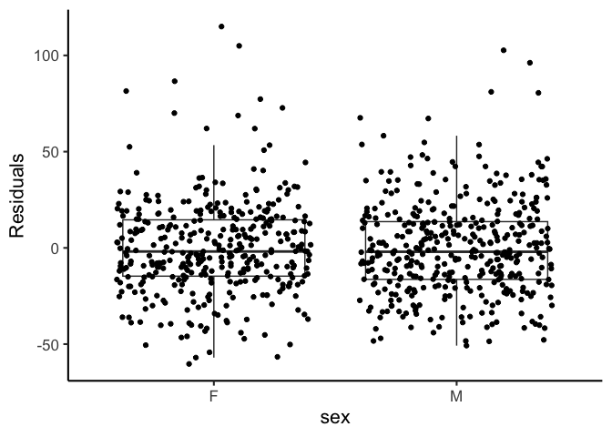
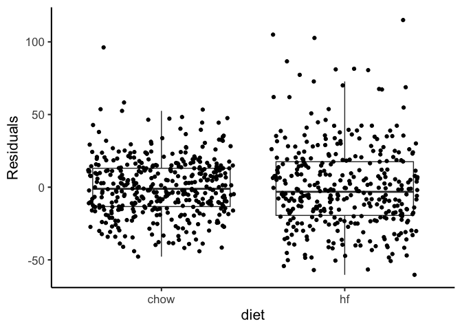
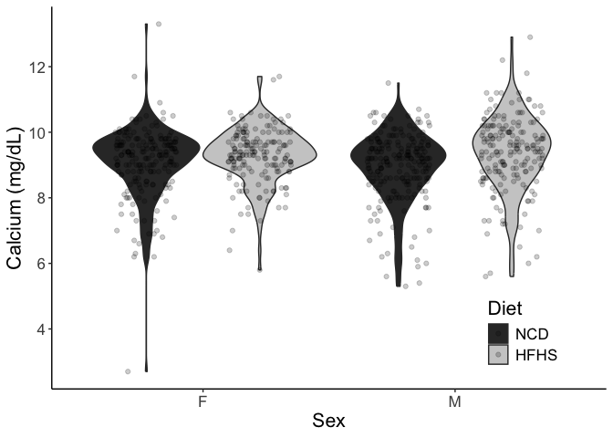

# Purpose

To analyze cholesterol levels from diversity outbred mice, identifying predictors of elevated choelsterol.

# Experimental Details

This analysis uses the complete dataset (F01-F425 and M01-M425). 

# Raw Data


``` r
phenotype.filename <- 'Svenson_HFD_DO_phenotype_V12.csv'
```


``` r
library(readr) #loads the readr package


phenotype.data <- read_csv(phenotype.filename)
#set phenotypes of zero or  to na
phenotype.data[phenotype.data < 0] <- NA

library(forcats)
cholesterol.data <-
  phenotype.data %>%
  mutate(Diet = fct_recode(as.factor(diet),
                           "NCD"="chow",
                           "HFHS"="hf")) %>%
  mutate(chol.avg = rowMeans(select(., starts_with("chol")), 
                             na.rm = TRUE))
```

# Analysis

The total number of mice with cholesterol levels in this dataset is 840
 mice, broken down as follows:
 

``` r
cholesterol.data %>%
  group_by(Diet,sex) %>%
  count() %>%
  kable(caption="Number of mice in each group")
```


Table: Number of mice in each group

|Diet |sex |   n|
|:----|:---|---:|
|NCD  |F   | 225|
|NCD  |M   | 224|
|HFHS |F   | 198|
|HFHS |M   | 193|
 
## Cholesterol Levels for NCD Annimals


``` r
cholesterol.data %>%
  group_by(sex,diet) %>%
  summarize_at(.vars=vars(chol1,chol2,chol.avg), .funs=list(~shapiro.test(.)$p.value)) %>%
  kable(caption="Groupwise Shapiro-Wilk normality tests for cholesterol levels", digits=c(0,0,5,5,5))
```


Table: Groupwise Shapiro-Wilk normality tests for cholesterol levels

|sex |diet |   chol1|   chol2| chol.avg|
|:---|:----|-------:|-------:|--------:|
|F   |chow | 0.21667| 0.01587|  0.21915|
|F   |hf   | 0.00767| 0.00006|  0.00271|
|M   |chow | 0.00000| 0.00071|  0.00002|
|M   |hf   | 0.04293| 0.01883|  0.09956|

``` r
library(ggplot2)
cholesterol.data %>%
  select(sex,Diet,starts_with('chol')) %>%
  group_by(sex,Diet) %>%
  pivot_longer(cols=starts_with('chol'),
               names_to = "Measure",
               values_to = "Cholesterol") %>%
  ggplot(aes(x=Cholesterol,fill=Measure)) +
  geom_density(alpha=0.5) +
  facet_grid(Diet~sex)
```

<!-- -->

### Similarity at Both Time Points


``` r
summary.data.complete <-
  cholesterol.data %>%
  group_by(sex,Diet) %>%
  summarize_at(.vars=vars(chol1,chol2,chol.avg), .funs=list(mean=~mean(., na.rm=T),
                                                            se=se,
                                                            sd=~sd(., na.rm=T)))

kable(summary.data.complete, caption="Cholesterol levels at 11 and 18 weeks")
```


Table: Cholesterol levels at 11 and 18 weeks

|sex |Diet | chol1_mean| chol2_mean| chol.avg_mean| chol1_se| chol2_se| chol.avg_se| chol1_sd| chol2_sd| chol.avg_sd|
|:---|:----|----------:|----------:|-------------:|--------:|--------:|-----------:|--------:|--------:|-----------:|
|F   |NCD  |       80.0|       78.7|            79|     1.16|     1.48|        1.23|     17.4|     22.2|        18.4|
|F   |HFHS |      108.5|      113.3|           111|     1.78|     2.40|        1.87|     25.0|     33.7|        26.3|
|M   |NCD  |       96.4|       96.5|            97|     1.47|     1.57|        1.37|     22.0|     23.5|        20.6|
|M   |HFHS |      128.2|      129.3|           128|     2.09|     2.33|        1.92|     29.1|     32.3|        26.7|

``` r
library(broom)
wilcox.test(cholesterol.data$chol2,
       cholesterol.data$chol1, 
       paired=TRUE) %>% tidy %>%
  kable(caption="Pairwise t-test ofcholesterol levels week 11 and week 18")
```


Table: Pairwise t-test ofcholesterol levels week 11 and week 18

| statistic| p.value|method                                               |alternative |
|---------:|-------:|:----------------------------------------------------|:-----------|
|    147377|   0.474|Wilcoxon signed rank test with continuity correction |two.sided   |

``` r
summary.data.complete %>%
  pivot_longer(cols=starts_with('chol'),
               names_sep="_",
               names_to = c("Measure","Measurement"),
               values_to = "Cholesterol") %>%
  pivot_wider(values_from="Cholesterol",names_from = "Measurement") %>%
  mutate(Value=fct_recode(as.factor(Measure),
                          "Average"="chol.avg",
                          `8 Weeks`="chol1",
                          `19 Weeks`="chol2")) %>%
  ggplot(aes(y=mean,ymin=mean-sd,ymax=mean+sd,x=Value)) +
  geom_bar(stat='identity') +
  geom_errorbar(width=0.5) +
  facet_grid(Diet~sex) +
    labs(y="Cholesterol (mg/dL)",
       x="") +
  scale_fill_grey() +
  scale_color_grey(end=0.7) +
  theme_classic() +
  theme(text=element_text(size=16),
        axis.text.x = element_text(angle = 90, vjust = 0.5, hjust=1))
```

<!-- -->


``` r
summary.data <-
  cholesterol.data %>%
  group_by(sex,diet) %>%
  summarize_at(.vars=vars(chol2), .funs=list(mean=~mean(., na.rm=T),
                                             se=se,
                                             sd=~sd(., na.rm=T)))

library(broom)
lm(chol2~sex*diet, data=cholesterol.data) %>%
  tidy %>%
  kable(caption="Global interactions between sex and diet")
```


Table: Global interactions between sex and diet

|term        | estimate| std.error| statistic| p.value|
|:-----------|--------:|---------:|---------:|-------:|
|(Intercept) |    78.67|      1.88|    41.887|   0.000|
|sexM        |    17.80|      2.68|     6.648|   0.000|
|diethf      |    34.64|      2.75|    12.615|   0.000|
|sexM:diethf |    -1.86|      3.94|    -0.474|   0.636|

``` r
lm(chol2~sex+diet, data=cholesterol.data) %>%
  tidy %>%
  kable(caption="Global effects of sex and diet, no interaction",
        digits=c(0,2,2,2,99))
```


Table: Global effects of sex and diet, no interaction

|term        | estimate| std.error| statistic|  p.value|
|:-----------|--------:|---------:|---------:|--------:|
|(Intercept) |     79.1|      1.65|     47.95| 0.00e+00|
|sexM        |     16.9|      1.96|      8.64| 3.03e-17|
|diethf      |     33.7|      1.97|     17.16| 1.37e-56|

``` r
cholesterol.data %>%
  group_by(sex,diet) %>%
  filter(!is.na(chol2)) %>%
  count %>%
  kable(caption="Total cholesterol values at 19 weeks for the complete DO dataset")
```


Table: Total cholesterol values at 19 weeks for the complete DO dataset

|sex |diet |   n|
|:---|:----|---:|
|F   |chow | 223|
|F   |hf   | 196|
|M   |chow | 216|
|M   |hf   | 183|

``` r
library(ggplot2)
cholesterol.data %>%
  ggplot(aes(y=chol2,x=sex,
             fill=Diet)) +
  geom_violin() +
  geom_jitter(alpha=0.2,
              position = position_jitterdodge(dodge.width = 0.9,
                                              jitter.width = 0.5,
                                              jitter.height = 0)) +
  labs(y="Cholesterol (mg/dL)",
       x="Sex") +
  scale_fill_grey() +
  scale_color_grey(end=0.7) +
  theme_classic() +
  theme(text=element_text(size=16),
        legend.position = c(0.15,0.8))
```

<!-- -->

There is no evidence of an interaction between sex and diet, though both covariates were significant individually.  

# Cholesterol Classification

Classified elevated cholesterol as being greater than the mean for the averaged cholesterol data for all mice


``` r
cholesterol.data <-
  cholesterol.data %>%
  mutate(High.Chol = chol2 > mean(chol2,na.rm=T)) %>%
  mutate(sex = as.factor(sex),
         diet = as.factor(diet))
```

# Classification Tree

First used only sex and diet to predict using classification trees


``` r
library(tree)

# load libraries
library(rpart)
library(rattle)

tree.sex.diet <- rpart(High.Chol~sex+Diet, data=cholesterol.data)
fancyRpartPlot(tree.sex.diet)
```

<!-- -->

Next included fat mass as a predictor


``` r
tree.fat <- rpart(High.Chol~sex+diet+percfat2, data=cholesterol.data)
log.fat <- glm(High.Chol~sex+diet+percfat2, data=cholesterol.data, family='binomial')
log.fat %>% tidy %>% kable(caption="Logistic regression for sex and diet as predictors of above average cholesterol levels")
```


Table: Logistic regression for sex and diet as predictors of above average cholesterol levels

|term        | estimate| std.error| statistic| p.value|
|:-----------|--------:|---------:|---------:|-------:|
|(Intercept) |    -2.72|     0.298|     -9.11|       0|
|sexM        |     1.29|     0.173|      7.49|       0|
|diethf      |     1.47|     0.187|      7.88|       0|
|percfat2    |     4.59|     1.035|      4.44|       0|

``` r
fancyRpartPlot(tree.sex.diet)
```

<!-- -->


``` r
#function to figure out if all columns are na, pass to select  
not_all_na <- function(x) any(!is.na(x))  

cholesterol.data %>%
  dplyr::select(where(not_all_na)) %>% #remove columns with all nA
  dplyr::select(-mouse.id,-chol.avg,-chol1, -hdld1,-hdld2,-diet) -> #remove cholesterol and hdl columns
  chol.pred.data.high #testing higher than average cholesterol

cholesterol.data %>%
  select(where(not_all_na)) %>% #remove columns with all nA
  select(-mouse.id,-chol1,-chol.avg,-High.Chol, -hdld1,-hdld2,-diet) -> #remove cholesterol and hdl columns
  chol.pred.data.cont #testing continuous cholesterol levels

 
chol.pred.data.cont %>% 
  rename(`TG 19w`="tg2",
         `Ca 19w`="calcium2",
         `BW 19w`="bw.19") %>%
  rpart(chol2~., data=., method="anova") -> tree.all.cont
chol.pred.data.high %>% rpart(High.Chol~., data=., method="class") -> tree.all.high

fancyRpartPlot(tree.all.cont, main="Full tree, predicting continuous cholesterol levels")
```

<!-- -->

``` r
fancyRpartPlot(tree.all.high, main="Full tree, predicting above average cholesterol levels")
```

<!-- -->

``` r
#pruning of the continuous model, first showed the complexity parameter table
tree.all.cont$cptable %>% kable(caption="Complexity parameter table, used to idenfiy minumum crossvalidated error rate (xerror)")
```


Table: Complexity parameter table, used to idenfiy minumum crossvalidated error rate (xerror)

|    CP| nsplit| rel error| xerror|  xstd|
|-----:|------:|---------:|------:|-----:|
| 0.247|      0|     1.000|  1.002| 0.059|
| 0.064|      1|     0.753|  0.757| 0.045|
| 0.060|      2|     0.689|  0.711| 0.044|
| 0.036|      3|     0.629|  0.637| 0.040|
| 0.023|      4|     0.593|  0.661| 0.044|
| 0.022|      5|     0.569|  0.663| 0.045|
| 0.015|      6|     0.547|  0.657| 0.045|
| 0.015|      7|     0.532|  0.667| 0.045|
| 0.014|      8|     0.516|  0.666| 0.045|
| 0.011|      9|     0.502|  0.662| 0.045|
| 0.011|     10|     0.491|  0.676| 0.046|
| 0.010|     11|     0.481|  0.675| 0.046|
| 0.010|     12|     0.470|  0.696| 0.049|

``` r
prune(tree.all.cont, cp=0.0365) -> tree.all.cont.pruned

fancyRpartPlot(tree.all.cont.pruned, uniform=TRUE, main="Pruned tree predicting continuous cholesterol levels")
```

<!-- -->

``` r
rpart.plot::prp(tree.all.cont.pruned, extra=1, 
                main="",
                cex=1.2) 
```

<!-- -->

``` r
tree.all.cont.pruned
```

```
## n=818 (22 observations deleted due to missingness)
## 
## node), split, n, deviance, yval
##       * denotes terminal node
## 
## 1) root 818 928000 103.0  
##   2) Diet=NCD 439 263000  87.4  
##     4) TG 19w< 128 233  92600  76.5 *
##     5) TG 19w>=128 206 111000  99.8 *
##   3) Diet=HFHS 379 436000 121.0  
##     6) Ca 19w< 8.35 52  26700  90.6 *
##     7) Ca 19w>=8.35 327 353000 126.0 *
```


``` r
log.calcium <- glm(High.Chol~sex+diet+tg2+calcium2, data=cholesterol.data, family='binomial')
summary(log.calcium)
```

```
## 
## Call:
## glm(formula = High.Chol ~ sex + diet + tg2 + calcium2, family = "binomial", 
##     data = cholesterol.data)
## 
## Coefficients:
##              Estimate Std. Error z value Pr(>|z|)    
## (Intercept) -10.63079    1.09542   -9.70  < 2e-16 ***
## sexM          1.10576    0.18978    5.83  5.7e-09 ***
## diethf        2.22720    0.20620   10.80  < 2e-16 ***
## tg2           0.00883    0.00189    4.68  2.9e-06 ***
## calcium2      0.84725    0.11357    7.46  8.6e-14 ***
## ---
## Signif. codes:  0 '***' 0.001 '**' 0.01 '*' 0.05 '.' 0.1 ' ' 1
## 
## (Dispersion parameter for binomial family taken to be 1)
## 
##     Null deviance: 1058.9  on 765  degrees of freedom
## Residual deviance:  766.9  on 761  degrees of freedom
##   (74 observations deleted due to missingness)
## AIC: 776.9
## 
## Number of Fisher Scoring iterations: 5
```

``` r
library(ggplot2)

ggplot(data=cholesterol.data,
       aes(y=chol2,
           x=calcium2,
           col=Diet)) +
  geom_point() +
  facet_grid(.~sex) +
  geom_smooth(method=lm, se=F) +
  labs(y="Cholesterol (mg/dL)",
       x="Calcium (mg/dL)",
       title="DO Mice") +
  scale_fill_grey() +
  scale_color_grey(end=0.7) +
  theme_classic() +
    guides(color=guide_legend(override.aes=list(fill=NA))) +
  theme(text=element_text(size=16),
        legend.position = c(0.15,0.80),
        legend.key=element_blank(),
        legend.background=element_blank())
```

<!-- -->

``` r
 lm(chol2~Diet+sex+calcium2, data=cholesterol.data) %>% 
   tidy %>% 
   kable(caption="Diet adjusted association of cholesterol with calcium",
         digits=c(3,3,3,2,99))
```


Table: Diet adjusted association of cholesterol with calcium

|term        | estimate| std.error| statistic|  p.value|
|:-----------|--------:|---------:|---------:|--------:|
|(Intercept) |    -34.2|     7.979|     -4.29| 2.04e-05|
|DietHFHS    |     28.4|     1.801|     15.80| 7.63e-49|
|sexM        |     17.7|     1.779|      9.98| 4.04e-22|
|calcium2    |     12.6|     0.866|     14.52| 2.31e-42|

``` r
  lm(chol2~Diet+sex+calcium2, data=cholesterol.data) %>% 
   glance %>% 
   kable(caption="Diet adjusted association of cholesterol with triglycerides",
         digits=c(3,3,3,2,99))
```


Table: Diet adjusted association of cholesterol with triglycerides

| r.squared| adj.r.squared| sigma| statistic| p.value| df| logLik|  AIC|  BIC| deviance| df.residual| nobs|
|---------:|-------------:|-----:|---------:|-------:|--:|------:|----:|----:|--------:|-----------:|----:|
|     0.452|          0.45|  24.6|       210|   4e-99|  3|  -3538| 7086| 7109|   460649|         762|  766|

``` r
cholesterol.data %>%
  group_by(Diet,sex) %>%
  summarize(Estimate = cor.test(chol2,calcium2, method="spearman")$estimate,
            P.value = cor.test(chol2,calcium2, method="spearman")$p.value) %>%
  kable(caption="Spearman's rho estimates for cholesterol and calcium for each subgroup of diet and sex",
        digits=c(0,0,3,99))
```


Table: Spearman's rho estimates for cholesterol and calcium for each subgroup of diet and sex

|Diet |sex | Estimate|  P.value|
|:----|:---|--------:|--------:|
|NCD  |F   |    0.415| 1.50e-09|
|NCD  |M   |    0.427| 5.66e-11|
|HFHS |F   |    0.384| 2.24e-07|
|HFHS |M   |    0.470| 1.88e-11|

``` r
lm.calcium.1 <- lm(chol2~calcium2, data=cholesterol.data)
lm.calcium.2 <- lm(chol2~calcium2+sex, data=cholesterol.data)
lm.calcium.3 <- lm(chol2~calcium2+sex+diet, data=cholesterol.data)
lm.calcium.4 <- lm(chol2~calcium2+sex+tg2, data=cholesterol.data)
lm.calcium.5 <- lm(chol2~calcium2+sex+bw.19, data=cholesterol.data)
lm.calcium.6 <- lm(chol2~sex+diet+calcium2, data=cholesterol.data)
lm.calcium.7 <- lm(chol2~sex+diet+calcium2+tg2, data=cholesterol.data)
lm.calcium.8 <- lm(chol2~sex+diet+calcium2+tg2+bw.19, data=cholesterol.data)
anova(lm.calcium.3,lm.calcium.4)
```

```
## Analysis of Variance Table
## 
## Model 1: chol2 ~ calcium2 + sex + diet
## Model 2: chol2 ~ calcium2 + sex + tg2
##   Res.Df    RSS Df Sum of Sq F Pr(>F)
## 1    762 460649                      
## 2    762 608722  0   -148072
```

``` r
lm.calcium.9 <- lm(chol2~sex+diet*calcium2, data=cholesterol.data)
aov.calcium <- aov(chol2~sex+diet+calcium2, data=cholesterol.data)
summary(lm.calcium.1) %>% tidy %>% kable(caption="Effects of calcium on cholesterol at 18w", digits=50)
```


Table: Effects of calcium on cholesterol at 18w

|term        | estimate| std.error| statistic|  p.value|
|:-----------|--------:|---------:|---------:|--------:|
|(Intercept) |    -28.2|      9.52|     -2.96| 3.12e-03|
|calcium2    |     14.4|      1.03|     13.91| 2.17e-39|

``` r
summary(lm.calcium.2) %>% tidy %>% kable(caption="Sex adjusted effects of calcium on cholesterol at 18w", digits=50)
```


Table: Sex adjusted effects of calcium on cholesterol at 18w

|term        | estimate| std.error| statistic|  p.value|
|:-----------|--------:|---------:|---------:|--------:|
|(Intercept) |    -39.1|     9.180|     -4.26| 2.34e-05|
|calcium2    |     14.6|     0.987|     14.75| 1.75e-43|
|sexM        |     17.6|     2.048|      8.61| 4.24e-17|

``` r
summary(lm.calcium.3) %>% tidy %>% kable(caption="Sex and diet adjusted effects of calcium on cholesterol at 18w", digits=50)
```


Table: Sex and diet adjusted effects of calcium on cholesterol at 18w

|term        | estimate| std.error| statistic|  p.value|
|:-----------|--------:|---------:|---------:|--------:|
|(Intercept) |    -34.2|     7.979|     -4.29| 2.04e-05|
|calcium2    |     12.6|     0.866|     14.52| 2.31e-42|
|sexM        |     17.7|     1.779|      9.98| 4.04e-22|
|diethf      |     28.4|     1.801|     15.80| 7.60e-49|

``` r
summary(lm.calcium.4) %>% tidy %>% kable(caption="Sex and diet and tg adjusted effects of calcium on cholesterol at 18w", digits=50)
```


Table: Sex and diet and tg adjusted effects of calcium on cholesterol at 18w

|term        | estimate| std.error| statistic|  p.value|
|:-----------|--------:|---------:|---------:|--------:|
|(Intercept) | -38.5294|    9.1695|     -4.20| 2.96e-05|
|calcium2    |  14.0889|    1.0160|     13.87| 3.71e-39|
|sexM        |  16.5404|    2.1255|      7.78| 2.33e-14|
|tg2         |   0.0346|    0.0185|      1.87| 6.13e-02|

``` r
summary(lm.calcium.5) %>% tidy %>% kable(caption="Sex and diet and tg adjusted effects of calcium on cholesterol at 18w", digits=50)
```


Table: Sex and diet and tg adjusted effects of calcium on cholesterol at 18w

|term        | estimate| std.error| statistic|  p.value|
|:-----------|--------:|---------:|---------:|--------:|
|(Intercept) |   -60.52|     9.169|     -6.60| 7.69e-11|
|calcium2    |    12.90|     0.966|     13.35| 1.08e-36|
|sexM        |     6.59|     2.378|      2.77| 5.70e-03|
|bw.19       |     1.24|     0.150|      8.29| 5.12e-16|

``` r
summary(lm.calcium.6) %>% tidy %>% kable(caption="Sex and diet and tg adjusted effects of calcium on cholesterol at 18w", digits=50)
```


Table: Sex and diet and tg adjusted effects of calcium on cholesterol at 18w

|term        | estimate| std.error| statistic|  p.value|
|:-----------|--------:|---------:|---------:|--------:|
|(Intercept) |    -34.2|     7.979|     -4.29| 2.04e-05|
|sexM        |     17.7|     1.779|      9.98| 4.04e-22|
|diethf      |     28.4|     1.801|     15.80| 7.60e-49|
|calcium2    |     12.6|     0.866|     14.52| 2.31e-42|

``` r
summary(lm.calcium.7) %>% tidy %>% kable(caption="Sex and diet and tg adjusted effects of calcium on cholesterol at 18w", digits=50)
```


Table: Sex and diet and tg adjusted effects of calcium on cholesterol at 18w

|term        | estimate| std.error| statistic|  p.value|
|:-----------|--------:|---------:|---------:|--------:|
|(Intercept) |  -31.782|    7.7396|     -4.11| 4.45e-05|
|sexM        |   14.144|    1.7970|      7.87| 1.21e-14|
|diethf      |   32.080|    1.8186|     17.64| 0.00e+00|
|calcium2    |   10.783|    0.8767|     12.30| 7.72e-32|
|tg2         |    0.115|    0.0162|      7.10| 2.91e-12|

``` r
summary(lm.calcium.8) %>% tidy %>% kable(caption="Sex and diet and tg adjusted effects of calcium on cholesterol at 18w", digits=50)
```


Table: Sex and diet and tg adjusted effects of calcium on cholesterol at 18w

|term        | estimate| std.error| statistic|  p.value|
|:-----------|--------:|---------:|---------:|--------:|
|(Intercept) |  -39.758|    8.1256|     -4.89| 1.21e-06|
|sexM        |   10.458|    2.1623|      4.84| 1.60e-06|
|diethf      |   29.777|    1.9547|     15.23| 6.39e-46|
|calcium2    |   10.440|    0.8798|     11.87| 6.45e-30|
|tg2         |    0.110|    0.0162|      6.75| 2.90e-11|
|bw.19       |    0.434|    0.1413|      3.07| 2.20e-03|

``` r
lm.calcium.chow <- lm(chol2~sex+calcium2, filter(cholesterol.data, diet == "chow"))
summary(lm.calcium.chow) %>% glance %>% kable
```


| r.squared| adj.r.squared| sigma| statistic| p.value| df| df.residual| nobs|
|---------:|-------------:|-----:|---------:|-------:|--:|-----------:|----:|
|     0.325|         0.322|  19.9|      98.4|       0|  2|         409|  412|

``` r
lm.calcium.hf <- lm(chol2~sex+calcium2, filter(cholesterol.data, diet == "hf"))
summary(lm.calcium.hf) %>% glance %>% kable
```


| r.squared| adj.r.squared| sigma| statistic| p.value| df| df.residual| nobs|
|---------:|-------------:|-----:|---------:|-------:|--:|-----------:|----:|
|     0.273|         0.269|  28.9|        66|       0|  2|         351|  354|

``` r
lm.calcium <- lm(chol2~sex+diet+calcium2, cholesterol.data)
summary(lm.calcium) %>% glance %>% kable(caption="Linear model of calcium on cholesterol adjusting for sex and diet")
```


Table: Linear model of calcium on cholesterol adjusting for sex and diet

| r.squared| adj.r.squared| sigma| statistic| p.value| df| df.residual| nobs|
|---------:|-------------:|-----:|---------:|-------:|--:|-----------:|----:|
|     0.452|          0.45|  24.6|       210|       0|  3|         762|  766|

``` r
library(effectsize)
eta_squared(lm.calcium, partial = TRUE) %>% kable(caption="Partial effect sizes for calcium model")
```


Table: Partial effect sizes for calcium model

|Parameter | Eta2_partial|   CI| CI_low| CI_high|
|:---------|------------:|----:|------:|-------:|
|sex       |        0.107| 0.95|  0.075|       1|
|diet      |        0.300| 0.95|  0.258|       1|
|calcium2  |        0.217| 0.95|  0.176|       1|

``` r
#moderation by triglycerides
lm.calcium.tg <- lm(chol2~sex+diet+calcium2+tg2, cholesterol.data)
summary(lm.calcium.tg) %>% tidy %>% kable(caption="Linear model of calcium on cholesterol adjusting for sex, diet and triglycerides")
```


Table: Linear model of calcium on cholesterol adjusting for sex, diet and triglycerides

|term        | estimate| std.error| statistic| p.value|
|:-----------|--------:|---------:|---------:|-------:|
|(Intercept) |  -31.782|     7.740|     -4.11|       0|
|sexM        |   14.144|     1.797|      7.87|       0|
|diethf      |   32.080|     1.819|     17.64|       0|
|calcium2    |   10.783|     0.877|     12.30|       0|
|tg2         |    0.115|     0.016|      7.10|       0|

``` r
anova(lm.calcium,lm.calcium.tg)%>% 
  kable(caption="Comparason of models with or without triglyceride levels",
        digits=c(0,0,0,0,0,99))
```


Table: Comparason of models with or without triglyceride levels

| Res.Df|    RSS| Df| Sum of Sq|  F|   Pr(>F)|
|------:|------:|--:|---------:|--:|--------:|
|    762| 460649| NA|        NA| NA|       NA|
|    761| 432050|  1|     28600| 50| 2.91e-12|

``` r
lm.calcium.chol <- lm(chol2~calcium2, cholesterol.data)
summary(lm.calcium.chol) %>% glance %>% kable(caption="Linear model of calcium on cholesterol")
```


Table: Linear model of calcium on cholesterol

| r.squared| adj.r.squared| sigma| statistic| p.value| df| df.residual| nobs|
|---------:|-------------:|-----:|---------:|-------:|--:|-----------:|----:|
|     0.202|         0.201|  29.6|       194|       0|  1|         764|  766|

``` r
lm.calcium.chol.sex <- lm(chol2~calcium2+sex, cholesterol.data)
summary(lm.calcium.chol.sex) %>% glance %>% kable(caption="Linear model of calcium on cholesterol adjusting for sex")
```


Table: Linear model of calcium on cholesterol adjusting for sex

| r.squared| adj.r.squared| sigma| statistic| p.value| df| df.residual| nobs|
|---------:|-------------:|-----:|---------:|-------:|--:|-----------:|----:|
|     0.273|         0.271|  28.3|       143|       0|  2|         763|  766|

``` r
lm.calcium.chol.sex.bw <- lm(chol2~calcium2+sex+bw.19, cholesterol.data)
summary(lm.calcium.chol.sex.bw) %>% glance %>% kable(caption="Linear model of calcium on cholesterol adjusting for sex and bw")
```


Table: Linear model of calcium on cholesterol adjusting for sex and bw

| r.squared| adj.r.squared| sigma| statistic| p.value| df| df.residual| nobs|
|---------:|-------------:|-----:|---------:|-------:|--:|-----------:|----:|
|     0.334|         0.331|  27.1|       127|       0|  3|         761|  765|

``` r
summary(lm.calcium.chol)
```

```
## 
## Call:
## lm(formula = chol2 ~ calcium2, data = cholesterol.data)
## 
## Residuals:
##    Min     1Q Median     3Q    Max 
## -67.61 -19.86  -3.02  15.93 123.89 
## 
## Coefficients:
##             Estimate Std. Error t value Pr(>|t|)    
## (Intercept)   -28.22       9.52   -2.96   0.0031 ** 
## calcium2       14.37       1.03   13.91   <2e-16 ***
## ---
## Signif. codes:  0 '***' 0.001 '**' 0.01 '*' 0.05 '.' 0.1 ' ' 1
## 
## Residual standard error: 29.6 on 764 degrees of freedom
##   (74 observations deleted due to missingness)
## Multiple R-squared:  0.202,	Adjusted R-squared:  0.201 
## F-statistic:  194 on 1 and 764 DF,  p-value: <2e-16
```

``` r
summary(lm.calcium.chol.sex)
```

```
## 
## Call:
## lm(formula = chol2 ~ calcium2 + sex, data = cholesterol.data)
## 
## Residuals:
##    Min     1Q Median     3Q    Max 
## -61.35 -19.54  -2.63  15.95 129.36 
## 
## Coefficients:
##             Estimate Std. Error t value Pr(>|t|)    
## (Intercept)  -39.072      9.180   -4.26 0.000023 ***
## calcium2      14.553      0.987   14.75  < 2e-16 ***
## sexM          17.628      2.048    8.61  < 2e-16 ***
## ---
## Signif. codes:  0 '***' 0.001 '**' 0.01 '*' 0.05 '.' 0.1 ' ' 1
## 
## Residual standard error: 28.3 on 763 degrees of freedom
##   (74 observations deleted due to missingness)
## Multiple R-squared:  0.273,	Adjusted R-squared:  0.271 
## F-statistic:  143 on 2 and 763 DF,  p-value: <2e-16
```

``` r
summary(lm.calcium.chol.sex.bw)
```

```
## 
## Call:
## lm(formula = chol2 ~ calcium2 + sex + bw.19, data = cholesterol.data)
## 
## Residuals:
##    Min     1Q Median     3Q    Max 
## -67.96 -18.41  -2.14  14.44 128.30 
## 
## Coefficients:
##             Estimate Std. Error t value Pr(>|t|)    
## (Intercept)  -60.515      9.169   -6.60  7.7e-11 ***
## calcium2      12.903      0.966   13.35  < 2e-16 ***
## sexM           6.592      2.378    2.77   0.0057 ** 
## bw.19          1.242      0.150    8.29  5.1e-16 ***
## ---
## Signif. codes:  0 '***' 0.001 '**' 0.01 '*' 0.05 '.' 0.1 ' ' 1
## 
## Residual standard error: 27.1 on 761 degrees of freedom
##   (75 observations deleted due to missingness)
## Multiple R-squared:  0.334,	Adjusted R-squared:  0.331 
## F-statistic:  127 on 3 and 761 DF,  p-value: <2e-16
```

## Diagnostic Plots for Calcium - Cholesterol Models

Based this analysis on [Bridges Lab Website - Linar Models](https://bridgeslab.github.io/Lab-Documents/Experimental%20Policies/correlations-linear-models.html#testing-the-assumptions-of-the-model)


``` r
chol.ca.lm <- lm(chol2~calcium2+sex+diet, data=cholesterol.data)
par(mfrow = c(2, 2))
plot(chol.ca.lm)
```

<!-- -->

``` r
#checking for model curvature
# Get the data actually used in the model (no NAs)
model_data <- model.frame(chol.ca.lm)

# Add residuals to that data
model_data$resid <- residuals(chol.ca.lm)

# Now plot residuals vs calcium2
ggplot(model_data, aes(x=calcium2,y=resid)) +
  geom_point() +
  geom_abline(slope=0, intercept=0, color="red") +
  geom_smooth(color="blue",se=FALSE) +
  labs(y="Residuals",
       x="Calcium (mg/dL)") +
  theme_classic(base_size = 16)
```

<!-- -->

``` r
#checking for colinearity between covariates
library(car)
vif(chol.ca.lm) |> kable(caption="Variance inflation factors for calcium model, a value under 5 suggests a lack of colinearity")
```


Table: Variance inflation factors for calcium model, a value under 5 suggests a lack of colinearity

|         |    x|
|:--------|----:|
|calcium2 | 1.02|
|sex      | 1.00|
|diet     | 1.02|

``` r
table(cholesterol.data$sex, cholesterol.data$diet) |> 
  kable(caption="Balance counts for model")
```


Table: Balance counts for model

|   | chow|  hf|
|:--|----:|---:|
|F  |  225| 198|
|M  |  224| 193|

``` r
#group differences for residuals
ggplot(model_data, aes(x=sex, y=resid)) + 
  geom_boxplot(outliers = F) +
  geom_jitter() +
  labs(y="Residuals") +
  theme_classic(base_size = 16)
```

<!-- -->

``` r
ggplot(model_data, aes(x=diet, y=resid)) + 
  geom_boxplot(outliers = F) +
  geom_jitter() +
  labs(y="Residuals") +
  theme_classic(base_size = 16)
```

<!-- -->

``` r
leveneTest(resid ~ sex,data =model_data) |> 
  kable(caption="Test for equal variance of residuals by sex")
```


Table: Test for equal variance of residuals by sex

|      |  Df| F value| Pr(>F)|
|:-----|---:|-------:|------:|
|group |   1|   0.263|  0.608|
|      | 764|      NA|     NA|

``` r
leveneTest(resid ~ diet,data=model_data)|> 
  kable(caption="Test for equal variance of residuals by diet", digits=c(1,2,99))
```


Table: Test for equal variance of residuals by diet

|      |  Df| F value|   Pr(>F)|
|:-----|---:|-------:|--------:|
|group |   1|    31.1| 3.44e-08|
|      | 764|      NA|       NA|

``` r
#since diet residuals had unequal variance tried using robust standard errors
library(sandwich)
library(lmtest)

# Calculate robust standard errors
robust_se <- vcovHC(chol.ca.lm, type = "HC3")

# Use coeftest for inference with robust SE
coeftest(chol.ca.lm, vcov = robust_se) |> 
  tidy() |>
  kable(caption="Results using robust standard errors for calcium model", digits=c(0,2,2,3,99))
```


Table: Results using robust standard errors for calcium model

|term        | estimate| std.error| statistic|  p.value|
|:-----------|--------:|---------:|---------:|--------:|
|(Intercept) |    -34.2|      6.98|     -4.90| 1.17e-06|
|calcium2    |     12.6|      0.78|     16.22| 4.64e-51|
|sexM        |     17.8|      1.78|      9.96| 4.77e-22|
|diethf      |     28.4|      1.83|     15.55| 1.50e-47|
Looking at these visualizations:

* From the Residuals vs Fitted plot, the points seem approximately evenly scattered, with mild non-linearity.  There is no strong funnel shape
* The QQ plot shows moderately normal distribution of the residuals, with some outliers.  Suggests some non-normality in these residuals.
* The Scale-Location plot shows a slight funnel shape, suggesting some non-constant variance (non homoscedasticity).  This is not a strong funnel shape, so it is not a major concern.
* Residuals vs Leverage shows few influential outliers.
* The plot of residuals vs fitted valus suggests some nonlinearity with the best fit line curving up at both ends.

### Non-Linear Analysis of Cholsterol-Calcium


``` r
#nonlinear quadratic
chol.ca.poly <- lm(chol2 ~ calcium2 + I(calcium2^2) + sex + diet, data = cholesterol.data)

#flexible splines
library(splines)
chol.ca.spline <- lm(chol2 ~ ns(calcium2, df = 4) + sex + diet, data = cholesterol.data)

#generalized additive model
library(mgcv)
chol.ca.gam <- gam(chol2 ~ s(calcium2) + sex + diet, data = cholesterol.data)

#comparing models
AIC(chol.ca.lm, chol.ca.poly, chol.ca.spline, chol.ca.gam) |> kable(caption="AIC for nonlinear model fits")
```


Table: AIC for nonlinear model fits

|               | df|  AIC|
|:--------------|--:|----:|
|chol.ca.lm     |  5| 7086|
|chol.ca.poly   |  6| 7086|
|chol.ca.spline |  8| 7089|
|chol.ca.gam    |  5| 7086|

``` r
#summary(chol.ca.gam)  # look at edf for s(calcium2)
```

This suggests that the models all perform similarly (higher AIC is bad), in this case its probably best to stick with the linear model.  The linear model is easier to interpret and understand, and is likely sufficient for this analysis.

## Effects of Diet and Sex on Calcium


``` r
summary.data <-
  cholesterol.data %>%
  group_by(sex,diet) %>%
  summarize_at(.vars=vars(calcium2), .funs=list(mean=~mean(., na.rm=T),
                                                se=se,
                                                sd=~sd(., na.rm=T)))

lm(calcium2~sex*diet, data=cholesterol.data) %>%
  tidy %>%
  kable(caption="Global interactions between sex and diet on calcium levels")
```


Table: Global interactions between sex and diet on calcium levels

|term        | estimate| std.error| statistic| p.value|
|:-----------|--------:|---------:|---------:|-------:|
|(Intercept) |    9.088|     0.073|    123.99|   0.000|
|sexM        |   -0.134|     0.101|     -1.32|   0.187|
|diethf      |    0.197|     0.107|      1.84|   0.067|
|sexM:diethf |    0.202|     0.149|      1.36|   0.174|

``` r
lm(calcium2~sex+diet, data=cholesterol.data) %>%
  tidy %>%
  kable(caption="Global effects of sex and diet on calcium levels, no interaction",
        digits=c(0,2,2,2,99))
```


Table: Global effects of sex and diet on calcium levels, no interaction

|term        | estimate| std.error| statistic|   p.value|
|:-----------|--------:|---------:|---------:|---------:|
|(Intercept) |     9.04|      0.06|    141.67| 0.0000000|
|sexM        |    -0.04|      0.07|     -0.54| 0.5915731|
|diethf      |     0.30|      0.07|      4.07| 0.0000511|

``` r
cholesterol.data %>%
  group_by(sex,diet) %>%
  filter(!is.na(calcium2)) %>%
  count %>%
  kable(caption="Total calcium values for complete DO dataset")
```


Table: Total calcium values for complete DO dataset

|sex |diet |   n|
|:---|:----|---:|
|F   |chow | 196|
|F   |hf   | 171|
|M   |chow | 216|
|M   |hf   | 185|

``` r
cholesterol.data %>%
  group_by(sex,diet) %>%
  filter(!is.na(calcium2)) %>%
  summarize(mean = mean(calcium2),
            sd = sd(calcium2),
            se = se(calcium2)) %>%
  kable(caption="Summary statistics for calcium levels from complete DO dataset")
```


Table: Summary statistics for calcium levels from complete DO dataset

|sex |diet | mean|    sd|    se|
|:---|:----|----:|-----:|-----:|
|F   |chow | 9.09| 1.070| 0.076|
|F   |hf   | 9.29| 0.829| 0.063|
|M   |chow | 8.96| 1.023| 0.070|
|M   |hf   | 9.35| 1.140| 0.084|

``` r
cholesterol.data %>%
  ggplot(aes(y=calcium2,x=sex,
             fill=Diet)) +
  geom_violin() +
  geom_jitter(alpha=0.2,
              position = position_jitterdodge(dodge.width = 0.9,
                                              jitter.width = 0.5,
                                              jitter.height = 0)) +
  labs(y="Calcium (mg/dL)",
       x="Sex") +
  scale_fill_grey() +
  scale_color_grey(end=0.7) +
  theme_classic() +
  theme(text=element_text(size=16),
        legend.position = c(0.85,0.15))
```

<!-- -->

## Proportions of Elevated Calcium and Cholesterol


``` r
cutoff.counts <- 
  cholesterol.data %>%
  mutate(High.Ca = calcium2>10.5,
         High.Chol = chol2>200) %>%
  group_by(High.Chol,High.Ca) %>%
  count %>%
  na.omit %>%
  pivot_wider(names_from=High.Chol,
              values_from=n) %>%
  rename(High.Chol = `TRUE`,
         Not.High.Chol=`FALSE`) %>%
  column_to_rownames('High.Ca') 

kable(cutoff.counts %>% mutate(High.Chol.pct=High.Chol/(Not.High.Chol+High.Chol)*100))
```


|      | Not.High.Chol| High.Chol| High.Chol.pct|
|:-----|-------------:|---------:|-------------:|
|FALSE |           727|         6|         0.819|
|TRUE  |            31|         2|         6.061|

``` r
fisher.test(as.matrix(cutoff.counts)) %>% tidy(caption="Fisher Test for enrichment of high cholesterol in mice with high calcium")
```

```
## # A tibble: 1 × 6
##   estimate p.value conf.low conf.high method                         alternative
##      <dbl>   <dbl>    <dbl>     <dbl> <chr>                          <chr>      
## 1     7.77  0.0428    0.738      45.8 Fisher's Exact Test for Count… two.sided
```

# Bone Content and Density


``` r
ggplot(data=cholesterol.data,
       aes(y=chol2,
           x=bmd2,
           col=Diet)) +
  geom_point() +
  facet_grid(.~sex) +
  geom_smooth(method=lm, se=F) +
  labs(y="Cholesterol (mg/dL)",
       x="Bone Mineral Density (g/cm2)") +
  scale_fill_grey() +
  scale_color_grey(end=0.7) +
  theme_classic() +
    guides(color=guide_legend(override.aes=list(fill=NA))) +
  theme(text=element_text(size=16),
        legend.position = c(0.15,0.80),
        legend.key=element_blank(),
        legend.background=element_blank())
```

<!-- -->

``` r
 lm(chol2~Diet+sex+bmd2, data=cholesterol.data) %>% 
   tidy %>% 
   kable(caption="Diet adjusted association of cholesterol with bone mineral density",
         digits=c(0,3,3,2,99))
```


Table: Diet adjusted association of cholesterol with bone mineral density

|term        | estimate| std.error| statistic|  p.value|
|:-----------|--------:|---------:|---------:|--------:|
|(Intercept) |    79.78|      5.53|     14.44| 3.48e-42|
|DietHFHS    |    33.62|      2.00|     16.79| 1.77e-54|
|sexM        |    16.89|      2.23|      7.59| 8.98e-14|
|bmd2        |    -1.19|      9.79|     -0.12| 9.03e-01|


``` r
ggplot(data=cholesterol.data,
       aes(y=chol2,
           x=bmc2,
           col=Diet)) +
  geom_point() +
  facet_grid(.~sex) +
  geom_smooth(method=lm, se=F) +
  labs(y="Cholesterol (mg/dL)",
       x="Bone Mineral Content (g)") +
  scale_fill_grey() +
  scale_color_grey(end=0.7) +
  theme_classic() +
    guides(color=guide_legend(override.aes=list(fill=NA))) +
  theme(text=element_text(size=16),
        legend.position = c(0.15,0.80),
        legend.key=element_blank(),
        legend.background=element_blank())
```

<!-- -->

``` r
 lm(chol2~Diet+sex+bmc2, data=cholesterol.data) %>% 
   tidy %>% 
   kable(caption="Diet adjusted association of cholesterol with bone mineral content",
         digits=c(0,3,3,2,99))
```


Table: Diet adjusted association of cholesterol with bone mineral content

|term        | estimate| std.error| statistic|  p.value|
|:-----------|--------:|---------:|---------:|--------:|
|(Intercept) |    79.70|      6.32|     12.61| 2.07e-33|
|DietHFHS    |    33.63|      2.00|     16.84| 9.34e-55|
|sexM        |    16.86|      2.22|      7.60| 8.02e-14|
|bmc2        |    -1.04|     11.19|     -0.09| 9.26e-01|

## Lipoprotein Subpopulations

Looked at the associations between HDL-C and non-HDL-C on calcium levels.

### HDL-C


``` r
ggplot(data=cholesterol.data,
       aes(y=hdld2,
           x=calcium2,
           col=Diet)) +
  geom_point(alpha=0.5) +
  facet_grid(.~sex) +
  geom_smooth(method=lm, se=F) +
  labs(y="HDL-C (mg/dL)",
       x="Calcium (mg/dL)",
       title="") +
  scale_fill_grey() +
  scale_color_grey(end=0.7) +
  theme_classic() +
    guides(color=guide_legend(override.aes=list(fill=NA))) +
  theme(text=element_text(size=16),
        legend.position = c(0.2,0.80),
        legend.key=element_blank(),
        legend.background=element_blank()) ->
  hdlc.calcium.plot
hdlc.calcium.plot
```

<!-- -->

``` r
 lm(hdld2~Diet+sex+calcium2, data=cholesterol.data) %>% 
   tidy %>% 
   kable(caption="Diet adjusted association of HDL-C with calcium",
         digits=c(0,3,3,2,99))
```


Table: Diet adjusted association of HDL-C with calcium

|term        | estimate| std.error| statistic|  p.value|
|:-----------|--------:|---------:|---------:|--------:|
|(Intercept) |    -30.1|     6.207|     -4.85| 1.52e-06|
|DietHFHS    |     29.9|     1.403|     21.29| 3.46e-79|
|sexM        |     10.8|     1.386|      7.80| 2.01e-14|
|calcium2    |     10.4|     0.674|     15.49| 3.13e-47|

### Non-HDL Cholesterol


``` r
cholesterol.data <-
  cholesterol.data %>%
  mutate(nonhdlc2 = chol2-hdld2,
         nonhdlc1 = chol1-hdld1)

ggplot(data=cholesterol.data,
       aes(y=nonhdlc2,
           x=calcium2,
           col=Diet)) +
  geom_point(alpha=0.5) +
  facet_grid(.~sex) +
  geom_smooth(method=lm, se=F) +
  labs(y="Non-HDL Cholesterol (mg/dL)",
       x="Calcium (mg/dL)",
       title="") +
  scale_fill_grey() +
  scale_color_grey(end=0.7) +
  theme_classic() +
    guides(color=guide_legend(override.aes=list(fill=NA))) +
  theme(text=element_text(size=16),
        legend.position = c(0.2,0.80),
        legend.key=element_blank(),
        legend.background=element_blank()) ->
  nonhdlc2.calcium.plot

nonhdlc2.calcium.plot
```

<!-- -->

``` r
 lm(nonhdlc2~Diet+sex+calcium2, data=cholesterol.data) %>% 
   tidy %>%    kable(caption="Diet adjusted association of non-HDL cholesterol with calcium",
         digits=c(0,3,3,2,99))
```


Table: Diet adjusted association of non-HDL cholesterol with calcium

|term        | estimate| std.error| statistic|  p.value|
|:-----------|--------:|---------:|---------:|--------:|
|(Intercept) |    -3.29|      3.41|     -0.96| 3.35e-01|
|DietHFHS    |    -1.44|      0.77|     -1.87| 6.16e-02|
|sexM        |     6.95|      0.76|      9.13| 6.01e-19|
|calcium2    |     2.04|      0.37|      5.52| 4.54e-08|
  
### Both Apolipopotein Fraction Plots  
 

``` r
cholesterol.data %>%
  group_by(Diet,sex) %>%
  summarize_at(.vars=vars(chol2,hdld2,nonhdlc2)
               ,.funs=list(mean=~mean(.,na.rm=T))) %>%
  mutate(fold=hdld2_mean/nonhdlc2_mean)
```

```
## # A tibble: 4 × 6
## # Groups:   Diet [2]
##   Diet  sex   chol2_mean hdld2_mean nonhdlc2_mean  fold
##   <fct> <fct>      <dbl>      <dbl>         <dbl> <dbl>
## 1 NCD   F           78.7       64.2          14.5  4.43
## 2 NCD   M           96.5       74.6          22.0  3.40
## 3 HFHS  F          113.        99.2          14.0  7.08
## 4 HFHS  M          129.       108.           21.3  5.07
```

``` r
library(gridExtra)
grid.arrange(hdlc.calcium.plot,nonhdlc2.calcium.plot, nrow=1)
```

<!-- -->

# Serum Triglycerides


``` r
ggplot(data=cholesterol.data,
       aes(y=chol2,
           x=tg2,
           col=Diet)) +
  geom_point(alpha=0.5) +
  facet_grid(.~sex) +
  geom_smooth(method=lm, se=F) +
  labs(y="Cholesterol (mg/dL)",
       x="Triglycerides (mg/dL)",
       title="DO Mice") +
  scale_fill_grey() +
  scale_color_grey(end=0.7) +
  theme_classic() +
    guides(color=guide_legend(override.aes=list(fill=NA))) +
  theme(text=element_text(size=16),
        legend.position = c(0.15,0.80),
        legend.key=element_blank(),
        legend.background=element_blank())
```

<!-- -->

``` r
 lm(chol2~Diet+sex+tg2, data=cholesterol.data) %>% 
   tidy %>% 
   kable(caption="Diet adjusted association of cholesterol with triglycerides",
         digits=c(0,3,3,2,99))
```


Table: Diet adjusted association of cholesterol with triglycerides

|term        | estimate| std.error| statistic|  p.value|
|:-----------|--------:|---------:|---------:|--------:|
|(Intercept) |   58.062|     2.537|     22.88| 7.23e-90|
|DietHFHS    |   38.474|     1.901|     20.24| 4.48e-74|
|sexM        |   11.375|     1.917|      5.93| 4.40e-09|
|tg2         |    0.177|     0.017|     10.47| 3.77e-24|

``` r
  lm(chol2~Diet+sex+tg2, data=cholesterol.data) %>% 
   glance %>% 
   kable(caption="Diet adjusted association of cholesterol with triglycerides",
         digits=c(0,3,3,2,99))
```


Table: Diet adjusted association of cholesterol with triglycerides

| r.squared| adj.r.squared| sigma| statistic|  p.value| df| logLik|  AIC|  BIC| deviance| df.residual| nobs|
|---------:|-------------:|-----:|---------:|--------:|--:|------:|----:|----:|--------:|-----------:|----:|
|         0|          0.39|  26.3|       175| 1.58e-87|  3|  -3834| 7679| 7702|   564513|         814|  818|

``` r
lm.tg.1 <- lm(chol2~sex+tg2, data=cholesterol.data)
lm.tg.2 <- lm(chol2~sex+diet+tg2, data=cholesterol.data)
lm.tg.3 <- lm(chol2~sex+calcium2+tg2, data=cholesterol.data)
lm.tg.4 <- lm(chol2~sex+bw.19+tg2, data=cholesterol.data)
lm.tg.5 <- lm(chol2~sex+diet+tg2+calcium2, data=cholesterol.data)
lm.tg.6 <- lm(chol2~sex+diet+tg2+calcium2+bw.19, data=cholesterol.data)
lm.tg.male <- lm(chol2~diet*tg2, dplyr::filter(cholesterol.data, sex == "M"))
lm.tg.female <- lm(chol2~diet*tg2, dplyr::filter(cholesterol.data, sex == "F"))
lm.tg.complicated <- lm(chol2~diet + sex + diet*tg2 + sex*tg2 + sex*diet + sex*diet*tg2, data=cholesterol.data)
aov.tg <- aov(chol2~sex+diet+tg2, data=cholesterol.data)

summary(lm.tg.1) %>% tidy %>% kable(caption="Sex adjusted effects of tg on cholesterol at 18w", digits=50)
```


Table: Sex adjusted effects of tg on cholesterol at 18w

|term        | estimate| std.error| statistic|  p.value|
|:-----------|--------:|---------:|---------:|--------:|
|(Intercept) |  84.7193|    2.6572|     31.88| 0.00e+00|
|sexM        |  13.6024|    2.3452|      5.80| 9.48e-09|
|tg2         |   0.0954|    0.0201|      4.75| 2.41e-06|

``` r
summary(lm.tg.2) %>% tidy %>% kable(caption="Sex and diet adjusted effects of tg on cholesterol at 18w", digits=50)
```


Table: Sex and diet adjusted effects of tg on cholesterol at 18w

|term        | estimate| std.error| statistic|  p.value|
|:-----------|--------:|---------:|---------:|--------:|
|(Intercept) |   58.062|    2.5374|     22.88| 0.00e+00|
|sexM        |   11.375|    1.9172|      5.93| 4.40e-09|
|diethf      |   38.474|    1.9012|     20.24| 0.00e+00|
|tg2         |    0.177|    0.0169|     10.47| 3.77e-24|

``` r
summary(lm.tg.3) %>% tidy %>% kable(caption="Sex and diet adjusted effects of tg on cholesterol at 18w", digits=50)
```


Table: Sex and diet adjusted effects of tg on cholesterol at 18w

|term        | estimate| std.error| statistic|  p.value|
|:-----------|--------:|---------:|---------:|--------:|
|(Intercept) | -38.5294|    9.1695|     -4.20| 2.96e-05|
|sexM        |  16.5404|    2.1255|      7.78| 2.33e-14|
|calcium2    |  14.0889|    1.0160|     13.87| 3.71e-39|
|tg2         |   0.0346|    0.0185|      1.87| 6.13e-02|

``` r
summary(lm.tg.4) %>% tidy %>% kable(caption="Sex and diet adjusted effects of tg on cholesterol at 18w", digits=50)
```


Table: Sex and diet adjusted effects of tg on cholesterol at 18w

|term        | estimate| std.error| statistic|  p.value|
|:-----------|--------:|---------:|---------:|--------:|
|(Intercept) |  36.4401|    5.2549|     6.934| 8.32e-12|
|sexM        |  -0.4276|    2.5861|    -0.165| 8.69e-01|
|bw.19       |   1.6579|    0.1587|    10.450| 4.53e-24|
|tg2         |   0.0865|    0.0189|     4.582| 5.33e-06|

``` r
summary(lm.tg.5) %>% tidy %>% kable(caption="Sex and diet adjusted effects of tg on cholesterol at 18w", digits=50)
```


Table: Sex and diet adjusted effects of tg on cholesterol at 18w

|term        | estimate| std.error| statistic|  p.value|
|:-----------|--------:|---------:|---------:|--------:|
|(Intercept) |  -31.782|    7.7396|     -4.11| 4.45e-05|
|sexM        |   14.144|    1.7970|      7.87| 1.21e-14|
|diethf      |   32.080|    1.8186|     17.64| 0.00e+00|
|tg2         |    0.115|    0.0162|      7.10| 2.91e-12|
|calcium2    |   10.783|    0.8767|     12.30| 7.72e-32|

``` r
summary(lm.tg.6) %>% tidy %>% kable(caption="Sex and diet adjusted effects of tg on cholesterol at 18w", digits=50)
```


Table: Sex and diet adjusted effects of tg on cholesterol at 18w

|term        | estimate| std.error| statistic|  p.value|
|:-----------|--------:|---------:|---------:|--------:|
|(Intercept) |  -39.758|    8.1256|     -4.89| 1.21e-06|
|sexM        |   10.458|    2.1623|      4.84| 1.60e-06|
|diethf      |   29.777|    1.9547|     15.23| 6.39e-46|
|tg2         |    0.110|    0.0162|      6.75| 2.90e-11|
|calcium2    |   10.440|    0.8798|     11.87| 6.45e-30|
|bw.19       |    0.434|    0.1413|      3.07| 2.20e-03|

``` r
summary(lm.tg.male) %>% tidy %>% kable(caption="Sex and diet adjusted effects of calcium on cholesterol at 18w for males", digits=50)
```


Table: Sex and diet adjusted effects of calcium on cholesterol at 18w for males

|term        | estimate| std.error| statistic|  p.value|
|:-----------|--------:|---------:|---------:|--------:|
|(Intercept) |   67.619|    4.6676|     14.49| 1.91e-38|
|diethf      |   51.106|    6.3091|      8.10| 6.90e-15|
|tg2         |    0.194|    0.0290|      6.69| 7.53e-11|
|diethf:tg2  |   -0.111|    0.0417|     -2.66| 8.20e-03|

``` r
summary(lm.tg.female) %>% tidy %>% kable(caption="Sex and diet adjusted effects of calcium on cholesterol at 18w for females", digits=50)
```


Table: Sex and diet adjusted effects of calcium on cholesterol at 18w for females

|term        | estimate| std.error| statistic|  p.value|
|:-----------|--------:|---------:|---------:|--------:|
|(Intercept) |   54.282|    4.4166|     12.29| 8.01e-30|
|diethf      |   27.199|    6.6631|      4.08| 5.36e-05|
|tg2         |    0.202|    0.0336|      6.00| 4.31e-09|
|diethf:tg2  |    0.152|    0.0615|      2.47| 1.38e-02|

``` r
summary(lm.tg.complicated) %>% tidy %>% kable(caption="Sex and diet adjusted effects of calcium on cholesterol at 18w", digits=50)
```


Table: Sex and diet adjusted effects of calcium on cholesterol at 18w

|term            | estimate| std.error| statistic|  p.value|
|:---------------|--------:|---------:|---------:|--------:|
|(Intercept)     |  54.2816|    4.4600|    12.171| 2.04e-31|
|diethf          |  27.1988|    6.7285|     4.042| 5.80e-05|
|sexM            |  13.3372|    6.4221|     2.077| 3.81e-02|
|tg2             |   0.2015|    0.0339|     5.941| 4.19e-09|
|diethf:tg2      |   0.1520|    0.0621|     2.449| 1.45e-02|
|sexM:tg2        |  -0.0073|    0.0445|    -0.164| 8.70e-01|
|diethf:sexM     |  23.9069|    9.1807|     2.604| 9.38e-03|
|diethf:sexM:tg2 |  -0.2628|    0.0746|    -3.525| 4.47e-04|

``` r
lm.tg.chow <- lm(chol2~sex+tg2, filter(cholesterol.data, diet == "chow"))
summary(lm.tg.chow) %>% glance %>% kable
```


| r.squared| adj.r.squared| sigma| statistic| p.value| df| df.residual| nobs|
|---------:|-------------:|-----:|---------:|-------:|--:|-----------:|----:|
|      0.34|         0.337|    20|       112|       0|  2|         436|  439|

``` r
lm.tg.hf <- lm(chol2~sex+tg2, filter(cholesterol.data, diet == "hf"))
summary(lm.tg.hf) %>% glance %>% kable
```


| r.squared| adj.r.squared| sigma| statistic| p.value| df| df.residual| nobs|
|---------:|-------------:|-----:|---------:|-------:|--:|-----------:|----:|
|     0.108|         0.103|  32.2|      22.7|       0|  2|         376|  379|

``` r
library(effectsize)
omega_squared(aov.calcium, partial = TRUE) %>%
  kable(caption="Partial effect size estimates for predictors of continuous cholesterol levels")
```


Table: Partial effect size estimates for predictors of continuous cholesterol levels

|Parameter | Omega2_partial|   CI| CI_low| CI_high|
|:---------|--------------:|----:|------:|-------:|
|sex       |          0.105| 0.95|  0.074|       1|
|diet      |          0.299| 0.95|  0.256|       1|
|calcium2  |          0.215| 0.95|  0.174|       1|

``` r
cholesterol.data %>%
  group_by(Diet,sex) %>%
  summarize(Estimate = cor.test(chol2,tg2, method="spearman")$estimate,
            P.value = cor.test(chol2,tg2, method="spearman")$p.value) %>%
  kable(caption="Spearman's rho estimates for cholesterol and calcium for each subgroup of diet and sex",
        digits=c(0,0,3,99))
```


Table: Spearman's rho estimates for cholesterol and calcium for each subgroup of diet and sex

|Diet |sex | Estimate|  P.value|
|:----|:---|--------:|--------:|
|NCD  |F   |    0.453| 1.11e-12|
|NCD  |M   |    0.491| 1.72e-14|
|HFHS |F   |    0.276| 9.26e-05|
|HFHS |M   |    0.190| 1.00e-02|

``` r
cholesterol.data %>% 
  group_by(Diet,sex) %>%
  do(beta=as.numeric(unlist(tidy(lm(chol2~tg2,data=.))[2,'estimate'])),
     se=as.numeric(unlist(tidy(lm(chol2~tg2,data=.))[2,'std.error'])),
     lm.p.value=as.numeric(unlist(tidy(lm(chol2~tg2,data=.))[2,'p.value']))) %>%
  kable(caption="Sensitivity analyses of diet/sex groups and the relationships between triglycerides and cholesterol")
```


Table: Sensitivity analyses of diet/sex groups and the relationships between triglycerides and cholesterol

|Diet |sex |beta   |se     |lm.p.value |
|:----|:---|:------|:------|:----------|
|NCD  |F   |0.202  |0.0256 |1.67e-13   |
|NCD  |M   |0.194  |0.0224 |1.08e-15   |
|HFHS |F   |0.354  |0.0626 |5.59e-08   |
|HFHS |M   |0.0835 |0.0364 |0.0229     |

``` r
lm(chol2~tg2*sex*diet, data=cholesterol.data) %>%
  tidy %>%
  kable(caption="Three way interaction model for triglycerides and cholesterol",
        digits=c(0,3,3,2,99))
```


Table: Three way interaction model for triglycerides and cholesterol

|term            | estimate| std.error| statistic|  p.value|
|:---------------|--------:|---------:|---------:|--------:|
|(Intercept)     |   54.282|     4.460|     12.17| 2.04e-31|
|tg2             |    0.202|     0.034|      5.94| 4.19e-09|
|sexM            |   13.337|     6.422|      2.08| 3.81e-02|
|diethf          |   27.199|     6.729|      4.04| 5.80e-05|
|tg2:sexM        |   -0.007|     0.044|     -0.16| 8.70e-01|
|tg2:diethf      |    0.152|     0.062|      2.45| 1.45e-02|
|sexM:diethf     |   23.907|     9.181|      2.60| 9.38e-03|
|tg2:sexM:diethf |   -0.263|     0.075|     -3.53| 4.47e-04|

``` r
omega_squared(lm(chol2~tg2*sex*diet, data=cholesterol.data), partial = TRUE) %>%
  kable(caption="Partial effect size estimates for triglycerides, diet and sex as predictors of cholesterol levels",
        digits = c(0,5,2,5,5))
```


Table: Partial effect size estimates for triglycerides, diet and sex as predictors of cholesterol levels

|Parameter    | Omega2_partial|   CI|  CI_low| CI_high|
|:------------|--------------:|----:|-------:|-------:|
|tg2          |        0.07400| 0.95| 0.04764|       1|
|sex          |        0.05836| 0.95| 0.03491|       1|
|diet         |        0.33829| 0.95| 0.29704|       1|
|tg2:sex      |        0.00753| 0.95| 0.00084|       1|
|tg2:diet     |        0.00109| 0.95| 0.00000|       1|
|sex:diet     |        0.00086| 0.95| 0.00000|       1|
|tg2:sex:diet |        0.01378| 0.95| 0.00361|       1|

# Mediating Effect of Body Weight


``` r
ggplot(data=cholesterol.data,
       aes(y=chol2,
           x=bw.19,
           col=diet)) +
  geom_point() +
  facet_grid(.~sex) +
  geom_smooth(method=lm) +
    labs(y="Cholesterol (mg/dL)",
       x="Body Weight (g)",
       title="DO Mice") +
  scale_fill_grey() +
  scale_color_grey(end=0.7) +
  theme_classic() +
    guides(color=guide_legend(override.aes=list(fill=NA))) +
  theme(text=element_text(size=16),
        legend.position = c(0.15,0.80),
        legend.key=element_blank(),
        legend.background=element_blank())
```

<!-- -->

``` r
lm.bw.model.1 <- lm(chol2~sex+bw.19, data=cholesterol.data)

summary(lm.bw.model.1) %>% tidy %>% kable(caption="Effects of body weight on cholesterol at 18w, ajdusting for sex", digits=50)
```


Table: Effects of body weight on cholesterol at 18w, ajdusting for sex

|term        | estimate| std.error| statistic|  p.value|
|:-----------|--------:|---------:|---------:|--------:|
|(Intercept) |    44.74|      4.99|     8.959| 2.20e-18|
|sexM        |     2.06|      2.56|     0.803| 4.22e-01|
|bw.19       |     1.69|      0.16|    10.527| 2.19e-24|

``` r
lm.bw.model.2 <- lm(chol2~sex+diet+bw.19, data=cholesterol.data)

summary(lm.bw.model.2) %>% tidy %>% kable(caption="Effects of body weight on cholesterol at 18w, ajdusting for sex and diet", digits=50)
```


Table: Effects of body weight on cholesterol at 18w, ajdusting for sex and diet

|term        | estimate| std.error| statistic|  p.value|
|:-----------|--------:|---------:|---------:|--------:|
|(Intercept) |   55.859|     4.554|     12.27| 7.51e-32|
|sexM        |    9.548|     2.360|      4.05| 5.72e-05|
|diethf      |   29.317|     2.093|     14.01| 4.36e-40|
|bw.19       |    0.852|     0.156|      5.46| 6.17e-08|

``` r
# mediating effect of body weight on the calcium, cholesterol relationship
lm.bw.1 <- lm(chol2~calcium2, data=cholesterol.data)
lm.bw.2 <- lm(chol2~calcium2+sex, data=cholesterol.data)
lm.bw.3 <- lm(chol2~calcium2+sex+bw.19, data=cholesterol.data)
lm.bw.4 <- lm(chol2~calcium2+sex+bw.19+diet, data=cholesterol.data)

bind_rows(tidy(lm.bw.1) %>% mutate(Model='cholesterol~calcium'),
          tidy(lm.bw.2) %>% mutate(Model='cholesterol~calcium+sex'),
          tidy(lm.bw.3) %>% mutate(Model='cholesterol~calcium+sex+body.weight'),
          tidy(lm.bw.4) %>% mutate(Model='cholesterol~calcium+sex+body.weight+diet')) %>%
  filter(term=='calcium2') %>%
  mutate(beta.calcium=paste(round(estimate,2),round(std.error,2),sep="+/-")) %>%
  select(Model,beta.calcium,p.value) %>%
  kable(caption="Summary of effects of body weight mediation",digits=c(0,0,99))
```


Table: Summary of effects of body weight mediation

|Model                                    |beta.calcium |  p.value|
|:----------------------------------------|:------------|--------:|
|cholesterol~calcium                      |14.37+/-1.03 | 2.17e-39|
|cholesterol~calcium+sex                  |14.55+/-0.99 | 1.75e-43|
|cholesterol~calcium+sex+body.weight      |12.9+/-0.97  | 1.08e-36|
|cholesterol~calcium+sex+body.weight+diet |12.05+/-0.87 | 5.59e-39|

## Mediation Analysis for Body Weight

Did a mediation analysis for the effects of body weight on the calcium-cholesterol relationship.  Based this on the instructions at https://data.library.virginia.edu/introduction-to-mediation-analysis/


``` r
library(mediation)
#need a dataset that is complete with respect to calcium and cholesterol
mediation.cholesterol.data <-
  cholesterol.data %>%
  filter(!is.na(calcium2)) %>%
  filter(!is.na(chol2))
mediator.model <- lm(bw.19 ~ calcium2+sex, mediation.cholesterol.data)
model.full <- lm(chol2 ~ calcium2 + sex+bw.19, mediation.cholesterol.data)

bw.mediation.results <- mediate(mediator.model, model.full, treat='calcium2', mediator='bw.19',
                   boot=TRUE, sims=1000)
summary(bw.mediation.results) 
```

```
## 
## Causal Mediation Analysis 
## 
## Nonparametric Bootstrap Confidence Intervals with the Percentile Method
## 
##                Estimate 95% CI Lower 95% CI Upper p-value    
## ACME             1.6482       1.0286         2.39  <2e-16 ***
## ADE             12.9034      11.2819        14.55  <2e-16 ***
## Total Effect    14.5516      13.0101        16.15  <2e-16 ***
## Prop. Mediated   0.1133       0.0706         0.17  <2e-16 ***
## ---
## Signif. codes:  0 '***' 0.001 '**' 0.01 '*' 0.05 '.' 0.1 ' ' 1
## 
## Sample Size Used: 765 
## 
## 
## Simulations: 1000
```

Differences in body weight partially mediate the relationship between calcium and cholesterol.

# Mediating Effect of Percent Fat Mass


``` r
ggplot(data=cholesterol.data,
       aes(y=chol2,
           x=percfat2*100,
           col=Diet)) +
  geom_point() +
  facet_grid(.~sex) +
  geom_smooth(method=lm,se=F) +
    labs(y="Cholesterol (mg/dL)",
       x="Percent Fat Mass",
       title="DO Mice") +
  scale_fill_grey() +
  scale_color_grey(end=0.7) +
  theme_classic() +
    guides(color=guide_legend(override.aes=list(fill=NA))) +
  theme(text=element_text(size=16),
        legend.position = c(0.15,0.80),
        legend.key=element_blank(),
        legend.background=element_blank())
```

<!-- -->

``` r
lm.bw.model.1 <- lm(chol2~sex+percfat2, data=cholesterol.data)

summary(lm.bw.model.1) %>% tidy %>% kable(caption="Effects of percent fat mass on cholesterol at 18w, ajdusting for sex", digits=50)
```


Table: Effects of percent fat mass on cholesterol at 18w, ajdusting for sex

|term        | estimate| std.error| statistic|  p.value|
|:-----------|--------:|---------:|---------:|--------:|
|(Intercept) |     52.4|      3.43|      15.3| 1.90e-46|
|sexM        |     21.8|      2.11|      10.3| 1.25e-23|
|percfat2    |    151.5|     11.12|      13.6| 3.11e-38|

``` r
lm.bw.model.2 <- lm(chol2~sex+diet+percfat2, data=cholesterol.data)

summary(lm.bw.model.2) %>% tidy %>% kable(caption="Effects of percent fat mass on cholesterol at 18w, ajdusting for sex and diet", digits=50)
```


Table: Effects of percent fat mass on cholesterol at 18w, ajdusting for sex and diet

|term        | estimate| std.error| statistic|  p.value|
|:-----------|--------:|---------:|---------:|--------:|
|(Intercept) |     61.5|      3.30|     18.66| 0.00e+00|
|sexM        |     19.4|      1.98|      9.80| 1.75e-21|
|diethf      |     25.9|      2.31|     11.20| 3.51e-27|
|percfat2    |     75.9|     12.35|      6.14| 1.28e-09|

### Is there an effect of diet beyond the effect of fat mass?


``` r
# mediating effect of body weight on the calcium, cholesterol relationship
lm.fm.1 <- lm(chol2~percfat2, data=cholesterol.data)
lm.fm.2 <- lm(chol2~sex+percfat2, data=cholesterol.data)
lm.fm.3 <- lm(chol2~sex+percfat2+diet, data=cholesterol.data)

bind_rows(tidy(lm.fm.1) %>% mutate(Model='cholesterol~sex'),
          tidy(lm.fm.2) %>% mutate(Model='cholesterol~sex+fat.mass'),
          tidy(lm.fm.3) %>% mutate(Model='cholesterol~sex+fat.mass+diet')) %>%
  filter(term=='percfat2') %>%
  mutate(beta.pct.fat.mass=paste(round(estimate,2),round(std.error,2),sep="+/-")) %>%
  dplyr::select(Model,beta.pct.fat.mass,p.value) %>%
  kable(caption="Summary of effects of diet and percent fat mass mediation",digits=c(0,0,99))
```


Table: Summary of effects of diet and percent fat mass mediation

|Model                         |beta.pct.fat.mass |  p.value|
|:-----------------------------|:-----------------|--------:|
|cholesterol~sex               |130.28+/-11.62    | 3.18e-27|
|cholesterol~sex+fat.mass      |151.53+/-11.12    | 3.11e-38|
|cholesterol~sex+fat.mass+diet |75.88+/-12.35     | 1.28e-09|

``` r
mediation.cholesterol.data <-
  cholesterol.data %>%
  filter(!is.na(calcium2)) %>%
  filter(!is.na(chol2)) %>%
  filter(!is.na(percfat2))

mediator.model <- lm(percfat2 ~ diet + sex, mediation.cholesterol.data)
model.full <- lm(chol2 ~ diet + sex + percfat2, mediation.cholesterol.data)

fm.mediation.results <- mediate(mediator.model, model.full, treat='diet', mediator='percfat2',
                   boot=TRUE, sims=1000)
summary(fm.mediation.results) 
```

```
## 
## Causal Mediation Analysis 
## 
## Nonparametric Bootstrap Confidence Intervals with the Percentile Method
## 
##                Estimate 95% CI Lower 95% CI Upper p-value    
## ACME              8.110        5.498        10.73  <2e-16 ***
## ADE              24.010       19.580        28.89  <2e-16 ***
## Total Effect     32.119       28.377        36.46  <2e-16 ***
## Prop. Mediated    0.252        0.170         0.34  <2e-16 ***
## ---
## Signif. codes:  0 '***' 0.001 '**' 0.01 '*' 0.05 '.' 0.1 ' ' 1
## 
## Sample Size Used: 758 
## 
## 
## Simulations: 1000
```

## Mediation Analysis for Percent Fat Mass

Did a mediation analysis for the effects of percent fat mass on the calcium-cholesterol relationship.  Based this on the instructions at https://data.library.virginia.edu/introduction-to-mediation-analysis/


``` r
# mediating effect of body weight on the calcium, cholesterol relationship
lm.fm.1 <- lm(chol2~calcium2, data=cholesterol.data)
lm.fm.2 <- lm(chol2~calcium2+sex, data=cholesterol.data)
lm.fm.3 <- lm(chol2~calcium2+sex+percfat2, data=cholesterol.data)
lm.fm.4 <- lm(chol2~calcium2+sex+percfat2+diet, data=cholesterol.data)

bind_rows(tidy(lm.fm.1) %>% mutate(Model='cholesterol~calcium'),
          tidy(lm.fm.2) %>% mutate(Model='cholesterol~calcium+sex'),
          tidy(lm.fm.3) %>% mutate(Model='cholesterol~calcium+sex+fat.mass'),
          tidy(lm.fm.4) %>% mutate(Model='cholesterol~calcium+sex+fat.mass+diet')) %>%
  filter(term=='calcium2') %>%
  mutate(beta.calcium=paste(round(estimate,2),round(std.error,2),sep="+/-")) %>%
  dplyr::select(Model,beta.calcium,p.value) %>%
  kable(caption="Summary of effects of percent fat mass mediation",digits=c(0,0,99))
```


Table: Summary of effects of percent fat mass mediation

|Model                                 |beta.calcium |  p.value|
|:-------------------------------------|:------------|--------:|
|cholesterol~calcium                   |14.37+/-1.03 | 2.17e-39|
|cholesterol~calcium+sex               |14.55+/-0.99 | 1.75e-43|
|cholesterol~calcium+sex+fat.mass      |12.56+/-0.93 | 1.16e-37|
|cholesterol~calcium+sex+fat.mass+diet |12.04+/-0.87 | 2.72e-39|

``` r
#need a dataset that is complete with respect to calcium and cholesterol
mediation.cholesterol.data <-
  cholesterol.data %>%
  filter(!is.na(calcium2)) %>%
  filter(!is.na(chol2))
mediator.model <- lm(percfat2 ~ calcium2+sex, mediation.cholesterol.data)
model.full <- lm(chol2 ~ calcium2 + sex+percfat2, mediation.cholesterol.data)

bw.mediation.results <- mediate(mediator.model, model.full, treat='calcium2', mediator='percfat2',
                   boot=TRUE, sims=1000)
summary(bw.mediation.results) 
```

```
## 
## Causal Mediation Analysis 
## 
## Nonparametric Bootstrap Confidence Intervals with the Percentile Method
## 
##                Estimate 95% CI Lower 95% CI Upper p-value    
## ACME             2.0783       1.2434         2.92  <2e-16 ***
## ADE             12.5614      10.8629        14.41  <2e-16 ***
## Total Effect    14.6397      12.9468        16.39  <2e-16 ***
## Prop. Mediated   0.1420       0.0856         0.20  <2e-16 ***
## ---
## Signif. codes:  0 '***' 0.001 '**' 0.01 '*' 0.05 '.' 0.1 ' ' 1
## 
## Sample Size Used: 758 
## 
## 
## Simulations: 1000
```

Differences in body weight partially mediate the relationship between calcium and cholesterol.


# Random Forests


``` r
library(caret)
library(ipred)

# Specify 10-fold cross validation
ctrl <- trainControl(method = "cv",  number = 10) 

# train bagged model
bagged_cv <- bagging(
  formula = chol2~Diet+calcium2,
  data    = chol.pred.data.cont,
  coob=TRUE
  )

# assess 10-50 bagged trees
ntree <- 10:50

# create empty vector to store OOB RMSE values
rmse <- vector(mode = "numeric", length = length(ntree))

for (i in seq_along(ntree)) {
  # reproducibility
  set.seed(123)
  
  # perform bagged model
  model <- bagging(
  formula = chol2~Diet+sex+calcium2+tg2,
  data    = chol.pred.data.cont,
  coob=TRUE,
  nbagg   = ntree[i]
)
  # get OOB error
  rmse[i] <- model$err
}

plot(ntree, rmse, type = 'l', lwd = 2)
abline(v = 25, col = "red", lty = "dashed")
```

<!-- -->

``` r
predict_model<-predict(bagged_cv, chol.pred.data.cont)

ggplot(chol.pred.data.cont, aes(x=predict_model,y=chol2)) +
  geom_point()
```

<!-- -->

``` r
library(randomForest)
forest <- randomForest(chol2~Diet+sex+calcium2+tg2, 
             data = chol.pred.data.cont,
             na.action=na.exclude) 
varImpPlot(forest)
```

<!-- -->

``` r
predict_model<-predict(forest, chol.pred.data.cont)
```

# Cholesterol Associations with All Parameters

First estimated Spearman correlation coefficients for each parameter relative to chol2


``` r
cholesterol.data %>% 
  dplyr::select(-Diet,-sex,-coat.color,-mouse.id,-chol.avg,-High.Chol,-diet) %>%
  mutate_all(.funs=as.numeric) %>% 
  cor(use="pairwise.complete.obs", method="spearman") %>%
  as.data.frame -> all.correlations

chol.correlations <- dplyr::select(all.correlations, chol2) %>%
  rownames_to_column('Parameter') %>%
  arrange(-abs(chol2)) 

cholesterol.data %>% 
  dplyr::select(-Diet,-sex,-coat.color,-mouse.id,-chol.avg,-High.Chol,-diet) %>%
  mutate_all(.funs=as.numeric) %>% 
  pivot_longer(cols=everything(),names_to="Parameter", values_to="Values") %>%
  group_by(Parameter) %>%
  summarize(n=length(Values[!(is.na(Values))])) ->
  chol.n

spearmentt <- function(r,n){r * sqrt((n-2)/((1-r)*(1+r)))} #from https://stats.stackexchange.com/questions/22816/calculating-p-value-for-spearmans-rank-correlation-coefficient-example-on-wikip

chol.cor.data <-
  left_join(chol.correlations,chol.n,by="Parameter") %>%
  mutate(cor.p.value = 2*pt(-abs(spearmentt(chol2,n)),n-2)) %>%
  mutate(cor.p.adj = p.adjust(cor.p.value,method="BH")) %>%
  rename(estimate=chol2)
```

Next constructed diet and sex adjusted linear models for each parameter


``` r
cholesterol.data %>% 
  dplyr::select(-coat.color,-mouse.id,-chol.avg,-High.Chol,-diet) %>%
  dplyr::select(b.area1:percfat2,nonhdlc1,nonhdlc2,sex,Diet) %>%
  pivot_longer(cols=-one_of('sex','Diet','chol2')) %>% 
  group_by(name) %>%
  do(beta=as.numeric(unlist(tidy(lm(chol2~value+Diet+sex,data=.))[2,'estimate'])),
     se=as.numeric(unlist(tidy(lm(chol2~value+Diet+sex,data=.))[2,'std.error'])),
     lm.p.value=as.numeric(unlist(tidy(lm(chol2~value+Diet+sex,data=.))[2,'p.value']))) %>%
  mutate(lm.p.adj = p.adjust(lm.p.value,method="BH")) %>%
  mutate_if(is.list, as.numeric) -> chol.cor.lm

annotation.dictionary <- 'Svenson-183_Svenson_DO-dictionary.csv'
annotation.data <- read_csv(annotation.dictionary) %>%
  add_row(data_name="nonhdlc2", description="Non-HDL Cholesterol at 19 weeks") %>%
  add_row(data_name="nonhdlc1", description="Non-HDL Cholesterol at 8 weeks")

left_join(chol.cor.data,chol.cor.lm,by=c('Parameter'='name')) %>%
  left_join(dplyr::select(annotation.data, data_name, description), by=c('Parameter'='data_name')) %>%
  dplyr::select(-Parameter) %>% 
  relocate(description, .before='estimate') %>%
  relocate(n, .before="estimate") %>%
  rename(Parameter = description) %>%
  filter(!is.na(Parameter)) %>%
  arrange(-abs(estimate)) -> cor.data.combined

cor.data.combined %>%
  kable(caption="Correlation coefficients and diet/sex adjusted estimates for each clinical parameter",
        digits=c(0,3,0,99,99,3,3,99,99))
```


Table: Correlation coefficients and diet/sex adjusted estimates for each clinical parameter

|Parameter                                                       |   n| estimate| cor.p.value| cor.p.adj|    beta|      se| lm.p.value| lm.p.adj|
|:---------------------------------------------------------------|---:|--------:|-----------:|---------:|-------:|-------:|----------:|--------:|
|Cholesterol at 19 weeks                                         | 818|        1|    0.00e+00|  0.00e+00|      NA|      NA|         NA|       NA|
|High density lipoprotein at 19 weeks                            | 814|        1|    0.00e+00|  0.00e+00|   1.188|   0.016|   0.00e+00| 0.00e+00|
|Cholesterol at 8 weeks                                          | 789|        1|    0.00e+00|  0.00e+00|   0.673|   0.036|   9.88e-64| 9.88e-64|
|High density lipoprotein at 8 weeks                             | 787|        1|    0.00e+00|  0.00e+00|   0.785|   0.047|   1.09e-53| 1.09e-53|
|Non-HDL Cholesterol at 19 weeks                                 | 812|        1|    2.05e-72|  6.87e-71|   1.808|   0.067|   0.00e+00| 0.00e+00|
|Albumin to creatinine ratio at 20 weeks                         | 192|        0|    8.81e-12|  2.79e-11|      NA|      NA|         NA|       NA|
|Fat tissue mass at 21 weeks                                     | 818|        0|    9.23e-42|  2.15e-40|   1.275|   0.223|   1.47e-08| 1.47e-08|
|Total tissue mass at 21 weeks                                   | 818|        0|    1.02e-41|  2.15e-40|   0.779|   0.144|   8.89e-08| 8.89e-08|
|Weight at 21 weeks                                              | 818|        0|    8.87e-39|  1.24e-37|   0.743|   0.148|   6.13e-07| 6.13e-07|
|Glucose at 19 weeks                                             | 815|        0|    3.46e-38|  4.14e-37|   0.116|   0.020|   9.40e-09| 9.40e-09|
|Calcium, time 2 at 19 weeks                                     | 768|        0|    1.08e-33|  8.28e-33|  12.579|   0.866|   2.31e-42| 2.31e-42|
|Fat tissue mass at 12 weeks                                     | 832|        0|    5.41e-34|  4.32e-33|   1.034|   0.329|   1.75e-03| 1.75e-03|
|Non-HDL Cholesterol at 8 weeks                                  | 787|        0|    1.29e-31|  8.65e-31|   1.254|   0.108|   7.35e-29| 7.35e-29|
|Total tissue mass at 12 weeks                                   | 832|        0|    4.53e-30|  2.72e-29|   0.611|   0.195|   1.81e-03| 1.81e-03|
|Leptin at 8 weeks                                               | 826|        0|    8.96e-30|  5.19e-29|   0.153|   0.046|   9.99e-04| 9.99e-04|
|Albumin to creatinine ratio at 11 weeks                         | 197|        0|    7.18e-08|  1.85e-07|      NA|      NA|         NA|       NA|
|Weight at 12 weeks                                              | 832|        0|    3.92e-28|  1.83e-27|   0.645|   0.198|   1.20e-03| 1.20e-03|
|Glutamate dehydrogenase at 19 weeks                             | 766|        0|    5.63e-22|  2.20e-21|   0.577|   0.077|   2.12e-13| 2.12e-13|
|Insulin at 8 weeks                                              | 821|        0|    4.22e-22|  1.73e-21|  -0.053|   0.019|   5.66e-03| 5.66e-03|
|Lean tissue mass at 21 weeks                                    | 818|        0|    4.67e-18|  1.74e-17|   0.966|   0.289|   8.81e-04| 8.81e-04|
|Glucose at 8 weeks                                              | 741|        0|    7.06e-14|  2.32e-13|   0.028|   0.027|   2.93e-01| 2.93e-01|
|Adiponectin at 8 weeks                                          | 195|        0|    2.00e-04|  4.25e-04|      NA|      NA|         NA|       NA|
|Lean tissue mass at 12 weeks                                    | 832|        0|    1.76e-14|  5.92e-14|   0.731|   0.336|   2.98e-02| 2.98e-02|
|Total bilirubin at 19 weeks                                     | 145|        0|    2.16e-03|  4.17e-03|   9.741|   9.893|   3.26e-01| 3.26e-01|
|Mouse length at 21 weeks                                        | 819|        0|    9.60e-13|  3.10e-12|   5.842|   2.592|   2.45e-02| 2.45e-02|
|Non-esterified fatty acids at 19 weeks                          | 677|        0|    3.42e-09|  9.74e-09|  16.300|   1.674|   4.81e-21| 4.81e-21|
|Triglycericdes at 19 weeks                                      | 819|        0|    2.38e-09|  6.90e-09|   0.177|   0.017|   3.77e-24| 3.77e-24|
|Phophorous at 19 weeks                                          | 769|        0|    1.30e-07|  3.25e-07|   3.631|   0.850|   2.17e-05| 2.17e-05|
|Mouse length at 12 weeks                                        | 832|        0|    4.72e-08|  1.24e-07|   3.804|   2.637|   1.50e-01| 1.50e-01|
|Mean corpuscular volume at 22 weeks                             | 601|        0|    4.89e-04|  1.01e-03|   0.501|   0.395|   2.06e-01| 2.06e-01|
|Glutamate dehydrogenase at 8 weeks                              | 690|        0|    2.97e-04|  6.23e-04|   0.202|   0.137|   1.40e-01| 1.40e-01|
|Calcium, time 1 at 8 weeks                                      | 644|        0|    5.39e-04|  1.10e-03|   4.385|   1.276|   6.28e-04| 6.28e-04|
|Hear rate at 13 weeks                                           | 781|        0|    1.12e-03|  2.26e-03|   0.001|   0.022|   9.76e-01| 9.76e-01|
|Lipase at 19 weeks                                              |  97|        0|    2.60e-01|  3.44e-01|   1.104|   0.467|   2.03e-02| 2.03e-02|
|Total bilirubin at 8 weeks                                      | 187|        0|    1.19e-01|  1.84e-01|  -7.290|  14.121|   6.06e-01| 6.06e-01|
|Corpuscular hemoglobin concentration, mean at 22 weeks          | 601|        0|    5.00e-03|  9.55e-03|  -0.871|   0.778|   2.63e-01| 2.63e-01|
|ECG: R to R wave time at 13 weeks                               | 781|        0|    1.99e-03|  3.90e-03|   0.021|   0.210|   9.19e-01| 9.19e-01|
|Ghrelin at 8 weeks                                              | 195|        0|    1.37e-01|  2.04e-01| 503.636| 140.525|   4.30e-04| 4.30e-04|
|Mean corpuscular hemoglobin concentration at 22 weeks           | 586|        0|    9.77e-03|  1.80e-02|  -1.086|   0.765|   1.56e-01| 1.56e-01|
|Non-esterified fatty acids at 8 weeks                           | 691|        0|    2.38e-02|  4.29e-02|   8.196|   1.783|   5.14e-06| 5.14e-06|
|Reticulocyte counts at 22 weeks                                 | 601|        0|    6.16e-02|  1.06e-01|  -0.104|   0.654|   8.74e-01| 8.74e-01|
|Mean corpuscular hemoglobin concentration at 10 weeks           | 627|        0|    6.61e-02|  1.09e-01|  -1.195|   0.795|   1.33e-01| 1.33e-01|
|ECG: S ot T wave time at 13 weeks                               | 781|        0|    6.52e-02|  1.09e-01|   0.123|   0.342|   7.19e-01| 7.19e-01|
|Blood urea nitrogen at 19 weeks                                 | 818|        0|    6.33e-02|  1.07e-01|   1.505|   0.234|   2.06e-10| 2.06e-10|
|Bone mineal content at 21 weeks                                 | 818|        0|    6.61e-02|  1.09e-01|  -1.039|  11.192|   9.26e-01| 9.26e-01|
|Mean corpuscular hemoglobin at 22 weeks                         | 586|        0|    1.26e-01|  1.94e-01|  -0.035|   1.309|   9.78e-01| 9.78e-01|
|Hemoglobin distribution width at 10 weeks                       | 628|        0|    1.14e-01|  1.79e-01|  -9.422|   6.394|   1.41e-01| 1.41e-01|
|Blood urea nitrogen at 8 weeks                                  | 787|        0|    7.88e-02|  1.29e-01|   0.508|   0.262|   5.32e-02| 5.32e-02|
|Corpuscular hemoglobin concentration, mean at 10 weeks          | 628|        0|    1.29e-01|  1.96e-01|  -0.066|   0.911|   9.42e-01| 9.42e-01|
|Reticulocyte counts at 10 weeks                                 | 628|        0|    1.36e-01|  2.04e-01|   0.126|   0.603|   8.35e-01| 8.35e-01|
|Hear rate variation at 13 weeks                                 | 781|        0|    1.00e-01|  1.61e-01|   0.061|   0.045|   1.80e-01| 1.80e-01|
|Red blood cell counts at 22 weeks                               | 601|        0|    1.59e-01|  2.30e-01|   0.564|   1.198|   6.38e-01| 6.38e-01|
|Bone mineal density at 21 weeks                                 | 818|        0|    1.03e-01|  1.63e-01|  -1.194|   9.795|   9.03e-01| 9.03e-01|
|Hematocrit at 22 weeks                                          | 601|        0|    1.85e-01|  2.61e-01|   0.322|   0.244|   1.87e-01| 1.87e-01|
|Hematocrit at 10 weeks                                          | 628|        0|    1.88e-01|  2.63e-01|   0.050|   0.272|   8.53e-01| 8.53e-01|
|ECG: root mean squared std. dev. (not sure of what) at 13 weeks | 781|        0|    1.60e-01|  2.30e-01|   0.373|   0.244|   1.27e-01| 1.27e-01|
|ECG: corrected QT interval at 13 weeks                          | 781|        0|    1.84e-01|  2.61e-01|  -0.015|   0.369|   9.67e-01| 9.67e-01|
|Mean corpuscular volume at 10 weeks                             | 628|        0|    2.36e-01|  3.15e-01|   0.113|   0.393|   7.75e-01| 7.75e-01|
|White blood cell counts at 22 weeks                             | 604|        0|    2.63e-01|  3.45e-01|   0.786|   0.377|   3.75e-02| 3.75e-02|
|Triglycericdes at 8 weeks                                       | 788|        0|    2.09e-01|  2.86e-01|   0.071|   0.017|   5.10e-05| 5.10e-05|
|Mean platelet volume at 10 weeks                                | 628|        0|    2.92e-01|  3.77e-01|  -2.651|   1.352|   5.04e-02| 5.04e-02|
|Calculated hemoglobin at 10 weeks                               | 628|        0|    2.98e-01|  3.79e-01|   0.145|   0.952|   8.79e-01| 8.79e-01|
|ECG: P to R wave time at 13 weeks                               | 781|        0|    2.74e-01|  3.57e-01|  -0.387|   0.279|   1.65e-01| 1.65e-01|
|Hemoglobin distribution width at 22 weeks                       | 601|        0|    4.50e-01|  5.53e-01| -15.301|   5.854|   9.18e-03| 9.18e-03|
|ECG: QRS wave time at 13 weeks                                  | 781|        0|    4.51e-01|  5.53e-01|  -1.041|   0.923|   2.60e-01| 2.60e-01|
|ECG: P to Q wave time at 13 weeks                               | 781|        0|    4.62e-01|  5.55e-01|  -0.332|   0.311|   2.87e-01| 2.87e-01|
|White blood cell counts at 10 weeks                             | 628|        0|    5.23e-01|  6.19e-01|   0.101|   0.393|   7.98e-01| 7.98e-01|
|Platelets at 22 weeks                                           | 601|        0|    5.47e-01|  6.38e-01|   0.002|   0.003|   6.22e-01| 6.22e-01|
|DO outbreeding generation and litter                            | 840|        0|    4.97e-01|  5.92e-01|      NA|      NA|         NA|       NA|
|Platelets at 10 weeks                                           | 628|        0|    6.55e-01|  7.53e-01|  -0.001|   0.004|   8.04e-01| 8.04e-01|
|Mean platelet volume at 22 weeks                                | 601|        0|    6.97e-01|  7.81e-01|  -0.143|   1.176|   9.03e-01| 9.03e-01|
|Red blood cell distribution width at 10 weeks                   | 628|        0|    7.12e-01|  7.87e-01|  -0.603|   0.829|   4.67e-01| 4.67e-01|
|Bone mineal density at 12 weeks                                 | 832|        0|    6.97e-01|  7.81e-01|  -0.968|  10.125|   9.24e-01| 9.24e-01|
|Fructoseamine at 8 weeks                                        |  93|        0|    9.01e-01|  9.46e-01|  -0.281|   0.233|   2.32e-01| 2.32e-01|
|Calculated hemoglobin at 22 weeks                               | 601|        0|    8.33e-01|  9.01e-01|   0.457|   0.877|   6.03e-01| 6.03e-01|
|measured hemoglobin at 22 weeks                                 | 586|        0|    8.98e-01|  9.46e-01|   0.247|   0.866|   7.76e-01| 7.76e-01|
|Mean corpuscular hemoglobin at 10 weeks                         | 627|        0|    9.42e-01|  9.76e-01|  -1.026|   1.274|   4.21e-01| 4.21e-01|
|Red blood cell distribution width at 22 weeks                   | 601|        0|    9.53e-01|  9.76e-01|  -1.345|   0.794|   9.08e-02| 9.08e-02|
|Red blood cell counts at 10 weeks                               | 628|        0|    9.70e-01|  9.87e-01|  -0.058|   1.222|   9.62e-01| 9.62e-01|
|Bone mineal content at 12 weeks                                 | 832|        0|    9.82e-01|  9.87e-01|   0.141|  11.830|   9.90e-01| 9.90e-01|
|measured hemoglobin at 10 weeks                                 | 627|        0|    9.86e-01|  9.87e-01|  -0.653|   0.969|   5.00e-01| 5.00e-01|
|Phophorous at 8 weeks                                           | 644|        0|    9.87e-01|  9.87e-01|   0.380|   0.967|   6.94e-01| 6.94e-01|

``` r
write_csv(cor.data.combined,file="Correlation of clinical factors with cholesterol.csv")
```

# Session Information


``` r
sessionInfo()
```

```
## R version 4.4.2 (2024-10-31)
## Platform: x86_64-apple-darwin20
## Running under: macOS Monterey 12.7.6
## 
## Matrix products: default
## BLAS:   /Library/Frameworks/R.framework/Versions/4.4-x86_64/Resources/lib/libRblas.0.dylib 
## LAPACK: /Library/Frameworks/R.framework/Versions/4.4-x86_64/Resources/lib/libRlapack.dylib;  LAPACK version 3.12.0
## 
## locale:
## [1] en_US.UTF-8/en_US.UTF-8/en_US.UTF-8/C/en_US.UTF-8/en_US.UTF-8
## 
## time zone: America/Detroit
## tzcode source: internal
## 
## attached base packages:
## [1] splines   stats     graphics  grDevices utils     datasets  methods  
## [8] base     
## 
## other attached packages:
##  [1] randomForest_4.7-1.2 ipred_0.9-15         caret_7.0-1         
##  [4] lattice_0.22-6       mediation_4.5.0      mvtnorm_1.3-3       
##  [7] Matrix_1.7-1         MASS_7.3-64          gridExtra_2.3       
## [10] mgcv_1.9-1           nlme_3.1-166         lmtest_0.9-40       
## [13] zoo_1.8-13           sandwich_3.1-1       car_3.1-3           
## [16] carData_3.0-5        effectsize_1.0.0     rattle_5.5.1        
## [19] bitops_1.0-9         tibble_3.2.1         rpart_4.1.24        
## [22] tree_1.0-44          broom_1.0.7          ggplot2_3.5.1       
## [25] forcats_1.0.0        readr_2.1.5          dplyr_1.1.4         
## [28] tidyr_1.3.1          knitr_1.49          
## 
## loaded via a namespace (and not attached):
##  [1] Rdpack_2.6.2         pROC_1.18.5          rlang_1.1.6         
##  [4] magrittr_2.0.3       rpart.plot_3.1.2     compiler_4.4.2      
##  [7] reshape2_1.4.4       vctrs_0.6.5          stringr_1.5.1       
## [10] pkgconfig_2.0.3      crayon_1.5.3         fastmap_1.2.0       
## [13] backports_1.5.0      labeling_0.4.3       utf8_1.2.4          
## [16] rmarkdown_2.29       prodlim_2025.04.28   tzdb_0.5.0          
## [19] nloptr_2.1.1         purrr_1.0.2          bit_4.5.0.1         
## [22] xfun_0.50            cachem_1.1.0         jsonlite_1.8.9      
## [25] recipes_1.3.0        parallel_4.4.2       cluster_2.1.8       
## [28] R6_2.5.1             bslib_0.8.0          stringi_1.8.4       
## [31] RColorBrewer_1.1-3   parallelly_1.41.0    boot_1.3-31         
## [34] lubridate_1.9.4      jquerylib_0.1.4      Rcpp_1.0.14         
## [37] iterators_1.0.14     future.apply_1.11.3  base64enc_0.1-3     
## [40] parameters_0.25.0    timechange_0.3.0     nnet_7.3-20         
## [43] tidyselect_1.2.1     rstudioapi_0.17.1    abind_1.4-8         
## [46] yaml_2.3.10          timeDate_4041.110    codetools_0.2-20    
## [49] listenv_0.9.1        plyr_1.8.9           withr_3.0.2         
## [52] bayestestR_0.16.0    evaluate_1.0.3       foreign_0.8-88      
## [55] future_1.34.0        survival_3.8-3       archive_1.1.12      
## [58] lpSolve_5.6.23       pillar_1.10.1        stats4_4.4.2        
## [61] checkmate_2.3.2      foreach_1.5.2        reformulas_0.4.0    
## [64] insight_1.3.0        generics_0.1.3       vroom_1.6.5         
## [67] hms_1.1.3            munsell_0.5.1        scales_1.3.0        
## [70] minqa_1.2.8          globals_0.16.3       class_7.3-23        
## [73] glue_1.8.0           Hmisc_5.2-2          tools_4.4.2         
## [76] data.table_1.16.4    lme4_1.1-36          ModelMetrics_1.2.2.2
## [79] gower_1.0.2          grid_4.4.2           rbibutils_2.3       
## [82] datawizard_1.0.2     colorspace_2.1-1     htmlTable_2.4.3     
## [85] Formula_1.2-5        cli_3.6.5            lava_1.8.1          
## [88] gtable_0.3.6         sass_0.4.9           digest_0.6.37       
## [91] htmlwidgets_1.6.4    farver_2.1.2         htmltools_0.5.8.1   
## [94] lifecycle_1.0.4      hardhat_1.4.1        bit64_4.5.2
```

