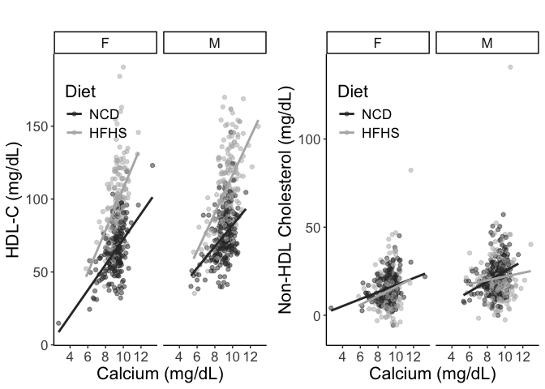
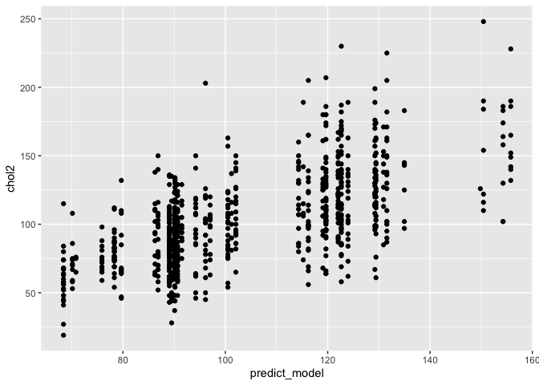

# Purpose

To analyze cholesterol levels from diversity outbred mice, identifying predictors of elevated choelsterol.

# Experimental Details

This analysis uses the complete dataset (F01-F425 and M01-M425). 

# Raw Data


```r
phenotype.filename <- 'Svenson_HFD_DO_phenotype_V12.csv'
```


```r
library(readr) #loads the readr package


phenotype.data <- read_csv(phenotype.filename)
#set phenotypes of zero or  to na
phenotype.data[phenotype.data < 0] <- NA

library(forcats)
cholesterol.data <-
  phenotype.data %>%
  mutate(Diet = fct_recode(as.factor(diet),
                           "NCD"="chow",
                           "HFHS"="hf")) %>%
  mutate(chol.avg = rowMeans(select(., starts_with("chol")), 
                             na.rm = TRUE))
```

# Analysis

The total number of mice with cholesterol levels in this dataset is 840
 mice, broken down as follows:
 

```r
cholesterol.data %>%
  group_by(Diet,sex) %>%
  count() %>%
  kable(caption="Number of mice in each group")
```


Table: Number of mice in each group

|Diet |sex |   n|
|:----|:---|---:|
|NCD  |F   | 225|
|NCD  |M   | 224|
|HFHS |F   | 198|
|HFHS |M   | 193|
 
## Cholesterol Levels for NCD Annimals


```r
cholesterol.data %>%
  group_by(sex,diet) %>%
  summarize_at(.vars=vars(chol1,chol2,chol.avg), .funs=list(~shapiro.test(.)$p.value)) %>%
  kable(caption="Groupwise Shapiro-Wilk normality tests for cholesterol levels", digits=c(0,0,5,5,5))
```


Table: Groupwise Shapiro-Wilk normality tests for cholesterol levels

|sex |diet |   chol1|   chol2| chol.avg|
|:---|:----|-------:|-------:|--------:|
|F   |chow | 0.21667| 0.01587|  0.21915|
|F   |hf   | 0.00767| 0.00006|  0.00271|
|M   |chow | 0.00000| 0.00071|  0.00002|
|M   |hf   | 0.04293| 0.01883|  0.09956|

```r
library(ggplot2)
cholesterol.data %>%
  select(sex,Diet,starts_with('chol')) %>%
  group_by(sex,Diet) %>%
  pivot_longer(cols=starts_with('chol'),
               names_to = "Measure",
               values_to = "Cholesterol") %>%
  ggplot(aes(x=Cholesterol,fill=Measure)) +
  geom_density(alpha=0.5) +
  facet_grid(Diet~sex)
```

<!-- -->

### Similarity at Both Time Points


```r
summary.data.complete <-
  cholesterol.data %>%
  group_by(sex,Diet) %>%
  summarize_at(.vars=vars(chol1,chol2,chol.avg), .funs=list(mean=~mean(., na.rm=T),
                                                            se=se,
                                                            sd=~sd(., na.rm=T)))

kable(summary.data.complete, caption="Cholesterol levels at 11 and 18 weeks")
```


Table: Cholesterol levels at 11 and 18 weeks

|sex |Diet | chol1_mean| chol2_mean| chol.avg_mean| chol1_se| chol2_se| chol.avg_se| chol1_sd| chol2_sd| chol.avg_sd|
|:---|:----|----------:|----------:|-------------:|--------:|--------:|-----------:|--------:|--------:|-----------:|
|F   |NCD  |       80.0|       78.7|            79|     1.16|     1.48|        1.23|     17.4|     22.2|        18.4|
|F   |HFHS |      108.5|      113.3|           111|     1.78|     2.40|        1.87|     25.0|     33.7|        26.3|
|M   |NCD  |       96.4|       96.5|            97|     1.47|     1.57|        1.37|     22.0|     23.5|        20.6|
|M   |HFHS |      128.2|      129.3|           128|     2.09|     2.33|        1.92|     29.1|     32.3|        26.7|

```r
library(broom)
wilcox.test(cholesterol.data$chol2,
       cholesterol.data$chol1, 
       paired=TRUE) %>% tidy %>%
  kable(caption="Pairwise t-test ofcholesterol levels week 11 and week 18")
```


Table: Pairwise t-test ofcholesterol levels week 11 and week 18

| statistic| p.value|method                                               |alternative |
|---------:|-------:|:----------------------------------------------------|:-----------|
|    147377|   0.474|Wilcoxon signed rank test with continuity correction |two.sided   |

```r
summary.data.complete %>%
  pivot_longer(cols=starts_with('chol'),
               names_sep="_",
               names_to = c("Measure","Measurement"),
               values_to = "Cholesterol") %>%
  pivot_wider(values_from="Cholesterol",names_from = "Measurement") %>%
  mutate(Value=fct_recode(as.factor(Measure),
                          "Average"="chol.avg",
                          `8 Weeks`="chol1",
                          `19 Weeks`="chol2")) %>%
  ggplot(aes(y=mean,ymin=mean-sd,ymax=mean+sd,x=Value)) +
  geom_bar(stat='identity') +
  geom_errorbar(width=0.5) +
  facet_grid(Diet~sex) +
    labs(y="Cholesterol (mg/dL)",
       x="") +
  scale_fill_grey() +
  scale_color_grey() +
  theme_classic() +
  theme(text=element_text(size=16),
        axis.text.x = element_text(angle = 90, vjust = 0.5, hjust=1))
```

<!-- -->


```r
summary.data <-
  cholesterol.data %>%
  group_by(sex,diet) %>%
  summarize_at(.vars=vars(chol2), .funs=list(mean=~mean(., na.rm=T),
                                             se=se,
                                             sd=~sd(., na.rm=T)))

library(broom)
lm(chol2~sex*diet, data=cholesterol.data) %>%
  tidy %>%
  kable(caption="Global interactions between sex and diet")
```


Table: Global interactions between sex and diet

|term        | estimate| std.error| statistic| p.value|
|:-----------|--------:|---------:|---------:|-------:|
|(Intercept) |    78.67|      1.88|    41.887|   0.000|
|sexM        |    17.80|      2.68|     6.648|   0.000|
|diethf      |    34.64|      2.75|    12.615|   0.000|
|sexM:diethf |    -1.86|      3.94|    -0.474|   0.636|

```r
lm(chol2~sex+diet, data=cholesterol.data) %>%
  tidy %>%
  kable(caption="Global effects of sex and diet, no interaction",
        digits=c(0,2,2,2,99))
```


Table: Global effects of sex and diet, no interaction

|term        | estimate| std.error| statistic|  p.value|
|:-----------|--------:|---------:|---------:|--------:|
|(Intercept) |     79.1|      1.65|     47.95| 0.00e+00|
|sexM        |     16.9|      1.96|      8.64| 3.03e-17|
|diethf      |     33.7|      1.97|     17.16| 1.37e-56|

```r
cholesterol.data %>%
  group_by(sex,diet) %>%
  filter(!is.na(chol2)) %>%
  count %>%
  kable(caption="Total cholesterol values at 19 weeks for the complete DO dataset")
```


Table: Total cholesterol values at 19 weeks for the complete DO dataset

|sex |diet |   n|
|:---|:----|---:|
|F   |chow | 223|
|F   |hf   | 196|
|M   |chow | 216|
|M   |hf   | 183|

```r
library(ggplot2)
cholesterol.data %>%
  ggplot(aes(y=chol2,x=sex,
             fill=Diet)) +
  geom_violin() +
  geom_jitter(alpha=0.2,
              position = position_jitterdodge(dodge.width = 0.9,
                                              jitter.width = 0.5,
                                              jitter.height = 0)) +
  labs(y="Cholesterol (mg/dL)",
       x="Sex") +
  scale_fill_grey() +
  scale_color_grey() +
  theme_classic() +
  theme(text=element_text(size=16),
        legend.position = c(0.15,0.8))
```

<!-- -->

There is no evidence of an interaction between sex and diet, though both covariates were significant individually.  

# Cholesterol Classification

Classified elevated cholesterol as being greater than the mean for the averaged cholesterol data for all mice


```r
cholesterol.data <-
  cholesterol.data %>%
  mutate(High.Chol = chol2 > mean(chol2,na.rm=T)) %>%
  mutate(sex = as.factor(sex),
         diet = as.factor(diet))
```

# Classification Tree

First used only sex and diet to predict using classification trees


```r
library(tree)

# load libraries
library(rpart)
library(rattle)

tree.sex.diet <- rpart(High.Chol~sex+Diet, data=cholesterol.data)
fancyRpartPlot(tree.sex.diet)
```

<!-- -->

Next included fat mass as a predictor


```r
tree.fat <- rpart(High.Chol~sex+diet+percfat2, data=cholesterol.data)
log.fat <- glm(High.Chol~sex+diet+percfat2, data=cholesterol.data, family='binomial')
log.fat %>% tidy %>% kable(caption="Logistic regression for sex and diet as predictors of above average cholesterol levels")
```


Table: Logistic regression for sex and diet as predictors of above average cholesterol levels

|term        | estimate| std.error| statistic| p.value|
|:-----------|--------:|---------:|---------:|-------:|
|(Intercept) |    -2.72|     0.298|     -9.11|       0|
|sexM        |     1.29|     0.173|      7.49|       0|
|diethf      |     1.47|     0.187|      7.88|       0|
|percfat2    |     4.59|     1.035|      4.44|       0|

```r
fancyRpartPlot(tree.sex.diet)
```

<!-- -->


```r
#function to figure out if all columns are na, pass to select  
not_all_na <- function(x) any(!is.na(x))  

cholesterol.data %>%
  dplyr::select(where(not_all_na)) %>% #remove columns with all nA
  dplyr::select(-mouse.id,-chol.avg,-chol1, -hdld1,-hdld2,-diet) -> #remove cholesterol and hdl columns
  chol.pred.data.high #testing higher than average cholesterol

cholesterol.data %>%
  select(where(not_all_na)) %>% #remove columns with all nA
  select(-mouse.id,-chol1,-chol.avg,-High.Chol, -hdld1,-hdld2,-diet) -> #remove cholesterol and hdl columns
  chol.pred.data.cont #testing continuous cholesterol levels

 
chol.pred.data.cont %>% 
  rename(`TG 19w`="tg2",
         `Ca 19w`="calcium2",
         `BW 19w`="bw.19") %>%
  rpart(chol2~., data=., method="anova") -> tree.all.cont
chol.pred.data.high %>% rpart(High.Chol~., data=., method="class") -> tree.all.high

fancyRpartPlot(tree.all.cont, main="Full tree, predicting continuous cholesterol levels")
```

<!-- -->

```r
fancyRpartPlot(tree.all.high, main="Full tree, predicting above average cholesterol levels")
```

<!-- -->

```r
#pruning of the continuous model, first showed the complexity parameter table
tree.all.cont$cptable %>% kable(caption="Complexity parameter table, used to idenfiy minumum crossvalidated error rate (xerror)")
```


Table: Complexity parameter table, used to idenfiy minumum crossvalidated error rate (xerror)

|    CP| nsplit| rel error| xerror|  xstd|
|-----:|------:|---------:|------:|-----:|
| 0.247|      0|     1.000|  1.001| 0.059|
| 0.064|      1|     0.753|  0.757| 0.045|
| 0.060|      2|     0.689|  0.710| 0.045|
| 0.036|      3|     0.629|  0.653| 0.042|
| 0.023|      4|     0.593|  0.648| 0.044|
| 0.022|      5|     0.569|  0.636| 0.043|
| 0.015|      6|     0.547|  0.638| 0.043|
| 0.015|      7|     0.532|  0.641| 0.044|
| 0.014|      8|     0.516|  0.644| 0.044|
| 0.011|      9|     0.502|  0.664| 0.046|
| 0.011|     10|     0.491|  0.678| 0.048|
| 0.010|     11|     0.481|  0.680| 0.048|
| 0.010|     12|     0.470|  0.680| 0.048|

```r
prune(tree.all.cont, cp=0.0365) -> tree.all.cont.pruned

fancyRpartPlot(tree.all.cont.pruned, uniform=TRUE, main="Pruned tree predicting continuous cholesterol levels")
```

<!-- -->

```r
rpart.plot::prp(tree.all.cont.pruned, extra=1, 
                main="",
                cex=1.2) 
```

<!-- -->

```r
tree.all.cont.pruned
```

```
## n=818 (22 observations deleted due to missingness)
## 
## node), split, n, deviance, yval
##       * denotes terminal node
## 
## 1) root 818 928000 103.0  
##   2) Diet=NCD 439 263000  87.4  
##     4) TG 19w< 128 233  92600  76.5 *
##     5) TG 19w>=128 206 111000  99.8 *
##   3) Diet=HFHS 379 436000 121.0  
##     6) Ca 19w< 8.35 52  26700  90.6 *
##     7) Ca 19w>=8.35 327 353000 126.0 *
```


```r
log.calcium <- glm(High.Chol~sex+diet+tg2+calcium2, data=cholesterol.data, family='binomial')
summary(log.calcium)
```

```
## 
## Call:
## glm(formula = High.Chol ~ sex + diet + tg2 + calcium2, family = "binomial", 
##     data = cholesterol.data)
## 
## Deviance Residuals: 
##    Min      1Q  Median      3Q     Max  
## -2.811  -0.788  -0.265   0.818   2.557  
## 
## Coefficients:
##              Estimate Std. Error z value Pr(>|z|)    
## (Intercept) -10.63079    1.09542   -9.70  < 2e-16 ***
## sexM          1.10576    0.18978    5.83  5.7e-09 ***
## diethf        2.22720    0.20620   10.80  < 2e-16 ***
## tg2           0.00883    0.00189    4.68  2.9e-06 ***
## calcium2      0.84725    0.11357    7.46  8.6e-14 ***
## ---
## Signif. codes:  0 '***' 0.001 '**' 0.01 '*' 0.05 '.' 0.1 ' ' 1
## 
## (Dispersion parameter for binomial family taken to be 1)
## 
##     Null deviance: 1058.9  on 765  degrees of freedom
## Residual deviance:  766.9  on 761  degrees of freedom
##   (74 observations deleted due to missingness)
## AIC: 776.9
## 
## Number of Fisher Scoring iterations: 5
```

```r
library(ggplot2)

ggplot(data=cholesterol.data,
       aes(y=chol2,
           x=calcium2,
           col=Diet)) +
  geom_point() +
  facet_grid(.~sex) +
  geom_smooth(method=lm, se=F) +
  labs(y="Cholesterol (mg/dL)",
       x="Calcium (mg/dL)",
       title="DO Strains") +
  scale_fill_grey() +
  scale_color_grey() +
  theme_classic() +
    guides(color=guide_legend(override.aes=list(fill=NA))) +
  theme(text=element_text(size=16),
        legend.position = c(0.15,0.80),
        legend.key=element_blank(),
        legend.background=element_blank())
```

<!-- -->

```r
 lm(chol2~Diet+sex+calcium2, data=cholesterol.data) %>% 
   tidy %>% 
   kable(caption="Diet adjusted association of cholesterol with calcium",
         digits=c(3,3,3,2,99))
```


Table: Diet adjusted association of cholesterol with calcium

|term        | estimate| std.error| statistic|  p.value|
|:-----------|--------:|---------:|---------:|--------:|
|(Intercept) |    -34.2|     7.979|     -4.29| 2.04e-05|
|DietHFHS    |     28.4|     1.801|     15.80| 7.63e-49|
|sexM        |     17.7|     1.779|      9.98| 4.04e-22|
|calcium2    |     12.6|     0.866|     14.52| 2.31e-42|

```r
  lm(chol2~Diet+sex+calcium2, data=cholesterol.data) %>% 
   glance %>% 
   kable(caption="Diet adjusted association of cholesterol with triglycerides",
         digits=c(3,3,3,2,99))
```


Table: Diet adjusted association of cholesterol with triglycerides

| r.squared| adj.r.squared| sigma| statistic| p.value| df| logLik|  AIC|  BIC| deviance| df.residual| nobs|
|---------:|-------------:|-----:|---------:|-------:|--:|------:|----:|----:|--------:|-----------:|----:|
|     0.452|          0.45|  24.6|       210|   4e-99|  3|  -3538| 7086| 7109|   460649|         762|  766|

```r
cholesterol.data %>%
  group_by(Diet,sex) %>%
  summarize(Estimate = cor.test(chol2,calcium2, method="spearman")$estimate,
            P.value = cor.test(chol2,calcium2, method="spearman")$p.value) %>%
  kable(caption="Spearman's rho estimates for cholesterol and calcium for each subgroup of diet and sex",
        digits=c(0,0,3,99))
```


Table: Spearman's rho estimates for cholesterol and calcium for each subgroup of diet and sex

|Diet |sex | Estimate|  P.value|
|:----|:---|--------:|--------:|
|NCD  |F   |    0.415| 1.50e-09|
|NCD  |M   |    0.427| 5.66e-11|
|HFHS |F   |    0.384| 2.24e-07|
|HFHS |M   |    0.470| 1.88e-11|

```r
lm.calcium.1 <- lm(chol2~calcium2, data=cholesterol.data)
lm.calcium.2 <- lm(chol2~calcium2+sex, data=cholesterol.data)
lm.calcium.3 <- lm(chol2~calcium2+sex+diet, data=cholesterol.data)
lm.calcium.4 <- lm(chol2~calcium2+sex+tg2, data=cholesterol.data)
lm.calcium.5 <- lm(chol2~calcium2+sex+bw.19, data=cholesterol.data)
lm.calcium.6 <- lm(chol2~sex+diet+calcium2, data=cholesterol.data)
lm.calcium.7 <- lm(chol2~sex+diet+calcium2+tg2, data=cholesterol.data)
lm.calcium.8 <- lm(chol2~sex+diet+calcium2+tg2+bw.19, data=cholesterol.data)
anova(lm.calcium.3,lm.calcium.4)
```

```
## Analysis of Variance Table
## 
## Model 1: chol2 ~ calcium2 + sex + diet
## Model 2: chol2 ~ calcium2 + sex + tg2
##   Res.Df    RSS Df Sum of Sq F Pr(>F)
## 1    762 460649                      
## 2    762 608722  0   -148072
```

```r
lm.calcium.9 <- lm(chol2~sex+diet*calcium2, data=cholesterol.data)
aov.calcium <- aov(chol2~sex+diet+calcium2, data=cholesterol.data)
summary(lm.calcium.1) %>% tidy %>% kable(caption="Effects of calcium on cholesterol at 18w", digits=50)
```


Table: Effects of calcium on cholesterol at 18w

|term        | estimate| std.error| statistic|  p.value|
|:-----------|--------:|---------:|---------:|--------:|
|(Intercept) |    -28.2|      9.52|     -2.96| 3.12e-03|
|calcium2    |     14.4|      1.03|     13.91| 2.17e-39|

```r
summary(lm.calcium.2) %>% tidy %>% kable(caption="Sex adjusted effects of calcium on cholesterol at 18w", digits=50)
```


Table: Sex adjusted effects of calcium on cholesterol at 18w

|term        | estimate| std.error| statistic|  p.value|
|:-----------|--------:|---------:|---------:|--------:|
|(Intercept) |    -39.1|     9.180|     -4.26| 2.34e-05|
|calcium2    |     14.6|     0.987|     14.75| 1.75e-43|
|sexM        |     17.6|     2.048|      8.61| 4.24e-17|

```r
summary(lm.calcium.3) %>% tidy %>% kable(caption="Sex and diet adjusted effects of calcium on cholesterol at 18w", digits=50)
```


Table: Sex and diet adjusted effects of calcium on cholesterol at 18w

|term        | estimate| std.error| statistic|  p.value|
|:-----------|--------:|---------:|---------:|--------:|
|(Intercept) |    -34.2|     7.979|     -4.29| 2.04e-05|
|calcium2    |     12.6|     0.866|     14.52| 2.31e-42|
|sexM        |     17.7|     1.779|      9.98| 4.04e-22|
|diethf      |     28.4|     1.801|     15.80| 7.60e-49|

```r
summary(lm.calcium.4) %>% tidy %>% kable(caption="Sex and diet and tg adjusted effects of calcium on cholesterol at 18w", digits=50)
```


Table: Sex and diet and tg adjusted effects of calcium on cholesterol at 18w

|term        | estimate| std.error| statistic|  p.value|
|:-----------|--------:|---------:|---------:|--------:|
|(Intercept) | -38.5294|    9.1695|     -4.20| 2.96e-05|
|calcium2    |  14.0889|    1.0160|     13.87| 3.71e-39|
|sexM        |  16.5404|    2.1255|      7.78| 2.33e-14|
|tg2         |   0.0346|    0.0185|      1.87| 6.13e-02|

```r
summary(lm.calcium.5) %>% tidy %>% kable(caption="Sex and diet and tg adjusted effects of calcium on cholesterol at 18w", digits=50)
```


Table: Sex and diet and tg adjusted effects of calcium on cholesterol at 18w

|term        | estimate| std.error| statistic|  p.value|
|:-----------|--------:|---------:|---------:|--------:|
|(Intercept) |   -60.52|     9.169|     -6.60| 7.69e-11|
|calcium2    |    12.90|     0.966|     13.35| 1.08e-36|
|sexM        |     6.59|     2.378|      2.77| 5.70e-03|
|bw.19       |     1.24|     0.150|      8.29| 5.12e-16|

```r
summary(lm.calcium.6) %>% tidy %>% kable(caption="Sex and diet and tg adjusted effects of calcium on cholesterol at 18w", digits=50)
```


Table: Sex and diet and tg adjusted effects of calcium on cholesterol at 18w

|term        | estimate| std.error| statistic|  p.value|
|:-----------|--------:|---------:|---------:|--------:|
|(Intercept) |    -34.2|     7.979|     -4.29| 2.04e-05|
|sexM        |     17.7|     1.779|      9.98| 4.04e-22|
|diethf      |     28.4|     1.801|     15.80| 7.60e-49|
|calcium2    |     12.6|     0.866|     14.52| 2.31e-42|

```r
summary(lm.calcium.7) %>% tidy %>% kable(caption="Sex and diet and tg adjusted effects of calcium on cholesterol at 18w", digits=50)
```


Table: Sex and diet and tg adjusted effects of calcium on cholesterol at 18w

|term        | estimate| std.error| statistic|  p.value|
|:-----------|--------:|---------:|---------:|--------:|
|(Intercept) |  -31.782|    7.7396|     -4.11| 4.45e-05|
|sexM        |   14.144|    1.7970|      7.87| 1.21e-14|
|diethf      |   32.080|    1.8186|     17.64| 0.00e+00|
|calcium2    |   10.783|    0.8767|     12.30| 7.72e-32|
|tg2         |    0.115|    0.0162|      7.10| 2.91e-12|

```r
summary(lm.calcium.8) %>% tidy %>% kable(caption="Sex and diet and tg adjusted effects of calcium on cholesterol at 18w", digits=50)
```


Table: Sex and diet and tg adjusted effects of calcium on cholesterol at 18w

|term        | estimate| std.error| statistic|  p.value|
|:-----------|--------:|---------:|---------:|--------:|
|(Intercept) |  -39.758|    8.1256|     -4.89| 1.21e-06|
|sexM        |   10.458|    2.1623|      4.84| 1.60e-06|
|diethf      |   29.777|    1.9547|     15.23| 6.39e-46|
|calcium2    |   10.440|    0.8798|     11.87| 6.45e-30|
|tg2         |    0.110|    0.0162|      6.75| 2.90e-11|
|bw.19       |    0.434|    0.1413|      3.07| 2.20e-03|

```r
lm.calcium.chow <- lm(chol2~sex+calcium2, filter(cholesterol.data, diet == "chow"))
summary(lm.calcium.chow) %>% glance %>% kable
```


| r.squared| adj.r.squared| sigma| statistic| p.value| df| df.residual| nobs|
|---------:|-------------:|-----:|---------:|-------:|--:|-----------:|----:|
|     0.325|         0.322|  19.9|      98.4|       0|  2|         409|  412|

```r
lm.calcium.hf <- lm(chol2~sex+calcium2, filter(cholesterol.data, diet == "hf"))
summary(lm.calcium.hf) %>% glance %>% kable
```


| r.squared| adj.r.squared| sigma| statistic| p.value| df| df.residual| nobs|
|---------:|-------------:|-----:|---------:|-------:|--:|-----------:|----:|
|     0.273|         0.269|  28.9|        66|       0|  2|         351|  354|

```r
lm.calcium <- lm(chol2~sex+diet+calcium2, cholesterol.data)
summary(lm.calcium) %>% glance %>% kable(caption="Linear model of calcium on cholesterol adjusting for sex and diet")
```


Table: Linear model of calcium on cholesterol adjusting for sex and diet

| r.squared| adj.r.squared| sigma| statistic| p.value| df| df.residual| nobs|
|---------:|-------------:|-----:|---------:|-------:|--:|-----------:|----:|
|     0.452|          0.45|  24.6|       210|       0|  3|         762|  766|

```r
library(effectsize)
eta_squared(lm.calcium, partial = TRUE) %>% kable(caption="Partial effect sizes for calcium model")
```


Table: Partial effect sizes for calcium model

|Parameter | Eta2_partial|   CI| CI_low| CI_high|
|:---------|------------:|----:|------:|-------:|
|sex       |        0.107| 0.95|  0.075|       1|
|diet      |        0.300| 0.95|  0.258|       1|
|calcium2  |        0.217| 0.95|  0.176|       1|

```r
#moderation by triglycerides
lm.calcium.tg <- lm(chol2~sex+diet+calcium2+tg2, cholesterol.data)
summary(lm.calcium.tg) %>% tidy %>% kable(caption="Linear model of calcium on cholesterol adjusting for sex, diet and triglycerides")
```


Table: Linear model of calcium on cholesterol adjusting for sex, diet and triglycerides

|term        | estimate| std.error| statistic| p.value|
|:-----------|--------:|---------:|---------:|-------:|
|(Intercept) |  -31.782|     7.740|     -4.11|       0|
|sexM        |   14.144|     1.797|      7.87|       0|
|diethf      |   32.080|     1.819|     17.64|       0|
|calcium2    |   10.783|     0.877|     12.30|       0|
|tg2         |    0.115|     0.016|      7.10|       0|

```r
anova(lm.calcium,lm.calcium.tg)%>% 
  kable(caption="Comparason of models with or without triglyceride levels",
        digits=c(0,0,0,0,0,99))
```


Table: Comparason of models with or without triglyceride levels

| Res.Df|    RSS| Df| Sum of Sq|  F|   Pr(>F)|
|------:|------:|--:|---------:|--:|--------:|
|    762| 460649| NA|        NA| NA|       NA|
|    761| 432050|  1|     28600| 50| 2.91e-12|

```r
lm.calcium.chol <- lm(chol2~calcium2, cholesterol.data)
summary(lm.calcium.chol) %>% glance %>% kable(caption="Linear model of calcium on cholesterol")
```


Table: Linear model of calcium on cholesterol

| r.squared| adj.r.squared| sigma| statistic| p.value| df| df.residual| nobs|
|---------:|-------------:|-----:|---------:|-------:|--:|-----------:|----:|
|     0.202|         0.201|  29.6|       194|       0|  1|         764|  766|

```r
lm.calcium.chol.sex <- lm(chol2~calcium2+sex, cholesterol.data)
summary(lm.calcium.chol.sex) %>% glance %>% kable(caption="Linear model of calcium on cholesterol adjusting for sex")
```


Table: Linear model of calcium on cholesterol adjusting for sex

| r.squared| adj.r.squared| sigma| statistic| p.value| df| df.residual| nobs|
|---------:|-------------:|-----:|---------:|-------:|--:|-----------:|----:|
|     0.273|         0.271|  28.3|       143|       0|  2|         763|  766|

```r
lm.calcium.chol.sex.bw <- lm(chol2~calcium2+sex+bw.19, cholesterol.data)
summary(lm.calcium.chol.sex.bw) %>% glance %>% kable(caption="Linear model of calcium on cholesterol adjusting for sex and bw")
```


Table: Linear model of calcium on cholesterol adjusting for sex and bw

| r.squared| adj.r.squared| sigma| statistic| p.value| df| df.residual| nobs|
|---------:|-------------:|-----:|---------:|-------:|--:|-----------:|----:|
|     0.334|         0.331|  27.1|       127|       0|  3|         761|  765|

```r
summary(lm.calcium.chol)
```

```
## 
## Call:
## lm(formula = chol2 ~ calcium2, data = cholesterol.data)
## 
## Residuals:
##    Min     1Q Median     3Q    Max 
## -67.61 -19.86  -3.02  15.93 123.89 
## 
## Coefficients:
##             Estimate Std. Error t value Pr(>|t|)    
## (Intercept)   -28.22       9.52   -2.96   0.0031 ** 
## calcium2       14.37       1.03   13.91   <2e-16 ***
## ---
## Signif. codes:  0 '***' 0.001 '**' 0.01 '*' 0.05 '.' 0.1 ' ' 1
## 
## Residual standard error: 29.6 on 764 degrees of freedom
##   (74 observations deleted due to missingness)
## Multiple R-squared:  0.202,	Adjusted R-squared:  0.201 
## F-statistic:  194 on 1 and 764 DF,  p-value: <2e-16
```

```r
summary(lm.calcium.chol.sex)
```

```
## 
## Call:
## lm(formula = chol2 ~ calcium2 + sex, data = cholesterol.data)
## 
## Residuals:
##    Min     1Q Median     3Q    Max 
## -61.35 -19.54  -2.63  15.95 129.36 
## 
## Coefficients:
##             Estimate Std. Error t value Pr(>|t|)    
## (Intercept)  -39.072      9.180   -4.26 0.000023 ***
## calcium2      14.553      0.987   14.75  < 2e-16 ***
## sexM          17.628      2.048    8.61  < 2e-16 ***
## ---
## Signif. codes:  0 '***' 0.001 '**' 0.01 '*' 0.05 '.' 0.1 ' ' 1
## 
## Residual standard error: 28.3 on 763 degrees of freedom
##   (74 observations deleted due to missingness)
## Multiple R-squared:  0.273,	Adjusted R-squared:  0.271 
## F-statistic:  143 on 2 and 763 DF,  p-value: <2e-16
```

```r
summary(lm.calcium.chol.sex.bw)
```

```
## 
## Call:
## lm(formula = chol2 ~ calcium2 + sex + bw.19, data = cholesterol.data)
## 
## Residuals:
##    Min     1Q Median     3Q    Max 
## -67.96 -18.41  -2.14  14.44 128.30 
## 
## Coefficients:
##             Estimate Std. Error t value Pr(>|t|)    
## (Intercept)  -60.515      9.169   -6.60  7.7e-11 ***
## calcium2      12.903      0.966   13.35  < 2e-16 ***
## sexM           6.592      2.378    2.77   0.0057 ** 
## bw.19          1.242      0.150    8.29  5.1e-16 ***
## ---
## Signif. codes:  0 '***' 0.001 '**' 0.01 '*' 0.05 '.' 0.1 ' ' 1
## 
## Residual standard error: 27.1 on 761 degrees of freedom
##   (75 observations deleted due to missingness)
## Multiple R-squared:  0.334,	Adjusted R-squared:  0.331 
## F-statistic:  127 on 3 and 761 DF,  p-value: <2e-16
```

## Effects of Diet and Sex on Calcium


```r
summary.data <-
  cholesterol.data %>%
  group_by(sex,diet) %>%
  summarize_at(.vars=vars(calcium2), .funs=list(mean=~mean(., na.rm=T),
                                                se=se,
                                                sd=~sd(., na.rm=T)))

lm(calcium2~sex*diet, data=cholesterol.data) %>%
  tidy %>%
  kable(caption="Global interactions between sex and diet on calcium levels")
```


Table: Global interactions between sex and diet on calcium levels

|term        | estimate| std.error| statistic| p.value|
|:-----------|--------:|---------:|---------:|-------:|
|(Intercept) |    9.088|     0.073|    123.99|   0.000|
|sexM        |   -0.134|     0.101|     -1.32|   0.187|
|diethf      |    0.197|     0.107|      1.84|   0.067|
|sexM:diethf |    0.202|     0.149|      1.36|   0.174|

```r
lm(calcium2~sex+diet, data=cholesterol.data) %>%
  tidy %>%
  kable(caption="Global effects of sex and diet on calcium levels, no interaction",
        digits=c(0,2,2,2,99))
```


Table: Global effects of sex and diet on calcium levels, no interaction

|term        | estimate| std.error| statistic|   p.value|
|:-----------|--------:|---------:|---------:|---------:|
|(Intercept) |     9.04|      0.06|    141.67| 0.0000000|
|sexM        |    -0.04|      0.07|     -0.54| 0.5915731|
|diethf      |     0.30|      0.07|      4.07| 0.0000511|

```r
cholesterol.data %>%
  group_by(sex,diet) %>%
  filter(!is.na(calcium2)) %>%
  count %>%
  kable(caption="Total calcium values for complete DO dataset")
```


Table: Total calcium values for complete DO dataset

|sex |diet |   n|
|:---|:----|---:|
|F   |chow | 196|
|F   |hf   | 171|
|M   |chow | 216|
|M   |hf   | 185|

```r
cholesterol.data %>%
  ggplot(aes(y=calcium2,x=sex,
             fill=Diet)) +
  geom_violin() +
  geom_jitter(alpha=0.2,
              position = position_jitterdodge(dodge.width = 0.9,
                                              jitter.width = 0.5,
                                              jitter.height = 0)) +
  labs(y="Calcium (mg/dL)",
       x="Sex") +
  scale_fill_grey() +
  scale_color_grey() +
  theme_classic() +
  theme(text=element_text(size=16),
        legend.position = c(0.85,0.15))
```

<!-- -->

# Bone Content and Density


```r
ggplot(data=cholesterol.data,
       aes(y=chol2,
           x=bmd2,
           col=Diet)) +
  geom_point() +
  facet_grid(.~sex) +
  geom_smooth(method=lm, se=F) +
  labs(y="Cholesterol (mg/dL)",
       x="Bone Mineral Density (g/cm2)") +
  scale_fill_grey() +
  scale_color_grey() +
  theme_classic() +
    guides(color=guide_legend(override.aes=list(fill=NA))) +
  theme(text=element_text(size=16),
        legend.position = c(0.15,0.80),
        legend.key=element_blank(),
        legend.background=element_blank())
```

<!-- -->

```r
 lm(chol2~Diet+sex+bmd2, data=cholesterol.data) %>% 
   tidy %>% 
   kable(caption="Diet adjusted association of cholesterol with bone mineral density",
         digits=c(0,3,3,2,99))
```


Table: Diet adjusted association of cholesterol with bone mineral density

|term        | estimate| std.error| statistic|  p.value|
|:-----------|--------:|---------:|---------:|--------:|
|(Intercept) |    79.78|      5.53|     14.44| 3.48e-42|
|DietHFHS    |    33.62|      2.00|     16.79| 1.77e-54|
|sexM        |    16.89|      2.23|      7.59| 8.98e-14|
|bmd2        |    -1.19|      9.79|     -0.12| 9.03e-01|


```r
ggplot(data=cholesterol.data,
       aes(y=chol2,
           x=bmc2,
           col=Diet)) +
  geom_point() +
  facet_grid(.~sex) +
  geom_smooth(method=lm, se=F) +
  labs(y="Cholesterol (mg/dL)",
       x="Bone Mineral Content (g)") +
  scale_fill_grey() +
  scale_color_grey() +
  theme_classic() +
    guides(color=guide_legend(override.aes=list(fill=NA))) +
  theme(text=element_text(size=16),
        legend.position = c(0.15,0.80),
        legend.key=element_blank(),
        legend.background=element_blank())
```

<!-- -->

```r
 lm(chol2~Diet+sex+bmc2, data=cholesterol.data) %>% 
   tidy %>% 
   kable(caption="Diet adjusted association of cholesterol with bone mineral content",
         digits=c(0,3,3,2,99))
```


Table: Diet adjusted association of cholesterol with bone mineral content

|term        | estimate| std.error| statistic|  p.value|
|:-----------|--------:|---------:|---------:|--------:|
|(Intercept) |    79.70|      6.32|     12.61| 2.07e-33|
|DietHFHS    |    33.63|      2.00|     16.84| 9.34e-55|
|sexM        |    16.86|      2.22|      7.60| 8.02e-14|
|bmc2        |    -1.04|     11.19|     -0.09| 9.26e-01|

## Lipoprotein Subpopulations

Looked at the associations between HDL-C and non-HDL-C on calcium levels.

### HDL-C


```r
ggplot(data=cholesterol.data,
       aes(y=hdld2,
           x=calcium2,
           col=Diet)) +
  geom_point(alpha=0.5) +
  facet_grid(.~sex) +
  geom_smooth(method=lm, se=F) +
  labs(y="HDL-C (mg/dL)",
       x="Calcium (mg/dL)",
       title="DO Strains") +
  scale_fill_grey() +
  scale_color_grey() +
  theme_classic() +
    guides(color=guide_legend(override.aes=list(fill=NA))) +
  theme(text=element_text(size=16),
        legend.position = c(0.2,0.80),
        legend.key=element_blank(),
        legend.background=element_blank()) ->
  hdlc.calcium.plot
hdlc.calcium.plot
```

<!-- -->

```r
 lm(hdld2~Diet+sex+calcium2, data=cholesterol.data) %>% 
   tidy %>% 
   kable(caption="Diet adjusted association of HDL-C with calcium",
         digits=c(0,3,3,2,99))
```


Table: Diet adjusted association of HDL-C with calcium

|term        | estimate| std.error| statistic|  p.value|
|:-----------|--------:|---------:|---------:|--------:|
|(Intercept) |    -30.1|     6.207|     -4.85| 1.52e-06|
|DietHFHS    |     29.9|     1.403|     21.29| 3.46e-79|
|sexM        |     10.8|     1.386|      7.80| 2.01e-14|
|calcium2    |     10.4|     0.674|     15.49| 3.13e-47|

### Non-HDL Cholesterol


```r
cholesterol.data <-
  cholesterol.data %>%
  mutate(nonhdlc2 = chol2-hdld2,
         nonhdlc1 = chol1-hdld1)

ggplot(data=cholesterol.data,
       aes(y=nonhdlc2,
           x=calcium2,
           col=Diet)) +
  geom_point(alpha=0.5) +
  facet_grid(.~sex) +
  geom_smooth(method=lm, se=F) +
  labs(y="Non-HDL Cholesterol (mg/dL)",
       x="Calcium (mg/dL)",
       title="DO Strains") +
  scale_fill_grey() +
  scale_color_grey() +
  theme_classic() +
    guides(color=guide_legend(override.aes=list(fill=NA))) +
  theme(text=element_text(size=16),
        legend.position = c(0.2,0.80),
        legend.key=element_blank(),
        legend.background=element_blank()) ->
  nonhdlc2.calcium.plot

 lm(nonhdlc2~Diet+sex+calcium2, data=cholesterol.data) %>% 
   tidy %>%    kable(caption="Diet adjusted association of non-HDL cholesterol with calcium",
         digits=c(0,3,3,2,99))
```


Table: Diet adjusted association of non-HDL cholesterol with calcium

|term        | estimate| std.error| statistic|  p.value|
|:-----------|--------:|---------:|---------:|--------:|
|(Intercept) |    -3.29|      3.41|     -0.96| 3.35e-01|
|DietHFHS    |    -1.44|      0.77|     -1.87| 6.16e-02|
|sexM        |     6.95|      0.76|      9.13| 6.01e-19|
|calcium2    |     2.04|      0.37|      5.52| 4.54e-08|
  
### Both Apolipopotein Fraction Plots  
 

```r
cholesterol.data %>%
  group_by(Diet,sex) %>%
  summarize_at(.vars=vars(chol2,hdld2,nonhdlc2)
               ,.funs=list(mean=~mean(.,na.rm=T))) %>%
  mutate(fold=hdld2_mean/nonhdlc2_mean)
```

```
## # A tibble: 4 × 6
## # Groups:   Diet [2]
##   Diet  sex   chol2_mean hdld2_mean nonhdlc2_mean  fold
##   <fct> <fct>      <dbl>      <dbl>         <dbl> <dbl>
## 1 NCD   F           78.7       64.2          14.5  4.43
## 2 NCD   M           96.5       74.6          22.0  3.40
## 3 HFHS  F          113.        99.2          14.0  7.08
## 4 HFHS  M          129.       108.           21.3  5.07
```

```r
library(gridExtra)
grid.arrange(hdlc.calcium.plot,nonhdlc2.calcium.plot, nrow=1)
```

<!-- -->


```r
ggplot(data=cholesterol.data,
       aes(y=chol2,
           x=tg2,
           col=Diet)) +
  geom_point(alpha=0.5) +
  facet_grid(.~sex) +
  geom_smooth(method=lm, se=F) +
  labs(y="Cholesterol (mg/dL)",
       x="Triglycerides (mg/dL)",
       title="DO Strains") +
  scale_fill_grey() +
  scale_color_grey() +
  theme_classic() +
    guides(color=guide_legend(override.aes=list(fill=NA))) +
  theme(text=element_text(size=16),
        legend.position = c(0.15,0.80),
        legend.key=element_blank(),
        legend.background=element_blank())
```

<!-- -->

```r
 lm(chol2~Diet+sex+tg2, data=cholesterol.data) %>% 
   tidy %>% 
   kable(caption="Diet adjusted association of cholesterol with triglycerides",
         digits=c(0,3,3,2,99))
```


Table: Diet adjusted association of cholesterol with triglycerides

|term        | estimate| std.error| statistic|  p.value|
|:-----------|--------:|---------:|---------:|--------:|
|(Intercept) |   58.062|     2.537|     22.88| 7.23e-90|
|DietHFHS    |   38.474|     1.901|     20.24| 4.48e-74|
|sexM        |   11.375|     1.917|      5.93| 4.40e-09|
|tg2         |    0.177|     0.017|     10.47| 3.77e-24|

```r
  lm(chol2~Diet+sex+tg2, data=cholesterol.data) %>% 
   glance %>% 
   kable(caption="Diet adjusted association of cholesterol with triglycerides",
         digits=c(0,3,3,2,99))
```


Table: Diet adjusted association of cholesterol with triglycerides

| r.squared| adj.r.squared| sigma| statistic|  p.value| df| logLik|  AIC|  BIC| deviance| df.residual| nobs|
|---------:|-------------:|-----:|---------:|--------:|--:|------:|----:|----:|--------:|-----------:|----:|
|         0|          0.39|  26.3|       175| 1.58e-87|  3|  -3834| 7679| 7702|   564513|         814|  818|

```r
lm.tg.1 <- lm(chol2~sex+tg2, data=cholesterol.data)
lm.tg.2 <- lm(chol2~sex+diet+tg2, data=cholesterol.data)
lm.tg.3 <- lm(chol2~sex+calcium2+tg2, data=cholesterol.data)
lm.tg.4 <- lm(chol2~sex+bw.19+tg2, data=cholesterol.data)
lm.tg.5 <- lm(chol2~sex+diet+tg2+calcium2, data=cholesterol.data)
lm.tg.6 <- lm(chol2~sex+diet+tg2+calcium2+bw.19, data=cholesterol.data)
lm.tg.male <- lm(chol2~diet*tg2, dplyr::filter(cholesterol.data, sex == "M"))
lm.tg.female <- lm(chol2~diet*tg2, dplyr::filter(cholesterol.data, sex == "F"))
lm.tg.complicated <- lm(chol2~diet + sex + diet*tg2 + sex*tg2 + sex*diet + sex*diet*tg2, data=cholesterol.data)
aov.tg <- aov(chol2~sex+diet+tg2, data=cholesterol.data)

summary(lm.tg.1) %>% tidy %>% kable(caption="Sex adjusted effects of tg on cholesterol at 18w", digits=50)
```


Table: Sex adjusted effects of tg on cholesterol at 18w

|term        | estimate| std.error| statistic|  p.value|
|:-----------|--------:|---------:|---------:|--------:|
|(Intercept) |  84.7193|    2.6572|     31.88| 0.00e+00|
|sexM        |  13.6024|    2.3452|      5.80| 9.48e-09|
|tg2         |   0.0954|    0.0201|      4.75| 2.41e-06|

```r
summary(lm.tg.2) %>% tidy %>% kable(caption="Sex and diet adjusted effects of tg on cholesterol at 18w", digits=50)
```


Table: Sex and diet adjusted effects of tg on cholesterol at 18w

|term        | estimate| std.error| statistic|  p.value|
|:-----------|--------:|---------:|---------:|--------:|
|(Intercept) |   58.062|    2.5374|     22.88| 0.00e+00|
|sexM        |   11.375|    1.9172|      5.93| 4.40e-09|
|diethf      |   38.474|    1.9012|     20.24| 0.00e+00|
|tg2         |    0.177|    0.0169|     10.47| 3.77e-24|

```r
summary(lm.tg.3) %>% tidy %>% kable(caption="Sex and diet adjusted effects of tg on cholesterol at 18w", digits=50)
```


Table: Sex and diet adjusted effects of tg on cholesterol at 18w

|term        | estimate| std.error| statistic|  p.value|
|:-----------|--------:|---------:|---------:|--------:|
|(Intercept) | -38.5294|    9.1695|     -4.20| 2.96e-05|
|sexM        |  16.5404|    2.1255|      7.78| 2.33e-14|
|calcium2    |  14.0889|    1.0160|     13.87| 3.71e-39|
|tg2         |   0.0346|    0.0185|      1.87| 6.13e-02|

```r
summary(lm.tg.4) %>% tidy %>% kable(caption="Sex and diet adjusted effects of tg on cholesterol at 18w", digits=50)
```


Table: Sex and diet adjusted effects of tg on cholesterol at 18w

|term        | estimate| std.error| statistic|  p.value|
|:-----------|--------:|---------:|---------:|--------:|
|(Intercept) |  36.4401|    5.2549|     6.934| 8.32e-12|
|sexM        |  -0.4276|    2.5861|    -0.165| 8.69e-01|
|bw.19       |   1.6579|    0.1587|    10.450| 4.53e-24|
|tg2         |   0.0865|    0.0189|     4.582| 5.33e-06|

```r
summary(lm.tg.5) %>% tidy %>% kable(caption="Sex and diet adjusted effects of tg on cholesterol at 18w", digits=50)
```


Table: Sex and diet adjusted effects of tg on cholesterol at 18w

|term        | estimate| std.error| statistic|  p.value|
|:-----------|--------:|---------:|---------:|--------:|
|(Intercept) |  -31.782|    7.7396|     -4.11| 4.45e-05|
|sexM        |   14.144|    1.7970|      7.87| 1.21e-14|
|diethf      |   32.080|    1.8186|     17.64| 0.00e+00|
|tg2         |    0.115|    0.0162|      7.10| 2.91e-12|
|calcium2    |   10.783|    0.8767|     12.30| 7.72e-32|

```r
summary(lm.tg.6) %>% tidy %>% kable(caption="Sex and diet adjusted effects of tg on cholesterol at 18w", digits=50)
```


Table: Sex and diet adjusted effects of tg on cholesterol at 18w

|term        | estimate| std.error| statistic|  p.value|
|:-----------|--------:|---------:|---------:|--------:|
|(Intercept) |  -39.758|    8.1256|     -4.89| 1.21e-06|
|sexM        |   10.458|    2.1623|      4.84| 1.60e-06|
|diethf      |   29.777|    1.9547|     15.23| 6.39e-46|
|tg2         |    0.110|    0.0162|      6.75| 2.90e-11|
|calcium2    |   10.440|    0.8798|     11.87| 6.45e-30|
|bw.19       |    0.434|    0.1413|      3.07| 2.20e-03|

```r
summary(lm.tg.male) %>% tidy %>% kable(caption="Sex and diet adjusted effects of calcium on cholesterol at 18w for males", digits=50)
```


Table: Sex and diet adjusted effects of calcium on cholesterol at 18w for males

|term        | estimate| std.error| statistic|  p.value|
|:-----------|--------:|---------:|---------:|--------:|
|(Intercept) |   67.619|    4.6676|     14.49| 1.91e-38|
|diethf      |   51.106|    6.3091|      8.10| 6.90e-15|
|tg2         |    0.194|    0.0290|      6.69| 7.53e-11|
|diethf:tg2  |   -0.111|    0.0417|     -2.66| 8.20e-03|

```r
summary(lm.tg.female) %>% tidy %>% kable(caption="Sex and diet adjusted effects of calcium on cholesterol at 18w for females", digits=50)
```


Table: Sex and diet adjusted effects of calcium on cholesterol at 18w for females

|term        | estimate| std.error| statistic|  p.value|
|:-----------|--------:|---------:|---------:|--------:|
|(Intercept) |   54.282|    4.4166|     12.29| 8.01e-30|
|diethf      |   27.199|    6.6631|      4.08| 5.36e-05|
|tg2         |    0.202|    0.0336|      6.00| 4.31e-09|
|diethf:tg2  |    0.152|    0.0615|      2.47| 1.38e-02|

```r
summary(lm.tg.complicated) %>% tidy %>% kable(caption="Sex and diet adjusted effects of calcium on cholesterol at 18w", digits=50)
```


Table: Sex and diet adjusted effects of calcium on cholesterol at 18w

|term            | estimate| std.error| statistic|  p.value|
|:---------------|--------:|---------:|---------:|--------:|
|(Intercept)     |  54.2816|    4.4600|    12.171| 2.04e-31|
|diethf          |  27.1988|    6.7285|     4.042| 5.80e-05|
|sexM            |  13.3372|    6.4221|     2.077| 3.81e-02|
|tg2             |   0.2015|    0.0339|     5.941| 4.19e-09|
|diethf:tg2      |   0.1520|    0.0621|     2.449| 1.45e-02|
|sexM:tg2        |  -0.0073|    0.0445|    -0.164| 8.70e-01|
|diethf:sexM     |  23.9069|    9.1807|     2.604| 9.38e-03|
|diethf:sexM:tg2 |  -0.2628|    0.0746|    -3.525| 4.47e-04|

```r
lm.tg.chow <- lm(chol2~sex+tg2, filter(cholesterol.data, diet == "chow"))
summary(lm.tg.chow) %>% glance %>% kable
```


| r.squared| adj.r.squared| sigma| statistic| p.value| df| df.residual| nobs|
|---------:|-------------:|-----:|---------:|-------:|--:|-----------:|----:|
|      0.34|         0.337|    20|       112|       0|  2|         436|  439|

```r
lm.tg.hf <- lm(chol2~sex+tg2, filter(cholesterol.data, diet == "hf"))
summary(lm.tg.hf) %>% glance %>% kable
```


| r.squared| adj.r.squared| sigma| statistic| p.value| df| df.residual| nobs|
|---------:|-------------:|-----:|---------:|-------:|--:|-----------:|----:|
|     0.108|         0.103|  32.2|      22.7|       0|  2|         376|  379|

```r
library(effectsize)
omega_squared(aov.calcium, partial = TRUE) %>%
  kable(caption="Partial effect size estimates for predictors of continuous cholesterol levels")
```


Table: Partial effect size estimates for predictors of continuous cholesterol levels

|Parameter | Omega2_partial|   CI| CI_low| CI_high|
|:---------|--------------:|----:|------:|-------:|
|sex       |          0.105| 0.95|  0.074|       1|
|diet      |          0.299| 0.95|  0.256|       1|
|calcium2  |          0.215| 0.95|  0.174|       1|

```r
dplyr::filter(cholesterol.data, sex == "M")
```

```
## # A tibble: 417 × 175
##    mouse.id sex     gen litter diet  coat.color  acr1  acr2 adiponectin b.area1
##    <chr>    <fct> <dbl>  <dbl> <fct> <chr>      <dbl> <dbl>       <dbl>   <dbl>
##  1 F142     M         7      2 hf    agouti        NA    NA          NA    8.31
##  2 M01      M         4      2 hf    agouti        NA    NA          NA    9.97
##  3 M02      M         4      2 hf    agouti        NA    NA          NA    9.02
##  4 M03      M         4      2 hf    agouti        NA    NA          NA    9.05
##  5 M04      M         4      2 hf    black         NA    NA          NA    9.55
##  6 M05      M         4      2 hf    agouti        NA    NA          NA    8.78
##  7 M06      M         4      2 hf    agouti        NA    NA          NA   11.4 
##  8 M07      M         4      2 hf    agouti        NA    NA          NA    9.24
##  9 M08      M         4      2 hf    black         NA    NA          NA   10.7 
## 10 M09      M         4      2 hf    agouti        NA    NA          NA   NA   
## # ℹ 407 more rows
## # ℹ 165 more variables: b.area2 <dbl>, bmc1 <dbl>, bmc2 <dbl>, bmd1 <dbl>,
## #   bmd2 <dbl>, bun1 <dbl>, bun2 <dbl>, bw.10 <dbl>, bw.11 <dbl>, bw.12 <dbl>,
## #   bw.13 <dbl>, bw.14 <dbl>, bw.15 <dbl>, bw.16 <dbl>, bw.17 <dbl>,
## #   bw.18 <dbl>, bw.19 <dbl>, bw.20 <dbl>, bw.21 <dbl>, bw.22 <dbl>,
## #   bw.23 <dbl>, bw.24 <dbl>, bw.25 <dbl>, bw.26 <dbl>, bw.27 <dbl>,
## #   bw.28 <dbl>, bw.29 <dbl>, bw.3 <dbl>, bw.30 <dbl>, bw.4 <dbl>, …
```

# Mediating Effect of Body Weight


```r
ggplot(data=cholesterol.data,
       aes(y=chol2,
           x=bw.19,
           col=diet)) +
  geom_point() +
  facet_grid(.~sex) +
  geom_smooth(method=lm) +
    labs(y="Cholesterol (mg/dL)",
       x="Body Weight (g)",
       title="DO Strains") +
  scale_fill_grey() +
  scale_color_grey() +
  theme_classic() +
    guides(color=guide_legend(override.aes=list(fill=NA))) +
  theme(text=element_text(size=16),
        legend.position = c(0.15,0.80),
        legend.key=element_blank(),
        legend.background=element_blank())
```

<!-- -->

```r
lm.bw.model.1 <- lm(chol2~sex+bw.19, data=cholesterol.data)

summary(lm.bw.model.1) %>% tidy %>% kable(caption="Effects of body weight on cholesterol at 18w, ajdusting for sex", digits=50)
```


Table: Effects of body weight on cholesterol at 18w, ajdusting for sex

|term        | estimate| std.error| statistic|  p.value|
|:-----------|--------:|---------:|---------:|--------:|
|(Intercept) |    44.74|      4.99|     8.959| 2.20e-18|
|sexM        |     2.06|      2.56|     0.803| 4.22e-01|
|bw.19       |     1.69|      0.16|    10.527| 2.19e-24|

```r
lm.bw.model.2 <- lm(chol2~sex+diet+bw.19, data=cholesterol.data)

summary(lm.bw.model.2) %>% tidy %>% kable(caption="Effects of body weight on cholesterol at 18w, ajdusting for sex and diet", digits=50)
```


Table: Effects of body weight on cholesterol at 18w, ajdusting for sex and diet

|term        | estimate| std.error| statistic|  p.value|
|:-----------|--------:|---------:|---------:|--------:|
|(Intercept) |   55.859|     4.554|     12.27| 7.51e-32|
|sexM        |    9.548|     2.360|      4.05| 5.72e-05|
|diethf      |   29.317|     2.093|     14.01| 4.36e-40|
|bw.19       |    0.852|     0.156|      5.46| 6.17e-08|

```r
# mediating effect of body weight on the calcium, cholesterol relationship
lm.bw.1 <- lm(chol2~calcium2, data=cholesterol.data)
lm.bw.2 <- lm(chol2~calcium2+sex, data=cholesterol.data)
lm.bw.3 <- lm(chol2~calcium2+sex+bw.19, data=cholesterol.data)
lm.bw.4 <- lm(chol2~calcium2+sex+bw.19+diet, data=cholesterol.data)

bind_rows(tidy(lm.bw.1) %>% mutate(Model='cholesterol~calcium'),
          tidy(lm.bw.2) %>% mutate(Model='cholesterol~calcium+sex'),
          tidy(lm.bw.3) %>% mutate(Model='cholesterol~calcium+sex+body.weight'),
          tidy(lm.bw.4) %>% mutate(Model='cholesterol~calcium+sex+body.weight+diet')) %>%
  filter(term=='calcium2') %>%
  mutate(beta.calcium=paste(round(estimate,2),round(std.error,2),sep="+/-")) %>%
  select(Model,beta.calcium,p.value) %>%
  kable(caption="Summary of effects of body weight mediation",digits=c(0,0,99))
```


Table: Summary of effects of body weight mediation

|Model                                    |beta.calcium |  p.value|
|:----------------------------------------|:------------|--------:|
|cholesterol~calcium                      |14.37+/-1.03 | 2.17e-39|
|cholesterol~calcium+sex                  |14.55+/-0.99 | 1.75e-43|
|cholesterol~calcium+sex+body.weight      |12.9+/-0.97  | 1.08e-36|
|cholesterol~calcium+sex+body.weight+diet |12.05+/-0.87 | 5.59e-39|

## Mediation Analysis for Body Weight

Did a mediation analysis for the effects of body weight on the calcium-cholesterol relationship.  Based this on the instructions at https://data.library.virginia.edu/introduction-to-mediation-analysis/


```r
library(mediation)
#need a dataset that is complete with respect to calcium and cholesterol
mediation.cholesterol.data <-
  cholesterol.data %>%
  filter(!is.na(calcium2)) %>%
  filter(!is.na(chol2))
mediator.model <- lm(bw.19 ~ calcium2+sex, mediation.cholesterol.data)
model.full <- lm(chol2 ~ calcium2 + sex+bw.19, mediation.cholesterol.data)

bw.mediation.results <- mediate(mediator.model, model.full, treat='calcium2', mediator='bw.19',
                   boot=TRUE, sims=1000)
summary(bw.mediation.results) 
```

```
## 
## Causal Mediation Analysis 
## 
## Nonparametric Bootstrap Confidence Intervals with the Percentile Method
## 
##                Estimate 95% CI Lower 95% CI Upper p-value    
## ACME             1.6482       1.0342         2.33  <2e-16 ***
## ADE             12.9034      11.1687        14.58  <2e-16 ***
## Total Effect    14.5516      12.8019        16.29  <2e-16 ***
## Prop. Mediated   0.1133       0.0733         0.16  <2e-16 ***
## ---
## Signif. codes:  0 '***' 0.001 '**' 0.01 '*' 0.05 '.' 0.1 ' ' 1
## 
## Sample Size Used: 765 
## 
## 
## Simulations: 1000
```

Differences in body weight partially mediate the relationship between calcium and cholesterol.

# Mediating Effect of Percent Fat Mass


```r
ggplot(data=cholesterol.data,
       aes(y=chol2,
           x=percfat2*100,
           col=Diet)) +
  geom_point() +
  facet_grid(.~sex) +
  geom_smooth(method=lm) +
    labs(y="Cholesterol (mg/dL)",
       x="Percent Fat Mass",
       title="DO Strains") +
  scale_fill_grey() +
  scale_color_grey() +
  theme_classic() +
    guides(color=guide_legend(override.aes=list(fill=NA))) +
  theme(text=element_text(size=16),
        legend.position = c(0.15,0.80),
        legend.key=element_blank(),
        legend.background=element_blank())
```

<!-- -->

```r
lm.bw.model.1 <- lm(chol2~sex+percfat2, data=cholesterol.data)

summary(lm.bw.model.1) %>% tidy %>% kable(caption="Effects of percent fat mass on cholesterol at 18w, ajdusting for sex", digits=50)
```


Table: Effects of percent fat mass on cholesterol at 18w, ajdusting for sex

|term        | estimate| std.error| statistic|  p.value|
|:-----------|--------:|---------:|---------:|--------:|
|(Intercept) |     52.4|      3.43|      15.3| 1.90e-46|
|sexM        |     21.8|      2.11|      10.3| 1.25e-23|
|percfat2    |    151.5|     11.12|      13.6| 3.11e-38|

```r
lm.bw.model.2 <- lm(chol2~sex+diet+percfat2, data=cholesterol.data)

summary(lm.bw.model.2) %>% tidy %>% kable(caption="Effects of percent fat mass on cholesterol at 18w, ajdusting for sex and diet", digits=50)
```


Table: Effects of percent fat mass on cholesterol at 18w, ajdusting for sex and diet

|term        | estimate| std.error| statistic|  p.value|
|:-----------|--------:|---------:|---------:|--------:|
|(Intercept) |     61.5|      3.30|     18.66| 0.00e+00|
|sexM        |     19.4|      1.98|      9.80| 1.75e-21|
|diethf      |     25.9|      2.31|     11.20| 3.51e-27|
|percfat2    |     75.9|     12.35|      6.14| 1.28e-09|

### Is there an effect of diet beyond the effect of fat mass?


```r
# mediating effect of body weight on the calcium, cholesterol relationship
lm.fm.1 <- lm(chol2~percfat2, data=cholesterol.data)
lm.fm.2 <- lm(chol2~sex+percfat2, data=cholesterol.data)
lm.fm.3 <- lm(chol2~sex+percfat2+diet, data=cholesterol.data)

bind_rows(tidy(lm.fm.1) %>% mutate(Model='cholesterol~sex'),
          tidy(lm.fm.2) %>% mutate(Model='cholesterol~sex+fat.mass'),
          tidy(lm.fm.3) %>% mutate(Model='cholesterol~sex+fat.mass+diet')) %>%
  filter(term=='percfat2') %>%
  mutate(beta.pct.fat.mass=paste(round(estimate,2),round(std.error,2),sep="+/-")) %>%
  dplyr::select(Model,beta.pct.fat.mass,p.value) %>%
  kable(caption="Summary of effects of diet and percent fat mass mediation",digits=c(0,0,99))
```


Table: Summary of effects of diet and percent fat mass mediation

|Model                         |beta.pct.fat.mass |  p.value|
|:-----------------------------|:-----------------|--------:|
|cholesterol~sex               |130.28+/-11.62    | 3.18e-27|
|cholesterol~sex+fat.mass      |151.53+/-11.12    | 3.11e-38|
|cholesterol~sex+fat.mass+diet |75.88+/-12.35     | 1.28e-09|

```r
mediation.cholesterol.data <-
  cholesterol.data %>%
  filter(!is.na(calcium2)) %>%
  filter(!is.na(chol2)) %>%
  filter(!is.na(percfat2))

mediator.model <- lm(percfat2 ~ diet + sex, mediation.cholesterol.data)
model.full <- lm(chol2 ~ diet + sex + percfat2, mediation.cholesterol.data)

fm.mediation.results <- mediate(mediator.model, model.full, treat='diet', mediator='percfat2',
                   boot=TRUE, sims=1000)
summary(fm.mediation.results) 
```

```
## 
## Causal Mediation Analysis 
## 
## Nonparametric Bootstrap Confidence Intervals with the Percentile Method
## 
##                Estimate 95% CI Lower 95% CI Upper p-value    
## ACME              8.110        5.556        10.78  <2e-16 ***
## ADE              24.010       19.335        28.99  <2e-16 ***
## Total Effect     32.119       28.140        36.27  <2e-16 ***
## Prop. Mediated    0.252        0.168         0.34  <2e-16 ***
## ---
## Signif. codes:  0 '***' 0.001 '**' 0.01 '*' 0.05 '.' 0.1 ' ' 1
## 
## Sample Size Used: 758 
## 
## 
## Simulations: 1000
```

## Mediation Analysis for Percent Fat Mass

Did a mediation analysis for the effects of percent fat mass on the calcium-cholesterol relationship.  Based this on the instructions at https://data.library.virginia.edu/introduction-to-mediation-analysis/


```r
# mediating effect of body weight on the calcium, cholesterol relationship
lm.fm.1 <- lm(chol2~calcium2, data=cholesterol.data)
lm.fm.2 <- lm(chol2~calcium2+sex, data=cholesterol.data)
lm.fm.3 <- lm(chol2~calcium2+sex+percfat2, data=cholesterol.data)
lm.fm.4 <- lm(chol2~calcium2+sex+percfat2+diet, data=cholesterol.data)

bind_rows(tidy(lm.fm.1) %>% mutate(Model='cholesterol~calcium'),
          tidy(lm.fm.2) %>% mutate(Model='cholesterol~calcium+sex'),
          tidy(lm.fm.3) %>% mutate(Model='cholesterol~calcium+sex+fat.mass'),
          tidy(lm.fm.4) %>% mutate(Model='cholesterol~calcium+sex+fat.mass+diet')) %>%
  filter(term=='calcium2') %>%
  mutate(beta.calcium=paste(round(estimate,2),round(std.error,2),sep="+/-")) %>%
  dplyr::select(Model,beta.calcium,p.value) %>%
  kable(caption="Summary of effects of percent fat mass mediation",digits=c(0,0,99))
```


Table: Summary of effects of percent fat mass mediation

|Model                                 |beta.calcium |  p.value|
|:-------------------------------------|:------------|--------:|
|cholesterol~calcium                   |14.37+/-1.03 | 2.17e-39|
|cholesterol~calcium+sex               |14.55+/-0.99 | 1.75e-43|
|cholesterol~calcium+sex+fat.mass      |12.56+/-0.93 | 1.16e-37|
|cholesterol~calcium+sex+fat.mass+diet |12.04+/-0.87 | 2.72e-39|

```r
#need a dataset that is complete with respect to calcium and cholesterol
mediation.cholesterol.data <-
  cholesterol.data %>%
  filter(!is.na(calcium2)) %>%
  filter(!is.na(chol2))
mediator.model <- lm(percfat2 ~ calcium2+sex, mediation.cholesterol.data)
model.full <- lm(chol2 ~ calcium2 + sex+percfat2, mediation.cholesterol.data)

bw.mediation.results <- mediate(mediator.model, model.full, treat='calcium2', mediator='percfat2',
                   boot=TRUE, sims=1000)
summary(bw.mediation.results) 
```

```
## 
## Causal Mediation Analysis 
## 
## Nonparametric Bootstrap Confidence Intervals with the Percentile Method
## 
##                Estimate 95% CI Lower 95% CI Upper p-value    
## ACME              2.078        1.278         2.99  <2e-16 ***
## ADE              12.561       10.879        14.34  <2e-16 ***
## Total Effect     14.640       13.014        16.45  <2e-16 ***
## Prop. Mediated    0.142        0.089         0.20  <2e-16 ***
## ---
## Signif. codes:  0 '***' 0.001 '**' 0.01 '*' 0.05 '.' 0.1 ' ' 1
## 
## Sample Size Used: 758 
## 
## 
## Simulations: 1000
```

Differences in body weight partially mediate the relationship between calcium and cholesterol.


# Random Forests


```r
library(caret)
library(ipred)

# Specify 10-fold cross validation
ctrl <- trainControl(method = "cv",  number = 10) 

# train bagged model
bagged_cv <- bagging(
  formula = chol2~Diet+calcium2,
  data    = chol.pred.data.cont,
  coob=TRUE
  )

# assess 10-50 bagged trees
ntree <- 10:50

# create empty vector to store OOB RMSE values
rmse <- vector(mode = "numeric", length = length(ntree))

for (i in seq_along(ntree)) {
  # reproducibility
  set.seed(123)
  
  # perform bagged model
  model <- bagging(
  formula = chol2~Diet+sex+calcium2+tg2,
  data    = chol.pred.data.cont,
  coob=TRUE,
  nbagg   = ntree[i]
)
  # get OOB error
  rmse[i] <- model$err
}

plot(ntree, rmse, type = 'l', lwd = 2)
abline(v = 25, col = "red", lty = "dashed")
```

<!-- -->

```r
predict_model<-predict(bagged_cv, chol.pred.data.cont)

ggplot(chol.pred.data.cont, aes(x=predict_model,y=chol2)) +
  geom_point()
```

<!-- -->

```r
library(randomForest)
forest <- randomForest(chol2~Diet+sex+calcium2+tg2, 
             data = chol.pred.data.cont,
             na.action=na.exclude) 
varImpPlot(forest)
```

<!-- -->

```r
predict_model<-predict(forest, chol.pred.data.cont)
```

# Cholesterol Associations with All Parameters

First estimated Spearman correlation coefficients for each parameter relative to chol2


```r
cholesterol.data %>% 
  dplyr::select(-Diet,-sex,-coat.color,-mouse.id,-chol.avg,-High.Chol,-diet) %>%
  mutate_all(.funs=as.numeric) %>% 
  cor(use="pairwise.complete.obs", method="spearman") %>%
  as.data.frame -> all.correlations

chol.correlations <- dplyr::select(all.correlations, chol2) %>%
  rownames_to_column('Parameter') %>%
  arrange(-abs(chol2)) 

cholesterol.data %>% 
  dplyr::select(-Diet,-sex,-coat.color,-mouse.id,-chol.avg,-High.Chol,-diet) %>%
  mutate_all(.funs=as.numeric) %>% 
  pivot_longer(cols=everything(),names_to="Parameter", values_to="Values") %>%
  group_by(Parameter) %>%
  summarize(n=length(Values[!(is.na(Values))])) ->
  chol.n

spearmentt <- function(r,n){r * sqrt((n-2)/((1-r)*(1+r)))} #from https://stats.stackexchange.com/questions/22816/calculating-p-value-for-spearmans-rank-correlation-coefficient-example-on-wikip

chol.cor.data <-
  left_join(chol.correlations,chol.n,by="Parameter") %>%
  mutate(cor.p.value = 2*pt(-abs(spearmentt(chol2,n)),n-2)) %>%
  mutate(cor.p.adj = p.adjust(cor.p.value,method="BH")) %>%
  rename(estimate=chol2)
```

Next constructed diet and sex adjusted linear models for each parameter


```r
cholesterol.data %>% 
  dplyr::select(-coat.color,-mouse.id,-chol.avg,-High.Chol,-diet) %>%
  dplyr::select(b.area1:percfat2,nonhdlc1,nonhdlc2,sex,Diet) %>%
  pivot_longer(cols=-one_of('sex','Diet','chol2')) %>% 
  group_by(name) %>%
  do(beta=as.numeric(unlist(tidy(lm(chol2~value+Diet+sex,data=.))[2,'estimate'])),
     se=as.numeric(unlist(tidy(lm(chol2~value+Diet+sex,data=.))[2,'std.error'])),
     lm.p.value=as.numeric(unlist(tidy(lm(chol2~value+Diet+sex,data=.))[2,'p.value']))) %>%
  mutate(lm.p.adj = p.adjust(lm.p.value,method="BH")) -> chol.cor.lm

left_join(chol.cor.data,chol.cor.lm,by=c('Parameter'='name')) %>%
  arrange(-abs(estimate)) -> cor.data.combined

cor.data.combined %>%
  kable(caption="Correlation coefficients and diet/sex adjusted estimates for each clinical parameter",
        digits=c(0,3,0,99,99,3,3,99,99))
```


Table: Correlation coefficients and diet/sex adjusted estimates for each clinical parameter

|Parameter            | estimate|   n| cor.p.value| cor.p.adj|beta       |se       |lm.p.value | lm.p.adj|
|:--------------------|--------:|---:|-----------:|---------:|:----------|:--------|:----------|--------:|
|chol2                |    1.000| 818|    0.00e+00|  0.00e+00|NULL       |NULL     |NULL       |       NA|
|hdld2                |    0.946| 814|    0.00e+00|  0.00e+00|1.19       |0.0156   |0          | 0.00e+00|
|chol1                |    0.723| 789|    0.00e+00|  0.00e+00|0.673      |0.0363   |9.88e-64   | 9.88e-64|
|hdld1                |    0.703| 787|    0.00e+00|  0.00e+00|0.785      |0.047    |1.09e-53   | 1.09e-53|
|nonhdlc2             |    0.574| 812|    2.05e-72|  6.87e-71|1.81       |0.0671   |1.92e-114  | 0.00e+00|
|acr2                 |    0.467| 192|    8.81e-12|  2.79e-11|NULL       |NULL     |NULL       |       NA|
|ftm2                 |    0.449| 818|    9.23e-42|  2.15e-40|1.28       |0.223    |1.47e-08   | 1.47e-08|
|ttm2                 |    0.448| 818|    1.02e-41|  2.15e-40|0.779      |0.144    |8.89e-08   | 8.89e-08|
|bw.19                |    0.447| 827|    6.44e-42|  1.80e-40|0.852      |0.156    |6.17e-08   | 6.17e-08|
|bw.22                |    0.443| 776|    1.13e-38|  1.46e-37|0.797      |0.15     |1.53e-07   | 1.53e-07|
|bw.20                |    0.439| 827|    2.69e-40|  5.03e-39|0.796      |0.15     |1.54e-07   | 1.54e-07|
|bw.23                |    0.438| 722|    4.00e-35|  3.36e-34|0.782      |0.15     |2.4e-07    | 2.40e-07|
|bw.18                |    0.438| 828|    4.82e-40|  8.11e-39|0.867      |0.162    |1.16e-07   | 1.16e-07|
|bw.21                |    0.437| 824|    1.02e-39|  1.55e-38|0.763      |0.147    |2.71e-07   | 2.71e-07|
|gtt.180              |    0.436| 195|    1.94e-10|  6.03e-10|0.0419     |0.0438   |0.34       | 3.40e-01|
|weight2              |    0.433| 818|    8.87e-39|  1.24e-37|0.743      |0.148    |6.13e-07   | 6.13e-07|
|glucose2             |    0.431| 815|    3.46e-38|  4.14e-37|0.116      |0.02     |9.4e-09    | 9.40e-09|
|bw.28                |    0.428| 143|    9.81e-08|  2.50e-07|0.45       |0.267    |0.0934     | 9.34e-02|
|bw.17                |    0.427| 829|    3.70e-38|  4.14e-37|0.844      |0.171    |0.00000102 | 1.02e-06|
|t.area2              |    0.427| 818|    1.26e-37|  1.33e-36|1.4        |0.28     |6.59e-07   | 6.59e-07|
|necr.wt              |    0.420| 840|    2.62e-37|  2.59e-36|0.482      |0.127    |0.000162   | 1.62e-04|
|bw.26                |    0.419| 648|    5.94e-29|  2.93e-28|0.64       |0.145    |0.0000123  | 1.23e-05|
|calcium2             |    0.417| 768|    1.08e-33|  8.28e-33|12.6       |0.866    |2.31e-42   | 2.31e-42|
|bw.25                |    0.416| 673|    1.37e-29|  7.70e-29|0.666      |0.147    |0.00000745 | 7.45e-06|
|perc.fat2            |    0.416| 818|    1.30e-35|  1.21e-34|1.94       |0.316    |1.29e-09   | 1.29e-09|
|bw.24                |    0.416| 673|    1.49e-29|  8.09e-29|0.692      |0.151    |0.00000525 | 5.25e-06|
|fat.mri              |    0.415| 198|    1.26e-09|  3.77e-09|0.81       |0.492    |0.101      | 1.01e-01|
|gtt.120              |    0.414| 195|    1.87e-09|  5.50e-09|0.0161     |0.0328   |0.625      | 6.25e-01|
|bw.16                |    0.411| 831|    3.56e-35|  3.15e-34|0.784      |0.179    |0.0000131  | 1.31e-05|
|bw.29                |    0.405|  97|    3.83e-05|  8.81e-05|0.294      |0.342    |0.392      | 3.92e-01|
|ftm1                 |    0.404| 832|    5.41e-34|  4.32e-33|1.03       |0.329    |0.00175    | 1.75e-03|
|bw.30                |    0.403|  97|    4.31e-05|  9.78e-05|0.32       |0.339    |0.347      | 3.47e-01|
|bw.15                |    0.401| 831|    2.07e-33|  1.51e-32|0.841      |0.187    |0.00000761 | 7.61e-06|
|nonhdlc1             |    0.400| 787|    1.29e-31|  8.65e-31|1.25       |0.108    |7.35e-29   | 7.35e-29|
|bw.27                |    0.398| 407|    6.69e-17|  2.34e-16|0.455      |0.18     |0.0118     | 1.18e-02|
|bw.14                |    0.395| 832|    2.00e-32|  1.40e-31|0.792      |0.196    |0.0000606  | 6.06e-05|
|bw.13                |    0.386| 835|    4.71e-31|  3.04e-30|0.819      |0.203    |0.0000592  | 5.92e-05|
|bw.12                |    0.385| 835|    5.75e-31|  3.58e-30|0.848      |0.209    |0.0000564  | 5.64e-05|
|ttm1                 |    0.381| 832|    4.53e-30|  2.72e-29|0.611      |0.195    |0.00181    | 1.81e-03|
|leptin               |    0.380| 826|    8.96e-30|  5.19e-29|0.153      |0.0463   |0.000999   | 9.99e-04|
|perc.fat1            |    0.377| 832|    1.77e-29|  9.30e-29|1.51       |0.445    |0.000712   | 7.12e-04|
|bw.11                |    0.373| 837|    5.27e-29|  2.68e-28|0.848      |0.216    |0.000096   | 9.60e-05|
|acr1                 |    0.372| 197|    7.18e-08|  1.85e-07|NULL       |NULL     |NULL       |       NA|
|percfat2             |    0.372| 818|    3.44e-28|  1.65e-27|75.9       |12.4     |1.28e-09   | 1.28e-09|
|weight1              |    0.368| 832|    3.92e-28|  1.83e-27|0.645      |0.198    |0.0012     | 1.20e-03|
|urine.microalbumin2  |    0.367| 805|    4.60e-27|  2.09e-26|1.08       |1.09     |0.322      | 3.22e-01|
|bw.10                |    0.360| 837|    5.12e-27|  2.26e-26|0.756      |0.228    |0.000941   | 9.41e-04|
|t.area1              |    0.357| 832|    1.83e-26|  7.87e-26|0.864      |0.344    |0.0122     | 1.22e-02|
|weight.mri           |    0.355| 198|    2.83e-07|  7.00e-07|0.479      |0.382    |0.211      | 2.11e-01|
|gldh2                |    0.338| 766|    5.63e-22|  2.20e-21|0.577      |0.0772   |2.12e-13   | 2.12e-13|
|bw.9                 |    0.338| 787|    1.58e-22|  6.64e-22|0.758      |0.254    |0.00295    | 2.95e-03|
|insulin              |    0.328| 821|    4.22e-22|  1.73e-21|-0.053     |0.0191   |0.00566    | 5.66e-03|
|percfat1             |    0.326| 832|    5.45e-22|  2.18e-21|51.2       |15.1     |0.000716   | 7.16e-04|
|bw.8                 |    0.324| 789|    8.77e-21|  3.35e-20|0.752      |0.279    |0.00722    | 7.22e-03|
|urine.microalbumin1  |    0.315| 708|    9.63e-18|  3.52e-17|1.88       |1.54     |0.222      | 2.22e-01|
|bw.7                 |    0.299| 789|    1.03e-17|  3.67e-17|0.682      |0.3      |0.0235     | 2.35e-02|
|ltm2                 |    0.296| 818|    4.67e-18|  1.74e-17|0.966      |0.289    |0.000881   | 8.81e-04|
|gtt.t0               |    0.290| 195|    3.83e-05|  8.81e-05|0.022      |0.0739   |0.767      | 7.67e-01|
|bw.6                 |    0.282| 790|    6.17e-16|  2.12e-15|1.1        |0.326    |0.000805   | 8.05e-04|
|non.fast.calcium     |    0.272| 412|    2.03e-08|  5.58e-08|7.35       |3.3      |0.0266     | 2.66e-02|
|glucose1             |    0.270| 741|    7.06e-14|  2.32e-13|0.0285     |0.0271   |0.293      | 2.93e-01|
|gtt.auc              |    0.264| 195|    1.95e-04|  4.19e-04|0.00000225 |0.000169 |0.989      | 9.89e-01|
|adiponectin          |    0.263| 195|    2.00e-04|  4.25e-04|NULL       |NULL     |NULL       |       NA|
|ltm1                 |    0.262| 832|    1.76e-14|  5.92e-14|0.731      |0.336    |0.0298     | 2.98e-02|
|tbil2                |    0.253| 145|    2.16e-03|  4.17e-03|9.74       |9.89     |0.326      | 3.26e-01|
|length2              |    0.246| 819|    9.60e-13|  3.10e-12|5.84       |2.59     |0.0245     | 2.45e-02|
|heart.wt             |    0.242| 668|    2.17e-10|  6.62e-10|19.4       |36.1     |0.591      | 5.91e-01|
|nefa2                |    0.225| 677|    3.42e-09|  9.74e-09|16.3       |1.67     |4.81e-21   | 4.81e-21|
|gtt.t60              |    0.220| 195|    2.00e-03|  3.90e-03|-0.00483   |0.0184   |0.794      | 7.94e-01|
|bw.pc1               |    0.219| 392|    1.24e-05|  2.94e-05|0.526      |0.716    |0.463      | 4.63e-01|
|non.fast.crex        |   -0.218| 459|    2.34e-06|  5.71e-06|-57.3      |34.1     |0.0938     | 9.38e-02|
|tg2                  |    0.207| 819|    2.38e-09|  6.90e-09|0.177      |0.0169   |3.77e-24   | 3.77e-24|
|bw.5                 |    0.204| 790|    6.81e-09|  1.91e-08|1.19       |0.295    |0.000059   | 5.90e-05|
|urine.glucose2       |   -0.196| 782|    3.13e-08|  8.49e-08|-0.0288    |0.0209   |0.169      | 1.69e-01|
|urine.creatinine2    |   -0.194| 797|    3.19e-08|  8.51e-08|-0.0945    |0.0392   |0.0161     | 1.61e-02|
|phosphorus2          |    0.189| 769|    1.30e-07|  3.25e-07|3.63       |0.85     |0.0000217  | 2.17e-05|
|length1              |    0.188| 832|    4.72e-08|  1.24e-07|3.8        |2.64     |0.15       | 1.50e-01|
|spleen.wt            |    0.170| 668|    1.02e-05|  2.45e-05|25.8       |17.1     |0.131      | 1.31e-01|
|urine.creatinine1    |   -0.151| 706|    5.84e-05|  1.31e-04|-0.0442    |0.0463   |0.34       | 3.40e-01|
|kidney.wt.r          |    0.150| 668|    9.76e-05|  2.16e-04|-7.04      |24.7     |0.775      | 7.75e-01|
|kidney.wt.l          |    0.147| 668|    1.39e-04|  3.03e-04|-2.88      |25.8     |0.911      | 9.11e-01|
|mcv2                 |    0.142| 601|    4.89e-04|  1.01e-03|0.501      |0.395    |0.206      | 2.06e-01|
|gldh1                |    0.137| 690|    2.97e-04|  6.23e-04|0.202      |0.137    |0.14       | 1.40e-01|
|calcium1             |    0.136| 644|    5.39e-04|  1.10e-03|4.38       |1.28     |0.000628   | 6.28e-04|
|bw.3                 |    0.129| 250|    4.11e-02|  7.27e-02|-1.25      |0.726    |0.0872     | 8.72e-02|
|urine.glucose1       |   -0.119| 699|    1.64e-03|  3.28e-03|0.0217     |0.0193   |0.261      | 2.61e-01|
|hr                   |    0.116| 781|    1.12e-03|  2.26e-03|0.000667   |0.022    |0.976      | 9.76e-01|
|lipase1              |    0.116|  97|    2.60e-01|  3.44e-01|1.1        |0.467    |0.0203     | 2.03e-02|
|tbil1                |    0.115| 187|    1.19e-01|  1.84e-01|-7.29      |14.1     |0.606      | 6.06e-01|
|chcm2                |   -0.114| 601|    5.00e-03|  9.55e-03|-0.871     |0.778    |0.263      | 2.63e-01|
|rr                   |   -0.110| 781|    1.99e-03|  3.90e-03|0.0214     |0.21     |0.919      | 9.19e-01|
|ghrelin              |    0.107| 195|    1.37e-01|  2.04e-01|504        |141      |0.00043    | 4.30e-04|
|mchc2                |   -0.107| 586|    9.77e-03|  1.80e-02|-1.09      |0.765    |0.156      | 1.56e-01|
|ct.eos1              |   -0.105| 628|    8.16e-03|  1.52e-02|-17.5      |4.68     |0.000206   | 2.06e-04|
|lean.mri             |    0.105| 198|    1.43e-01|  2.10e-01|0.0366     |0.735    |0.96       | 9.60e-01|
|bw.4                 |    0.101| 765|    5.21e-03|  9.84e-03|1.1        |0.277    |0.0000766  | 7.66e-05|
|gtt.t30              |    0.092| 195|    2.00e-01|  2.78e-01|-0.00661   |0.0189   |0.727      | 7.27e-01|
|nefa1                |    0.086| 691|    2.38e-02|  4.29e-02|8.2        |1.78     |0.00000514 | 5.14e-06|
|ct.eos2              |   -0.085| 600|    3.77e-02|  6.73e-02|-9.75      |3.18     |0.0023     | 2.30e-03|
|b.area1              |   -0.085| 832|    1.45e-02|  2.64e-02|-0.988     |0.889    |0.267      | 2.67e-01|
|totalwater.mri       |    0.085| 198|    2.36e-01|  3.15e-01|-0.118     |0.878    |0.893      | 8.93e-01|
|perc.mono1           |    0.080| 628|    4.57e-02|  8.00e-02|0.341      |1.43     |0.811      | 8.11e-01|
|perc.eos1            |   -0.078| 628|    5.17e-02|  8.96e-02|-1.36      |0.384    |0.000432   | 4.32e-04|
|retic2               |    0.076| 601|    6.16e-02|  1.06e-01|-0.104     |0.654    |0.874      | 8.74e-01|
|mchc1                |   -0.073| 627|    6.61e-02|  1.09e-01|-1.2       |0.795    |0.133      | 1.33e-01|
|perc.eos2            |   -0.070| 604|    8.44e-02|  1.36e-01|-0.919     |0.284    |0.00126    | 1.26e-03|
|st                   |   -0.066| 781|    6.52e-02|  1.09e-01|0.123      |0.342    |0.719      | 7.19e-01|
|bun2                 |    0.065| 818|    6.33e-02|  1.07e-01|1.51       |0.234    |2.06e-10   | 2.06e-10|
|bmc2                 |    0.064| 818|    6.61e-02|  1.09e-01|-1.04      |11.2     |0.926      | 9.26e-01|
|mch2                 |    0.063| 586|    1.26e-01|  1.94e-01|-0.0355    |1.31     |0.978      | 9.78e-01|
|hdw1                 |    0.063| 628|    1.14e-01|  1.79e-01|-9.42      |6.39     |0.141      | 1.41e-01|
|bun1                 |   -0.063| 787|    7.88e-02|  1.29e-01|0.508      |0.262    |0.0532     | 5.32e-02|
|perc.mono2           |    0.062| 604|    1.27e-01|  1.94e-01|0.822      |0.776    |0.29       | 2.90e-01|
|chcm1                |   -0.061| 628|    1.29e-01|  1.96e-01|-0.0663    |0.911    |0.942      | 9.42e-01|
|retic1               |   -0.060| 628|    1.36e-01|  2.04e-01|0.126      |0.603    |0.835      | 8.35e-01|
|hrv                  |   -0.059| 781|    1.00e-01|  1.61e-01|0.0607     |0.0453   |0.18       | 1.80e-01|
|rbc2                 |   -0.058| 601|    1.59e-01|  2.30e-01|0.564      |1.2      |0.638      | 6.38e-01|
|bmd2                 |    0.057| 818|    1.03e-01|  1.63e-01|-1.19      |9.79     |0.903      | 9.03e-01|
|hct2                 |    0.054| 601|    1.85e-01|  2.61e-01|0.322      |0.244    |0.187      | 1.87e-01|
|hct1                 |    0.053| 628|    1.88e-01|  2.63e-01|0.0504     |0.272    |0.853      | 8.53e-01|
|ct.mono2             |    0.052| 600|    2.02e-01|  2.78e-01|9.87       |8.54     |0.248      | 2.48e-01|
|rmssd                |   -0.050| 781|    1.60e-01|  2.30e-01|0.373      |0.244    |0.127      | 1.27e-01|
|pnn50...6ms.         |   -0.050| 781|    1.60e-01|  2.30e-01|-0.00196   |0.117    |0.987      | 9.87e-01|
|ct.mono1             |    0.049| 628|    2.18e-01|  2.95e-01|6.63       |14.5     |0.647      | 6.47e-01|
|qtc                  |   -0.048| 781|    1.84e-01|  2.61e-01|-0.0153    |0.369    |0.967      | 9.67e-01|
|mcv1                 |    0.047| 628|    2.36e-01|  3.15e-01|0.113      |0.393    |0.775      | 7.75e-01|
|wbc2                 |    0.046| 604|    2.63e-01|  3.45e-01|0.786      |0.377    |0.0375     | 3.75e-02|
|tg1                  |    0.045| 788|    2.09e-01|  2.86e-01|0.0708     |0.0174   |0.000051   | 5.10e-05|
|perc.neut2           |    0.043| 604|    2.94e-01|  3.77e-01|0.0668     |0.12     |0.577      | 5.77e-01|
|mpv1                 |   -0.042| 628|    2.92e-01|  3.77e-01|-2.65      |1.35     |0.0504     | 5.04e-02|
|chgb1                |    0.042| 628|    2.98e-01|  3.79e-01|0.145      |0.952    |0.879      | 8.79e-01|
|pr                   |   -0.039| 781|    2.74e-01|  3.57e-01|-0.387     |0.279    |0.165      | 1.65e-01|
|ct.neut2             |    0.036| 600|    3.80e-01|  4.75e-01|1.48       |1.34     |0.272      | 2.72e-01|
|nlr2                 |    0.036| 600|    3.81e-01|  4.75e-01|1.46       |1.34     |0.275      | 2.75e-01|
|non.fast.alb         |    0.035| 450|    4.61e-01|  5.55e-01|-0.988     |4.36     |0.821      | 8.21e-01|
|qtc.dispersion       |   -0.034| 781|    3.46e-01|  4.37e-01|0.0858     |0.103    |0.404      | 4.04e-01|
|hdw2                 |   -0.031| 601|    4.50e-01|  5.53e-01|-15.3      |5.85     |0.00918    | 9.18e-03|
|qrs                  |   -0.027| 781|    4.51e-01|  5.53e-01|-1.04      |0.923    |0.26       | 2.60e-01|
|pq                   |   -0.026| 781|    4.62e-01|  5.55e-01|-0.332     |0.311    |0.287      | 2.87e-01|
|wbc1                 |   -0.026| 628|    5.23e-01|  6.19e-01|0.101      |0.393    |0.798      | 7.98e-01|
|litter               |    0.025| 840|    4.63e-01|  5.55e-01|NULL       |NULL     |NULL       |       NA|
|plt2                 |    0.025| 601|    5.47e-01|  6.38e-01|0.00153    |0.0031   |0.622      | 6.22e-01|
|ct.lym1              |   -0.024| 628|    5.44e-01|  6.38e-01|0.412      |0.444    |0.354      | 3.54e-01|
|ct.lym2              |   -0.024| 600|    5.62e-01|  6.51e-01|0.555      |0.452    |0.22       | 2.20e-01|
|gen                  |    0.023| 840|    4.97e-01|  5.92e-01|NULL       |NULL     |NULL       |       NA|
|plt1                 |   -0.018| 628|    6.55e-01|  7.53e-01|-0.000992  |0.004    |0.804      | 8.04e-01|
|nlr1                 |   -0.017| 628|    6.78e-01|  7.73e-01|-2.35      |1.86     |0.207      | 2.07e-01|
|ct.neut1             |   -0.016| 628|    6.81e-01|  7.73e-01|-2.33      |1.8      |0.196      | 1.96e-01|
|mpv2                 |    0.016| 601|    6.97e-01|  7.81e-01|-0.143     |1.18     |0.903      | 9.03e-01|
|perc.lym2            |   -0.015| 604|    7.07e-01|  7.87e-01|0.0656     |0.107    |0.54       | 5.40e-01|
|rdw1                 |   -0.015| 628|    7.12e-01|  7.87e-01|-0.603     |0.829    |0.467      | 4.67e-01|
|bmd1                 |   -0.014| 832|    6.97e-01|  7.81e-01|-0.968     |10.1     |0.924      | 9.24e-01|
|fruc1                |    0.013|  93|    9.01e-01|  9.46e-01|-0.281     |0.233    |0.232      | 2.32e-01|
|freewater.mri        |   -0.013| 198|    8.56e-01|  9.16e-01|-34.1      |35.3     |0.336      | 3.36e-01|
|perc.lym1            |    0.011| 628|    7.76e-01|  8.52e-01|0.424      |0.167    |0.0112     | 1.12e-02|
|non.fast.phosphorous |    0.010| 467|    8.24e-01|  8.99e-01|-0.534     |1.15     |0.644      | 6.44e-01|
|chgb2                |   -0.009| 601|    8.33e-01|  9.01e-01|0.457      |0.877    |0.603      | 6.03e-01|
|b.area2              |    0.007| 818|    8.37e-01|  9.01e-01|-0.539     |0.912    |0.554      | 5.54e-01|
|perc.neut1           |    0.007| 628|    8.68e-01|  9.23e-01|-0.239     |0.191    |0.211      | 2.11e-01|
|mhgb2                |   -0.005| 586|    8.98e-01|  9.46e-01|0.247      |0.866    |0.776      | 7.76e-01|
|bw.pc2               |    0.005| 435|    9.20e-01|  9.60e-01|-4.63      |4.64     |0.32       | 3.20e-01|
|gtt.t15              |    0.004| 195|    9.51e-01|  9.76e-01|-0.0171    |0.024    |0.476      | 4.76e-01|
|mch1                 |    0.003| 627|    9.42e-01|  9.76e-01|-1.03      |1.27     |0.421      | 4.21e-01|
|rdw2                 |   -0.002| 601|    9.53e-01|  9.76e-01|-1.35      |0.794    |0.0908     | 9.08e-02|
|rbc1                 |    0.002| 628|    9.70e-01|  9.87e-01|-0.0577    |1.22     |0.962      | 9.62e-01|
|bmc1                 |   -0.001| 832|    9.82e-01|  9.87e-01|0.141      |11.8     |0.99       | 9.90e-01|
|mhgb1                |    0.001| 627|    9.86e-01|  9.87e-01|-0.653     |0.969    |0.5        | 5.00e-01|
|phosphorus1          |    0.001| 644|    9.87e-01|  9.87e-01|0.38       |0.967    |0.694      | 6.94e-01|

```r
write_csv(cor.data.combined,file="Correlation of clinical factors with cholesterol.csv")
```

# Session Information


```r
sessionInfo()
```

```
## R version 4.2.2 (2022-10-31)
## Platform: x86_64-apple-darwin17.0 (64-bit)
## Running under: macOS Big Sur ... 10.16
## 
## Matrix products: default
## BLAS:   /Library/Frameworks/R.framework/Versions/4.2/Resources/lib/libRblas.0.dylib
## LAPACK: /Library/Frameworks/R.framework/Versions/4.2/Resources/lib/libRlapack.dylib
## 
## locale:
## [1] en_US.UTF-8/en_US.UTF-8/en_US.UTF-8/C/en_US.UTF-8/en_US.UTF-8
## 
## attached base packages:
## [1] stats     graphics  grDevices utils     datasets  methods   base     
## 
## other attached packages:
##  [1] randomForest_4.7-1.1 ipred_0.9-14         caret_6.0-94        
##  [4] lattice_0.21-9       mediation_4.5.0      sandwich_3.0-2      
##  [7] mvtnorm_1.2-3        Matrix_1.5-4.1       MASS_7.3-60         
## [10] gridExtra_2.3        effectsize_0.8.6     rattle_5.5.1        
## [13] bitops_1.0-7         tibble_3.2.1         rpart_4.1.21        
## [16] tree_1.0-43          broom_1.0.5          ggplot2_3.4.4       
## [19] forcats_1.0.0        readr_2.1.4          dplyr_1.1.3         
## [22] tidyr_1.3.0          knitr_1.44          
## 
## loaded via a namespace (and not attached):
##   [1] TH.data_1.1-2        minqa_1.2.6          colorspace_2.1-0    
##   [4] class_7.3-22         estimability_1.4.1   htmlTable_2.4.1     
##   [7] parameters_0.21.2    base64enc_0.1-3      rstudioapi_0.15.0   
##  [10] listenv_0.9.0        farver_2.1.1         bit64_4.0.5         
##  [13] lubridate_1.9.3      prodlim_2023.08.28   fansi_1.0.5         
##  [16] codetools_0.2-19     splines_4.2.2        cachem_1.0.8        
##  [19] Formula_1.2-5        jsonlite_1.8.7       nloptr_2.0.3        
##  [22] pROC_1.18.4          cluster_2.1.4        compiler_4.2.2      
##  [25] emmeans_1.8.8        backports_1.4.1      fastmap_1.1.1       
##  [28] cli_3.6.1            htmltools_0.5.6.1    tools_4.2.2         
##  [31] coda_0.19-4          gtable_0.3.4         glue_1.6.2          
##  [34] reshape2_1.4.4       Rcpp_1.0.11          jquerylib_0.1.4     
##  [37] vctrs_0.6.4          nlme_3.1-163         iterators_1.0.14    
##  [40] insight_0.19.6       timeDate_4022.108    xfun_0.40           
##  [43] gower_1.0.1          stringr_1.5.0        globals_0.16.2      
##  [46] lme4_1.1-34          timechange_0.2.0     lpSolve_5.6.19      
##  [49] lifecycle_1.0.3      future_1.33.0        zoo_1.8-12          
##  [52] scales_1.2.1         vroom_1.6.4          hms_1.1.3           
##  [55] parallel_4.2.2       RColorBrewer_1.1-3   rpart.plot_3.1.1    
##  [58] yaml_2.3.7           sass_0.4.7           stringi_1.7.12      
##  [61] bayestestR_0.13.1    foreach_1.5.2        checkmate_2.2.0     
##  [64] hardhat_1.3.0        boot_1.3-28.1        lava_1.7.2.1        
##  [67] rlang_1.1.1          pkgconfig_2.0.3      evaluate_0.22       
##  [70] purrr_1.0.2          recipes_1.0.8        htmlwidgets_1.6.2   
##  [73] labeling_0.4.3       bit_4.0.5            tidyselect_1.2.0    
##  [76] parallelly_1.36.0    plyr_1.8.9           magrittr_2.0.3      
##  [79] R6_2.5.1             generics_0.1.3       Hmisc_5.1-1         
##  [82] multcomp_1.4-25      pillar_1.9.0         foreign_0.8-85      
##  [85] withr_2.5.1          mgcv_1.9-0           survival_3.5-7      
##  [88] datawizard_0.9.0     nnet_7.3-19          future.apply_1.11.0 
##  [91] crayon_1.5.2         utf8_1.2.3           tzdb_0.4.0          
##  [94] rmarkdown_2.25       grid_4.2.2           data.table_1.14.8   
##  [97] ModelMetrics_1.2.2.2 digest_0.6.33        xtable_1.8-4        
## [100] stats4_4.2.2         munsell_0.5.0        bslib_0.5.1
```

