# Purpose

# Experimental Details

The RNA expression data was downloaded from GSE72759 as a matrix file, and compared with genotypes from the Svenson-183 dataset.

# Raw Data


```r
library(readr) #loads the readr package
expression.filename <- "GSE72759_DO192_RNAseq_UpperQuartileNormalized_n21454genes_forGEOSubmission.txt"
expression.data <- read_tsv(expression.filename, show_col_types = F) %>%
  dplyr::rename(ENSEMBL.ID=1)

genotype.filename <- 'Svenson-183_Svenson_DO-MegaMUGA-calls.csv'
genotype.data <- read_csv(genotype.filename,
                          col_types = cols(
  .default = col_character(),
  chr = col_factor(levels=NULL),
  pos = col_double()
))

phenotype.filename <- 'Svenson_HFD_DO_phenotype_V12.csv'
phenotype.data <- read_csv(phenotype.filename)

phenotype.data[phenotype.data=='-999999'] <- NA
  

mean.expression <- 
  expression.data %>%
  dplyr::select(contains(phenotype.data$mouse.id))%>%
  rowMeans()

expression.data <-
   expression.data %>%
   filter(mean.expression>10)
```

# Analysis

Only evaluated gene expression for genes with >10 TPM

## Cholesterol Levels 

Regressed cholesterol levels by diet and sex


```r
summary.data <-
  phenotype.data %>%
  group_by(sex,diet) %>%
  summarize_at(.vars=vars(chol2), .funs=list(mean=mean,
                                             se=se,
                                             sd=sd,
                                             n=length))

kable(summary.data,caption="Summary statistics for cholesterol levels at 8 weeks")
```


Table: Summary statistics for cholesterol levels at 8 weeks

|sex |diet | mean|   se| sd|   n|
|:---|:----|----:|----:|--:|---:|
|F   |chow |   NA| 1.48| NA| 225|
|F   |hf   |   NA| 2.40| NA| 198|
|M   |chow |   NA| 1.57| NA| 224|
|M   |hf   |   NA| 2.33| NA| 193|

```r
library(broom)
lm(chol2~sex*diet, data=phenotype.data) %>%
  tidy %>%
  kable(caption="Global interactions between sex and diet")
```


Table: Global interactions between sex and diet

|term        | estimate| std.error| statistic| p.value|
|:-----------|--------:|---------:|---------:|-------:|
|(Intercept) |    78.67|      1.88|    41.887|   0.000|
|sexM        |    17.80|      2.68|     6.648|   0.000|
|diethf      |    34.64|      2.75|    12.615|   0.000|
|sexM:diethf |    -1.86|      3.94|    -0.474|   0.636|

```r
chol.lm <- lm(chol2~sex+diet, data=phenotype.data)
chol.lm.ncd <- lm(chol2~sex, data=filter(phenotype.data, diet=='chow'))

cholesterol.data.ncd <-
  phenotype.data %>%
  filter(!is.na(chol2)) %>%
  filter(diet=='chow') %>%
  mutate(adj.chol.ncd=residuals(chol.lm.ncd)+coefficients(chol.lm.ncd)['(Intercept)'])
```


```r
summary.data <-
  phenotype.data %>%
  group_by(sex,diet) %>%
  summarize_at(.vars=vars(chol2), .funs=list(mean=mean,
                                             se=se,
                                             sd=sd,
                                             n=length))

kable(summary.data,caption="Summary statistics for cholesterol levels at 8 weeks")
```


Table: Summary statistics for cholesterol levels at 8 weeks

|sex |diet | mean|   se| sd|   n|
|:---|:----|----:|----:|--:|---:|
|F   |chow |   NA| 1.48| NA| 225|
|F   |hf   |   NA| 2.40| NA| 198|
|M   |chow |   NA| 1.57| NA| 224|
|M   |hf   |   NA| 2.33| NA| 193|

```r
library(broom)
lm(chol2~sex*diet, data=phenotype.data) %>%
  tidy %>%
  kable(caption="Global interactions between sex and diet")
```


Table: Global interactions between sex and diet

|term        | estimate| std.error| statistic| p.value|
|:-----------|--------:|---------:|---------:|-------:|
|(Intercept) |    78.67|      1.88|    41.887|   0.000|
|sexM        |    17.80|      2.68|     6.648|   0.000|
|diethf      |    34.64|      2.75|    12.615|   0.000|
|sexM:diethf |    -1.86|      3.94|    -0.474|   0.636|

```r
chol.lm <- lm(chol2~sex+diet, data=phenotype.data)
chol.lm.hf <- lm(chol2~sex, data=filter(phenotype.data, diet=='hf'))

cholesterol.data.hfd <-
  phenotype.data %>%
    filter(!is.na(chol2)) %>%
  filter(diet=='hf') %>%
  mutate(adj.chol.hf=residuals(chol.lm.hf)+coefficients(chol.lm.hf)['(Intercept)'])
```

# TWAS with Cholesterol Levels for NCD


```r
library("org.Mm.eg.db")

library(purrr)
possible.lm <- possibly(.f = lm, otherwise=NULL) # to catch errors when we only have one sex and a contrasts error occurs

twas.data.ncd <- 
  expression.data %>%
  dplyr::select(ENSEMBL.ID,one_of(cholesterol.data.ncd$mouse.id))%>%
  pivot_longer(cols=one_of(cholesterol.data.ncd$mouse.id),
               names_to='mouse.id',
               values_to='expression') %>%
  full_join(cholesterol.data.ncd,by='mouse.id') %>%
  dplyr::select(chol2,sex,mouse.id,ENSEMBL.ID,expression) %>%
  group_by(ENSEMBL.ID) %>%
  group_modify(~ broom::tidy(possible.lm(expression ~ chol2+sex, data = .x))) %>%
  filter(term=='chol2') %>%
  arrange(p.value)%>%
  mutate(p.adj=p.adjust(p.value,method="BH"))

twas.data.ncd.all <- 
  expression.data %>%
  dplyr::select(ENSEMBL.ID,one_of(cholesterol.data.ncd$mouse.id))%>%
  pivot_longer(cols=one_of(cholesterol.data.ncd$mouse.id),
               names_to='mouse.id',
               values_to='expression') %>%
  full_join(cholesterol.data.ncd,by='mouse.id') %>%
  dplyr::select(chol2,sex,mouse.id,ENSEMBL.ID,expression) %>%
  group_by(ENSEMBL.ID) %>%
  group_modify(~ broom::tidy(possible.lm(expression ~ chol2+sex, data = .x))) %>%
  filter(term %in% c('chol2', '(Intercept)')) %>%
  dplyr::select(ENSEMBL.ID,term,estimate,std.error) %>%
  pivot_wider(id_cols=ENSEMBL.ID,
              names_from = 'term',
              values_from = c(estimate,std.error)) %>%
  mutate(estimate.rel = estimate_chol2/`estimate_(Intercept)`,
         std.error.rel = std.error_chol2/`estimate_(Intercept)`)

twas.data.ncd.r2 <-
  expression.data %>%
  dplyr::select(ENSEMBL.ID,one_of(cholesterol.data.ncd$mouse.id))%>%
  pivot_longer(cols=one_of(cholesterol.data.ncd$mouse.id),
               names_to='mouse.id',
               values_to='expression') %>%
  full_join(cholesterol.data.ncd,by='mouse.id') %>%
  group_by(ENSEMBL.ID) %>%
  group_modify(~ broom::glance(possible.lm(expression ~ chol2+sex, data = .x))) %>%
  arrange(p.value)%>%
  mutate(p.adj=p.adjust(p.value,method="BH"))

twas.data.ncd.int <-
  expression.data %>%
  dplyr::select(ENSEMBL.ID,one_of(cholesterol.data.ncd$mouse.id))%>%
  pivot_longer(cols=one_of(cholesterol.data.ncd$mouse.id),
               names_to='mouse.id',
               values_to='expression') %>%
  full_join(cholesterol.data.ncd,by='mouse.id') %>%
  group_by(ENSEMBL.ID) %>%
  group_modify(~ broom::tidy(possible.lm(expression ~ chol2*sex, data = .x))) %>%
  filter(term=='chol2:sexM') %>%
  arrange(p.value) %>%
  mutate(p.adj=p.adjust(p.value,method="BH"))

twas.data.ncd$symbol <- mapIds(org.Mm.eg.db,
                           keys=twas.data.ncd$ENSEMBL.ID,
                           column="SYMBOL", 
                           keytype="ENSEMBL", 
                           multiVals="first")

twas.data.ncd.int$symbol <- mapIds(org.Mm.eg.db,
                           keys=twas.data.ncd.int$ENSEMBL.ID,
                           column="SYMBOL", 
                           keytype="ENSEMBL", 
                           multiVals="first")

twas.data.ncd.all$symbol <- mapIds(org.Mm.eg.db,
                           keys=twas.data.ncd.all$ENSEMBL.ID,
                           column="SYMBOL", 
                           keytype="ENSEMBL", 
                           multiVals="first")


twas.data.ncd %>%
  head(10) %>%
  kable(caption="Top 10 liver TWAS assocations with cholesterol levels")
```


Table: Top 10 liver TWAS assocations with cholesterol levels

|ENSEMBL.ID         |term  | estimate| std.error| statistic| p.value| p.adj|symbol  |
|:------------------|:-----|--------:|---------:|---------:|-------:|-----:|:-------|
|ENSMUSG00000089943 |chol2 |    0.279|     0.067|      4.18|   0.000| 0.000|Ugt1a5  |
|ENSMUSG00000006567 |chol2 |    0.044|     0.013|      3.52|   0.001| 0.001|Atp7b   |
|ENSMUSG00000028412 |chol2 |    0.078|     0.023|      3.33|   0.001| 0.001|Slc44a1 |
|ENSMUSG00000024981 |chol2 |    0.326|     0.100|      3.27|   0.002| 0.002|Acsl5   |
|ENSMUSG00000025809 |chol2 |   -0.054|     0.016|     -3.26|   0.002| 0.002|Itgb1   |
|ENSMUSG00000083863 |chol2 |    1.847|     0.572|      3.23|   0.002| 0.002|NA      |
|ENSMUSG00000026238 |chol2 |   -0.078|     0.024|     -3.20|   0.002| 0.002|Ptma    |
|ENSMUSG00000049940 |chol2 |    0.048|     0.016|      3.09|   0.003| 0.003|Pgrmc2  |
|ENSMUSG00000024066 |chol2 |    0.105|     0.034|      3.08|   0.003| 0.003|Xdh     |
|ENSMUSG00000090555 |chol2 |   -1.371|     0.446|     -3.08|   0.003| 0.003|Gm8893  |

```r
twas.data.ncd.int %>%
  head(10) %>%
  kable(caption="Top 10 liver TWAS assocations with cholesterol levels that are modified by sex")
```


Table: Top 10 liver TWAS assocations with cholesterol levels that are modified by sex

|ENSEMBL.ID         |term       | estimate| std.error| statistic| p.value| p.adj|symbol  |
|:------------------|:----------|--------:|---------:|---------:|-------:|-----:|:-------|
|ENSMUSG00000071644 |chol2:sexM |   -0.146|     0.029|     -5.06|       0|     0|Eef1g   |
|ENSMUSG00000024120 |chol2:sexM |   -0.179|     0.040|     -4.43|       0|     0|Lrpprc  |
|ENSMUSG00000021595 |chol2:sexM |   -0.112|     0.026|     -4.29|       0|     0|Nsun2   |
|ENSMUSG00000026895 |chol2:sexM |   -0.053|     0.012|     -4.29|       0|     0|Ndufa8  |
|ENSMUSG00000010608 |chol2:sexM |   -0.069|     0.017|     -4.15|       0|     0|Rbm25   |
|ENSMUSG00000069874 |chol2:sexM |    0.221|     0.054|      4.12|       0|     0|Irgm2   |
|ENSMUSG00000034422 |chol2:sexM |    0.128|     0.031|      4.08|       0|     0|Parp14  |
|ENSMUSG00000031877 |chol2:sexM |   -0.081|     0.021|     -3.85|       0|     0|Ces2g   |
|ENSMUSG00000050043 |chol2:sexM |   -0.072|     0.019|     -3.80|       0|     0|Tmx2    |
|ENSMUSG00000021610 |chol2:sexM |   -0.082|     0.022|     -3.79|       0|     0|Clptm1l |

```r
write_csv(twas.data.ncd,
          file="NCD TWAS Results.csv")
write_csv(twas.data.ncd.int,
          file="NCD TWAS Interaction Results.csv")

twas.data.ncd.combined <- 
  left_join(twas.data.ncd,
            filter(twas.data.ncd.int, p.value<0.05), #only append interaction values when significant
             by=c('ENSEMBL.ID','symbol'),
             suffix = c('_main','_int'))

write_csv(twas.data.ncd.combined,
          file="NCD TWAS Results - Combined.csv")
```

# TWAS with Cholesterol Levels for HFD


```r
twas.data.hf <- 
  expression.data %>%
  dplyr::select(ENSEMBL.ID,one_of(cholesterol.data.hfd$mouse.id))%>%
  pivot_longer(cols=one_of(cholesterol.data.hfd$mouse.id),
               names_to='mouse.id',
               values_to='expression') %>%
  full_join(cholesterol.data.hfd,by='mouse.id') %>%
  group_by(ENSEMBL.ID) %>%
  group_modify(~ broom::tidy(possible.lm(expression ~ chol2+sex, data = .x))) %>%
  filter(term=='chol2') %>%
  arrange(p.value)%>%
  mutate(p.adj=p.adjust(p.value,method="BH"))

twas.data.hf.all<- 
  expression.data %>%
  dplyr::select(ENSEMBL.ID,one_of(cholesterol.data.hfd$mouse.id))%>%
  pivot_longer(cols=one_of(cholesterol.data.hfd$mouse.id),
               names_to='mouse.id',
               values_to='expression') %>%
  full_join(cholesterol.data.hfd,by='mouse.id') %>%
  group_by(ENSEMBL.ID) %>%
  group_modify(~ broom::tidy(possible.lm(expression ~ chol2+sex, data = .x))) %>%
  filter(term %in% c('chol2', '(Intercept)')) %>%
  dplyr::select(ENSEMBL.ID,term,estimate,std.error) %>%
  pivot_wider(id_cols=ENSEMBL.ID,
              names_from = 'term',
              values_from = c(estimate,std.error)) %>%
  mutate(estimate.rel = estimate_chol2/`estimate_(Intercept)`*100,
         std.error.rel = std.error_chol2/`estimate_(Intercept)`*100)
  

twas.data.hf.r2 <-
  expression.data %>%
  dplyr::select(ENSEMBL.ID,one_of(cholesterol.data.hfd$mouse.id))%>%
  pivot_longer(cols=one_of(cholesterol.data.hfd$mouse.id),
               names_to='mouse.id',
               values_to='expression') %>%
  full_join(cholesterol.data.hfd,by='mouse.id') %>%
  group_by(ENSEMBL.ID) %>%
  group_modify(~ broom::glance(possible.lm(expression ~ chol2+sex, data = .x))) %>%
  arrange(p.value)%>%
  mutate(p.adj=p.adjust(p.value,method="BH"))

twas.data.int.hf <-
  expression.data %>%
  dplyr::select(ENSEMBL.ID,one_of(cholesterol.data.hfd$mouse.id))%>%
  pivot_longer(cols=one_of(cholesterol.data.hfd$mouse.id),
               names_to='mouse.id',
               values_to='expression') %>%
  full_join(cholesterol.data.hfd,by='mouse.id') %>%
  group_by(ENSEMBL.ID) %>%
  group_modify(~ broom::tidy(possible.lm(expression ~ chol2*sex, data = .x))) %>%
  filter(term=='chol2:sexM') %>%
  arrange(p.value) %>%
  mutate(p.adj=p.adjust(p.value,method="BH"))

twas.data.hf$symbol <- mapIds(org.Mm.eg.db,
                           keys=twas.data.hf$ENSEMBL.ID,
                           column="SYMBOL", 
                           keytype="ENSEMBL", 
                           multiVals="first")

twas.data.int.hf$symbol <- mapIds(org.Mm.eg.db,
                           keys=twas.data.int.hf$ENSEMBL.ID,
                           column="SYMBOL", 
                           keytype="ENSEMBL", 
                           multiVals="first")

twas.data.hf.all$symbol <- mapIds(org.Mm.eg.db,
                           keys=twas.data.hf.all$ENSEMBL.ID,
                           column="SYMBOL", 
                           keytype="ENSEMBL", 
                           multiVals="first")


twas.data.hf %>%
  head(10) %>%
  kable(caption="Top 10 liver TWAS a ssocations with cholesterol levels for HFD")
```


Table: Top 10 liver TWAS a ssocations with cholesterol levels for HFD

|ENSEMBL.ID         |term  | estimate| std.error| statistic| p.value| p.adj|symbol    |
|:------------------|:-----|--------:|---------:|---------:|-------:|-----:|:---------|
|ENSMUSG00000038366 |chol2 |   -0.044|     0.014|     -3.21|   0.002| 0.002|Lasp1     |
|ENSMUSG00000054469 |chol2 |    0.018|     0.006|      3.19|   0.002| 0.002|Lclat1    |
|ENSMUSG00000037266 |chol2 |    0.070|     0.023|      3.10|   0.003| 0.003|Rsrp1     |
|ENSMUSG00000030662 |chol2 |    0.014|     0.004|      3.07|   0.003| 0.003|Ipo5      |
|ENSMUSG00000025003 |chol2 |    0.309|     0.103|      3.01|   0.003| 0.003|Cyp2c39   |
|ENSMUSG00000000631 |chol2 |    0.036|     0.012|      2.94|   0.004| 0.004|Myo18a    |
|ENSMUSG00000022615 |chol2 |   -0.058|     0.020|     -2.92|   0.004| 0.004|Tymp      |
|ENSMUSG00000031762 |chol2 |    0.165|     0.057|      2.90|   0.005| 0.005|Mt2       |
|ENSMUSG00000024140 |chol2 |    0.063|     0.022|      2.88|   0.005| 0.005|Epas1     |
|ENSMUSG00000079012 |chol2 |    0.235|     0.082|      2.86|   0.005| 0.005|Serpina3m |

```r
twas.data.int.hf %>%
  head(10) %>%
  kable(caption="Top 10 liver TWAS assocations with cholesterol levels that are modified by sex for HFD")
```


Table: Top 10 liver TWAS assocations with cholesterol levels that are modified by sex for HFD

|ENSEMBL.ID         |term       | estimate| std.error| statistic| p.value| p.adj|symbol   |
|:------------------|:----------|--------:|---------:|---------:|-------:|-----:|:--------|
|ENSMUSG00000087579 |chol2:sexM |   -0.141|     0.038|     -3.69|   0.000| 0.000|Hectd2os |
|ENSMUSG00000060407 |chol2:sexM |   -0.763|     0.222|     -3.44|   0.001| 0.001|Cyp2a12  |
|ENSMUSG00000018102 |chol2:sexM |   -0.084|     0.024|     -3.44|   0.001| 0.001|H2bc4    |
|ENSMUSG00000022010 |chol2:sexM |   -0.304|     0.091|     -3.33|   0.001| 0.001|Tsc22d1  |
|ENSMUSG00000006529 |chol2:sexM |   -0.670|     0.211|     -3.18|   0.002| 0.002|Itih1    |
|ENSMUSG00000026405 |chol2:sexM |   -0.450|     0.149|     -3.03|   0.003| 0.003|C4bp     |
|ENSMUSG00000037780 |chol2:sexM |   -0.119|     0.039|     -3.03|   0.003| 0.003|Mbl1     |
|ENSMUSG00000035540 |chol2:sexM |   -2.960|     0.983|     -3.01|   0.003| 0.003|Gc       |
|ENSMUSG00000038521 |chol2:sexM |   -0.326|     0.112|     -2.91|   0.005| 0.005|C1s1     |
|ENSMUSG00000030695 |chol2:sexM |    0.034|     0.012|      2.79|   0.007| 0.007|Aldoa    |

```r
write_csv(twas.data.hf,
          file="HFD TWAS Results.csv")
write_csv(twas.data.int.hf,
          file="HFD TWAS Interaction Results.csv")

twas.data.combined.hf <- 
  left_join(twas.data.hf,
            filter(twas.data.int.hf, p.value<0.05), #only append interaction values when significant
             by=c('ENSEMBL.ID','symbol'),
             suffix = c('_main','_int'))

write_csv(twas.data.combined.hf,
          file="HFD TWAS Results - Combined.csv")

sig.twas.data.hf <- 
    twas.data.hf %>%
  filter(p.adj<0.05)

sig.twas.data.ncd <-
  twas.data.ncd %>%
  filter(p.adj<0.05)

sig.twas.data.ncd$symbol %in% sig.twas.data.hf$symbol %>% table
```

```
## .
## FALSE  TRUE 
##   106     7
```

```r
sig.twas.data.ncd$genes %in% sig.twas.data.hf$genes %>% table
```

```
## < table of extent 0 >
```

```r
library(venneuler)
vd.all <- venneuler(c("NCD"=dim(sig.twas.data.ncd)[1],
                      "HFHS"=dim(sig.twas.data.hf)[1],
                      "NCD&HFHS"=intersect(sig.twas.data.hf$symbol,sig.twas.data.ncd$symbol) %>% length()))
plot(vd.all, main="Transcripts Associating with Cholesterol")
```

<!-- -->

Our analysis identified **113** nominally significant associations between expression of genes and adjusted cholesterol levels on a normal chow diet.  Among those, 68 were positively correlated and 68 were negatively correlated with cholesterol levels.

## TWAS Modification by Sex

By modeling the interactions between sex and expression on cholesterol levels, we identified **526** genes where the cholesterol/expression relationship was modified by sex in a nominally significant manner.  This included 14 genes where the relationship was stronger in males, and 512 where it was stronger in females.

# Comparason with mouse GWAS


```r
chr11.genes <- c('Znrf3', 'Xbp1', 'Ccdc117', 'Ankrd36', 'Mrps24', 'Urgcp', 'Dbnl', 'Pgam2', 'Polm', 'Aebp1','Pold2', 'Myl7', 'Gck', 'Ykt6', 'Camk2b', 'Nudcd3', 'A730071L15Rik', 'Npc1l1', 'Ddx56','Tmed4')
genes.of.interest <- c('Cyp7a1','Fasn','Ldlr','Hmgcr')
twas.data.ncd %>%
  filter(symbol %in% c(chr11.genes,genes.of.interest)) %>%
  kable(caption="Genes in the chromosome 11 interval with liver expression")
```


Table: Genes in the chromosome 11 interval with liver expression

|ENSEMBL.ID         |term  | estimate| std.error| statistic| p.value| p.adj|symbol |
|:------------------|:-----|--------:|---------:|---------:|-------:|-----:|:------|
|ENSMUSG00000002741 |chol2 |   -0.014|     0.008|    -1.699|   0.093| 0.093|Ykt6   |
|ENSMUSG00000004394 |chol2 |   -0.008|     0.006|    -1.381|   0.170| 0.170|Tmed4  |
|ENSMUSG00000041798 |chol2 |    0.055|     0.053|     1.027|   0.307| 0.307|Gck    |
|ENSMUSG00000020484 |chol2 |   -0.064|     0.079|    -0.812|   0.419| 0.419|Xbp1   |
|ENSMUSG00000021670 |chol2 |    0.050|     0.091|     0.556|   0.580| 0.580|Hmgcr  |
|ENSMUSG00000028240 |chol2 |   -0.049|     0.138|    -0.355|   0.724| 0.724|Cyp7a1 |
|ENSMUSG00000032193 |chol2 |   -0.004|     0.043|    -0.090|   0.928| 0.928|Ldlr   |
|ENSMUSG00000025153 |chol2 |    0.050|     0.636|     0.078|   0.938| 0.938|Fasn   |


# Integrated TWAS Analysis


```r
combined.twas.data <-
  full_join(twas.data.ncd, twas.data.hf, by=c('ENSEMBL.ID','term','symbol'), suffix=c('_ncd','_hfd'))

combined.twas.data.all <-
  full_join(twas.data.ncd.all, twas.data.hf.all, by=c('ENSEMBL.ID','symbol'), suffix=c('_ncd','_hfd'))

library(ggplot2)
library(ggrepel)
ggplot(combined.twas.data, 
       aes(y=estimate_hfd, x=estimate_ncd,
           xmin=estimate_ncd-std.error_ncd, xmax=estimate_ncd+std.error_ncd,
           ymin=estimate_hfd-std.error_hfd, ymax=estimate_hfd+std.error_hfd )) +
  geom_point() +
  #geom_errorbar() +
  #geom_errorbarh() +
  geom_hline(yintercept = 0, lty=2) +
  geom_vline(xintercept = 0, lty=2) +
  geom_label_repel(aes(label=symbol),
                   data = subset(combined.twas.data, abs(estimate_hfd) > 2|abs(estimate_ncd) > 2))
```

<!-- -->

```r
sig.genes <- filter(combined.twas.data, p.adj_ncd<0.05&p.adj_hfd<0.05) %>% pull(symbol)
ggplot(combined.twas.data.all %>% filter(symbol %in% sig.genes), 
       aes(y=estimate.rel_hfd, x=estimate.rel_ncd,
           xmin=estimate.rel_ncd-std.error.rel_ncd,
           xmax=estimate.rel_ncd+std.error.rel_ncd,
           ymin=estimate.rel_hfd-std.error.rel_hfd,
           ymax=estimate.rel_hfd+std.error.rel_hfd )) +
  geom_point() +
  geom_errorbar() +
  geom_errorbarh() +
  geom_hline(yintercept = 0, lty=2) +
  geom_vline(xintercept = 0, lty=2) +
  geom_text_repel(aes(label=symbol))
```

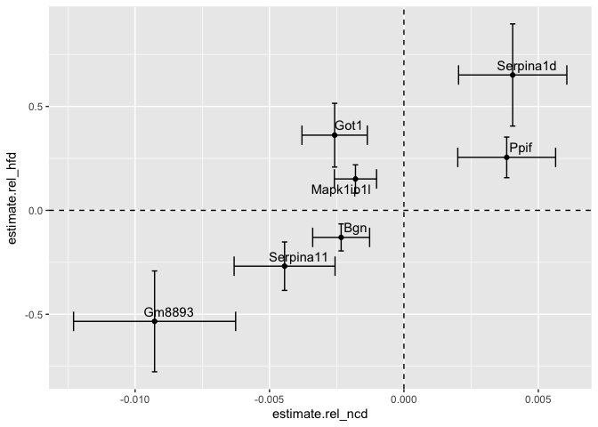<!-- -->

```r
sig.genes <- filter(combined.twas.data, p.adj_ncd<0.05|p.adj_hfd<0.05) %>% pull(symbol)
ggplot(combined.twas.data.all %>% filter(symbol %in% sig.genes), 
       aes(y=estimate.rel_hfd, x=estimate.rel_ncd,
           xmin=estimate.rel_ncd-std.error.rel_ncd,
           xmax=estimate.rel_ncd+std.error.rel_ncd,
           ymin=estimate.rel_hfd-std.error.rel_hfd,
           ymax=estimate.rel_hfd+std.error.rel_hfd )) +
  geom_point() +
  geom_errorbar() +
  geom_errorbarh() +
  geom_smooth() +
  geom_hline(yintercept = 0, lty=2) +
  geom_vline(xintercept = 0, lty=2) +
  xlim(-0.03,0.03) +
  ylim(-0.03,0.03) +
  geom_text_repel(aes(label=symbol)) +
  labs(y="On HFHS Diet (beta)",
       x="On NCD Diet (beta)",
       title="Associations of Liver Transcripts with Cholesterol",
       subtitle="Significant for at least one diet")
```

<!-- -->

```r
cutoff <- -log10(0.05)
ggplot(combined.twas.data, 
       aes(y=-log10(p.adj_hfd), x=-log10(p.adj_ncd) )) +
  geom_point() +
  #geom_errorbar() +
  #geom_errorbarh() +
  geom_hline(yintercept = -log10(0.05), lty=2) +
  geom_vline(xintercept = -log10(0.05), lty=2) +
  geom_text_repel(aes(label=symbol),
                   data = subset(combined.twas.data, -log10(p.adj_hfd) > cutoff|-log10(p.adj_ncd) > cutoff)) +
  labs(y="On HFHS Diet (log10 q-value)",
       x="On NCD Diet (log10 q-value)",
       title="Associations of Liver Transcripts with Cholesterol") +
  theme_classic() +
  theme(text=element_text(size=16))
```

<!-- -->
# Comparason with human GWAS

Downloaded human cholesterol associated alleles from https://t2d.hugeamp.org/phenotype.html?phenotype=CHOL

```{ chol-human-gwas}
gwas.filename <- 'cholesterol-associations.csv'
gwas.data <- read_csv(gwas.filename) %>%
  mutate(Symbol=gsub('.{2}$', '', nearest)) %>%
  mutate(Symbol=gsub("^.{0,2}", "",Symbol)) #removes first and last characters

library(biomaRt)
human = useMart("ensembl", dataset = "hsapiens_gene_ensembl")
mouse = useMart("ensembl", dataset = "mmusculus_gene_ensembl")

mapping.data <- getLDS(attributes = c("hgnc_symbol"), filters = "hgnc_symbol", values = gwas.data$Symbol , mart = human, attributesL = c("mgi_symbol"), martL = mouse, uniqueRows=T)

gwas.data <-
  full_join(gwas.data, mapping.data, by=c('Symbol'='HGNC.symbol')) %>%
  dplyr::filter(!(is.na(MGI.symbol)))

#are gwas alleles enriched in correlation analyses

sig.twas.data <- filter(twas.data, p.value<0.05)
#sig.twas.data$symbol %in% gwas.data$MGI.symbol %>% table

combined.twas.data %>%
  filter(symbol %in% gwas.data$MGI.symbol) %>%
  arrange(p.value) %>%
  head %>%
  kable(caption="Most significant TWAS association hits that are also nearby GWAS hits")


#checked if a TWAS was a GWAS hit
twas.data.matched <-
  combined.twas.data %>%
  mutate(hGWAS.match=symbol %in% gwas.data$MGI.symbol)

with(twas.data.matched, table(hGWAS.match,p.value<0.05)) %>% 
  fisher.test() %>% 
  tidy %>%
  kable(caption='Fisher test for enrichment of GWAS hits in liver TWAS genes')


glm(hGWAS.match~p.value, data=twas.data.matched, family='binomial') %>% 
  tidy %>% 
  kable(caption="Logistic regression of TWAS values against likilihood of a GWAS hit.")
```

# Pathway Analyses for NCD


```r
twas.list <- twas.data.ncd %>% arrange(-estimate) %>% pull(estimate)
names(twas.list) <- twas.data.ncd %>% arrange(-estimate) %>% pull(symbol)
twas.list <- sort(twas.list, decreasing = TRUE)
#twas.list <- twas.list[!(is.na(names(twas.list)))]


library(clusterProfiler)
go.twas.bp <- gseGO(geneList=twas.list, 
               ont="BP", 
               keyType='SYMBOL',
               OrgDb=org.Mm.eg.db, 
               pvalueCutoff=0.25,
               verbose=T,
               by='fgsea',
               eps=1E-25)

#enrichement
twas.data.ncd %>% 
  filter(p.value<0.05) %>%
  pull(symbol) ->
  twas.sig

go.twas.bp.enrich <- enrichGO(gene=twas.sig, 
               ont="BP", 
               keyType='SYMBOL',
               OrgDb=org.Mm.eg.db, 
               pvalueCutoff=0.05)

go.twas.bp.enrich.simpl <- simplify(go.twas.bp.enrich,
                             cutoff=0.7, 
                             by="p.adjust",
                             select_fun=min)

library(enrichplot)

dotplot(go.twas.bp.enrich.simpl, 
        showCategory=50,
        color='pvalue',
        font.size=8)
```

<!-- -->

```r
barplot(go.twas.bp.enrich.simpl,font.size=8)
```

<!-- -->

```r
cnetplot(go.twas.bp.enrich.simpl, 
         showCategory=100,
         node_label="gene",
         cex_label_gene=0.5)
```

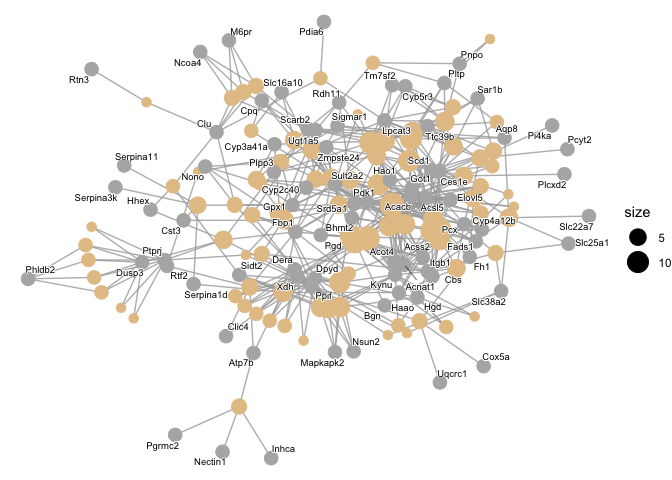<!-- -->

```r
cnetplot(go.twas.bp.enrich.simpl, 
         showCategory=100,
         node_label="category",
         cex_label_category=0.5)
```

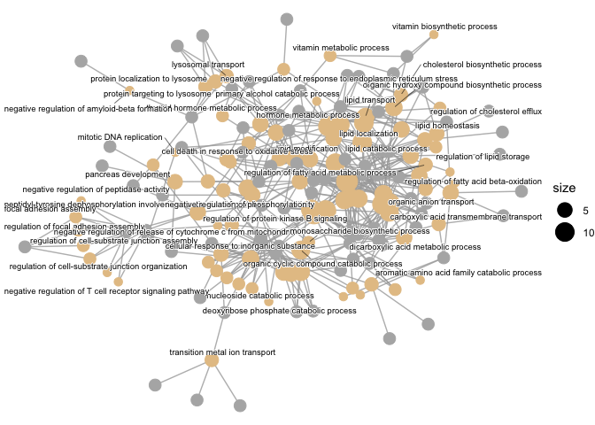<!-- -->

```r
heatplot(go.twas.bp.enrich.simpl)
```

<!-- -->

```r
library(ggupset)
upsetplot(go.twas.bp.enrich.simpl)
```

<!-- -->

```r
dotplot(go.twas.bp.enrich.simpl, showCategory=30)
```

<!-- -->

```r
heatplot(go.twas.bp.enrich.simpl, foldChange=twas.list)
```

<!-- -->

```r
upsetplot(go.twas.bp.enrich.simpl)
```

<!-- -->

```r
as.data.frame(go.twas.bp) %>% select("Description","setSize","enrichmentScore","NES","pvalue","p.adjust") %>%
  kable(caption="NCD GO BP Analysis of TWAS Associations from GSEA")
```


Table: NCD GO BP Analysis of TWAS Associations from GSEA

|Description | setSize| enrichmentScore| NES| pvalue| p.adjust|
|:-----------|-------:|---------------:|---:|------:|--------:|

```r
as.data.frame(go.twas.bp) %>%
  write_csv(file="NCD TWAS GO-BP GSEA.csv")

as.data.frame(go.twas.bp.enrich.simpl) %>% select("Description","GeneRatio","Count","pvalue","p.adjust") %>% 
  kable(caption="NCD GO BP Analysis of TWAS Associations from Enrichment")
```


Table: NCD GO BP Analysis of TWAS Associations from Enrichment

|           |Description                                                                             |GeneRatio | Count| pvalue| p.adjust|
|:----------|:---------------------------------------------------------------------------------------|:---------|-----:|------:|--------:|
|GO:0006790 |sulfur compound metabolic process                                                       |13/109    |    13|  0.000|    0.000|
|GO:0044282 |small molecule catabolic process                                                        |13/109    |    13|  0.000|    0.000|
|GO:0046394 |carboxylic acid biosynthetic process                                                    |12/109    |    12|  0.000|    0.000|
|GO:0016053 |organic acid biosynthetic process                                                       |12/109    |    12|  0.000|    0.000|
|GO:0006631 |fatty acid metabolic process                                                            |14/109    |    14|  0.000|    0.000|
|GO:0033865 |nucleoside bisphosphate metabolic process                                               |8/109     |     8|  0.000|    0.000|
|GO:0033875 |ribonucleoside bisphosphate metabolic process                                           |8/109     |     8|  0.000|    0.000|
|GO:0034032 |purine nucleoside bisphosphate metabolic process                                        |8/109     |     8|  0.000|    0.000|
|GO:0006066 |alcohol metabolic process                                                               |11/109    |    11|  0.000|    0.000|
|GO:0046395 |carboxylic acid catabolic process                                                       |9/109     |     9|  0.000|    0.000|
|GO:0019693 |ribose phosphate metabolic process                                                      |11/109    |    11|  0.000|    0.000|
|GO:0008202 |steroid metabolic process                                                               |10/109    |    10|  0.000|    0.000|
|GO:0043648 |dicarboxylic acid metabolic process                                                     |6/109     |     6|  0.000|    0.000|
|GO:0006622 |protein targeting to lysosome                                                           |4/109     |     4|  0.000|    0.000|
|GO:0062012 |regulation of small molecule metabolic process                                          |10/109    |    10|  0.000|    0.000|
|GO:0019216 |regulation of lipid metabolic process                                                   |10/109    |    10|  0.000|    0.000|
|GO:0071616 |acyl-CoA biosynthetic process                                                           |4/109     |     4|  0.000|    0.000|
|GO:0042180 |cellular ketone metabolic process                                                       |8/109     |     8|  0.000|    0.000|
|GO:0010876 |lipid localization                                                                      |10/109    |    10|  0.000|    0.000|
|GO:0009120 |deoxyribonucleoside metabolic process                                                   |3/109     |     3|  0.000|    0.001|
|GO:0061462 |protein localization to lysosome                                                        |4/109     |     4|  0.000|    0.001|
|GO:0010565 |regulation of cellular ketone metabolic process                                         |6/109     |     6|  0.000|    0.001|
|GO:1901617 |organic hydroxy compound biosynthetic process                                           |7/109     |     7|  0.000|    0.001|
|GO:0009410 |response to xenobiotic stimulus                                                         |8/109     |     8|  0.000|    0.001|
|GO:0120254 |olefinic compound metabolic process                                                     |6/109     |     6|  0.000|    0.001|
|GO:1905952 |regulation of lipid localization                                                        |6/109     |     6|  0.000|    0.002|
|GO:0006695 |cholesterol biosynthetic process                                                        |4/109     |     4|  0.000|    0.002|
|GO:0009164 |nucleoside catabolic process                                                            |3/109     |     3|  0.000|    0.003|
|GO:1901361 |organic cyclic compound catabolic process                                               |9/109     |     9|  0.000|    0.003|
|GO:0006869 |lipid transport                                                                         |8/109     |     8|  0.000|    0.004|
|GO:0006575 |cellular modified amino acid metabolic process                                          |6/109     |     6|  0.000|    0.004|
|GO:0044262 |cellular carbohydrate metabolic process                                                 |7/109     |     7|  0.000|    0.004|
|GO:0010038 |response to metal ion                                                                   |7/109     |     7|  0.000|    0.004|
|GO:0009264 |deoxyribonucleotide catabolic process                                                   |3/109     |     3|  0.000|    0.004|
|GO:0030258 |lipid modification                                                                      |6/109     |     6|  0.000|    0.005|
|GO:1901658 |glycosyl compound catabolic process                                                     |3/109     |     3|  0.000|    0.005|
|GO:0042445 |hormone metabolic process                                                               |6/109     |     6|  0.000|    0.005|
|GO:0009072 |aromatic amino acid family metabolic process                                            |3/109     |     3|  0.000|    0.006|
|GO:0042403 |thyroid hormone metabolic process                                                       |3/109     |     3|  0.000|    0.008|
|GO:0019439 |aromatic compound catabolic process                                                     |8/109     |     8|  0.000|    0.008|
|GO:0010675 |regulation of cellular carbohydrate metabolic process                                   |5/109     |     5|  0.000|    0.010|
|GO:1903573 |negative regulation of response to endoplasmic reticulum stress                         |3/109     |     3|  0.000|    0.011|
|GO:0055088 |lipid homeostasis                                                                       |5/109     |     5|  0.001|    0.013|
|GO:0010874 |regulation of cholesterol efflux                                                        |3/109     |     3|  0.001|    0.013|
|GO:2001243 |negative regulation of intrinsic apoptotic signaling pathway                            |4/109     |     4|  0.001|    0.013|
|GO:0005996 |monosaccharide metabolic process                                                        |6/109     |     6|  0.001|    0.013|
|GO:0019217 |regulation of fatty acid metabolic process                                              |4/109     |     4|  0.001|    0.013|
|GO:0036473 |cell death in response to oxidative stress                                              |4/109     |     4|  0.001|    0.013|
|GO:0071466 |cellular response to xenobiotic stimulus                                                |5/109     |     5|  0.001|    0.013|
|GO:1990264 |peptidyl-tyrosine dephosphorylation involved in inactivation of protein kinase activity |2/109     |     2|  0.001|    0.013|
|GO:0008631 |intrinsic apoptotic signaling pathway in response to oxidative stress                   |3/109     |     3|  0.001|    0.014|
|GO:0000041 |transition metal ion transport                                                          |4/109     |     4|  0.001|    0.016|
|GO:0034310 |primary alcohol catabolic process                                                       |2/109     |     2|  0.001|    0.017|
|GO:0007041 |lysosomal transport                                                                     |4/109     |     4|  0.001|    0.019|
|GO:0010883 |regulation of lipid storage                                                             |3/109     |     3|  0.001|    0.020|
|GO:0044270 |cellular nitrogen compound catabolic process                                            |7/109     |     7|  0.001|    0.021|
|GO:0046700 |heterocycle catabolic process                                                           |7/109     |     7|  0.001|    0.021|
|GO:1902969 |mitotic DNA replication                                                                 |2/109     |     2|  0.001|    0.021|
|GO:0016042 |lipid catabolic process                                                                 |6/109     |     6|  0.002|    0.025|
|GO:0008654 |phospholipid biosynthetic process                                                       |5/109     |     5|  0.002|    0.025|
|GO:0009074 |aromatic amino acid family catabolic process                                            |2/109     |     2|  0.002|    0.025|
|GO:0051893 |regulation of focal adhesion assembly                                                   |3/109     |     3|  0.002|    0.027|
|GO:0090109 |regulation of cell-substrate junction assembly                                          |3/109     |     3|  0.002|    0.027|
|GO:0071243 |cellular response to arsenic-containing substance                                       |2/109     |     2|  0.002|    0.027|
|GO:1905039 |carboxylic acid transmembrane transport                                                 |4/109     |     4|  0.002|    0.028|
|GO:0016052 |carbohydrate catabolic process                                                          |4/109     |     4|  0.002|    0.028|
|GO:0071241 |cellular response to inorganic substance                                                |5/109     |     5|  0.002|    0.030|
|GO:0007584 |response to nutrient                                                                    |3/109     |     3|  0.002|    0.030|
|GO:0015711 |organic anion transport                                                                 |6/109     |     6|  0.002|    0.031|
|GO:0150116 |regulation of cell-substrate junction organization                                      |3/109     |     3|  0.002|    0.031|
|GO:0009110 |vitamin biosynthetic process                                                            |2/109     |     2|  0.003|    0.033|
|GO:1902430 |negative regulation of amyloid-beta formation                                           |2/109     |     2|  0.003|    0.033|
|GO:0071404 |cellular response to low-density lipoprotein particle stimulus                          |2/109     |     2|  0.003|    0.038|
|GO:1901657 |glycosyl compound metabolic process                                                     |3/109     |     3|  0.003|    0.038|
|GO:0010466 |negative regulation of peptidase activity                                               |5/109     |     5|  0.003|    0.039|
|GO:0031998 |regulation of fatty acid beta-oxidation                                                 |2/109     |     2|  0.003|    0.040|
|GO:0090201 |negative regulation of release of cytochrome c from mitochondria                        |2/109     |     2|  0.003|    0.040|
|GO:0009060 |aerobic respiration                                                                     |4/109     |     4|  0.004|    0.041|
|GO:0006766 |vitamin metabolic process                                                               |3/109     |     3|  0.004|    0.044|
|GO:0050860 |negative regulation of T cell receptor signaling pathway                                |2/109     |     2|  0.004|    0.044|
|GO:0042326 |negative regulation of phosphorylation                                                  |6/109     |     6|  0.004|    0.045|
|GO:0048041 |focal adhesion assembly                                                                 |3/109     |     3|  0.004|    0.045|
|GO:0046386 |deoxyribose phosphate catabolic process                                                 |2/109     |     2|  0.004|    0.045|
|GO:0046685 |response to arsenic-containing substance                                                |2/109     |     2|  0.004|    0.045|
|GO:0051896 |regulation of protein kinase B signaling                                                |4/109     |     4|  0.005|    0.047|
|GO:0006979 |response to oxidative stress                                                            |6/109     |     6|  0.005|    0.047|
|GO:0031016 |pancreas development                                                                    |3/109     |     3|  0.005|    0.049|
|GO:0046364 |monosaccharide biosynthetic process                                                     |3/109     |     3|  0.005|    0.049|
|GO:0042059 |negative regulation of epidermal growth factor receptor signaling pathway               |2/109     |     2|  0.005|    0.049|

```r
as.data.frame(go.twas.bp.enrich.simpl) %>%
  write_csv(file="NCD TWAS GO-BP Enrichment.csv")

steroid.enrichment <- as.data.frame(go.twas.bp) %>% filter(ID=='GO:0016126')
```

# Pathway Analyses for HFD


```r
twas.list <- twas.data.hf %>% arrange(-estimate) %>% pull(estimate)
names(twas.list) <- twas.data.hf %>% arrange(-estimate) %>% pull(symbol)
twas.list <- sort(twas.list, decreasing = TRUE)
#twas.list <- twas.list[!(is.na(names(twas.list)))]


library(clusterProfiler)
go.twas.bp <- gseGO(geneList=twas.list, 
               ont="BP", 
               keyType='SYMBOL',
               OrgDb=org.Mm.eg.db, 
               pvalueCutoff=0.25,
               verbose=T,
               by='fgsea',
               eps=1E-25)

#enrichement
twas.data.hf %>% 
  filter(p.value<0.05) %>%
  pull(symbol) ->
  twas.sig

go.twas.bp.enrich <- enrichGO(gene=twas.sig, 
               ont="BP", 
               keyType='SYMBOL',
               OrgDb=org.Mm.eg.db, 
               pvalueCutoff=0.05)

go.twas.bp.enrich.simpl <- simplify(go.twas.bp.enrich,
                             cutoff=0.7, 
                             by="p.adjust",
                             select_fun=min)

library(enrichplot)

dotplot(go.twas.bp.enrich.simpl, 
        showCategory=50,
        color='pvalue',
        font.size=8)
```

<!-- -->

```r
barplot(go.twas.bp.enrich.simpl,font.size=8)
```

<!-- -->

```r
cnetplot(go.twas.bp.enrich.simpl, 
         showCategory=100,
         node_label="gene",
         cex_label_gene=0.5)
```

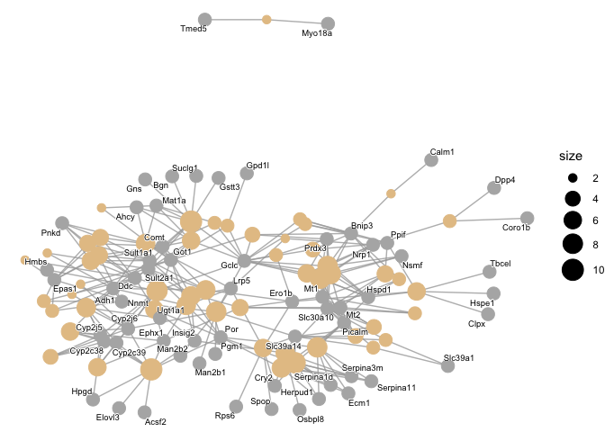<!-- -->

```r
cnetplot(go.twas.bp.enrich.simpl, 
         showCategory=100,
         node_label="category",
         cex_label_category=0.5)
```

<!-- -->

```r
heatplot(go.twas.bp.enrich.simpl)
```

<!-- -->

```r
library(ggupset)
upsetplot(go.twas.bp.enrich.simpl)
```

<!-- -->

```r
dotplot(go.twas.bp.enrich.simpl, showCategory=30)
```

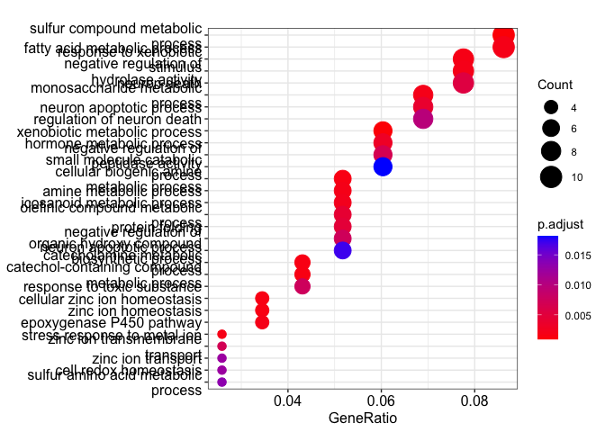<!-- -->

```r
heatplot(go.twas.bp.enrich.simpl, foldChange=twas.list)
```

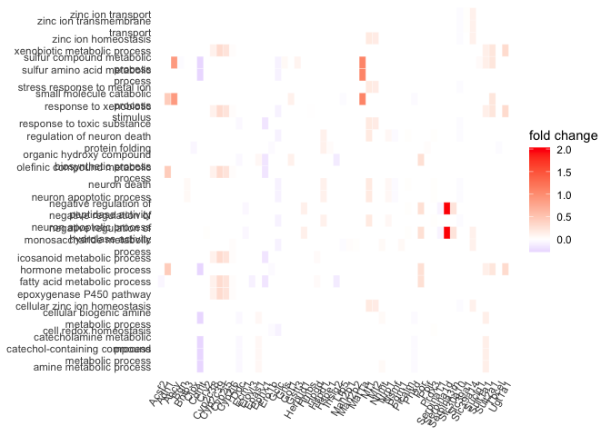<!-- -->

```r
upsetplot(go.twas.bp.enrich.simpl)
```

<!-- -->

```r
as.data.frame(go.twas.bp) %>% dplyr::select("Description","setSize","enrichmentScore","NES","pvalue","p.adjust") %>%
  kable(caption="HFD GO BP Analysis of TWAS Associations from GSEA")
```


Table: HFD GO BP Analysis of TWAS Associations from GSEA

|           |Description            | setSize| enrichmentScore|  NES| pvalue| p.adjust|
|:----------|:----------------------|-------:|---------------:|----:|------:|--------:|
|GO:0051640 |organelle localization |     113|           0.959| 1.77|      0|        0|

```r
as.data.frame(go.twas.bp) %>%
  write_csv(file="HFD TWAS GO-BP GSEA.csv")

as.data.frame(go.twas.bp.enrich.simpl) %>% dplyr::select("Description","GeneRatio","Count","pvalue","p.adjust") %>% 
  kable(caption="HFD GO BP Analysis of TWAS Associations from Enrichment")
```


Table: HFD GO BP Analysis of TWAS Associations from Enrichment

|           |Description                                                                     |GeneRatio | Count| pvalue| p.adjust|
|:----------|:-------------------------------------------------------------------------------|:---------|-----:|------:|--------:|
|GO:0006805 |xenobiotic metabolic process                                                    |7/116     |     7|  0.000|    0.001|
|GO:0006790 |sulfur compound metabolic process                                               |10/116    |    10|  0.000|    0.001|
|GO:0006882 |cellular zinc ion homeostasis                                                   |4/116     |     4|  0.000|    0.002|
|GO:0006576 |cellular biogenic amine metabolic process                                       |6/116     |     6|  0.000|    0.002|
|GO:0006584 |catecholamine metabolic process                                                 |5/116     |     5|  0.000|    0.002|
|GO:0009712 |catechol-containing compound metabolic process                                  |5/116     |     5|  0.000|    0.002|
|GO:0055069 |zinc ion homeostasis                                                            |4/116     |     4|  0.000|    0.002|
|GO:0009410 |response to xenobiotic stimulus                                                 |9/116     |     9|  0.000|    0.002|
|GO:0097501 |stress response to metal ion                                                    |3/116     |     3|  0.000|    0.002|
|GO:0009308 |amine metabolic process                                                         |6/116     |     6|  0.000|    0.002|
|GO:0019373 |epoxygenase P450 pathway                                                        |4/116     |     4|  0.000|    0.002|
|GO:0006631 |fatty acid metabolic process                                                    |10/116    |    10|  0.000|    0.002|
|GO:0005996 |monosaccharide metabolic process                                                |8/116     |     8|  0.000|    0.002|
|GO:0051346 |negative regulation of hydrolase activity                                       |9/116     |     9|  0.000|    0.002|
|GO:0006690 |icosanoid metabolic process                                                     |6/116     |     6|  0.000|    0.002|
|GO:0042445 |hormone metabolic process                                                       |7/116     |     7|  0.000|    0.003|
|GO:0051402 |neuron apoptotic process                                                        |8/116     |     8|  0.000|    0.004|
|GO:0120254 |olefinic compound metabolic process                                             |6/116     |     6|  0.000|    0.004|
|GO:0006457 |protein folding                                                                 |6/116     |     6|  0.000|    0.005|
|GO:0070997 |neuron death                                                                    |9/116     |     9|  0.000|    0.005|
|GO:0010466 |negative regulation of peptidase activity                                       |7/116     |     7|  0.000|    0.007|
|GO:0071577 |zinc ion transmembrane transport                                                |3/116     |     3|  0.000|    0.007|
|GO:0043524 |negative regulation of neuron apoptotic process                                 |6/116     |     6|  0.000|    0.007|
|GO:0009636 |response to toxic substance                                                     |5/116     |     5|  0.000|    0.008|
|GO:1901214 |regulation of neuron death                                                      |8/116     |     8|  0.000|    0.010|
|GO:0006829 |zinc ion transport                                                              |3/116     |     3|  0.000|    0.012|
|GO:0045454 |cell redox homeostasis                                                          |3/116     |     3|  0.000|    0.012|
|GO:0000096 |sulfur amino acid metabolic process                                             |3/116     |     3|  0.000|    0.013|
|GO:1901617 |organic hydroxy compound biosynthetic process                                   |6/116     |     6|  0.000|    0.017|
|GO:0044282 |small molecule catabolic process                                                |7/116     |     7|  0.000|    0.018|
|GO:0051881 |regulation of mitochondrial membrane potential                                  |4/116     |     4|  0.000|    0.018|
|GO:0052547 |regulation of peptidase activity                                                |8/116     |     8|  0.000|    0.018|
|GO:0008202 |steroid metabolic process                                                       |7/116     |     7|  0.000|    0.018|
|GO:1902686 |mitochondrial outer membrane permeabilization involved in programmed cell death |3/116     |     3|  0.000|    0.019|
|GO:0006066 |alcohol metabolic process                                                       |7/116     |     7|  0.001|    0.020|
|GO:0071248 |cellular response to metal ion                                                  |5/116     |     5|  0.001|    0.023|
|GO:0043434 |response to peptide hormone                                                     |7/116     |     7|  0.001|    0.023|
|GO:0006520 |cellular amino acid metabolic process                                           |6/116     |     6|  0.001|    0.023|
|GO:0009309 |amine biosynthetic process                                                      |3/116     |     3|  0.001|    0.023|
|GO:0042401 |cellular biogenic amine biosynthetic process                                    |3/116     |     3|  0.001|    0.023|
|GO:0006068 |ethanol catabolic process                                                       |2/116     |     2|  0.001|    0.027|
|GO:0061299 |retina vasculature morphogenesis in camera-type eye                             |2/116     |     2|  0.001|    0.027|
|GO:0009068 |aspartate family amino acid catabolic process                                   |2/116     |     2|  0.001|    0.031|
|GO:0090161 |Golgi ribbon formation                                                          |2/116     |     2|  0.001|    0.031|
|GO:0003254 |regulation of membrane depolarization                                           |3/116     |     3|  0.001|    0.031|
|GO:0042593 |glucose homeostasis                                                             |6/116     |     6|  0.001|    0.034|
|GO:0008637 |apoptotic mitochondrial changes                                                 |4/116     |     4|  0.001|    0.037|
|GO:0010823 |negative regulation of mitochondrion organization                               |3/116     |     3|  0.001|    0.037|
|GO:2000378 |negative regulation of reactive oxygen species metabolic process                |3/116     |     3|  0.001|    0.037|
|GO:0048102 |autophagic cell death                                                           |2/116     |     2|  0.002|    0.041|
|GO:0050922 |negative regulation of chemotaxis                                               |3/116     |     3|  0.002|    0.044|
|GO:0042416 |dopamine biosynthetic process                                                   |2/116     |     2|  0.002|    0.044|
|GO:0010713 |negative regulation of collagen metabolic process                               |2/116     |     2|  0.002|    0.048|
|GO:0032966 |negative regulation of collagen biosynthetic process                            |2/116     |     2|  0.002|    0.048|

```r
as.data.frame(go.twas.bp.enrich.simpl) %>%
  write_csv(file="HFD TWAS GO-BP Enrichment.csv")

steroid.enrichment <- as.data.frame(go.twas.bp) %>% filter(ID=='GO:0016126')
```

# Specific Associations

Fbp1 was one of the most highly associated results on NCD.


```r
gene <- 'Fbp1'
gene.ens <- filter(twas.data.ncd, symbol==gene) %>% pull(ENSEMBL.ID)
library(ggplot2)

expression.data %>%
  filter(ENSEMBL.ID == gene.ens) %>%
  pivot_longer(cols=c(starts_with('F'),
                      starts_with('M')),
               names_to='mouse.id',
               values_to='expression') %>%
  full_join(phenotype.data,by='mouse.id') %>%
  filter(!is.na(diet)) %>%
  ggplot(aes(y=chol2,expression,col=sex)) +
  geom_point() +
  geom_smooth(method='lm',se=F) +
  facet_grid(~diet) +
  labs(y="Cholesterol (mg/dL)",
       x=paste('Expression of ', gene, sep=""))
```

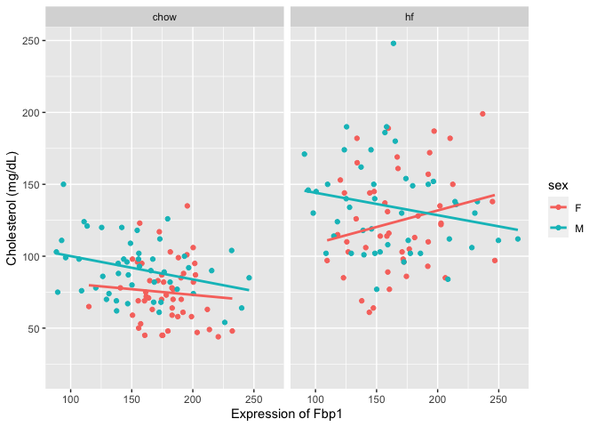<!-- -->

```r
expression.data %>%
  filter(ENSEMBL.ID == gene.ens) %>%
  pivot_longer(cols=c(starts_with('F'),
                      starts_with('M')),
               names_to='mouse.id',
               values_to='expression') %>%
  full_join(phenotype.data,by='mouse.id') %>%
  filter(!is.na(diet)) %>%
  filter(diet=='chow') %>%
  ggplot(aes(y=chol2,expression,col=sex)) +
  geom_point() +
  geom_smooth(method='lm',se=F) +
  facet_grid(~diet) +
  labs(y="Cholesterol (mg/dL)",
       x=paste('Expression of ', gene, sep=""))
```

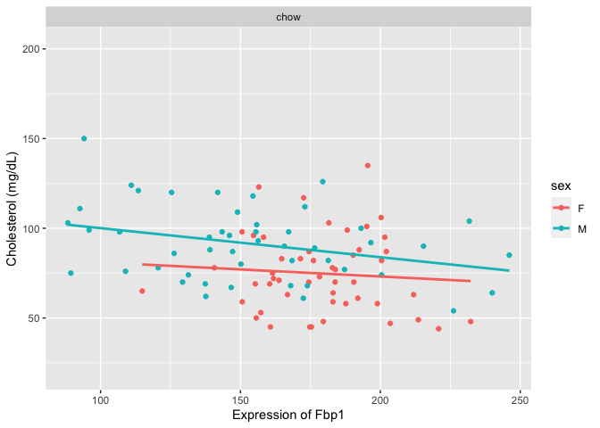<!-- -->

```r
expression.data %>%
  filter(ENSEMBL.ID == gene.ens) %>%
  pivot_longer(cols=c(starts_with('F'),
                      starts_with('M')),
               names_to='mouse.id',
               values_to='expression') %>%
  full_join(phenotype.data,by='mouse.id') %>%
  filter(!is.na(diet)) %>%
  filter(diet=='chow') -> fbp1.chow.data

lm(data=fbp1.chow.data, chol2 ~ expression + sex) %>%
  glance
```

```
## # A tibble: 1  12
##   r.squ adj.r sigma stati p.value    df logLik   AIC   BIC devia df.re
##     <dbl>   <dbl> <dbl>   <dbl>   <dbl> <dbl>  <dbl> <dbl> <dbl>   <dbl>   <int>
## 1   0.176   0.159  20.6    10.2 9.96e-5     2  -434.  876.  886.  40231.      95
## #  with 1 more variable: nobs <int>, and abbreviated variable names
## #   r.squared, adj.r.squared, statistic, deviance, df.residual
```

```r
expression.data %>%
  filter(ENSEMBL.ID == gene) %>%
  pivot_longer(cols=c(starts_with('F'),
                      starts_with('M')),
               names_to='mouse.id',
               values_to='expression') %>%
  full_join(phenotype.data,by='mouse.id') %>%
  filter(!is.na(diet)) -> fbp.hf.data
```

## Bile Acid Metabolism

CYP7A1 is the rate limiting step for de novo *bile acid* biosynthesis


```r
gene <- 'Cyp7a1'
gene.ens <- filter(twas.data.ncd, symbol==gene) %>% pull(ENSEMBL.ID)

expression.data %>%
  filter(ENSEMBL.ID == gene.ens) %>%
  pivot_longer(cols=c(starts_with('F'),
                      starts_with('M')),
               names_to='mouse.id',
               values_to='expression') %>%
  full_join(phenotype.data,by='mouse.id') %>%
  filter(!is.na(diet)) %>%
  ggplot(aes(y=chol2,expression,col=sex)) +
  geom_point() +
  geom_smooth(method='lm',se=F) +
  facet_grid(~diet) +
  labs(y="Cholesterol (mg/dL)",
       x=paste('Expression of ', gene, sep=""))
```

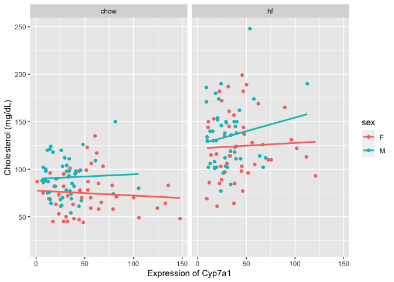<!-- -->

```r
expression.data %>%
  filter(ENSEMBL.ID == gene.ens) %>%
  pivot_longer(cols=c(starts_with('F'),
                      starts_with('M')),
               names_to='mouse.id',
               values_to='expression') %>%
  full_join(phenotype.data,by='mouse.id') %>%
  filter(!is.na(diet)) %>%
  filter(diet=='chow') -> gene.chow.data


lm(data=gene.chow.data, chol2 ~ expression + sex) %>%
  tidy %>%
  kable(caption="Summary associations of Cyp7a1 and cholesterol on chow")
```


Table: Summary associations of Cyp7a1 and cholesterol on chow

|term        | estimate| std.error| statistic| p.value|
|:-----------|--------:|---------:|---------:|-------:|
|(Intercept) |   76.191|     4.881|    15.611|   0.000|
|expression  |   -0.027|     0.076|    -0.355|   0.724|
|sexM        |   15.954|     4.518|     3.531|   0.001|

```r
expression.data %>%
  filter(ENSEMBL.ID == gene.ens) %>%
  pivot_longer(cols=c(starts_with('F'),
                      starts_with('M')),
               names_to='mouse.id',
               values_to='expression') %>%
  full_join(phenotype.data,by='mouse.id') %>%
  filter(!is.na(diet)) -> gene.hf.data

lm(data=gene.hf.data, chol2 ~ expression + sex) %>%
  tidy %>%
  kable(caption="Summary associations of Cyp7a1 and cholesterol on HFD")
```


Table: Summary associations of Cyp7a1 and cholesterol on HFD

|term        | estimate| std.error| statistic| p.value|
|:-----------|--------:|---------:|---------:|-------:|
|(Intercept) |  100.060|     6.108|    16.381|   0.000|
|expression  |   -0.026|     0.103|    -0.255|   0.799|
|sexM        |   13.262|     5.565|     2.383|   0.018|

```r
lm(data=bind_rows(gene.chow.data, gene.hf.data), chol2 ~ expression + sex + diet) %>%
  tidy %>%
  kable(caption="Summary associations of Cyp7a1 and cholesterol", digits =c(0,3,3,2,99))
```


Table: Summary associations of Cyp7a1 and cholesterol

|term        | estimate| std.error| statistic|  p.value|
|:-----------|--------:|---------:|---------:|--------:|
|(Intercept) |    75.30|     3.715|     20.27| 3.53e-57|
|expression  |     0.01|     0.058|      0.18| 8.60e-01|
|sexM        |    14.67|     3.219|      4.56| 7.71e-06|
|diethf      |    46.51|     3.278|     14.19| 6.34e-35|

```r
lm(data=bind_rows(gene.chow.data, gene.hf.data), chol2 ~ expression + sex * diet) %>%
  tidy %>%
  kable(caption="Summary associations of Cyp7a1 and cholesterol", digits =c(0,3,3,2,99))
```


Table: Summary associations of Cyp7a1 and cholesterol

|term        | estimate| std.error| statistic|  p.value|
|:-----------|--------:|---------:|---------:|--------:|
|(Intercept) |   74.114|     3.913|     18.94| 2.70e-52|
|expression  |    0.014|     0.058|      0.24| 8.09e-01|
|sexM        |   16.770|     3.888|      4.31| 2.22e-05|
|diethf      |   49.643|     4.616|     10.76| 7.40e-23|
|sexM:diethf |   -6.331|     6.561|     -0.96| 3.35e-01|

```r
expression.data %>%
  filter(ENSEMBL.ID == gene.ens) %>%
  pivot_longer(cols=c(starts_with('F'),
                      starts_with('M')),
               names_to='mouse.id',
               values_to='expression') %>%
  full_join(select(phenotype.data, mouse.id,diet,sex),by='mouse.id') %>% 
  group_by(diet,sex) %>%
  summarize(mean=mean(expression,na.rm=T),
            se=se(expression)) %>%
  ggplot(aes(y=mean,
             ymin=mean-se,
             ymax=mean+se,
             x=sex,
             fill=diet)) +
  geom_bar(stat='identity', position=position_dodge()) +
  geom_errorbar(position=position_dodge(width=0.9),width=0.5) +
  labs(y="Relative Expression",
       title="Cyp7a1")
```

<!-- -->


```r
gene <- 'Cyp27a1'
gene.ens <- filter(twas.data.ncd, symbol==gene) %>% pull(ENSEMBL.ID)

expression.data %>%
  filter(ENSEMBL.ID == gene.ens) %>%
  pivot_longer(cols=c(starts_with('F'),
                      starts_with('M')),
               names_to='mouse.id',
               values_to='expression') %>%
  full_join(phenotype.data,by='mouse.id') %>%
  filter(!is.na(diet)) %>%
  ggplot(aes(y=chol2,expression,col=sex)) +
  geom_point() +
  geom_smooth(method='lm',se=F) +
  facet_grid(~diet) +
  labs(y="Cholesterol (mg/dL)",
       x=paste('Expression of ', gene, sep=""))
```

<!-- -->

```r
expression.data %>%
  filter(ENSEMBL.ID == gene.ens) %>%
  pivot_longer(cols=c(starts_with('F'),
                      starts_with('M')),
               names_to='mouse.id',
               values_to='expression') %>%
  full_join(phenotype.data,by='mouse.id') %>%
  filter(!is.na(diet)) %>%
  filter(diet=='chow') -> gene.chow.data


lm(data=gene.chow.data, chol2 ~ expression + sex) %>%
  tidy %>%
  kable(caption="Summary associations of Cyp27a1 and cholesterol on chow")
```


Table: Summary associations of Cyp27a1 and cholesterol on chow

|term        | estimate| std.error| statistic| p.value|
|:-----------|--------:|---------:|---------:|-------:|
|(Intercept) |   71.576|     9.706|     7.375|   0.000|
|expression  |    0.048|     0.137|     0.351|   0.726|
|sexM        |   15.130|     5.758|     2.628|   0.010|

```r
expression.data %>%
  filter(ENSEMBL.ID == gene.ens) %>%
  pivot_longer(cols=c(starts_with('F'),
                      starts_with('M')),
               names_to='mouse.id',
               values_to='expression') %>%
  full_join(phenotype.data,by='mouse.id') %>%
  filter(!is.na(diet)) -> gene.hf.data

lm(data=gene.hf.data, chol2 ~ expression + sex) %>%
  tidy %>%
  kable(caption="Summary associations of Cyp27a1 and cholesterol on HFD")
```


Table: Summary associations of Cyp27a1 and cholesterol on HFD

|term        | estimate| std.error| statistic| p.value|
|:-----------|--------:|---------:|---------:|-------:|
|(Intercept) |  135.127|     8.841|     15.28|       0|
|expression  |   -0.601|     0.134|     -4.48|       0|
|sexM        |   28.368|     6.019|      4.71|       0|

```r
lm(data=bind_rows(gene.chow.data, gene.hf.data), chol2 ~ expression + sex + diet) %>%
  tidy %>%
  kable(caption="Summary associations of Cyp27a1 and cholesterol", digits =c(0,3,3,2,99))
```


Table: Summary associations of Cyp27a1 and cholesterol

|term        | estimate| std.error| statistic|  p.value|
|:-----------|--------:|---------:|---------:|--------:|
|(Intercept) |   73.410|     6.975|     10.53| 4.21e-22|
|expression  |    0.035|     0.095|      0.36| 7.15e-01|
|sexM        |   13.593|     3.923|      3.47| 6.11e-04|
|diethf      |   47.129|     3.734|     12.62| 2.57e-29|

```r
lm(data=bind_rows(gene.chow.data, gene.hf.data), chol2 ~ expression + sex * diet) %>%
  tidy %>%
  kable(caption="Summary associations of Cyp27a1 and cholesterol", digits =c(0,3,3,2,99))
```


Table: Summary associations of Cyp27a1 and cholesterol

|term        | estimate| std.error| statistic|  p.value|
|:-----------|--------:|---------:|---------:|--------:|
|(Intercept) |   73.160|     6.982|     10.48| 6.17e-22|
|expression  |    0.025|     0.096|      0.26| 7.98e-01|
|sexM        |   15.796|     4.604|      3.43| 6.91e-04|
|diethf      |   49.909|     4.815|     10.37| 1.46e-21|
|sexM:diethf |   -6.028|     6.591|     -0.91| 3.61e-01|

```r
expression.data %>%
  filter(ENSEMBL.ID == gene.ens) %>%
  pivot_longer(cols=c(starts_with('F'),
                      starts_with('M')),
               names_to='mouse.id',
               values_to='expression') %>%
  full_join(select(phenotype.data, mouse.id,diet,sex),by='mouse.id') %>% 
  group_by(diet,sex) %>%
  summarize(mean=mean(expression,na.rm=T),
            se=se(expression)) %>%
  ggplot(aes(y=mean,
             ymin=mean-se,
             ymax=mean+se,
             x=sex,
             fill=diet)) +
  geom_bar(stat='identity', position=position_dodge()) +
  geom_errorbar(position=position_dodge(width=0.9),width=0.5) +
  labs(y="Relative Expression",
       title="Cyp27a1")
```

<!-- -->


## SCD1

SCD1 is the gene with the biggest effect size on NCD


```r
gene <- 'Scd1'
gene.ens <- filter(twas.data.ncd, symbol==gene) %>% pull(ENSEMBL.ID)

expression.data %>%
  filter(ENSEMBL.ID == gene.ens) %>%
  pivot_longer(cols=c(starts_with('F'),
                      starts_with('M')),
               names_to='mouse.id',
               values_to='expression') %>%
  full_join(phenotype.data,by='mouse.id') %>%
  filter(!is.na(diet)) %>%
  ggplot(aes(y=chol2,expression,col=sex)) +
  geom_point() +
  geom_smooth(method='lm',se=F) +
  facet_grid(~diet) +
  labs(y="Cholesterol (mg/dL)",
       x=paste('Expression of ', gene, sep=""))
```

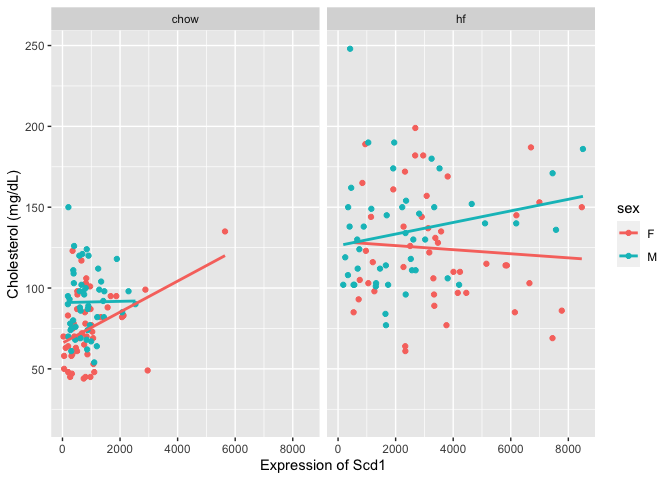<!-- -->

```r
expression.data %>%
  filter(ENSEMBL.ID == gene.ens) %>%
  pivot_longer(cols=c(starts_with('F'),
                      starts_with('M')),
               names_to='mouse.id',
               values_to='expression') %>%
  full_join(phenotype.data,by='mouse.id') %>%
  filter(!is.na(diet)) %>%
  filter(diet=='chow') -> gene.chow.data

lm(data=gene.chow.data, chol2 ~ expression + sex) %>%
  tidy %>%
  kable(caption="Summary associations of Scd1 and cholesterol on chow")
```


Table: Summary associations of Scd1 and cholesterol on chow

|term        | estimate| std.error| statistic| p.value|
|:-----------|--------:|---------:|---------:|-------:|
|(Intercept) |   68.093|     3.775|     18.04|   0.000|
|expression  |    0.007|     0.003|      2.74|   0.007|
|sexM        |   17.118|     4.105|      4.17|   0.000|

```r
library(MASS)
rlm(data=gene.chow.data, chol2 ~ expression + sex) %>%
  tidy %>%
  kable(caption="Summary associations of Scd1 and cholesterol on chow, using robust linear models")
```


Table: Summary associations of Scd1 and cholesterol on chow, using robust linear models

|term        | estimate| std.error| statistic|
|:-----------|--------:|---------:|---------:|
|(Intercept) |   65.735|     3.908|     16.82|
|expression  |    0.009|     0.003|      3.30|
|sexM        |   16.623|     4.250|      3.91|

```r
expression.data %>%
  filter(ENSEMBL.ID == gene.ens) %>%
  pivot_longer(cols=c(starts_with('F'),
                      starts_with('M')),
               names_to='mouse.id',
               values_to='expression') %>%
  full_join(phenotype.data,by='mouse.id') %>%
  filter(!is.na(diet)) -> gene.hf.data

lm(data=gene.hf.data, chol2 ~ expression + sex) %>%
  tidy %>%
  kable(caption="Summary associations of Scd1 and cholesterol on HFD")
```


Table: Summary associations of Scd1 and cholesterol on HFD

|term        | estimate| std.error| statistic| p.value|
|:-----------|--------:|---------:|---------:|-------:|
|(Intercept) |   80.778|     4.398|     18.37|       0|
|expression  |    0.008|     0.001|      6.40|       0|
|sexM        |   18.589|     4.874|      3.81|       0|


## Serpina3k

Serpina3k is the gene with the biggest inverse effect size on NCD


```r
gene <- 'Serpina3k'
gene.ens <- filter(twas.data.ncd, symbol==gene) %>% pull(ENSEMBL.ID)

expression.data %>%
  filter(ENSEMBL.ID == gene.ens) %>%
  pivot_longer(cols=c(starts_with('F'),
                      starts_with('M')),
               names_to='mouse.id',
               values_to='expression') %>%
  full_join(phenotype.data,by='mouse.id') %>%
  filter(!is.na(diet)) %>%
  ggplot(aes(y=chol2,expression,col=sex)) +
  geom_point() +
  geom_smooth(method='lm',se=F) +
  facet_grid(~diet) +
  labs(y="Cholesterol (mg/dL)",
       x=paste('Expression of ', gene, sep=""))
```

<!-- -->

```r
expression.data %>%
  filter(ENSEMBL.ID == gene.ens) %>%
  pivot_longer(cols=c(starts_with('F'),
                      starts_with('M')),
               names_to='mouse.id',
               values_to='expression') %>%
  full_join(phenotype.data,by='mouse.id') %>%
  filter(!is.na(diet)) %>%
  filter(diet=='chow') -> gene.chow.data

lm(data=gene.chow.data, chol2 ~ expression + sex) %>%
  tidy %>%
  kable(caption="Summary associations of Serpina3k and cholesterol on chow")
```


Table: Summary associations of Serpina3k and cholesterol on chow

|term        | estimate| std.error| statistic| p.value|
|:-----------|--------:|---------:|---------:|-------:|
|(Intercept) |   82.390|     4.331|     19.02|   0.000|
|expression  |   -0.007|     0.003|     -2.35|   0.021|
|sexM        |   30.226|     7.160|      4.22|   0.000|

```r
library(MASS)
rlm(data=gene.chow.data, chol2 ~ expression + sex) %>%
  tidy %>%
  kable(caption="Summary associations of Serpina3k and cholesterol on chow, using robust linear models")
```


Table: Summary associations of Serpina3k and cholesterol on chow, using robust linear models

|term        | estimate| std.error| statistic|
|:-----------|--------:|---------:|---------:|
|(Intercept) |   81.991|     4.226|     19.40|
|expression  |   -0.008|     0.003|     -2.74|
|sexM        |   32.690|     6.985|      4.68|

```r
expression.data %>%
  filter(ENSEMBL.ID == gene.ens) %>%
  pivot_longer(cols=c(starts_with('F'),
                      starts_with('M')),
               names_to='mouse.id',
               values_to='expression') %>%
  full_join(phenotype.data,by='mouse.id') %>%
  filter(!is.na(diet)) -> gene.hf.data

lm(data=gene.hf.data, chol2 ~ expression + sex) %>%
  tidy %>%
  kable(caption="Summary associations of Serpina3k and cholesterol on HFD")
```


Table: Summary associations of Serpina3k and cholesterol on HFD

|term        | estimate| std.error| statistic| p.value|
|:-----------|--------:|---------:|---------:|-------:|
|(Intercept) |  111.314|     4.516|     24.65|       0|
|expression  |   -0.014|     0.003|     -4.46|       0|
|sexM        |   38.748|     7.554|      5.13|       0|

## Ugt1a5

Ugt1a5 is the gene with the most significant effect on ncd


```r
gene <- 'Ugt1a5'
gene.ens <- filter(twas.data.ncd, symbol==gene) %>% pull(ENSEMBL.ID)

expression.data %>%
  filter(ENSEMBL.ID == gene.ens) %>%
  pivot_longer(cols=c(starts_with('F'),
                      starts_with('M')),
               names_to='mouse.id',
               values_to='expression') %>%
  full_join(phenotype.data,by='mouse.id') %>%
  filter(!is.na(diet)) %>%
  ggplot(aes(y=chol2,expression,col=sex)) +
  geom_point() +
  geom_smooth(method='lm',se=F) +
  facet_grid(~diet) +
  labs(y="Cholesterol (mg/dL)",
       x=paste('Expression of ', gene, sep=""))
```

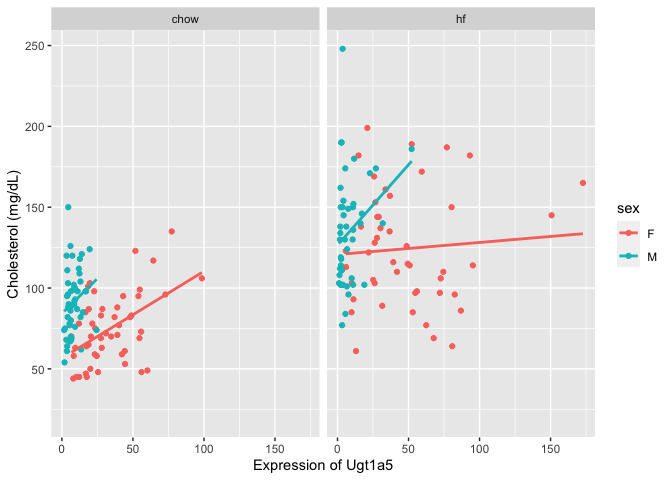<!-- -->

```r
expression.data %>%
  filter(ENSEMBL.ID == gene.ens) %>%
  pivot_longer(cols=c(starts_with('F'),
                      starts_with('M')),
               names_to='mouse.id',
               values_to='expression') %>%
  full_join(phenotype.data,by='mouse.id') %>%
  filter(!is.na(diet)) %>%
  filter(diet=='chow') -> gene.chow.data

lm(data=gene.chow.data, chol2 ~ expression + sex) %>%
  tidy %>%
  kable(caption="Summary associations of Ugt1a5 and cholesterol on chow")
```


Table: Summary associations of Ugt1a5 and cholesterol on chow

|term        | estimate| std.error| statistic| p.value|
|:-----------|--------:|---------:|---------:|-------:|
|(Intercept) |   55.979|     5.277|     10.61|       0|
|expression  |    0.556|     0.133|      4.18|       0|
|sexM        |   30.772|     5.197|      5.92|       0|

```r
library(MASS)
rlm(data=gene.chow.data, chol2 ~ expression + sex) %>%
  tidy %>%
  kable(caption="Summary associations of Ugt1a5 and cholesterol on chow, using robust linear models")
```


Table: Summary associations of Ugt1a5 and cholesterol on chow, using robust linear models

|term        | estimate| std.error| statistic|
|:-----------|--------:|---------:|---------:|
|(Intercept) |   54.556|     5.512|      9.90|
|expression  |    0.586|     0.139|      4.22|
|sexM        |   30.864|     5.428|      5.69|

```r
expression.data %>%
  filter(ENSEMBL.ID == gene.ens) %>%
  pivot_longer(cols=c(starts_with('F'),
                      starts_with('M')),
               names_to='mouse.id',
               values_to='expression') %>%
  full_join(phenotype.data,by='mouse.id') %>%
  filter(!is.na(diet)) -> gene.hf.data

lm(data=gene.hf.data, chol2 ~ expression + sex) %>%
  tidy %>%
  kable(caption="Summary associations of Ugt1a5 and cholesterol on HFD")
```


Table: Summary associations of Ugt1a5 and cholesterol on HFD

|term        | estimate| std.error| statistic| p.value|
|:-----------|--------:|---------:|---------:|-------:|
|(Intercept) |   80.915|      6.12|     13.22|       0|
|expression  |    0.436|      0.12|      3.62|       0|
|sexM        |   28.021|      6.49|      4.32|       0|

## Lasp1

Lasp1 is the gene with the most significant effect on HFD


```r
gene <- 'Lasp1'
gene.ens <- filter(twas.data.ncd, symbol==gene) %>% pull(ENSEMBL.ID)

expression.data %>%
  filter(ENSEMBL.ID == gene.ens) %>%
  pivot_longer(cols=c(starts_with('F'),
                      starts_with('M')),
               names_to='mouse.id',
               values_to='expression') %>%
  full_join(phenotype.data,by='mouse.id') %>%
  filter(!is.na(diet)) %>%
  ggplot(aes(y=chol2,expression,col=sex)) +
  geom_point() +
  geom_smooth(method='lm',se=F) +
  facet_grid(~diet) +
  labs(y="Cholesterol (mg/dL)",
       x=paste('Expression of ', gene, sep=""))
```

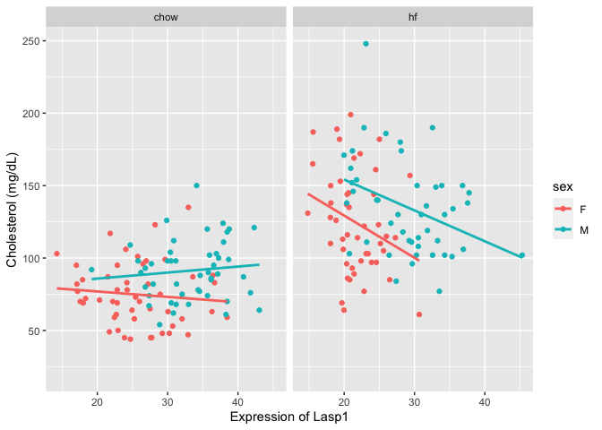<!-- -->

```r
expression.data %>%
  filter(ENSEMBL.ID == gene.ens) %>%
  pivot_longer(cols=c(starts_with('F'),
                      starts_with('M')),
               names_to='mouse.id',
               values_to='expression') %>%
  full_join(phenotype.data,by='mouse.id') %>%
  filter(!is.na(diet)) %>%
  filter(diet=='chow') -> gene.chow.data

lm(data=gene.chow.data, chol2 ~ expression + sex) %>%
  tidy %>%
  kable(caption="Summary associations of Lasp1 and cholesterol on chow")
```


Table: Summary associations of Lasp1 and cholesterol on chow

|term        | estimate| std.error| statistic| p.value|
|:-----------|--------:|---------:|---------:|-------:|
|(Intercept) |   75.387|    10.515|     7.170|   0.000|
|expression  |   -0.022|     0.394|    -0.056|   0.955|
|sexM        |   16.663|     5.225|     3.189|   0.002|

```r
library(MASS)
rlm(data=gene.chow.data, chol2 ~ expression + sex) %>%
  tidy %>%
  kable(caption="Summary associations of Lasp1 and cholesterol on chow, using robust linear models")
```


Table: Summary associations of Lasp1 and cholesterol on chow, using robust linear models

|term        | estimate| std.error| statistic|
|:-----------|--------:|---------:|---------:|
|(Intercept) |   77.547|    11.157|     6.951|
|expression  |   -0.167|     0.418|    -0.399|
|sexM        |   18.260|     5.544|     3.294|

```r
expression.data %>%
  filter(ENSEMBL.ID == gene.ens) %>%
  pivot_longer(cols=c(starts_with('F'),
                      starts_with('M')),
               names_to='mouse.id',
               values_to='expression') %>%
  full_join(phenotype.data,by='mouse.id') %>%
  filter(!is.na(diet)) -> gene.hf.data

lm(data=gene.hf.data, chol2 ~ expression + sex) %>%
  tidy %>%
  kable(caption="Summary associations of Lasp1 and cholesterol on HFD")
```


Table: Summary associations of Lasp1 and cholesterol on HFD

|term        | estimate| std.error| statistic| p.value|
|:-----------|--------:|---------:|---------:|-------:|
|(Intercept) |   156.11|    11.333|     13.78|       0|
|expression  |    -2.42|     0.455|     -5.31|       0|
|sexM        |    31.96|     6.032|      5.30|       0|

# Session Information


```r
sessionInfo()
```

```
## R version 4.2.2 (2022-10-31)
## Platform: x86_64-apple-darwin17.0 (64-bit)
## Running under: macOS Big Sur ... 10.16
## 
## Matrix products: default
## BLAS:   /Library/Frameworks/R.framework/Versions/4.2/Resources/lib/libRblas.0.dylib
## LAPACK: /Library/Frameworks/R.framework/Versions/4.2/Resources/lib/libRlapack.dylib
## 
## locale:
## [1] en_US.UTF-8/en_US.UTF-8/en_US.UTF-8/C/en_US.UTF-8/en_US.UTF-8
## 
## attached base packages:
## [1] stats4    stats     graphics  grDevices utils     datasets  methods  
## [8] base     
## 
## other attached packages:
##  [1] MASS_7.3-58.1         ggupset_0.3.0         enrichplot_1.16.2    
##  [4] clusterProfiler_4.4.4 ggrepel_0.9.2         ggplot2_3.4.0        
##  [7] venneuler_1.1-3       rJava_1.0-6           purrr_1.0.1          
## [10] org.Mm.eg.db_3.15.0   AnnotationDbi_1.58.0  IRanges_2.30.1       
## [13] S4Vectors_0.34.0      Biobase_2.56.0        BiocGenerics_0.42.0  
## [16] broom_1.0.2           readr_2.1.3           dplyr_1.0.10         
## [19] tidyr_1.3.0           knitr_1.41           
## 
## loaded via a namespace (and not attached):
##   [1] fgsea_1.22.0           colorspace_2.0-3       ggtree_3.4.4          
##   [4] ellipsis_0.3.2         qvalue_2.28.0          XVector_0.36.0        
##   [7] aplot_0.1.9            rstudioapi_0.14        farver_2.1.1          
##  [10] graphlayouts_0.8.4     bit64_4.0.5            scatterpie_0.1.8      
##  [13] fansi_1.0.3            codetools_0.2-18       splines_4.2.2         
##  [16] cachem_1.0.6           GOSemSim_2.22.0        polyclip_1.10-4       
##  [19] jsonlite_1.8.4         GO.db_3.15.0           png_0.1-8             
##  [22] ggforce_0.4.1          compiler_4.2.2         httr_1.4.4            
##  [25] backports_1.4.1        lazyeval_0.2.2         assertthat_0.2.1      
##  [28] Matrix_1.5-3           fastmap_1.1.0          cli_3.6.0             
##  [31] tweenr_2.0.2           htmltools_0.5.4        tools_4.2.2           
##  [34] igraph_1.3.5           gtable_0.3.1           glue_1.6.2            
##  [37] GenomeInfoDbData_1.2.8 reshape2_1.4.4         DO.db_2.9             
##  [40] fastmatch_1.1-3        Rcpp_1.0.9             jquerylib_0.1.4       
##  [43] vctrs_0.5.2            Biostrings_2.64.1      ape_5.6-2             
##  [46] nlme_3.1-161           ggraph_2.1.0           xfun_0.36             
##  [49] stringr_1.5.0          lifecycle_1.0.3        DOSE_3.22.1           
##  [52] zlibbioc_1.42.0        scales_1.2.1           tidygraph_1.2.2       
##  [55] vroom_1.6.0            hms_1.1.2              parallel_4.2.2        
##  [58] RColorBrewer_1.1-3     yaml_2.3.6             memoise_2.0.1         
##  [61] gridExtra_2.3          downloader_0.4         ggfun_0.0.9           
##  [64] yulab.utils_0.0.6      sass_0.4.4             stringi_1.7.12        
##  [67] RSQLite_2.2.20         highr_0.10             tidytree_0.4.2        
##  [70] BiocParallel_1.30.4    GenomeInfoDb_1.32.4    rlang_1.0.6           
##  [73] pkgconfig_2.0.3        bitops_1.0-7           evaluate_0.19         
##  [76] lattice_0.20-45        treeio_1.20.2          patchwork_1.1.2       
##  [79] labeling_0.4.2         shadowtext_0.1.2       bit_4.0.5             
##  [82] tidyselect_1.2.0       plyr_1.8.8             magrittr_2.0.3        
##  [85] R6_2.5.1               generics_0.1.3         DBI_1.1.3             
##  [88] pillar_1.8.1           withr_2.5.0            mgcv_1.8-41           
##  [91] KEGGREST_1.36.3        RCurl_1.98-1.9         tibble_3.1.8          
##  [94] crayon_1.5.2           utf8_1.2.2             tzdb_0.3.0            
##  [97] rmarkdown_2.19         viridis_0.6.2          grid_4.2.2            
## [100] data.table_1.14.6      blob_1.2.3             digest_0.6.31         
## [103] gridGraphics_0.5-1     munsell_0.5.0          viridisLite_0.4.1     
## [106] ggplotify_0.1.0        bslib_0.4.2
```

