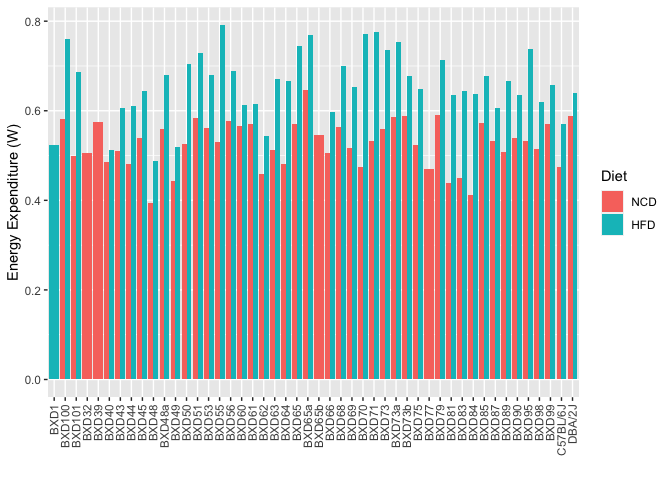
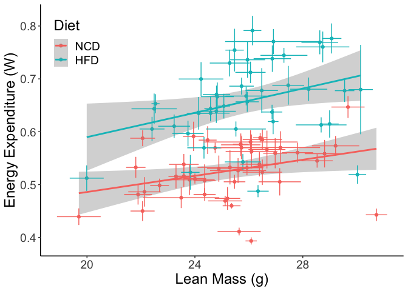
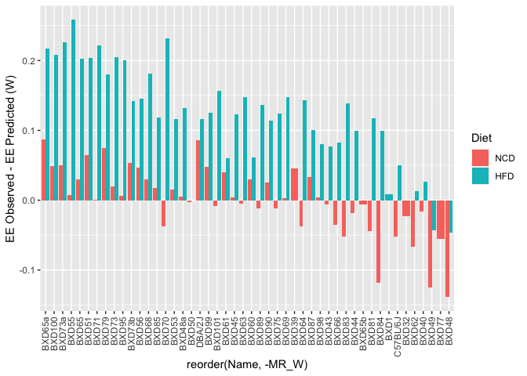
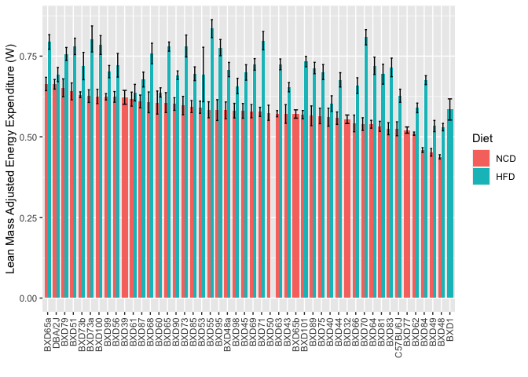
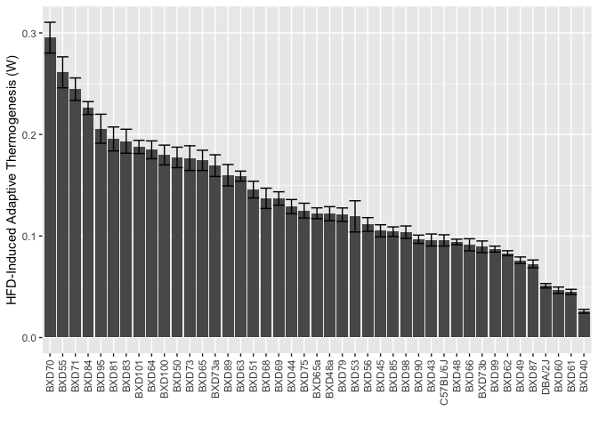
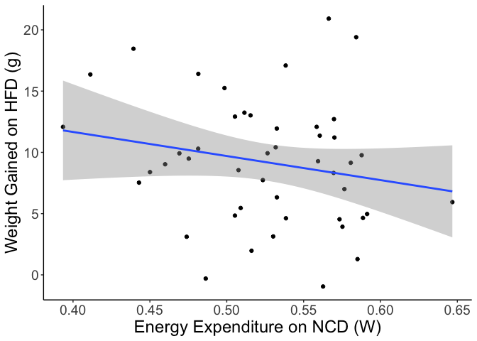
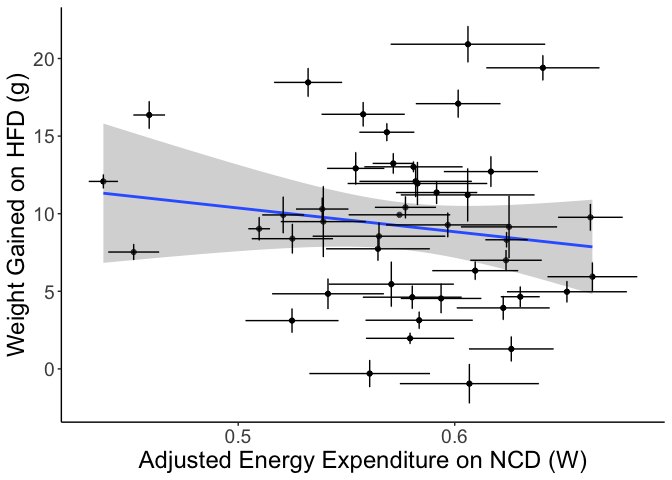
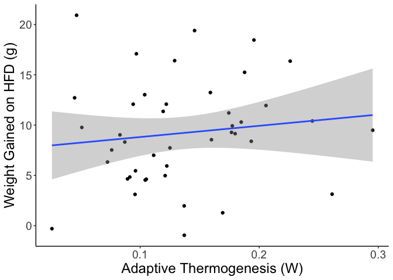
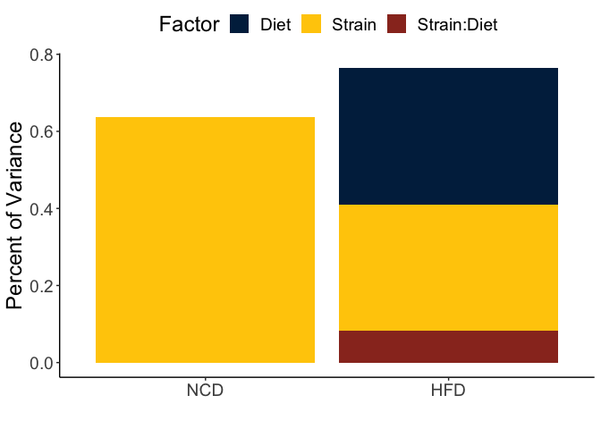

The goal is to identify genetic determinants of energy expenditure and of adaptive thermogenesis from BXD mice.  To start we searched gene network for energy expenditure data, ignoring those involved in exercise physiology.

* **BXD_17621** Oxygen intake over 24h on NCD at 16 w age.  Also included light/dark.  Not adjusted for lean mass.  Has mean +/- SE in mL/kg/h.  From Prinen 2014 (https://doi.org/10.1016/j.cmet.2014.04.002)
* **BXD_17622** Oxygen intake over 24h at 16 w age on HFD, males.  Not adjusted for lean mass.  Has mean +/- SE in mL/kg/h.  From Williams (2016).  Body weight in BXD_17560, lean mass in BXD_17574


```r
library(readr)
williams.ncd.ee <- read_csv("BXD_17621.csv", skip=9)%>% 
  mutate(Diet="NCD",Age=16,Dataset="Williams")
williams.ncd.bw <- read_csv("BXD_17559.csv" , skip=9)%>% 
  mutate(Diet="NCD",Age=16,Dataset="Williams")
williams.ncd.lm <- read_csv("BXD_17573.csv" , skip=9)%>% 
  mutate(Diet="NCD",Age=16,Dataset="Williams")

williams.ncd <- full_join(williams.ncd.ee,williams.ncd.bw, suffix=c('_ee','_bw'), by=c("Name","Dataset","Diet")) %>%
  full_join(williams.ncd.lm) %>%
  mutate(Value_lm = Value,
         SE_lm = SE)

williams.hfd.ee <- read_csv("BXD_17622.csv" , skip=9)%>% #may be mislabelled on genenetwork
  mutate(Diet="HFD",Age=16,Dataset="Williams")
williams.hfd.bw <- read_csv("BXD_17560.csv", skip=9)%>% 
  mutate(Diet="HFD",Age=16,Dataset="Williams")
williams.hfd.lm <- read_csv("BXD_17574.csv", skip=9)%>% 
  mutate(Diet="HFD",Age=16,Dataset="Williams")

williams.hfd <- full_join(williams.hfd.ee,williams.hfd.bw, suffix=c('_ee','_bw'), by=c("Name","Dataset","Diet")) %>%
  full_join(williams.hfd.lm) %>%
  mutate(Value_lm = Value,
         SE_lm = SE)

data <- bind_rows(#ncd.pirinen,
                  williams.ncd,
                  williams.hfd) %>% # in mL/kg/h
  mutate(VO2_g_min = Value_ee/1000) %>% #in mL/g/h
  mutate(VO2_min = VO2_g_min*Value_bw/60) %>% # in mL/min #this seems reasonable
  mutate(MR_KJ_d = VO2_min * 60 * 24 / 1000 * 4.84 * 4.184,
         MR_KJ_d_SE = SE_ee/1000*Value_bw/60* 60 * 24 / 1000 * 4.84 * 4.184) %>% # 60min/h x 24h/day / 1000 mL/L x 4.84 kcal/L x 4.184 kJ/kcal
  mutate(MR_W = MR_KJ_d * 0.0115740741,
         MR_W_SE = MR_KJ_d_SE* 0.0115740741) %>% # in Watts 
  mutate(Diet = relevel(factor(Diet), ref="NCD"))
```

These data can be found in /Users/davebrid/Documents/GitHub/PrecisionNutrition/Mouse Genetics/Energy Expenditure.  This script was most recently updated on Mon May  9 09:29:57 2022.

# Analysis of Energy Expenditure

## Comparason of Datasets


```r
library(ggplot2)
data %>%
  filter(!(is.na(MR_W))) %>% # complete cases only
  ggplot(aes(y=MR_W,
         x=Name,
         ymin=MR_W-MR_W_SE,
         ymax=MR_W-MR_W_SE,
         fill=Diet)) +
  geom_bar(stat='identity',position='dodge') +
  labs(y="Energy Expenditure (W)",
       x="") +
  theme(axis.text.x = element_text(angle = 90, vjust = 0.5, hjust=1))
```

<!-- -->

```r
#lm(Value~Name+Diet,data=data) %>% summary

mr.order <- 
  data %>% 
  filter(Diet == "NCD") %>% 
  arrange(desc(MR_W)) %>% 
  mutate(Name = factor(Name))


data %>%
  filter(!is.na(MR_W)) %>% # complete cases only
  mutate(Name = factor(Name, levels = mr.order$Name, ordered = TRUE)) %>%
  ggplot(aes(y=MR_W,
         x=Name,
         ymin=MR_W-MR_W_SE,
         ymax=MR_W+MR_W_SE,
         fill=Diet)) +
  geom_bar(stat='identity',position='dodge', width=0.75) +
  geom_errorbar(position=position_dodge(width=0.75), width=0.5) +
  labs(y="Energy Expenditure (W)",x="") +
  theme(axis.text.x = element_text(angle = 90, vjust = 0.5, hjust=1))
```

<!-- -->

## Estimating Effect Sizes


```r
data %>%
  group_by(Diet) %>%
  summarize(Max = max(MR_W, na.rm=T),
            Min = min(MR_W,na.rm=T), 
            Mean = mean(MR_W, na.rm=T),
            SE = mean(MR_W_SE,na.rm=T),
            N = mean(N,na.rm=T)) %>%
  mutate(SD = SE*sqrt(mean(N,na.rm=T))) %>%
  mutate(Rel.SD = SD/Mean*100) %>%
  kable(caption="Summary statistics for thermogenesis from BXD mice")
```


Table: Summary statistics for thermogenesis from BXD mice

|Diet |   Max|   Min|  Mean|    SE|    N|    SD| Rel.SD|
|:----|-----:|-----:|-----:|-----:|----:|-----:|------:|
|NCD  | 0.647| 0.393| 0.526| 0.020| 4.44| 0.042|   7.96|
|HFD  | 0.791| 0.488| 0.659| 0.025| 4.47| 0.052|   7.96|

```r
data %>%
  group_by(Diet) %>%
  summarize(Max = max(Value_lm, na.rm=T),
            Min = min(Value_lm,na.rm=T), 
            Mean = mean(Value_lm, na.rm=T),
            SE = mean(SE_lm,na.rm=T),
            N = mean(N,na.rm=T)) %>%
  mutate(SD = SE*sqrt(mean(N,na.rm=T))) %>%
  mutate(Rel.SD = SD/Mean*100) %>%
  kable(caption="Summary statistics for lean mass from BXD mice")
```


Table: Summary statistics for lean mass from BXD mice

|Diet |  Max|  Min| Mean|    SE|    N|   SD| Rel.SD|
|:----|----:|----:|----:|-----:|----:|----:|------:|
|NCD  | 30.7| 19.7| 25.4| 0.623| 4.44| 1.31|   5.19|
|HFD  | 30.2| 20.0| 26.0| 0.612| 4.47| 1.29|   4.97|

## Adjusting for Lean Mass


```r
library(ggrepel)
ggplot(data, aes(y=MR_W,
           x=Value_lm)) +
  geom_point(aes(col=Diet)) +
  geom_smooth(method="lm") +
  #geom_label_repel(data = subset(data, (MR_W < 0.45&Value_lm>25.5)|MR_W>0.65&Value_lm<27), aes(label=Name,col=Diet)) +
  labs(y="Energy Expenditure (W)",
       x="Lean Mass (g)")
```

<!-- -->

```r
ggplot(data, aes(y=MR_W,
           x=Value_lm,
           col=Diet)) +
  geom_point() +
  geom_smooth(method="lm") +
  geom_errorbar(aes(ymin=MR_W-MR_W_SE,
                ymax=MR_W+MR_W_SE)) +
  geom_errorbarh(aes(xmin=Value_lm-SE_lm,
                xmax=Value_lm+SE_lm))+
  #geom_label_repel(data = subset(data, (MR_W < 0.45&Value_lm>25.5)|MR_W>0.65&Value_lm<27),aes(label=Name)) +
  labs(y="Energy Expenditure (W)",
       x="Lean Mass (g)") +
  theme_classic() +
  theme(legend.position = c(0.1,0.85),
        text=element_text(size=18))
```

<!-- -->

```r
#chow only
ggplot(data %>% filter(Diet=="NCD"), aes(y=MR_W,
           x=Value_lm)) +
  geom_point() +
  geom_smooth(method="lm") +
  geom_label_repel(data = subset(data %>% filter(Diet=="NCD"),
                                 (MR_W < 0.43&Value_lm>24.5)|MR_W>0.60&Value_lm<27),
                   aes(label=Name)) +
  guides(fill = guide_legend(override.aes = aes(color = NA))) +
  labs(y="Energy Expenditure (W)",
       x="Lean Mass (g)")
```

<!-- -->

```r
lm.model.1 <- lm(MR_W~Value_lm,data=data %>% filter(Diet=="NCD")) #model built on only NCD
lm.model.2 <- lm(MR_W~Value_lm+Diet,data=data) #model built on NCD and AT
library(broom)
aov(lm.model.1) %>% tidy %>% kable(caption="Model 1 summary for adjusting for lean mass")
```


Table: Model 1 summary for adjusting for lean mass

|term      | df| sumsq| meansq| statistic| p.value|
|:---------|--:|-----:|------:|---------:|-------:|
|Value_lm  |  1| 0.013|  0.013|      5.17|   0.028|
|Residuals | 45| 0.115|  0.003|        NA|      NA|

```r
summary(lm.model.1) %>% tidy %>% kable(caption="Model 1 coefficients for adjusting for lean mass")
```


Table: Model 1 coefficients for adjusting for lean mass

|term        | estimate| std.error| statistic| p.value|
|:-----------|--------:|---------:|---------:|-------:|
|(Intercept) |    0.333|     0.085|      3.92|   0.000|
|Value_lm    |    0.008|     0.003|      2.27|   0.028|

```r
aov(lm.model.2) %>% tidy %>% kable(caption="Model 2 summary for adjusting for lean mass")
```


Table: Model 2 summary for adjusting for lean mass

|term      | df| sumsq| meansq| statistic| p.value|
|:---------|--:|-----:|------:|---------:|-------:|
|Value_lm  |  1| 0.081|  0.081|      21.5|       0|
|Diet      |  1| 0.347|  0.347|      92.0|       0|
|Residuals | 87| 0.328|  0.004|        NA|      NA|

```r
summary(lm.model.2) %>% tidy %>% kable(caption="Model 2 coefficients for adjusting for lean mass")
```


Table: Model 2 coefficients for adjusting for lean mass

|term        | estimate| std.error| statistic| p.value|
|:-----------|--------:|---------:|---------:|-------:|
|(Intercept) |    0.287|     0.075|      3.83|   0.000|
|Value_lm    |    0.009|     0.003|      3.22|   0.002|
|DietHFD     |    0.126|     0.013|      9.59|   0.000|

```r
data <- data %>%
  mutate(MR_predicted = predict(lm.model.1, newdata = list(Value_lm=Value_lm))) %>%
  mutate(MR_resid = MR_W-MR_predicted) %>%
  mutate(MR_adj = MR_resid + coef(lm.model.1)['(Intercept)'] + coef(lm.model.2)['Value_lm']*mean(data$Value_lm,na.rm=T))

data %>%
  filter(!is.na(MR_W)) %>% # complete cases only
  ggplot(aes(y=MR_resid,
         x=reorder(Name,-MR_W),
         ymin=MR_resid-MR_W_SE,
         ymax=MR_resid-MR_W_SE,
         fill=Diet)) +
  #geom_label_repel(label=Name) +
  geom_bar(stat='identity',position='dodge') +
  labs(y="EE Observed - EE Predicted (W)") +
  theme(axis.text.x = element_text(angle = 90, vjust = 0.5, hjust=1))
```

<!-- -->

```r
mr.adj.order <- 
  data %>% 
  filter(Diet == "NCD") %>% 
  arrange(desc(MR_adj)) %>% 
  mutate(Name = factor(Name))


data %>%
  filter(!is.na(MR_W)) %>% # complete cases only
  mutate(Name = factor(Name, levels = mr.adj.order$Name, ordered = TRUE)) %>%
  ggplot(aes(y=MR_adj,
         x=Name,
         ymin=MR_adj-MR_W_SE,
         ymax=MR_adj+MR_W_SE,
         fill=Diet)) +
  geom_bar(stat='identity',position='dodge', width=0.75) +
  geom_errorbar(position=position_dodge(width=0.75), width=0.5) +
  labs(y="Lean Mass Adjusted Energy Expenditure (W)",x="") +
  theme(axis.text.x = element_text(angle = 90, vjust = 0.5, hjust=1))
```

<!-- -->

based on this modelling after adjusting for lean mass, HFD increases thermogenesis by `(coef(lm.model.2)["(Intercept)"]-coef(lm.model.2)["DietHFD"])/coef(lm.model.2)["(Intercept)"]*100`%.

## Adaptive Thermogenesis

Defined as lean mass adjusted VO2 from HFD - NCD


```r
data.wide <-
  data %>%
  select(Value_lm,SE,Value_bw, MR_W, MR_W_SE, MR_adj,Name,Diet) %>%
  pivot_wider(names_from=Diet,id_cols=Name,values_from=c(Value_lm,Value_bw, MR_W,MR_W_SE,MR_adj,SE)) %>%
  mutate(AT = MR_W_HFD - MR_W_NCD,
         AT_SE = sqrt((MR_W_SE_NCD/MR_W_NCD)^2+(MR_W_SE_HFD/MR_W_HFD)^2)*AT,
         Wt_SE = sqrt((SE_NCD/Value_bw_NCD)^2+(SE_HFD/Value_bw_NCD)^2)*Value_bw_NCD,
         Wt.Gain = Value_bw_HFD-Value_bw_NCD)

data.wide %>%
  filter(!is.na(AT)) %>% # complete cases only
  ggplot(aes(y=AT,
         x=reorder(Name,-AT),
         ymin=AT-AT_SE,
         ymax=AT+AT_SE)) +
  geom_bar(stat='identity',position='dodge') +
    geom_errorbar() +
  labs(y="HFD-Induced Adaptive Thermogenesis (W)",
       x="") +
  theme(axis.text.x = element_text(angle = 90, vjust = 0.5, hjust=1))  
```

<!-- -->

### Thermogenesis on NCD as a Predictor of Weight Gain


```r
data.wide %>%
  ggplot(aes(y=Wt.Gain,
             x=MR_W_NCD)) +
  labs(y="Weight Gained on HFD (g)",
       x="Energy Expenditure on NCD (W)") +
  geom_point() +
  geom_smooth(method="lm") +
  theme_classic() +
  theme(text=element_text(size=18))
```

<!-- -->

```r
lm(Wt.Gain~MR_W_NCD, data=data.wide) %>% glance %>% kable(caption="Summary of relationship between energy expenditure and diet-induced weight gain", digits = c(3,3,3,1,8,0,0,0,0,0,0,0))
```


Table: Summary of relationship between energy expenditure and diet-induced weight gain

| r.squared| adj.r.squared| sigma| statistic| p.value| df| logLik| AIC| BIC| deviance| df.residual| nobs|
|---------:|-------------:|-----:|---------:|-------:|--:|------:|---:|---:|--------:|-----------:|----:|
|     0.042|          0.02|  5.06|       1.9|   0.172|  1|   -139| 284| 289|     1128|          44|   46|

```r
data.wide %>%
  ggplot(aes(y=Wt.Gain,
             x=MR_adj_NCD)) +
  labs(y="Weight Gained on HFD (g)",
       x="Adjusted Energy Expenditure on NCD (W)") +
  geom_point() +
  geom_smooth(method="lm") +
  geom_errorbarh(aes(xmin=MR_adj_NCD-MR_W_SE_NCD,
                    xmax=MR_adj_NCD+MR_W_SE_NCD))+
  geom_errorbar(aes(ymin=Wt.Gain-Wt_SE,
                     ymax=Wt.Gain+Wt_SE)) +
  theme_classic() +
  theme(text=element_text(size=18))
```

<!-- -->

```r
lm(Wt.Gain~MR_adj_NCD, data=data.wide) %>% glance %>% kable(caption="Summary of relationship between lean mass adjusted energy expenditure and diet-induced weight gain", digits = c(3,3,3,1,8,0,0,0,0,0,0,0))
```


Table: Summary of relationship between lean mass adjusted energy expenditure and diet-induced weight gain

| r.squared| adj.r.squared| sigma| statistic| p.value| df| logLik| AIC| BIC| deviance| df.residual| nobs|
|---------:|-------------:|-----:|---------:|-------:|--:|------:|---:|---:|--------:|-----------:|----:|
|     0.023|         0.001|  5.11|         1|   0.315|  1|   -139| 285| 290|     1151|          44|   46|


```r
gemma.phenotype.export <- 'Strain Level Energy Expenditure Data.csv'
data %>%
  filter(Diet=="NCD") %>%
  select(Name, MR_W, MR_adj) %>%
  write_csv(gemma.phenotype.export)
```

The data on lean mass adjusted thermogenesis was exported to Strain Level Energy Expenditure Data.csv


### Adaptive Thermogenesis vs Weight Gain


```r
data.wide %>%
  ggplot(aes(y=Wt.Gain,
             x=AT)) +
  labs(y="Weight Gained on HFD (g)",
       x="Adaptive Thermogenesis (W)") +
  geom_point() +
  geom_smooth(method="lm") +  theme_classic() +
  theme(text=element_text(size=18))
```

<!-- -->

```r
lm(Wt.Gain~AT, data=data.wide) %>% glance %>% kable(caption="Summary of relationship between energy expenditure and diet-induced weight gain")
```


Table: Summary of relationship between energy expenditure and diet-induced weight gain

| r.squared| adj.r.squared| sigma| statistic| p.value| df| logLik| AIC| BIC| deviance| df.residual| nobs|
|---------:|-------------:|-----:|---------:|-------:|--:|------:|---:|---:|--------:|-----------:|----:|
|     0.017|        -0.007|  5.22|     0.691|   0.411|  1|   -131| 268| 273|     1117|          41|   43|

# Heritability of NCD Thermogenesis

Since we dont have individual mouse data we will make simulated data based on the mean and se of the metabolic rate.


```r
new.sim.data <- data.frame(Strain=NA, Diet=NA,EE=NA)

for (row in 1:dim(data)[1]) {
  strain.data <- data[row,]
  if(!(is.na(strain.data$MR_W))){
  sim.data <- with(strain.data, 
                   rnorm(mean=MR_W,
                         sd=MR_W_SE * sqrt(N),
                         n=N_ee
                    ))
  sim.lean.data <- with(strain.data, 
                   rnorm(mean=Value_lm,
                         sd=SE_lm * sqrt(N),
                         n=N_ee
                    ))
  sim.dataset <- data.frame(Strain=strain.data$Name, 
                            Diet=strain.data$Diet,
                            EE=sim.data,
                            Lean=sim.lean.data)
  new.sim.data <- bind_rows(new.sim.data,sim.dataset)
  }
else{
    sim.dataset <- data.frame(Strain=strain.data$Name, 
                            Diet=strain.data$Diet,
                            EE=NA,
                            Lean=NA)
    new.sim.data <- bind_rows(new.sim.data,sim.dataset)
}

}
```

Estimated heritability by calculating the $\omega^2_p$ for each component.  The formula for this is:

$$\eta^2=\frac{SS_{effect}}{SS_{total}}$$

The alternative, not used here is to use the $\omega^2_p$, but for this the sum of the terms is less than 1

$$\omega^2_p = \frac{SS_{effect}-df_{effect} \times MS_{error}}{SS_{effect}+(N-df_{effect})\times MS_{error}}$$
The forumula is from from:

>Albers and Lakens. 2018.  When power analyses based on pilot data are biased: Inaccurate effect size estimators and follow-up bias.  Journal of Experimental Social Psychology. 74: 187-195 https://doi.org/10.1016/j.jesp.2017.09.004.

In this case $SS_{effect}$ is the term for the strain.  Therefore $\omega^2_p$ for the strain the amount of variance attributable to the strain, or the broad sense heritability.


```r
library(effectsize)
aov(EE ~  Strain, data=new.sim.data %>% filter(Diet=='NCD')) %>% 
  eta_squared() %>%
  kable(caption="Overall heritability of energy expenditure on NCD mice, not accounting for lean mass")
```


Table: Overall heritability of energy expenditure on NCD mice, not accounting for lean mass

|Parameter |  Eta2|   CI| CI_low| CI_high|
|:---------|-----:|----:|------:|-------:|
|Strain    | 0.675| 0.95|  0.565|       1|

```r
aov(EE ~ Lean + Strain, data=new.sim.data %>% filter(Diet=='NCD')) %>% 
  eta_squared(partial=F) -> lean.adj.ee.lean 

  
lean.adj.ee.lean %>% kable(caption="Heritability of energy expenditure on NCD adjusting for lean mass")
```


Table: Heritability of energy expenditure on NCD adjusting for lean mass

|Parameter |  Eta2|   CI| CI_low| CI_high|
|:---------|-----:|----:|------:|-------:|
|Lean      | 0.037| 0.95|  0.004|       1|
|Strain    | 0.638| 0.95|  0.510|       1|

```r
aov(EE ~ Lean + Strain + Diet + Strain:Diet, data=new.sim.data) %>% 
  eta_squared(partial=F) -> hfd.incl.ee

hfd.incl.ee  %>% kable(caption="Overall heritability of energy expenditure including diet and lean mass, and allowing for a gene-diet interaction")
```


Table: Overall heritability of energy expenditure including diet and lean mass, and allowing for a gene-diet interaction

|Parameter   |  Eta2|   CI| CI_low| CI_high|
|:-----------|-----:|----:|------:|-------:|
|Lean        | 0.036| 0.95|  0.009|       1|
|Strain      | 0.327| 0.95|  0.172|       1|
|Diet        | 0.354| 0.95|  0.286|       1|
|Strain:Diet | 0.084| 0.95|  0.000|       1|

```r
aov(EE ~ Lean + Strain + Diet + Strain:Diet, data=new.sim.data) %>% 
  eta_squared(partial=F) -> hfd.adj.ee.adj

aov(EE ~ Lean + Strain + Diet + Strain:Diet, data=new.sim.data) %>% 
  eta_squared(partial=F) -> hfd.adj.ee.all

hfd.adj.ee.adj %>% kable(caption="Heritability of energy expenditure adjusted for diet and lean mass")
```


Table: Heritability of energy expenditure adjusted for diet and lean mass

|Parameter   |  Eta2|   CI| CI_low| CI_high|
|:-----------|-----:|----:|------:|-------:|
|Lean        | 0.036| 0.95|  0.009|       1|
|Strain      | 0.327| 0.95|  0.172|       1|
|Diet        | 0.354| 0.95|  0.286|       1|
|Strain:Diet | 0.084| 0.95|  0.000|       1|

```r
ee.var.data <- bind_rows(lean.adj.ee.lean %>% mutate(Diet="NCD"),hfd.adj.ee.adj %>% mutate(Diet="HFD")) 

ggplot(ee.var.data %>% filter(Parameter %in% c('Strain','Strain:Diet','Diet')),
        aes(x=reorder(Diet,-Eta2),
            y=Eta2,
            fill=Parameter)) +
  geom_bar(position="stack",stat='identity') +
  scale_fill_manual(values = color.scheme,
                     name="Factor") +
  labs(y="Percent of Variance",
       x="") +
  theme_classic() +
  theme(legend.position="top")+
  theme(text=element_text(size=18))
```

<!-- -->


# Integration with Lifespan

To ask whether BMR is related to experimental livespan we used the data from Roy et al 2021.  This determined lifespan of **female** mice in days


```r
aging.datafile <- 'BXD_18441.csv'

aging.data <- read_csv(aging.datafile, skip=8) %>%
  rename(Age = Value,
         Age.SE = SE,
         Age.N = N)

combined.age.mr.data <-
  full_join(aging.data, data.wide)

combined.age.mr.data %>%
  ggplot(aes(y=Age,
             x=MR_adj_NCD)) +
  geom_point() +
  geom_errorbar(aes(ymin=Age-Age.SE,
                    ymax=Age+Age.SE),
                alpha=0.25) +
  geom_errorbarh(aes(xmin=MR_adj_NCD-MR_W_SE_NCD,
                    xmax=MR_adj_NCD+MR_W_SE_NCD),
                alpha=0.25) +
  geom_smooth(method="lm") +
  theme_classic() +
  theme(text=element_text(size=18))
```

<!-- -->

```r
combined.age.mr.data %>%
  mutate_at(vars(Age,MR_adj_NCD), .funs=as.numeric) %>%
  summarize_at(vars(Age,MR_adj_NCD), .funs=function(x) shapiro.test(x)$p.value) %>%
  kable(caption="Shapiro-Wilk tests for normality")
```


Table: Shapiro-Wilk tests for normality

|  Age| MR_adj_NCD|
|----:|----------:|
| 0.98|      0.043|

```r
with(combined.age.mr.data, cor.test(Age, MR_adj_NCD)) %>% 
  tidy %>%
  kable(caption="Relationship between age (of female BXD mice) and adjusted metabolic rate")
```


Table: Relationship between age (of female BXD mice) and adjusted metabolic rate

| estimate| statistic| p.value| parameter| conf.low| conf.high|method                               |alternative |
|--------:|---------:|-------:|---------:|--------:|---------:|:------------------------------------|:-----------|
|   -0.058|    -0.356|   0.724|        37|   -0.367|     0.262|Pearson's product-moment correlation |two.sided   |

# Session Information


```r
sessionInfo()
```

```
## R version 4.0.2 (2020-06-22)
## Platform: x86_64-apple-darwin17.0 (64-bit)
## Running under: macOS  10.16
## 
## Matrix products: default
## BLAS:   /Library/Frameworks/R.framework/Versions/4.0/Resources/lib/libRblas.dylib
## LAPACK: /Library/Frameworks/R.framework/Versions/4.0/Resources/lib/libRlapack.dylib
## 
## locale:
## [1] en_US.UTF-8/en_US.UTF-8/en_US.UTF-8/C/en_US.UTF-8/en_US.UTF-8
## 
## attached base packages:
## [1] stats     graphics  grDevices utils     datasets  methods   base     
## 
## other attached packages:
## [1] effectsize_0.6.0.1 broom_0.7.11       ggrepel_0.9.1      ggplot2_3.3.5     
## [5] readr_2.1.1        dplyr_1.0.7        tidyr_1.1.4        knitr_1.37        
## 
## loaded via a namespace (and not attached):
##  [1] Rcpp_1.0.7        mvtnorm_1.1-3     lattice_0.20-45   zoo_1.8-9        
##  [5] assertthat_0.2.1  digest_0.6.29     utf8_1.2.2        R6_2.5.1         
##  [9] backports_1.4.1   coda_0.19-4       evaluate_0.14     highr_0.9        
## [13] pillar_1.6.4      rlang_0.4.12      multcomp_1.4-18   performance_0.8.0
## [17] rstudioapi_0.13   jquerylib_0.1.4   Matrix_1.4-0      rmarkdown_2.11   
## [21] labeling_0.4.2    splines_4.0.2     stringr_1.4.0     bit_4.0.4        
## [25] munsell_0.5.0     compiler_4.0.2    xfun_0.29         pkgconfig_2.0.3  
## [29] parameters_0.17.0 mgcv_1.8-38       htmltools_0.5.2   insight_0.17.0   
## [33] tidyselect_1.1.1  tibble_3.1.6      codetools_0.2-18  fansi_1.0.0      
## [37] crayon_1.4.2      tzdb_0.2.0        withr_2.4.3       MASS_7.3-54      
## [41] grid_4.0.2        xtable_1.8-4      nlme_3.1-153      jsonlite_1.7.2   
## [45] gtable_0.3.0      lifecycle_1.0.1   DBI_1.1.2         magrittr_2.0.1   
## [49] bayestestR_0.11.5 scales_1.1.1      datawizard_0.4.0  estimability_1.3 
## [53] cli_3.1.0         stringi_1.7.6     vroom_1.5.7       farver_2.1.0     
## [57] bslib_0.3.1       ellipsis_0.3.2    generics_0.1.1    vctrs_0.3.8      
## [61] sandwich_3.0-1    TH.data_1.1-0     tools_4.0.2       bit64_4.0.5      
## [65] glue_1.6.0        purrr_0.3.4       hms_1.1.1         emmeans_1.7.2    
## [69] survival_3.2-13   parallel_4.0.2    fastmap_1.1.0     yaml_2.2.1       
## [73] colorspace_2.0-2  sass_0.4.0
```
